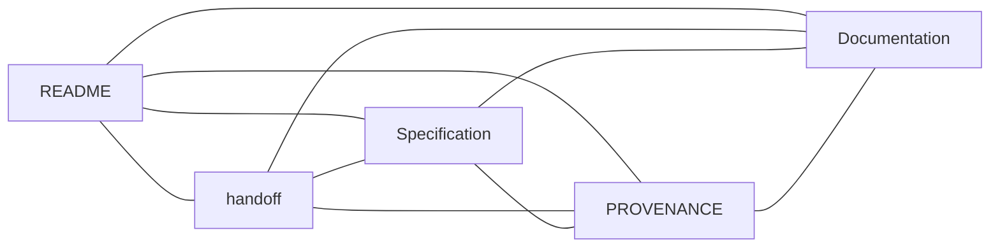

# Liqvera

**Market reports you can verify.**

Built for [MEZO ₿](https://mezo.org/) — [The Mezo Buildathon](https://app.akindo.io/wave-hacks/OVOO0gdrVU8379D10).

Verifiable reports from public Hyperliquid BTC perpetual order-book snapshots,
with planned access payments in test MUSD on Mezo Testnet.

## Project state

F0 imported a public technical snapshot with independent Git history. F1 is
complete-with-blockers: publication inventory, public salvage verification,
the pinned Python development toolchain, and the public compatibility lock
are implemented. [ADR-0002](docs/adr/0002-liqvera-report-payment-boundary.md)
accepts only the runtime and payment boundary. The overall change remains
`implementing`. F2's static contract phase is complete and independently
approved at `3729bdc131ca4ac971ab04e735da2e113d68ad71`: 446 contract tests
and 1087 full-suite tests plus 85 subtests pass. See the
[bound F2 evidence](engineering/changes/2026-09-24-mezo-evidence/evidence/f2-contracts.md).
The F3–F7 code surfaces are now **IMPLEMENTED_UNVERIFIED**: fixed public
capture, exact reports and offline verification, internal services, the F2
gateway and PostgreSQL ledger, official x402 adapter boundaries, the browser
application, isolated deployment definitions, runbooks, and the A01–A30
acceptance runner exist in the tree. The local protocol package pins official
Mezo MUSD material and recorded `mezo-org` source revisions. Separate Liqvera
factory targets were added without changing the existing Stage A three-wheel
factory. None of these new product targets, services, containers, browser
flows, or acceptance cases has been executed in this code-completion phase.
All 156 vectors remain `NOT_RUN`, and no runtime acceptance follows from the
implementation. Grok's inherited Trivy policy gate remains open.

At implementation commit `37d3e2cf3c64ef2c5d260bccf64e4f107e3f2c25`,
`make verify` passed with 641 tests and 85 subtests. The command
`grok_verify.py --mode pr --no-record` exited 1 due to two pre-existing LOW
Trivy `DS-0026` findings in the one-shot Stage A Dockerfiles
(`BLOCKED_TRIVY_HEALTHCHECK_POLICY`). No scanner exception or artificial
healthcheck was added. See
[verification evidence](engineering/changes/2026-09-24-mezo-evidence/evidence/f1-verification.md).

The live public probe returned `COMPATIBILITY_PASS_PAYMENT_BLOCKED`.
`PAY_TO_MISSING`, canonical authorization identity, facilitator compatibility,
and `FINALITY_RULE_UNVERIFIED` remain open; payment readiness is false. The
gateway and UI therefore retain a fail-closed payment path. No testnet payment
or deployment has been performed.

Current metadata: root project `0.1.0.dev0`; Stage A, evidence-report, protocol,
gateway, and web packages `0.1.0`.
There is no root `VERSION` file or F1 release. Inherited `mee-*` identifiers
are preserved.

## Start here

- [Canonical specification](docs/planning/LIQVERA_FACTORY_TZ.md): stages F0–F7 and A01–A30.
- [Handoff](handoff.md): current evidence, blockers, and next action.
- [Documentation](docs/README.md): technical foundation and historical context.
- [Security](SECURITY.md): data and trading restrictions.
- [Provenance](PROVENANCE.md): source snapshot and public-import boundary.



## Technical foundation

| Location | Responsibility |
| --- | --- |
| `packages/contracts` | Exact types and Stage A contracts |
| `packages/public-capture` | Public capture and frozen evidence packages |
| `packages/readonly-analyzer` | Reconstruction, validation, and exact analytics |
| `packages/evidence-report` | Canonical report construction, deterministic bundles, offline verification, and the local fixture demo |
| `packages/mezo-protocol` | Pinned official Mezo Testnet and MUSD metadata with upstream provenance |
| `services/evidence-capture`, `services/evidence-report` | Internal-only capture and immutable report service contracts |
| `apps/mezo-gateway` | F2 HTTP API, PostgreSQL ledger, reconciliation, and fail-closed x402 boundary |
| `apps/mezo-web` | Mezo Testnet browser flow and injected-wallet boundary |
| `deploy/mezo-evidence` | Isolated Compose, image, proxy, and secret-file definitions |
| `tools/mezo_acceptance` | Result-producing A01–A30 offline/live acceptance orchestrator |
| `tools/mezo_compatibility.py` | Closed compatibility validator and bounded public transport |
| `docs/compatibility/mezo-evidence-v1.json` | Fixed testnet, token, protocol, and SDK boundary |
| `schemas/mezo-evidence/v1/` | F2 JSON Schemas, OpenAPI, state graphs and exact/future runtime vectors |
| `tests/contracts/test_mezo_*.py` | Offline F2 contract consistency and existing arithmetic characterization |

Capture produces frozen packages consumed by the analyzer and report builder
through shared contracts. Python owns evidence and exact analytics; the
TypeScript/Express gateway serves immutable artifacts and keeps payment state
in PostgreSQL; the Vite browser application owns user wallet interaction.
Retained Go code remains historical executable specification. These components
are code-complete but unverified, and their `NOT_RUN` obligations do not
establish settlement or acceptance.

Use Python 3.12+ for the Stage A packages, Make, and an isolated environment:

```bash
python3 -m venv .venv
.venv/bin/python -m pip install -e '.[dev]'
PATH="$PWD/.venv/bin:$PATH" make verify
```

`make demo` runs the fixture demonstration. `make product` requires Docker;
container builds and the full clean-machine README/demo acceptance were not
run during F1 closure. Public salvage verifies pinned target bytes and reports
`source_objects=unavailable`; private-source verification is not claimed.

The new factory surfaces are intentionally separate:

```bash
make liqvera-python
make liqvera-gateway
make liqvera-web
make liqvera-images
make liqvera-compose
make liqvera-acceptance ACCEPTANCE_OUTPUT=/new/path/result.json
```

They have not been executed yet. The gateway and web lockfiles were generated
with lifecycle scripts disabled; dependency audit findings are deferred to the
verification and defect-repair phase.

## Local MVP prototypes

The current branch includes an intentionally unhardened, fixture-only
prototype of the future report flow:

```bash
make mvp
```

It captures the built-in public-data fixture, builds a simulated BTC report,
and writes `.mvp/output/report.json` plus `.mvp/output/evidence.zip`. Optional
`MVP_SIDE` and `MVP_QUANTITY` environment variables default to `BUY` and
`0.15`. Each run replaces only `.mvp/package` and `.mvp/output`.

`make mvp` remains the CLI artifact demo. The integrated interactive local
product demo starts with:

```bash
make mvp-web
```

Open <http://127.0.0.1:8765>. Choose `BUY` or `SELL`, enter an exact BTC
quantity and an illustrative expected payer address, then create a run. The
page shows a fixture-backed preview and quote. Select the explicit
**Confirm simulated unlock — NO TRANSFER** action to view the full report and
download its JSON and evidence ZIP. Reloading the page in the same browser
session recovers the active run. The expected payer is display-only; no wallet
authentication or payment occurs.

The server binds to `127.0.0.1:8765` by default. Set `MVP_HOST` and/or
`MVP_PORT` in the environment to override the bind address and port, for
example `MVP_PORT=9000 make mvp-web`. The browser demo keeps its local fixture
package in `.mvp/store/package`, SQLite state in `.mvp/store/ledger.sqlite3`,
and immutable reports and ZIPs under `.mvp/store/artifacts/<report_id>/`.
Stop the foreground server with Ctrl-C; local state remains for the next run.
The evidence-report wheel also exposes `mee-evidence-demo`; an installed run
uses `$PWD/.mvp` unless `MVP_STATE_ROOT` names an absolute state directory.

Both demos are **SIMULATED**, **UNVERIFIED**, read-only analytics over fixture
data. The browser unlock transfers nothing and is not x402 or settlement.
Neither demo establishes verified F3–F7 completion, runtime acceptance,
report chargeability, testnet payment, or permission for live exchange
mutations. The interactive implementation is factory-bound but deliberately
not yet verified.

The optional public compatibility probe is separate from offline verification:

```bash
PATH="$PWD/.venv/bin:$PATH" python -B scripts/check-mezo-compatibility.py \
  --lock docs/compatibility/mezo-evidence-v1.json
```

The live probe requires POSIX real-time timer support, the main thread, and
no existing active real-time alarm; unsupported contexts fail closed before
network I/O. Each request has one 12-second total deadline, a 2 MiB decoded
body limit, a separate 64 KiB framing limit, and an 8 KiB line limit. Chunk
extensions, trailers, malformed framing, redirects, and ambient proxies are
refused. The timer and previous signal handler are restored on every exit.

## Boundaries

Only public market data and read-only analytics are permitted at the exchange
boundary. Payment code is testnet-only and remains disabled until its external
gates close. Mainnet, trading, custody, merchant private keys,
user secrets, and exchange credentials are excluded. Fixture data is simulated
and cannot establish live-report or payment acceptance. Shadow-only remains
the safety default.

Private upstream Git history, secrets, and environments were not imported.
Inherited GitHub Actions were disabled during publication; F1 made no remote
settings changes. The original `Proprietary` metadata is retained; public
visibility does not grant a new license.
