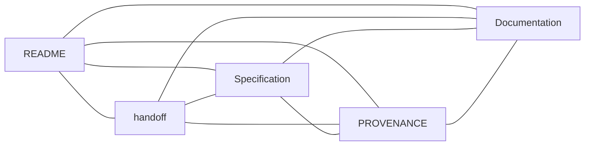

# Liqvera

**Market reports you can verify.**

Built for [MEZO ₿](https://mezo.org/) — [The Mezo Buildathon](https://app.akindo.io/wave-hacks/OVOO0gdrVU8379D10).

Verifiable reports from public Hyperliquid BTC perpetual order-book snapshots,
with planned access payments in test MUSD on Mezo Testnet.

## Project state

F0 imported a public technical snapshot with independent Git history. F1 is
complete-with-blockers: publication inventory, public salvage verification,
the pinned Python development toolchain, and the public compatibility lock
are implemented. [ADR-0002](docs/adr/0002-liqvera-report-payment-boundary.md)
accepts only the runtime and payment boundary. The overall change remains
`implementing`. F2's static contract phase is complete and independently
approved at `3729bdc131ca4ac971ab04e735da2e113d68ad71`: 446 contract tests
and 1087 full-suite tests plus 85 subtests pass. See the
[bound F2 evidence](engineering/changes/2026-09-24-mezo-evidence/evidence/f2-contracts.md).
F3 planning is in review; F3–F7 remain open. The
[F3 implementation plan](docs/superpowers/plans/2026-09-24-liqvera-f3-evidence-report.md)
defines fixed public capture, exact report construction, deterministic bundles,
and offline verification without claiming implementation. All 156 vectors remain
`NOT_RUN`, and no runtime acceptance follows from contract tests. Grok's inherited
Trivy policy gate remains open. F2 closure is documentation-only after the
verified implementation.

At implementation commit `37d3e2cf3c64ef2c5d260bccf64e4f107e3f2c25`,
`make verify` passed with 641 tests and 85 subtests. The command
`grok_verify.py --mode pr --no-record` exited 1 due to two pre-existing LOW
Trivy `DS-0026` findings in the one-shot Stage A Dockerfiles
(`BLOCKED_TRIVY_HEALTHCHECK_POLICY`). No scanner exception or artificial
healthcheck was added. See
[verification evidence](engineering/changes/2026-09-24-mezo-evidence/evidence/f1-verification.md).

The live public probe returned `COMPATIBILITY_PASS_PAYMENT_BLOCKED`.
`PAY_TO_MISSING` and `FINALITY_RULE_UNVERIFIED` remain open; payment readiness
is false. The HTTP gateway, payment ledger, paid-report flow, and Mezo UI are
future work. No testnet payment or deployment has been performed.

Current metadata: root project `0.1.0.dev0`, Stage A packages `0.1.0`.
There is no root `VERSION` file or F1 release. Inherited `mee-*` identifiers
are preserved.

## Start here

- [Canonical specification](docs/planning/LIQVERA_FACTORY_TZ.md): stages F0–F7 and A01–A30.
- [Handoff](handoff.md): current evidence, blockers, and next action.
- [Documentation](docs/README.md): technical foundation and historical context.
- [Security](SECURITY.md): data and trading restrictions.
- [Provenance](PROVENANCE.md): source snapshot and public-import boundary.



## Technical foundation

| Location | Responsibility |
| --- | --- |
| `packages/contracts` | Exact types and Stage A contracts |
| `packages/public-capture` | Public capture and frozen evidence packages |
| `packages/readonly-analyzer` | Reconstruction, validation, and exact analytics |
| `tools/mezo_compatibility.py` | Closed compatibility validator and bounded public transport |
| `docs/compatibility/mezo-evidence-v1.json` | Fixed testnet, token, protocol, and SDK boundary |
| `schemas/mezo-evidence/v1/` | F2 JSON Schemas, OpenAPI, state graphs and exact/future runtime vectors |
| `tests/contracts/test_mezo_*.py` | Offline F2 contract consistency and existing arithmetic characterization |

Capture produces frozen packages consumed by the analyzer through shared
contracts. Python is the active analytical runtime; retained Go code is
historical executable specification. A future TypeScript/Express gateway will
serve immutable Python artifacts and keep payment state in PostgreSQL.
F2 contracts define that future boundary; their `NOT_RUN` runtime obligations
do not establish an HTTP service, ledger, report builder or settlement flow.

Use Python 3.12+ for the Stage A packages, Make, and an isolated environment:

```bash
python3 -m venv .venv
.venv/bin/python -m pip install -e '.[dev]'
PATH="$PWD/.venv/bin:$PATH" make verify
```

`make demo` runs the fixture demonstration. `make product` requires Docker;
container builds and the full clean-machine README/demo acceptance were not
run during F1 closure. Public salvage verifies pinned target bytes and reports
`source_objects=unavailable`; private-source verification is not claimed.

## F3 MVP prototype

The in-progress F3 branch includes an intentionally unhardened, fixture-only
prototype of the future report flow:

```bash
make mvp
```

It captures the built-in public-data fixture, builds a simulated BTC report,
and writes `.mvp/output/report.json` plus `.mvp/output/evidence.zip`. Optional
`MVP_SIDE` and `MVP_QUANTITY` environment variables default to `BUY` and
`0.15`. Each run replaces only `.mvp/package` and `.mvp/output`.

This prototype is **SIMULATED** and **UNVERIFIED**. Payments and live
verification are not implemented. It does not establish F3 completion,
runtime acceptance, report chargeability, testnet settlement, or permission
for live exchange mutations.

The optional public compatibility probe is separate from offline verification:

```bash
PATH="$PWD/.venv/bin:$PATH" python -B scripts/check-mezo-compatibility.py \
  --lock docs/compatibility/mezo-evidence-v1.json
```

The live probe requires POSIX real-time timer support, the main thread, and
no existing active real-time alarm; unsupported contexts fail closed before
network I/O. Each request has one 12-second total deadline, a 2 MiB decoded
body limit, a separate 64 KiB framing limit, and an 8 KiB line limit. Chunk
extensions, trailers, malformed framing, redirects, and ambient proxies are
refused. The timer and previous signal handler are restored on every exit.

## Boundaries

Only public market data and read-only analytics are implemented. Planned
payments are testnet-only. Mainnet, trading, custody, merchant private keys,
user secrets, and exchange credentials are excluded. Fixture data is simulated
and cannot establish live-report or payment acceptance. Shadow-only remains
the safety default.

Private upstream Git history, secrets, and environments were not imported.
Inherited GitHub Actions were disabled during publication; F1 made no remote
settings changes. The original `Proprietary` metadata is retained; public
visibility does not grant a new license.
