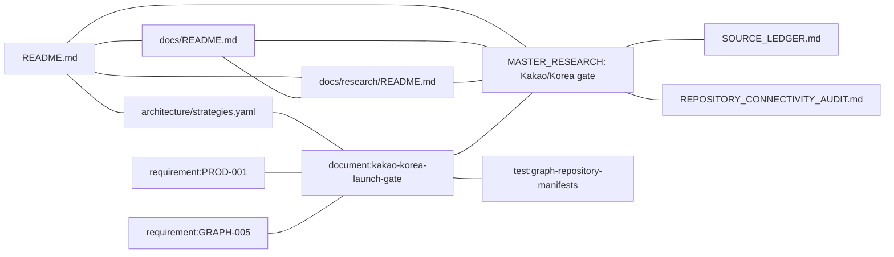

# Multi-Exchange Engine

Safety-first foundation for cross-venue perpetual market data, falsifiable shadow opportunities, and eventually paired execution.

Current status: **Stage A is ready**. Public capture and read-only analysis
only. The repository does not authorize production trading, automatic
withdrawals or user-capital deployment.

## Ready Stage A product

Three installable distributions live under `packages/`:

| Package | Installs | Entry |
|---|---|---|
| `mee-contracts` | `mee_contracts` | library only |
| `mee-public-capture` | contracts + capture | `mee-public-capture` |
| `mee-readonly-analyzer` | contracts + analyzer | `mee-readonly-analyzer` |

```bash
python3 -m pip install -e '.[dev]'
make verify
make product
python3 -m pip install --find-links dist mee-public-capture mee-readonly-analyzer
make demo
```

`make demo` writes `.stage-a/package` and the analyzer reads it. Capture stays
public-only; `MEE_CAPTURE_SOURCE=public` may fetch a Hyperliquid L2 snapshot.

`make product` writes exact-SHA wheels to `dist/` and builds
`mee-public-capture:stage-a` and `mee-readonly-analyzer:stage-a` from those
wheels only (`docker build --network=none`). Do not put credentials in the
environment: capture rejects `SECRET`/`TOKEN`/`PASSWORD`/`API_KEY` names.

Production loop (public evidence only):

```bash
make prod
```

That rebuilds wheels/images, wipes volume `mee-stage-a-data`, writes a fixture
package as UID 65534, and runs the analyzer read-only. Operator stack:
`compose.stage-a.yml`. Default source is fixture, not live public fetch.

## Start here

- [Documentation index](docs/README.md) — map of maintained, research, operational and archived documents.
- [Master Plan pointer](MASTER_PLAN.md) — maintained entry point for planning and historical-plan boundaries.
- [Implementation roadmap](docs/ROADMAP.md) — active sequence and exit criteria.
- [Accepted Python runtime ADR](docs/adr/0001-python-universal-arbitrage-core.md) — current runtime direction.
- [Architecture/reference invariants](docs/architecture.md) — safety invariants and retained Go-foundation boundary.
- [Research index](docs/research/README.md) — PMF critique, competitor evidence, master conclusions and source ledger.
- [Master research](docs/research/MASTER_RESEARCH.md) — full project history, pivots, validation plan and kill criteria.
- [KakaoTalk / South Korea launch gate](docs/research/MASTER_RESEARCH.md#kakaotalk-south-korea-launch-gate-2026-08-18) — canonical platform, legal, privacy, architecture and launch decision. Machine graph identity: `document:kakao-korea-launch-gate`; direct crypto integration is not approved without written clearances.
- [Canonical market-demand and JTBD synthesis](docs/research/user-needs/README.md) — ranked pains, ICPs, product wedges, pricing hypotheses, interview questions and go/kill criteria.
- [X/Twitter trader-pain input](docs/research/user-needs/X_TWITTER_PAINS_INPUT_2026-08-10.md) — complete owner-supplied discovery note, explicitly unvalidated pending Reddit/forum/source corroboration.
- [Verified Teletype/Solana extraction](docs/research/user-needs/TELETYPE_SOLANA_ARBITRAGE_TECH_EXTRACTION_2026-08-10.md) — what the supplied Solana arbitrage articles actually add, what primary docs confirm, and why a smart contract is not yet a core roadmap item.
- [Security](SECURITY.md) — credential and live-trading restrictions.
- [Cleanup audit](docs/CLEANUP_AUDIT.md) — known safety findings and blockers.

### Research and machine-graph discoverability



The machine-readable identity is `document:kakao-korea-launch-gate`, declared
in `architecture/strategies.yaml`. It is connected to `PROD-001`, `GRAPH-005`
and `test:graph-repository-manifests`; the canonical human-readable content
remains the dated section in `docs/research/MASTER_RESEARCH.md`.

The Kakao/Korea gate is research authority only. It cannot authorize a Kakao
integration, private venue access, personalized investment advice, account
connection, referrals, custody or trading.

## Active implementation direction

The accepted product surface is **Stage A**: three installable distributions
under `packages/` — `mee-contracts`, `mee-public-capture`, and
`mee-readonly-analyzer`. They are public evidence and read-only analysis only.
Hyperliquid and Lighter are the first public-data pair. Ticker equality is
never sufficient to prove hedge equivalence.

The two `multi_exchange_engine` trees have been removed. Stage A import
namespaces are `mee_contracts`, `mee_public_capture`, and
`mee_readonly_analyzer` only.

See [ADR-0001](docs/adr/0001-python-universal-arbitrage-core.md) and
`packages/*/pyproject.toml`.

The repository also retains a Go Stage-0 foundation as reference material.
Go files must not be interpreted as the active product direction merely
because they remain buildable.

## Current safety scope

The repository is intended to fail closed:

- exact decimal/fixed-point money boundaries;
- capability-specific market-data, trading and RFQ contracts;
- persistent evidence and reproducible shadow calculations;
- unknown-order reconciliation before retry;
- exact order ownership rather than broad cancel operations;
- explicit-unit risk reservations;
- tenant/account isolation in persistence designs;
- no live execution authorization from research or documentation alone.

## Market demand and product packaging

The canonical [market-demand and JTBD synthesis](docs/research/user-needs/README.md)
concludes that the strongest observed gap is not another generic terminal,
funding scanner, Telegram surface, or “AI trading bot.” The recurring pain is
execution integrity: authoritative market, order, fill and position evidence
when venue APIs, WebSocket streams and local state disagree.

The current product sequence under validation is:

1. **MEE Evidence** — public/read-only evidence, market equivalence and
   reproducible shadow verdicts;
2. **MEE Observer** — a future read-only local-versus-venue reconciliation
   surface, only after buyer validation and security review;
3. **MEE Integrity** — future deterministic order-state convergence and bounded
   residual exposure, only after P1/P2 implementation and release gates.

These are product hypotheses and packaging names. Only Stage A exists today.
Research cannot arm execution or override the roadmap, ADRs, tests or security
policy.

For the strategic reason this project exists — and the reasons it may still be killed — read the [critical PMF review](docs/research/PMF_CRITICAL_REVIEW.md).

The user-needs study starts from the [X/Twitter pain hypothesis input](docs/research/user-needs/X_TWITTER_PAINS_INPUT_2026-08-10.md), the [verified Teletype/Solana extraction](docs/research/user-needs/TELETYPE_SOLANA_ARBITRAGE_TECH_EXTRACTION_2026-08-10.md), and production issue evidence consolidated in the [canonical synthesis](docs/research/user-needs/README.md). Social claims do not change product scope until they pass the repository promotion rule.

## Verify the active Python direction

Stage A installable distributions are `mee-contracts`, `mee-public-capture`
and `mee-readonly-analyzer` under `packages/`. They do not authorize live
trading. The current working verify path is:

```bash
python -m pip install -e '.[dev]'
make verify
```

`make verify` is the Stage A gate: architecture graph (declared conflicts
allowed), PR #21 salvage, Stage A artifact Go-exclusion, the three
distribution suites, `tests/conformance`, graph tests, and `tests/installed`.
Default `python -m pytest` follows the Stage A `testpaths`. Hypotheses are
executed only in Python; do not run `go test` as a Stage A proof.

Live-marked tests remain opt-in. Do not add real credentials merely to make a local verification command pass.

## Retained Go foundation

The root `Dockerfile`, `go.mod`, `cmd/` and `internal/` remain a
`TEST_ONLY_EXECUTABLE_SPEC` reference tree. They are excluded from Stage A
packages and are not part of `make verify`. Do not run Go tools to prove Stage A hypotheses.

See [the repository connectivity audit](docs/research/REPOSITORY_CONNECTIVITY_AUDIT.md) for the active/transitional/archive classification.

## Configuration

Use the checked-in example files and an external secret store. Root `.env` is excluded from Git and Docker build context. Never commit real credentials or pass them as Docker build arguments.

The exact active variables depend on the current Python/A2 increment. Historical Go variables may remain in legacy configuration; consult the accepted ADR, roadmap and package-specific deployment document before use.

## A2 collector boundary

Stage A images are `deploy/images/Dockerfile.public-capture` and
`deploy/images/Dockerfile.readonly-analyzer`. They install exact wheels from
`dist/` only. They do not authorize trading and must not contain venue
credentials. Use `make verify`.

See [A2 deployment](docs/a2-deployment.md).

## Documentation truth hierarchy

When documents conflict:

1. runtime code and tests;
2. accepted ADRs;
3. `SECURITY.md`;
4. `docs/ROADMAP.md`;
5. this README and [the docs index](docs/README.md);
6. `docs/research/` strategic material;
7. `docs/archive/` historical material.

Research can change what should be built. It cannot claim that a feature already exists.
