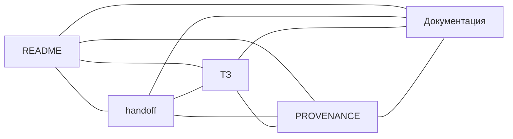

# MEE Evidence × Mezo

Проверяемые отчёты по снимку стакана BTC-perpetual на Hyperliquid с планируемой оплатой доступа тестовыми MUSD в Mezo Testnet.

## Состояние проекта

Отдельный публичный репозиторий подготовлен из технического снимка Multi-Exchange Engine. Здесь есть Python-ядро Stage A, сбор публичных данных, анализ, тесты, конфигурация сборки и полное ТЗ для Mezo. HTTP API, платёжный шлюз и интерфейс Mezo ещё предстоит реализовать. Публикация репозитория не подтверждает готовность приложения или успешную testnet-оплату.

Исходная приватная Git-история не перенесена. Источник, контрольные суммы и изменения для публикации перечислены в [PROVENANCE.md](PROVENANCE.md). Унаследованные GitHub Actions отключены; secrets и environments исходного проекта не перенесены.

## Начать здесь

- [ТЗ MEE Evidence × Mezo](docs/planning/MEE_MEZO_EVIDENCE_FACTORY_TZ.md) — сценарий, этапы F0–F7 и 30 приёмочных проверок.
- [Handoff](handoff.md) — актуальный статус и следующий шаг.
- [Документация](docs/README.md) — техническая основа и архив исходного проекта.
- [Security](SECURITY.md) — ограничения работы с данными и торговлей.
- [Происхождение и проверка публикации](PROVENANCE.md).

Раздел 0 исходного ТЗ описывает исторический блокер публикации на момент его написания. Актуальный статус переноса находится в handoff и PROVENANCE.



## Техническая основа

| Пакет | Назначение |
|---|---|
| `packages/contracts` | Точные типы и контракты |
| `packages/public-capture` | Получение публичных снимков |
| `packages/readonly-analyzer` | Восстановление, проверка и расчёты |

Python — активное вычислительное ядро. Сохранённый Go-код относится к исторической основе. В ТЗ для новой версии предусмотрены отдельный TypeScript-шлюз x402, PostgreSQL и минимальный браузерный интерфейс; они не входят в текущую реализацию.

Команды проверки унаследованной основы для среды с Python 3.11+, Make и зависимостями:

```bash
python3 -m pip install -e '.[dev]'
make verify
```

Для fixture-демо: `make demo`. Сборка контейнеров требует Docker: `make product`. Полный `make verify`, контейнерная сборка и платёжный сценарий при публикации не запускались; их выполнение относится к F1 и последующим этапам.

## Границы

Только публичные рыночные данные и read-only аналитика. Планируемые платежи — только Mezo Testnet. Торговля, mainnet, хранение пользовательских средств и биржевые ключи исключены. Fixture-данные не являются live-отчётом.

В исходных Python-метаданных указано `Proprietary`; эта маркировка сохранена. Публичность репозитория сама по себе не предоставляет открытую лицензию. Новая лицензия не добавлялась.
