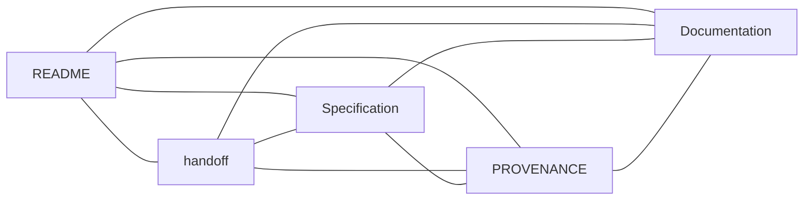

# Liqvera

**Market reports you can verify.**

Built for [MEZO ₿](https://mezo.org/) — [The Mezo Buildathon](https://app.akindo.io/wave-hacks/OVOO0gdrVU8379D10).

Verifiable reports from Hyperliquid BTC perpetual order-book snapshots, with planned access payments in test MUSD on Mezo Testnet.

## Project status

This standalone public repository starts from a technical snapshot of Multi-Exchange Engine. It includes the Stage A Python core, public-data capture, analysis, tests, build configuration, and the complete Mezo implementation specification. The HTTP API, payment gateway, and Mezo user interface still need to be implemented. Publishing the repository does not establish application readiness or a successful testnet payment.

The private upstream Git history was not imported. Sources, checksums, and publication changes are documented in [PROVENANCE.md](PROVENANCE.md). Inherited GitHub Actions are disabled; upstream secrets and environments were not copied.

English is the default language for project documentation, contributor material, and product content.

## Start here

- [Liqvera specification](docs/planning/LIQVERA_FACTORY_TZ.md) — user journey, phases F0–F7, and 30 acceptance checks.
- [Handoff](handoff.md) — current status and next step.
- [Documentation](docs/README.md) — technical baseline and upstream archive.
- [Security](SECURITY.md) — data and trading boundaries.
- [Source provenance and publication verification](PROVENANCE.md).

The current Liqvera plan is [phases F0–F7 in the specification](docs/planning/LIQVERA_FACTORY_TZ.md). The F0 public import is complete; F1 baseline verification is next. Handoff and PROVENANCE describe the status and origin of the files.



## Technical baseline

| Package | Purpose |
|---|---|
| `packages/contracts` | Exact types and contracts |
| `packages/public-capture` | Public snapshot capture |
| `packages/readonly-analyzer` | Reconstruction, verification, and calculations |

Python is the active computation core. Retained Go code belongs to the historical baseline. The new product specification calls for a separate TypeScript x402 gateway, PostgreSQL, and a minimal browser interface; these are not part of the current implementation.

To verify the inherited baseline in an environment with Python 3.11+, Make, and the required dependencies:

```bash
python3 -m pip install -e '.[dev]'
make verify
```

Use `make demo` for the fixture demo. Container builds require Docker: `make product`. The full `make verify`, container build, and payment flow were not run during publication; they belong to F1 and later phases.

## Boundaries

Public market data and read-only analysis only. Planned payments are restricted to Mezo Testnet. Trading, mainnet, custody of user funds, and exchange API keys are excluded. Fixture data is not a live report.

The original Python metadata specifies `Proprietary`; that designation is retained. Public repository visibility does not itself grant an open-source license. No new license has been added.
