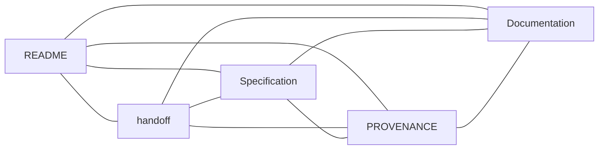

# Liqvera

**Market reports you can verify.**

Built for [MEZO ₿](https://mezo.org/) — [The Mezo Buildathon](https://app.akindo.io/wave-hacks/OVOO0gdrVU8379D10).

Verifiable reports from public Hyperliquid BTC perpetual order-book snapshots,
with planned access payments in test MUSD on Mezo Testnet.

## Project state

F0 imported a public technical snapshot with independent Git history. F1 is
complete-with-blockers: publication inventory, public salvage verification,
the pinned Python development toolchain, and the public compatibility lock
are implemented. [ADR-0002](docs/adr/0002-liqvera-report-payment-boundary.md)
accepts only the runtime and payment boundary. The overall change remains
`implementing`. F2's static contract phase is complete and independently
approved at `3729bdc131ca4ac971ab04e735da2e113d68ad71`: 446 contract tests
and 1087 full-suite tests plus 85 subtests pass. See the
[bound F2 evidence](engineering/changes/2026-09-24-mezo-evidence/evidence/f2-contracts.md).
F3's canonical offline artifact path is locally verified and `ready`. F4 local
gateway/ledger verification is `ready`: the exact lock, strict cleanup-adapter
regressions, and five disposable PostgreSQL checks passed pinned verification
and independent review. F5's focused fake-only Node slice around the real
gateway and reconciliation orchestration is locally verified and `ready`.
F6 has deterministic production-orchestration and static operations checks for
guarded cancel, wrong-network and wallet changes, reload identity and
no-resettlement, fixture zero-egress topology, internal-only metrics, resource
and security bounds, and CSP; its route is locally verified and reviewed. F7
P0 now hardens the acceptance producer with exact A01–A30 semantic reduction,
closed case-specific observations, an exact pinned dispatcher capability,
same-byte plan validation, final clean Git revalidation, atomic create-only
publication, and a post-seal verifier. The output is tamper-evident and made
read-only locally; filesystem permissions are not claimed as immutability. The
checked-in offline plan intentionally executes only five currently bound local
assertions; every other case remains truthful `NOT_RUN` or `BLOCKED_EXTERNAL`
until its complete criterion has an approved dispatcher. The corrected
release-candidate result at `76c0b63` is **INCOMPLETE** with 5 PASS, 4
`BLOCKED_EXTERNAL`, 21 `NOT_RUN`, and no FAIL. Separately retained sealed
evidence records A13 and A14 PASS on Mezo Testnet using one settlement of 0.01
test MUSD, 50 observed confirmations, and zero buyer native-gas spend. The
earlier full result is not an overall PASS because A08/A09 used the system
Python; the runner now pins the repository `.venv` for those cases. Final
release-commit acceptance, A29, artifacts, reviews, tag, push, and GitHub
Release remain unrun, so F7 is still **INCOMPLETE / NO-GO**. The local protocol package pins official Mezo MUSD
material and recorded `mezo-org` source revisions. Separate Liqvera factory
targets do not change the existing Stage A three-wheel factory. All 156 frozen
vectors remain `NOT_RUN`; focused local tests are not relabelled as vector,
payment, deployment, or release acceptance.

At implementation commit `37d3e2cf3c64ef2c5d260bccf64e4f107e3f2c25`,
`make verify` passed with 641 tests and 85 subtests. The command
`grok_verify.py --mode pr --no-record` exited 1 due to two pre-existing LOW
Trivy `DS-0026` findings in the one-shot Stage A Dockerfiles
(`BLOCKED_TRIVY_HEALTHCHECK_POLICY`). No scanner exception or artificial
healthcheck was added. See
[verification evidence](engineering/changes/2026-09-24-mezo-evidence/evidence/f1-verification.md).

The historical live public probe returned `COMPATIBILITY_PASS_PAYMENT_BLOCKED`.
F7 now implements an explicit Permit2 authorization identity with required
EIP-2612 gas sponsorship, twelve-block canonical finality, an exact one-submit
testnet grant, and pinned official x402 browser composition. Ordinary startup intentionally has no live grant, so
payment readiness remains false with `EXTERNAL_GRANT_REQUIRED`. One explicitly
authorized Mezo Testnet settlement is retained as sealed A13/A14 evidence; no
mainnet payment, exchange mutation, custody action, deployment, tag, push, or
release publication was performed.

Current product release identity: root `VERSION` is `0.0.1`; the root Python
workspace remains `0.1.0.dev0`, and Stage A, evidence-report, protocol,
gateway, and web component packages remain `0.1.0`. No tag or GitHub Release
exists yet. Inherited `mee-*` identifiers are preserved.

## Start here

- [Canonical specification](docs/planning/LIQVERA_FACTORY_TZ.md): stages F0–F7 and A01–A30.
- [Handoff](handoff.md): current evidence, blockers, and next action.
- [Documentation](docs/README.md): technical foundation and historical context.
- [Security](SECURITY.md): data and trading restrictions.
- [Provenance](PROVENANCE.md): source snapshot and public-import boundary.


```mermaid
graph LR
    R[README] --- H[handoff]
    R --- T[Specification]
    R --- P[PROVENANCE]
    R --- D[Documentation]
    H --- T
    H --- P
    H --- D
    T --- P
    T --- D
    P --- D
```

## Technical foundation

| Location | Responsibility |
| --- | --- |
| `packages/contracts` | Exact types and Stage A contracts |
| `packages/public-capture` | Public capture and frozen evidence packages |
| `packages/readonly-analyzer` | Reconstruction, validation, and exact analytics |
| `packages/evidence-report` | Canonical report construction, deterministic bundles, offline verification, and the local fixture demo |
| `packages/mezo-protocol` | Pinned official Mezo Testnet and MUSD metadata with upstream provenance |
| `services/evidence-capture`, `services/evidence-report` | Internal-only capture and immutable report service contracts |
| `apps/mezo-gateway` | F2 HTTP API, PostgreSQL ledger, reconciliation, and fail-closed x402 boundary |
| `apps/mezo-web` | Mezo Testnet browser flow and injected-wallet boundary |
| `deploy/mezo-evidence` | Isolated Compose, image, proxy, and secret-file definitions |
| `tools/mezo_acceptance` | Result-producing A01–A30 offline/live acceptance orchestrator |
| `tools/mezo_compatibility.py` | Closed compatibility validator and bounded public transport |
| `docs/compatibility/mezo-evidence-v1.json` | Fixed testnet, token, protocol, and SDK boundary |
| `schemas/mezo-evidence/v1/` | F2 JSON Schemas, OpenAPI, state graphs and exact/future runtime vectors |
| `tests/contracts/test_mezo_*.py` | Offline F2 contract consistency and existing arithmetic characterization |

Capture produces frozen packages consumed by the analyzer and report builder
through shared contracts. Python owns evidence and exact analytics; the
TypeScript/Express gateway serves immutable artifacts and keeps payment state
in PostgreSQL; the Vite browser application owns user wallet interaction. The
inherited Go Stage-0 implementation has been removed from the active tree; its
source remains recoverable at import commit
`8734907d489168a8a6567b93bc85920001fefd85`, while five safety invariants remain
covered by Python conformance tests. These components are code-complete but
unverified, and their `NOT_RUN` obligations do not establish settlement or
acceptance.

Use Python 3.12+ for the Stage A packages, Make, and an isolated environment:

```bash
python3 -m venv .venv
.venv/bin/python -m pip install -e '.[dev]'
PATH="$PWD/.venv/bin:$PATH" make verify
```

Adaptive Grok Build Pro is development tooling, not product source. It is a
Git submodule pinned to `v2.0.19` commit
`cb9af4073ba6c3d515145164d771c75ebdfa3224`; this version is selected for its
bounded parallel Python verifier. After cloning, initialize and validate it
explicitly—ordinary product commands never fetch it:

```bash
git submodule update --init --recursive
python3 tooling/run-adaptive-grok.py --check
```

The exact BMad `6.10.0` npm identity is recorded for optional use, but no BMad
implementation or generated skill tree is vendored. See
[`tooling/README.md`](tooling/README.md) and
[`tooling/tooling-lock.json`](tooling/tooling-lock.json).

`make demo` runs the fixture demonstration. `make product` requires Docker;
container builds and the full clean-machine README/demo acceptance were not
run during F1 closure. Public salvage verifies pinned target bytes and reports
`source_objects=unavailable`; private-source verification is not claimed.

The new factory surfaces are intentionally separate:

```bash
make liqvera-python
make liqvera-gateway
make liqvera-web
make liqvera-images
make liqvera-compose
make liqvera-acceptance ACCEPTANCE_OUTPUT=/new/path/result.json
```

`liqvera-acceptance` uses the checked-in local-only
`acceptance/offline-plan.json`. `ACCEPTANCE_OUTPUT` must be inside a new
out-of-repository directory; the runner creates that directory mode 0700 and
refuses overwrite. A local INCOMPLETE result is expected until every remaining
criterion has complete executable evidence and the separately gated external
phases are authorized. Verify a retained result and every runner/plan/evidence
binding with `make liqvera-acceptance-verify ACCEPTANCE_OUTPUT=/path/result.json
ACCEPTANCE_RESULT_SHA256=<sha256>`.

`liqvera-gateway` has now been exercised locally through its exact lock,
typecheck/build, loopback adapter suite, and disposable PostgreSQL tests. The
gateway-owned fake-only F5 suite additionally executes `Gateway.read`,
`reconcileOne`, and `recoverUnsubmitted` without a database or network. These
tests do not establish production payment readiness: F7's concrete identity
and finality policies plus browser composition remain externally unexercised
and need independent review and an exact short-lived grant. All 156 vectors
remain `NOT_RUN`.
The
other listed targets remain separately evidenced. The gateway and web
lockfiles were generated with lifecycle scripts disabled; dependency audit
findings remain release-risk input, not acceptance. The current gateway audit
observation is 32 advisories (28 moderate, 4 high); the retained web observation
is 31 (27 moderate, 4 high). No forced or breaking audit fix is included in F4.

## F3 MVP prototype

The current branch includes an intentionally unhardened, fixture-only
prototype of the future report flow:

```bash
make mvp
```

It captures the built-in public-data fixture, builds a simulated BTC report,
and writes `.mvp/output/report.json` plus `.mvp/output/evidence.zip`. Optional
`MVP_SIDE` and `MVP_QUANTITY` environment variables default to `BUY` and
`0.15`. Each run replaces only `.mvp/package` and `.mvp/output`.

`make mvp` remains the CLI artifact demo. The integrated interactive local
product demo starts with:

```bash
make mvp-web
```

Open <http://127.0.0.1:8765>. Choose `BUY` or `SELL`, enter an exact BTC
quantity and an illustrative expected payer address, then create a run. The
page shows a fixture-backed preview and quote. Select the explicit
**Confirm simulated unlock — NO TRANSFER** action to view the full report and
download its JSON and evidence ZIP. Reloading the page in the same browser
session recovers the active run. The expected payer is display-only; no wallet
authentication or payment occurs.

The server binds to `127.0.0.1:8765` by default. Set `MVP_HOST` and/or
`MVP_PORT` in the environment to override the bind address and port, for
example `MVP_PORT=9000 make mvp-web`. The browser demo keeps its local fixture
package in `.mvp/store/package`, SQLite state in `.mvp/store/ledger.sqlite3`,
and immutable reports and ZIPs under `.mvp/store/artifacts/<report_id>/`.
Stop the foreground server with Ctrl-C; local state remains for the next run.
The evidence-report wheel also exposes `mee-evidence-demo`; an installed run
uses `$PWD/.mvp` unless `MVP_STATE_ROOT` names an absolute state directory.

Both demos are **SIMULATED**, **UNVERIFIED**, read-only analytics over fixture
data. Payments and live verification are not implemented. The browser unlock
transfers nothing and is not x402 or settlement.
Neither demo establishes verified F3–F7 completion, runtime acceptance,
report chargeability, testnet payment, or permission for live exchange
mutations. The interactive implementation is factory-bound but deliberately
not yet verified.

The optional public compatibility probe is separate from offline verification:

```bash
PATH="$PWD/.venv/bin:$PATH" python -B scripts/check-mezo-compatibility.py \
  --lock docs/compatibility/mezo-evidence-v1.json
```

The live probe requires POSIX real-time timer support, the main thread, and
no existing active real-time alarm; unsupported contexts fail closed before
network I/O. Each request has one 12-second total deadline, a 2 MiB decoded
body limit, a separate 64 KiB framing limit, and an 8 KiB line limit. Chunk
extensions, trailers, malformed framing, redirects, and ambient proxies are
refused. The timer and previous signal handler are restored on every exit.

## Boundaries

Only public market data and read-only analytics are permitted at the exchange
boundary. Payment code is testnet-only and remains disabled until its external
gates close. Mainnet, trading, custody, merchant private keys,
user secrets, and exchange credentials are excluded. Fixture data is simulated
and cannot establish live-report or payment acceptance. Shadow-only remains
the safety default.

Private upstream Git history, secrets, and environments were not imported.
Inherited GitHub Actions were disabled during publication; F1 made no remote
settings changes. The original `Proprietary` metadata is retained; public
visibility does not grant a new license.
