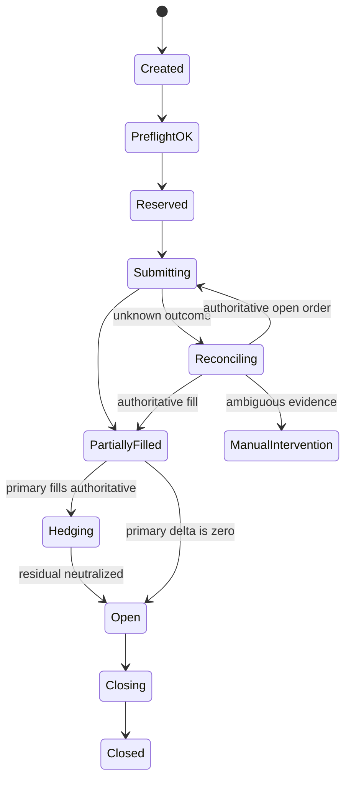

# Liqvera — architecture and safety invariants

The architecture of the Liqvera buildathon product is described in the [current specification](planning/LIQVERA_FACTORY_TZ.md). This document preserves the invariants and history of the Multi-Exchange Engine technical baseline.

[Repository README](../README.md) · [Accepted Python ADR](adr/0001-python-universal-arbitrage-core.md) · [Roadmap](ROADMAP.md) · [Technical strategy](research/TECHNICAL_STRATEGY.md) · [Repository audit](research/REPOSITORY_CONNECTIVITY_AUDIT.md)

## Status

This document preserves the **Go Stage-0 foundation and its safety invariants**. It is no longer the authoritative runtime-language decision.

The Liqvera F3–F7 implementation now adds a Python evidence/report layer, a
TypeScript/Express gateway with PostgreSQL state, a separate Vite browser
application, and an isolated Compose deployment. Those surfaces are
`IMPLEMENTED_UNVERIFIED`: their graph identities and factories exist, but the
deferred build, test, browser, container, security, fault, and acceptance phase
has not run. The official Mezo protocol package supplies pinned read-only MUSD
metadata to the gateway and browser; it does not grant minting, custody,
administrative, mainnet, or exchange-mutation authority.

The accepted forward runtime is the Python modular monolith in [`adr/0001-python-universal-arbitrage-core.md`](adr/0001-python-universal-arbitrage-core.md). Existing Go code remains `TEST_ONLY_EXECUTABLE_SPEC` until conformance and
review make a row `ELIGIBLE`. The superseded `Dockerfile.a2` packaging owner
is `RETIRED`. Retirement never makes Go packageable in Stage A.

Do not infer that a live adapter, trading endpoint or production execution path exists from either architecture document.

## Retained Go foundation decision

The first implemented foundation was a Go modular monolith with two future deployment boundaries:

1. Control plane: authentication, configuration, portfolio views, and audit.
2. Private execution worker: venue credentials, order ownership, reducer, reconciliation, and risk reservations.

They remained one binary until isolation or measured load required a split. PostgreSQL was the authoritative state store. Redis, NATS, and a Python sidecar were intentionally absent from that foundation.

The active Python design reuses the invariants below while changing the runtime and package structure.

## Safety invariants

- Money, price, quantity, fees, and P&L use exact integer fixed-point or equivalent exact-decimal values.
- JSON decimal values are strings; ambiguous binary floating-point money boundaries are rejected.
- An HTTP acceptance is never interpreted as a fill.
- Unknown order outcomes freeze new submissions until authoritative reconciliation.
- Residual hedging starts only after primary-leg cumulative fills are authoritative under the accepted saga policy.
- Only orders present in the exact ownership registry can be cancelled. There is no broad unscoped cancel operation.
- RFQ and CLOB capabilities use different contracts.
- Tenant and account identifiers are present in execution, ownership, risk, event, credential, and audit persistence.
- Credential rows store only encrypted envelopes and tenant/account-bound AAD.
- Execution events and audit records are append-only.
- Shadow-only mode remains the default; documentation does not arm live trading.
- Ticker equality never proves cross-venue hedge equivalence.
- Missing, stale, crossed or non-reproducible market evidence produces no opportunity.

## Conceptual state flow

The exact active Python state model must be defined by code/tests and the accepted ADR. This diagram records the invariant intent, not proof of implementation.

## Deferred deliberately

- production Hyperliquid and Lighter mutation adapters;
- live paired execution;
- user-capital deployment;
- credential KMS implementation;
- Telegram trading confirmation;
- Variational RFQ execution;
- automatic withdrawals;
- live arming and production deployment.

Each item requires its own contract, fault tests, shadow evidence and release gate.

## A2 packaging and CI boundary

The A2 raw-evidence collector is a separately pinned Python image. It is public-data only and must contain neither trading SDK authority nor venue trading credentials.

Its deployment/CI claims are maintained in [`a2-deployment.md`](a2-deployment.md) and must be verified against current workflow files and tests. Historical Go Docker behavior must not be confused with the accepted Python runtime direction.

## Strategy relationship

For why the project is intentionally narrow, read:

- [`research/MASTER_RESEARCH.md`](research/MASTER_RESEARCH.md);
- [`research/PMF_CRITICAL_REVIEW.md`](research/PMF_CRITICAL_REVIEW.md);
- [`research/TECHNICAL_STRATEGY.md`](research/TECHNICAL_STRATEGY.md).

Research governs what should be attempted; code, tests and ADRs govern what exists.
