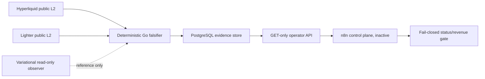

# Multi-Exchange Engine — complete handoff

## Update 2026-08-09: A2 verify image includes actionlint config

- PR CI run `31316449932` passed the PostgreSQL 16.11/17.7, A2 unit,
  replay, fault, and public-boundary gates, then both matrix jobs failed only
  while building the verify image. Its 215-test in-image suite had one failure:
  `/src/.github/actionlint.yaml` was absent.
- Regression coverage now requires the actionlint config in both the exact
  `.dockerignore` build context and the `Dockerfile.a2` verify-stage copies.
  The focused test failed on the missing `COPY` before the implementation.
- `.dockerignore` now re-includes `.github/actionlint.yaml`, and only the
  verify stage copies it. The production image boundary is unchanged.
- Local GREEN evidence: deployment contract 8/8; full A2 suite 215 tests with
  19 expected PostgreSQL-only skips; boundary scan, compileall, and pip check
  passed. Local Docker and actionlint executables were unavailable, so the
  fresh PR run remains the binding in-image and actionlint evidence.
- The Dockerfile validator repeated its documented temporary-pip bootstrap
  failure; fallback static checks found no latest tag, secret assignment, or
  root runtime user and confirmed the urllib healthcheck.
- No Claw workflow was dispatched and no Claw, app-stack, n8n, trading,
  credential, image-tag, or runtime state was changed.

## Update 2026-08-09: controlled A2 candidate promotion producer

- Manual Claw build no longer tags `mee-a2:candidate` inside each PostgreSQL
  matrix leg. The matrix now owns only PostgreSQL 16.11/17.7, unit, replay,
  fault, and boundary gates.
- One `needs: verify-a2-candidate` job builds the exact GitHub SHA once, runs
  pinned Syft/Trivy, uploads the reports, verifies the OCI revision and image
  ID, and runs the present/missing/tampered registry-mount smoke against the
  exact-SHA image before promotion.
- Global non-cancelling workflow concurrency serializes the shared local tag
  and host staging boundary across refs.
- `scripts/promote-a2-candidate.sh` revalidates the source SHA, image revision,
  image ID, and committed registry hash. It tags the candidate, then atomically
  stages a root-owned `0644` reviewed registry, checksum, and receipt under
  `/home/operator/app-stack/secrets`; the receipt is moved last as the deploy commit
  marker and binds source revision, both image IDs, registry hash, and run ID.
- Deployment contract coverage first failed on the old matrix promotion and
  missing staging script, then passed 8 tests. The A2 suite passed 215 tests
  with 19 expected PostgreSQL-only skips; the two CI reference tape modules
  passed 32 tests. Boundary scan, compileall, Bash parse, actionlint, and diff
  checks passed. A broader non-CI discovery attempt reached 431 tests but had
  nine legacy `pytest` import errors because this Windows interpreter does not
  have pytest. Actionlint configuration now records the custom `claw` runner
  label. No workflow was dispatched, no image was built or tagged on Claw, and
  app-stack/Compose/runtime state was not mutated.
- Binding validation still requires an available `[self-hosted, claw]` runner
  with reviewed passwordless authority for the script's `sudo -n` staging
  commands. Absent authority fails closed; it is not proven by Windows checks.

## Update 2026-08-09: A2 frozen-universe status and warm-up quality recovery

- `/v1/a2/soak-status` no longer relies on never-published in-memory coverage
  counters. At runtime freeze it reloads the current run's immutable quality
  minutes, verifies their hashes and exact frozen `(venue, market, channel)`
  membership, and aggregates only those rows; mixed historic runs and foreign
  streams cannot affect the report. `reporting_streams` is the distinct count
  of validated persisted stream keys, so empty and partial evidence now report
  zero and the actual partial count instead of the frozen-universe target 20.
- The runtime now owns a deterministic warm-up minute aggregator. A closed
  healthy UTC minute writes twenty quality records (one L2 stream per frozen
  venue/market) and immediately refreshes the status projection. Feed open and
  close events supply epoch health; a local subscription send no longer counts
  as acknowledgement. A routed venue-native L2 semantic observation is required
  before a stream's later quiet seconds can be healthy, while continuity and
  persistence failures remain invalidating predicates.
- This checkpoint intentionally produces quality only while `WARMING`; it
  does not claim to create five-day `MEASURING` evidence. That producer and
  the terminal soak decision remain separate work.
- Local verification: focused RED regressions failed with empty quality
  reporting 20 streams and no-data health reporting a valid minute. The focused
  status/warm-up/feed/runtime suite then passed 19 tests. Full A2 discovery ran
  211 tests successfully with 19 PostgreSQL-only skips because no local
  `A2_TEST_DATABASE_URL` was configured.

## Update 2026-07-28: A2 package-owned fixture runtime boundary

- The complete committed fixture corpus (seven JSON payloads plus its
  manifest) is package-owned at `multi_exchange_engine/a2/fixtures`; it was
  moved without byte changes and is no longer duplicated under `tests/`.
- `RuntimeDependencies.fixture_root` now defaults to the canonical package
  path, and fixture mode passes that path directly to `FixtureFeed`. Runtime
  source no longer derives a fixture location from a project root or a test
  directory, so the production `/app/multi_exchange_engine` Docker copy
  carries the exact fixture corpus while the production stage still excludes
  tests.
- Unit and integration tests use the same canonical root. The runtime test
  validates every manifest entry's byte length and SHA-256 before accepting
  the default package corpus.
- Verification: the targeted A2 runtime/semantic/replay/deployment suite
  passed 34 tests, fixture-path integration tests passed 3 tests with 2
  expected PostgreSQL-only skips, and the full suite passed 405 tests with 19
  expected PostgreSQL-only skips. `check-a2-boundary.py`, `compileall`, and
  `git diff --check` passed; no Docker build was run.
- This is a source-only packaging repair. It does not build or run Docker,
  start an A2 collector, contact any venue, or alter the shadow-only gate.

## Update 2026-07-28: A2 Task 13 adversarial RC gates complete

- Final reviewed branch commit:
  `2593ec088684c05709bc8c8293e48e400b68a242`; local and
  `origin/feature/a2-boundary-scan` matched after push.
- The whole-branch review first rejected the candidate because production
  lacked the reviewed-registry runtime input and the Docker contract could
  miss an extra `FROM`. Both were fixed. A second review found and mutation-
  confirmed a resume bypass around registry validation; commit `57bee57`
  moved byte/hash verification before database ownership and bound resume to
  the persisted PLAN manifest. Final reviews reported no Critical, Important,
  or Minor findings.
- Local final suite: 404 tests passed with 19 expected PostgreSQL-only skips;
  compileall, public-only boundary, and diff checks passed.
- Claw exact-commit validation was retained at
  `/home/operator/codex-validation/mee-a2-task13-2593ec0-QE2EDegv`.
  The verify and production images built successfully. The real production
  registry smoke accepted the read-only reviewed file and rejected missing
  and byte-tampered mounts while using `--network=none`, read-only rootfs,
  dropped capabilities, and UID/GID `10001:10001`.
- Pinned PostgreSQL 16.11 and 17.7 gates each passed all 22 integration tests
  with no skips, including migration down/up recovery, crash/outage,
  deterministic fresh-process replay, partition, retention, and authority
  checks.
- Pinned Syft produced a 311332-byte CycloneDX SBOM. Pinned Trivy 0.72.0
  produced a 109824-byte report with zero HIGH/CRITICAL findings. The final
  image is 26459830 bytes and `mee-a2:candidate` carries the exact final
  revision label.
- No public collector, measured run, n8n workflow, venue API, or trading path
  was started. Task 14 still owns isolated app-stack Compose and inactive
  read-only n8n integration; the existing unrelated `glider.conf` dirty state
  in `/home/operator/app-stack` was not modified.

## Update 2026-07-28: A2 reviewed-registry runtime boundary and Docker stage parsing

- Production A2 configuration now requires the exact Linux registry mount path
  and its expected SHA-256. Runtime reads that explicit input before any
  database claim, rejects missing or altered bytes, and writes the accepted
  hash to the PLAN manifest. Resume compares the current hash with the
  persisted manifest before it can append a `RESTART` event; valid-but-different
  registry bytes fail closed too.
- `Dockerfile.a2` provides a root-owned `/app/config` mount point but still
  does not copy the registry into production. Task 14 Compose must bind the
  reviewed host file to
  `/app/config/a2-reviewed-perpetual-mappings.json:ro` and set its reviewed
  SHA-256 environment value; the engine plan now makes this mandatory.
- `scripts/smoke-a2-registry-mount.py --image mee-a2:candidate` is the
  production-image mount gate: present input must pass; missing and tampered
  inputs must fail while the image remains read-only and runs as `10001:10001`.
- The deployment contract enumerates every physical `FROM` instruction,
  including optional `--platform` syntax, and requires exactly the three
  approved pinned stages. A mutation adding `FROM busybox:1.36` is rejected.
- This source-only checkpoint does not start A2, run Docker/Compose, change
  `/home/operator/app-stack`, validate the future app-stack repository, or permit
  public warm-up, measured capture, or live trading.

## Update 2026-07-28: A2 selector and proxy-path hardening

- Selector assignments through constant-key subscripts, for example
  `payload["method"]`, now receive the same AST private-capability check as
  named and attribute selectors.
- Lowercase action compounds such as `ordercreate` are rejected at explicit
  capability/action boundaries; arbitrary interior fragments such as `border`
  are not raw-substring matches.
- `channel` is a structured selector. Private `account` is rejected, while
  the explicit public `order_book`, `trade`, and `market_stats` channel pattern
  remains accepted.
- The internal proxy exception requires the exact root A2 path
  `a2/transport.py`; a nested file named `transport.py` cannot inherit it.
- This remains a static source boundary only, not evidence of public data
  quality, reconstruction, opportunity, profitability, warm-up, or live use.

## Update 2026-07-28: A2 boundary scanner review fixes

- Scanner now resolves relative imports against the logical
  `multi_exchange_engine.a2` package and rejects a relative escape to
  `domain.execution`; legitimate A2-local relative imports remain allowed.
- Private capability literals are checked in AST message-selector dict fields,
  selector-like assignments and keyword arguments. Delimited/camel-case tokens
  such as `order.cancel` and `orderCancel` are rejected without substring
  scanning comments, prose, or public channel names.
- Forbidden normalized-book symbols are checked as AST names, attributes,
  import aliases, class names and function names.
- The public URL allowlist contains only the four venue URLs. The internal
  proxy is a separate exception for exactly one module-level
  `transport.py: PROXY_URL` assignment; copies or duplicates fail closed.
- New copied-package mutations cover every reviewed escape. This static gate
  still does not establish data quality, reconstruction, edge, profitability,
  public warm-up, or live-trading authority.

## Update 2026-07-28: A2 public-only boundary regression

- Added the fail-closed AST scanner `scripts/check-a2-boundary.py`. It checks
  only production A2 source: import boundaries, the third-party allowlist,
  credential-free public URL literals, structured outbound message types, and
  forbidden normalized-book symbols.
- `tests/a2/test_dependency_boundary.py` copies the A2 package to a temporary
  directory, and mutation tests reject execution imports, unauthorized domain
  imports, private outbound `order`, and private URL literals. Comments and harmless
  public `order_book` names do not count as private capability evidence.
- Scanner success means only that forbidden capabilities are absent from
  statically checked A2 source. It does not establish data quality,
  reconstructability, arbitrage edge, profitability, or readiness for live
  trading.
- After this checkpoint is GREEN, public warm-up and the five-day measured run still
  require the subsequent packaging/deployment gates; venue/private APIs, signers,
  account data, and trading methods were not invoked.

## Update 2026-07-27: A2 Task 10 replay and fault gate complete

### Result

- Implemented deterministic PostgreSQL replay one raw batch at a time:
  compressed/uncompressed hashes, strict envelopes, contiguous batch/ingest
  indexes, frame indexes by `(venue, boot_id, connection_epoch)`, and repeated
  venue-native semantic classification.
- Replay compares raw-envelope semantics with stored decoder evidence and
  fails closed using only typed A2 reason codes. It does not build an order book.
- `scripts/replay-a2-run.py` prints one credential-free canonical JSON
  report. Configuration errors return exit `2`; integrity/runtime failures return
  exit `1`; tracebacks and DSNs are not exposed.
- Two fresh Python processes against the same PostgreSQL snapshot must
  produce byte-identical stdout. An integration test proves this.
- Decoder schema/version drift, hash corruption, gzip truncation/append,
  duplicate/missing indexes, epoch merging, and semantic mismatches have negative
  replay coverage.

### Fault matrix

- Queue saturation terminates ingress with `QUEUE_SATURATED`.
- WebSocket EOF is recorded as `WEBSOCKET_DISCONNECTED`.
- A Lighter nonce gap opens `GAP_OPEN`; a large `offset` with a correct
  nonce chain remains valid and is not used as a continuity key.
- Hyperliquid source-time regression is recorded as
  `SOURCE_TIME_REGRESSION`/`INVALID_SOURCE_TIME`.
- A stored future decoder version produces `DECODER_VERSION_MISMATCH`.
- The existing binding PostgreSQL harness actually kills the child before and after commit,
  proving atomic/idempotent recovery, and separately closes the connection before
  a pending retry, proving the outage/reclaim path.

### Files and Git

- Core replay checkpoint: `b3d9a79`.
- Canonical CLI/PostgreSQL/fault checkpoint: `e699e31`, pushed to
  `origin/feature/a2-raw-wire-capture`.
- Changed/added:
  `multi_exchange_engine/a2/model.py`,
  `multi_exchange_engine/a2/repository.py`,
  `multi_exchange_engine/a2/replay.py`,
  `scripts/replay-a2-run.py`,
  `tests/a2/test_replay.py`,
  `tests/a2/test_repository_unit.py`,
  `tests/a2/integration/test_replay_postgres.py`,
  `tests/a2/integration/test_fault_matrix.py`.

### Claw verification

- Source archive exact commit: `e699e31`; SHA-256
  `3946e196fdcd0f4222c786b36aba066612bec3b7eaff385ea1be077442b93aec`.
- Pinned Linux wheelhouse: 13 wheels; archive SHA-256
  `4edce479619007a533831b968d793b5d26ca90f6b9852364b5a4c8a53ff6a759`.
- Runtime: `python:3.12-slim-bookworm`, `postgres:16-alpine`, network
  `app-stack_airgap_net`, an ephemeral random database password, a read-only source
  mount, and tmpfs for the venv/bytecode.
- Focused Task 10 + binding crash/outage gate: 8/8.
- Full PostgreSQL integration gate: 22/22; skips are prohibited.
- Full suite on Python 3.12: 377/377.
- `pip check` and `compileall` passed.
- `/home/operator/app-stack` remained at
  `5109675c17c1b3d8975c208c83d054bbc4e5b550`; HEAD and dirty-state hashes matched
  before and after. Temporary containers/source/archive were removed.
- Evidence:
  `outputs/mee-a2-task10-e699e31-claw.log` and
  `outputs/mee-a2-task10-e699e31-claw.status`.

### Attempts and failures

- The first runner performed `pip install` through `proxy-gateway`; intermittent TLS
  record corruption interrupted the download before tests. n8n has the same proxy origin,
  but ordinary Node `fetch` does not apply an environment proxy by itself.
- The retry switched to offline delivery of a pinned Linux wheelhouse. The test container
  has no dependency egress and no bypass through a direct-WAN route.
- The next runner did not pass `PYTHONPATH=/workspace`; the explicit script saw
  `scripts/`, but not the `tests` package. The path was set explicitly.
- Then `compileall` correctly refused to write `__pycache__` into the read-only
  source mount. Bytecode output moved to `/tmp/pycache`; source-mount restrictions
  were not relaxed.

### Claim boundary and next step

- Task 10 proves replay integrity and fault handling for stored public
  application messages. It does not establish reconstructability, arbitrage edge,
  profitability, or live-trading readiness.
- Venue/private APIs, signers, account data, and trading methods were not invoked.
- Next step: Task 11 forbidden-capability scan and claim-boundary regression.
  Do not start public warm-up or the five-day measured run until it is GREEN
  and the subsequent packaging/deployment gates pass.

## Update 2026-07-27: A2 Task 10 bounded replay core checkpoint

- Added batch-bounded deterministic replay. Memory holds no more than
  one raw batch and its bounded decoder evidence range at a time.
- Replay checks both stored hashes, the fixed gzip profile, canonical NDJSON,
  contiguous batch/ingest indexes, and epoch-local frame indexes.
- Observer state is separated by `(venue, boot_id, connection_epoch)`: the same
  epoch number in a new boot is not merged with the old one.
- Reproduced observations are compared with combined persisted evidence:
  semantic/source fields from the immutable raw envelope plus decoder version,
  class/continuity/error from `raw_decoder_observations`.
- The terminal report has a canonical SHA-256, exact `VERIFIED|FAILED` status, and only
  typed A2 reason codes. Replay does not build an order book.
- The PostgreSQL reader loads decoder rows only for the current batch range
  and fails closed on missing, duplicate, or non-contiguous rows.
- TDD RED: `multi_exchange_engine.a2.replay` was missing, then the
  typed bounded decoder reader was missing. Focused GREEN: 8/8 tests; `compileall` and
  `git diff --check` passed.
- One initial corruption test changed nothing: the final gzip byte
  was already `0x00`. The fixture was corrected to use a guaranteed XOR; production code
  was not changed for this.
- Next Task 10 step: canonical CLI, PostgreSQL replay integration, and fault
  matrix. The Claw gate and public warm-up were not run at this checkpoint.

## Update 2026-07-27: A2 Task 9 runtime composition complete

### Result

- Assembled a concrete A2 service runtime for `public|fixture`: strict configuration,
  PostgreSQL run lease, clock qualification, discovery/frozen universe,
  append-only lifecycle, durable batch writer, both public raw feeds, and the exact
  GET-only status surface.
- Startup order is fixed as lease/database → clock/discovery/freeze → writer →
  Hyperliquid → Lighter → status. Shutdown uses one boundary:
  stop admission → close feed epochs → durable batch flush → lifecycle
  persistence → lease release → status stop.
- `python -m multi_exchange_engine.a2` does not print DSNs or arbitrary exception
  text. Configuration, terminal, and generic failures have bounded
  operator-facing messages.

### Persistence and restart

- Public discovery accesses only fixed credential-free endpoints through
  `proxy-gateway`. Exact raw Hyperliquid/Lighter control payloads and the processed
  frozen universe are stored atomically after hash/provenance/registry
  validation.
- Restart restores exact lifecycle events and the frozen universe from
  PostgreSQL. A previously frozen run does not repeat discovery or change
  the ranking.
- The status persistence cursor is updated after every confirmed DB
  commit, not only at shutdown. The callback receives the next
  `batch_sequence` and `ingest_index` only after successful `persist`.
- Lifecycle/connection control writes are moved out of the asyncio event loop through
  bounded thread calls; batch persistence already uses the same approach.

### Fixture boundary

- Fixture mode creates no public HTTP/WebSocket session. It builds
  deterministic synthetic discovery from the committed reviewed registry,
  freezes 10 mappings, and passes seven exact committed application payloads through
  the real ingress/writer: three Hyperliquid and four Lighter payloads.
- Fixture readiness proves only wiring, raw-byte admission, durability,
  startup/shutdown, and absence of venue network access. It does not establish complete
  semantic routing, public subscription acknowledgement, data quality,
  reconstructability, or arbitrage expectancy.
- Public collector readiness means the WebSocket is open and all fixed
  subscription requests have been sent. Acknowledged subscription quality and
  each one-second slot remain binding responsibilities of warm-up/the gate.

### Task 9 files

- `multi_exchange_engine/a2/config.py`
- `multi_exchange_engine/a2/status_api.py`
- `multi_exchange_engine/a2/app.py`
- `multi_exchange_engine/a2/runtime.py`
- `multi_exchange_engine/a2/fixture_runtime.py`
- `multi_exchange_engine/a2/__main__.py`
- `multi_exchange_engine/a2/feed.py`
- `multi_exchange_engine/a2/hyperliquid_feed.py`
- `multi_exchange_engine/a2/lighter_feed.py`
- `multi_exchange_engine/a2/pipeline.py`
- `multi_exchange_engine/a2/repository.py`
- `tests/a2/test_config.py`
- `tests/a2/test_status_api.py`
- `tests/a2/test_app.py`
- `tests/a2/test_runtime.py`
- Related feed/pipeline/repository unit and PostgreSQL integration tests.

### Attempts and failures

- The first Claw runner expected an unavailable cached
  `python:3.12-alpine`; the available `python:3.12-slim-bookworm` was selected.
- The first container run passed explicit unittest modules without
  `PYTHONPATH=/workspace`, so Python saw `scripts/`, but not the
  `tests` package. The final runner sets the top-level path.
- An attempt to use host Python confirmed `Python 3.12.3`, but the system
  environment lacks `aiohttp/psycopg`. A temporary venv first received the
  concatenated IPs of all `proxy-gateway` networks; then the host-to-container DB path
  hung. This mixed route was abandoned.
- The final gate follows the working n8n network pattern: the Python runner and
  ephemeral PostgreSQL are in `app-stack_airgap_net`; outbound dependency
  fetching uses only `http://proxy-gateway:1080`, and DB access uses container DNS.
- Reading the full `docker logs` through Bitvise hung after terminal
  `EXIT=0`; a separate bounded cleanup check confirmed that the
  containers, archive, and temporary tree were absent.

### Verification and Git

- Final local suite: 362 tests, 345 passed, and 17 expected PostgreSQL
  skips without a local DSN.
- Claw binding PostgreSQL gate: 17/17, runner `EXIT=0`; the gate separately fails
  on any skip.
- `compileall`, `pip check`, and `git diff --check` passed.
- Runtime checkpoints pushed:
  `6730b85`, `c472926`, `da17eef`, `0c2024d`.
- `/home/operator/app-stack` was not changed. Temporary Claw containers, the source tree,
  and the archive were removed.
- Public warm-up, the five-day measured run, replay, and trading operations were
  not started.

### Next step

- Task 10: deterministic bounded PostgreSQL replay and fault matrix. Starting public
  warm-up is premature without byte-identical double replay and crash/outage evidence.

## Update 2026-07-27: A2 Task 9 GET-only status checkpoint

- Added the exact GET-only aiohttp surface: `/health`, `/ready`,
  `/v1/a2/soak-status`. Automatic `HEAD` is disabled; known paths return
  `405` for `HEAD/POST/PUT/PATCH/DELETE`, and mutating routes are absent.
- Status publishes only a typed `A2StatusSnapshot`: lifecycle,
  immutable window, warm-up, aggregate coverage, typed failure counts, and
  batch/index/hash progress. Arbitrary config/secret payloads are not accepted.
- Readiness is `true` only when ownership is held, the database is ready,
  the universe is frozen, and Hyperliquid/Lighter collectors are ready simultaneously.
- `A2Application` fixes startup order as
  database/ownership → discovery/freeze → writer → Hyperliquid → Lighter →
  status. Shutdown order:
  stop admission → close both epochs → flush boundary → persist lifecycle →
  release ownership → stop status.
- An ownership conflict stops startup before discovery/writer/feeds/status and
  is published as a typed failure. SIGINT/SIGTERM only set a stop event;
  the same boundary controller performs shutdown.
- TDD: expected RED — `a2.status_api` and `a2.app` were missing. One test
  incorrectly used the quality label `MISSING_SLOT` as a terminal enum; the premise
  was corrected to `COVERAGE_BELOW_THRESHOLD`. The focused suite passed 6/6.
- Full local suite: 356 total, 340 passed, and 16 expected PostgreSQL
  skips. `compileall`, `pip check`, the 88-column scan, and `git diff --check`
  passed.
- Next step within Task 9: concrete runtime assembly and `__main__.py`.
  No public/fixture run was started.

## Update 2026-07-27: A2 Task 9 safe-config checkpoint

- Added strict `A2Config`: canonical run UUID, only `public|fixture`,
  fixed app-stack proxy, IPv4 status bind, bounded port, and allowlisted log
  level.
- `A2_DATABASE_URL` and unknown `A2_*` variables are rejected without printing
  values. The PostgreSQL DSN is read only from a bounded regular non-symlink
  file; group/other permissions are prohibited on Linux.
- The DSN is excluded from `repr` and errors. The secret file is checked before and after
  opening, limited to 4096 bytes, and rejects empty, multiline, NUL-containing, or
  whitespace-mutated values.
- TDD: expected RED — `a2.config` was missing; the first GREEN attempt exposed
  an incorrect exact-type check for Windows `WindowsPath`; after correction,
  the focused configuration suite passed 5/5.
- Full local suite: 350 total, 334 passed, and 16 expected PostgreSQL
  skips. `compileall`, `pip check`, the 88-column scan, and `git diff --check`
  passed.
- Next step: status/application RED, GET-only API, and application composition
  with boundary-ordered startup/shutdown. No public or fixture run has started yet.

## Update 2026-07-27: A2 Task 8 quality, lifecycle and five-day gate

### Goal and result

- Implemented credential-free Task 8: fixed-slot quality evidence,
  a 60-minute contiguous warm-up, one immutable measured window, and
  a deterministic `PASS|FAIL` gate.
- Corrected a critical inconsistency: the separate A2 design/plan still
  specified 24 hours, although the binding Stage A specification and the user's explicit
  instruction require five full data days. The unified contract is now exactly
  432000 seconds after warm-up, half-open
  `[measured_start, measured_end)`.
- No trading/private/account/signer/order/transaction methods exist. Task 8 does not
  build books or claim profitability.

### Changes

- Each of the 20 frozen venue-market L2 streams receives 60 expected
  one-second slots per UTC minute. A slot is valid only with an acknowledged
  subscription, an active epoch, a valid recorder clock, ready persistence, and
  no continuity gap. A quiet healthy second is valid; a missing slot
  is synthesized as `MISSING_SLOT`.
- Source-time age and the latest cross-venue receive skew are computed as exact
  `Decimal` values from integer nanoseconds. The 750/200/250 ms thresholds are stored as
  hash-bound evidence for A3 and do not themselves reduce A2 coverage. Future source
  time receives a separate reason count.
- Warm-up requires 60 contiguous complete minutes. An invalid minute, time
  jump, or restart resets progress with an append-only `WARMUP_RESET` event.
  After the 60th minute, bounds are fixed once; a restart during measurement
  neither changes nor extends the window.
- `SoakGate` checks exactly 10 mappings, 20 L2 streams, and 7200 quality
  minutes per stream. Each stream has 432000 expected slots; exactly 429840
  valid slots (99.5%) still pass, while 429839 produce
  `COVERAGE_BELOW_THRESHOLD`.
- `PASS` requires a valid replay shape and terminal evidence hash. A missing stream,
  bad quality hash, bad replay anchor, silent drop, wrong duration, or
  incomplete window produces immutable `FAIL`; A2 has no manual override, `GO`, or `EXTEND`.
- Python `RunEvent` and the authoritative PostgreSQL trigger now independently
  prohibit `MEASURING/PASS` without exact 432000-second bounds, a window in
  `PLANNED/WARMING`, an incorrect duration, and changes to bounds by a terminal
  event. A `PASS` decision row must also have a five-day window.

### Task 8 files

- `multi_exchange_engine/a2/quality.py`
- `multi_exchange_engine/a2/lifecycle.py`
- `multi_exchange_engine/a2/soak_gate.py`
- `multi_exchange_engine/a2/model.py`
- `multi_exchange_engine/a2/repository.py`
- `migrations/000002_a2_raw_capture.up.sql`
- `tests/a2/test_quality.py`
- `tests/a2/test_lifecycle.py`
- `tests/a2/test_repository_unit.py`
- `tests/a2/integration/test_pipeline_postgres.py`
- `tests/a2/integration/test_repository_postgres.py`
- The A2 design, plan, and this `handoff.md`.

### Attempts and failures

- The first Claw runner installed only `psycopg`; importing the repository requires
  the pinned public transport dependency `aiohttp`, so tests stopped before
  migration. The runner switched to the full `requirements-a2.txt`.
- The first full PostgreSQL run produced 15 passes and one rejected fixture: the old
  owner-immutability test inserted a dummy `PASS` with bounds `1..2`. The fixture
  was changed to `FAIL`, because the test checks only the owner-level prohibition on
  `UPDATE/DELETE`, not a successful soak.
- The root test container created temporary `__pycache__` that the
  host user could not remove. The retry runner disabled bytecode; the old temporary tree was removed
  through a targeted `/tmp` mount. The final cleanup check passed.
- During the final reducer/gate split, a focused test caught a missing
  `SoakDecision` import in `LifecycleEvent.finalize`. The import was restored,
  and the repeated focused and full suites passed.

### Verification and environment

- Focused Task 8: 11/11 passed.
- Full local suite: 345 total, 329 passed, and 16 PostgreSQL tests
  expectedly skipped without a DSN.
- `compileall`, the repository contract suite 23/23, and `git diff --check` passed.
- On Claw: ephemeral `postgres:16-alpine` and Python 3.12 containers in
  `app-stack_airgap_net`; binding PostgreSQL gate 16/16, skips 0.
- Temporary archive, runner, test tree, and PostgreSQL container were removed.
  `/home/operator/app-stack` was not changed; production deployment and five-day
  capture were not started.

### Next step

- Task 9: safe configuration, application composition, and GET-only status API.
- Do not start warm-up or five-day capture before Task 9/10: Task 8 proved
  the reducer/gate and DB constraints, but runtime orchestration, the status surface, and
  deterministic database replay are still absent.

## Update 2026-07-27: A2 Task 7 public discovery and raw feeds

### Goal and result

- Task 7 implements only credential-free public discovery and raw capture for
  Hyperliquid/Lighter. There are no trading, private, signer, account, order, transaction,
  transfer, or withdrawal methods.
- Instrument contract: the same base asset, a linear perpetual, `1x`
  displayed base units, USD valuation, USDC settlement, and mandatory
  `EXPLICIT_ORACLE_STABLECOIN_BASIS/v1`. This does not prove zero basis
  risk or profitability.
- The committed manual registry contains 12 current reviewed candidates; runtime
  ranks them only after semantic membership review and freezes the top 10
  by the minimum positive venue-reported 24h quote volume.

### Changes

- Added fixed public transports:
  `https://api.hyperliquid.xyz/info`,
  `wss://api.hyperliquid.xyz/ws`,
  Lighter `orderBooks`, and
  `wss://mainnet.zklighter.elliot.ai/stream?readonly=true`.
  All venue connections go through `http://proxy-gateway:1080`; TLS verification
  is enabled, redirect policy fails closed, WebSocket heartbeat is 30 seconds,
  and frame limit is 8 MiB.
- Discovery JSON is parsed strictly: fractional numbers become
  `Decimal`; duplicate keys and non-finite constants are rejected. The semantic value
  is reconstructed each time from exact hash-bound raw bytes and cannot
  diverge from the payload after external mutation.
- Discovery is processed before writing. Then one PostgreSQL transaction
  stores:
  1. exact raw Hyperliquid `metaAndAssetCtxs`;
  2. exact raw Lighter active `orderBooks`;
  3. exact raw Lighter read-only `market_stats/all`;
  4. processed hash-bound frozen mappings.
  Missing, duplicate, wrong-run, wrong-provenance, or hash-unbound evidence
  is rejected before the transaction. The Lighter catalog must also actually
  resolve every frozen market ID/base asset; successful raw-only or processed-only
  writes are prohibited.
- Added the append-only `a2.raw_control_evidence` table with fixed
  venue/kind/transport/source URI constraints, raw `bytea`, SHA-256, an 8 MiB
  limit, and an owner-level immutable trigger.
- Added one multiplexed public WebSocket collector per venue. Exact
  text UTF-8/binary application bytes are admitted to ingress before the semantic
  observer. Reconnect creates a new epoch and observer. Queue saturation and
  oversized frames close the epoch without infinite reconnect. OPEN/CLOSE
  evidence stores the actual extensions and exact `aiohttp` version.
- Added a deterministic mapping-review generator, committed registry,
  critical review document, and credential-free live smoke.

### Task 7 files

- `multi_exchange_engine/a2/transport.py`
- `multi_exchange_engine/a2/feed.py`
- `multi_exchange_engine/a2/hyperliquid_feed.py`
- `multi_exchange_engine/a2/lighter_feed.py`
- `multi_exchange_engine/a2/universe.py`
- `multi_exchange_engine/a2/repository.py`
- `migrations/000002_a2_raw_capture.up.sql`
- `config/a2-reviewed-perpetual-mappings.json`
- `docs/a2-mapping-review.md`
- `scripts/build-a2-mapping-review.py`
- `scripts/smoke-a2-public-discovery.py`
- `tests/a2/test_transport.py`
- `tests/a2/test_mapping_registry.py`
- `tests/a2/test_hyperliquid_feed.py`
- `tests/a2/test_lighter_feed.py`
- `tests/a2/test_repository_unit.py`
- `tests/a2/integration/test_repository_postgres.py`
- The A2 design, plan, and this `handoff.md`.

### Attempts and failures

- `aiohttp 3.14.3` does not accept `max_redirects` in `ws_connect`; the first
  Claw live smoke exposed this. Protection was replaced with session middleware that
  rejects any 3xx before a follow-up request, plus checks for the exact final WS URL and
  empty response history.
- The first final Claw gate was interrupted by a transient
  `SSL record layer failure` during `pip` through proxy-gateway. Cleanup removed
  the temporary DB and files. A bounded dependency-install retry was added.
- The next PostgreSQL gate exposed only an error in the new test:
  a local `import psycopg` was missing before the zero-row assertion. After
  correction, the entire binding gate passed.

### Verification and environment

- Locally: the suite ran 334 tests — 318 passed and 16 PostgreSQL tests
  expectedly skipped without a DSN; focused Task 7/repository — 46 passed;
  `compileall`, `pip check`, the line-length scan, and `git diff --check` passed.
- On Claw: ephemeral PostgreSQL 16 in `app-stack_airgap_net`, 16/16 binding
  integration tests with no skips. Proven: raw+processed round-trip,
  pre-transaction rejection with zero rows, and immutability of eight evidence tables.
- Live smoke through the real `proxy-gateway`: 12 current accepted mappings,
  10 frozen mappings, 3 raw control documents, 313786 raw bytes, one
  Hyperliquid application WebSocket frame, `public_only=true`.
- `/home/operator/app-stack` was not changed. The temporary PostgreSQL container, archive,
  test directory, and runner were removed after verification.

### Next step

- Task 8: warm-up lifecycle, fixed measured window, and soak gate.
- Five-day capture readiness cannot be claimed before Task 8: collectors and
  persistence primitives are ready, but orchestration, 60 contiguous warm-up
  minutes, the 5-day window, coverage decision, and production deployment are not
  implemented yet.

## Update 2026-07-27: A2 compatibility contract corrected before Task 7

- Dmitry selected the explicit basis-risk model after official contract review
  showed that ticker equality cannot prove identical quote conventions.
- A reviewed pair now requires the same base asset, USD-valued price, USDC
  settlement, linear payoff, one base-asset displayed-size unit, and exact
  `1x` multipliers. `quote_currency` was replaced by
  `valuation_currency`.
- Hyperliquid and Lighter quote/oracle references are stored separately. Every
  admitted mapping must carry
  `EXPLICIT_ORACLE_STABLECOIN_BASIS/v1`; downstream economics may not assume
  the recorded oracle/stablecoin basis is zero.
- Venue-reported positive USD-valued 24-hour notionals remain usable for
  discovery ranking without FX conversion. Their raw payload hashes, separate
  quote references, and the basis-risk policy are bound into the frozen
  manifest and canonical PostgreSQL mapping document.
- Focused TDD produced the expected missing-field RED and then passed 18
  universe/repository tests. Full local discovery passes 309 tests with 15
  explicit PostgreSQL skips; `compileall` and `git diff --check` pass. This is
  a binding design correction, not a profitability or
  executable-equivalence claim. Next action remains A2 Task 7 public
  transport, reviewed registry, and raw public feeds.

## Update 2026-07-27: A2 Task 6 durable restart and outage recovery

- A leased repository now derives the next `batch_sequence` and
  `ingest_index` from the complete committed batch tail. It rejects gaps,
  overlaps, malformed indexes, a foreign/closed lease, and any divergent
  restart cursor instead of guessing from process memory.
- `BatchWriter` accepts that durable cursor, so a new process may use a new
  `boot_id` and connection epoch while continuing the immutable run indexes.
  The existing `MEASURING` event retains the original fixed measurement
  window.
- `RepositoryBatchSink` owns the PostgreSQL run lease, retains the exact
  pending batch and decoder observations across a connection outage, verifies
  readiness by reconnecting and reclaiming ownership, and accepts only the
  pre-commit or identical-post-commit cursor before replay.
- Availability failure and evidence conflict are now separate. A database
  outage stops admission, emits `PERSISTENCE_UNAVAILABLE` once, and retries
  only after readiness. `IntegrityConflict` is terminal and never enters the
  readiness loop.
- The binding PostgreSQL gate ran on Claw against an ephemeral PostgreSQL 16
  container on `app-stack_airgap_net`. All three Task 6 scenarios passed:
  process death before commit left zero rows; death after commit replayed
  idempotently; and a forced connection loss stopped admission, reclaimed the
  lease, and committed the retained batch. No persistent database or
  credential was created.
- Focused terminal/repository coverage passes 23 tests. Full local discovery
  passes 308 tests with 15 explicit PostgreSQL skips; the binding Claw gate
  supplies the three Task 6 PostgreSQL results. `compileall` and
  `git diff --check` pass. Next action is A2 Task 7: fixed public transports,
  deterministic mapping-review evidence, and read-only Hyperliquid/Lighter
  feeds.

## Update 2026-07-27: A2 Task 5 final UTC and role-boundary remediation

- Both security-definer helpers now compute exactly one explicit UTC date from
  `(CURRENT_TIMESTAMP AT TIME ZONE 'UTC')::date`. Partition authorization,
  the current/yesterday window, retention argument validation, and the
  seven-complete-UTC-day cutoff no longer depend on caller or session
  `TimeZone`; production migration SQL contains no `CURRENT_DATE`.
- `a2_writer` and `a2_maintainer` are created with explicit `NOLOGIN`,
  `NOSUPERUSER`, `NOCREATEDB`, `NOCREATEROLE`, `NOINHERIT`,
  `NOREPLICATION`, and `NOBYPASSRLS`. Every up migration revalidates all
  attributes and rejects any role that is a member of another role with
  SQLSTATE `55000`. External principals may still be granted membership in
  these A2 roles.
- PostgreSQL coverage now asserts exact catalog attributes and zero inherited
  memberships, changes the session timezone to `+14:00` and `-12:00` while
  proving UTC partition/retention decisions and no early boundary drop, and
  exercises an unsafe pre-existing `LOGIN` maintainer rejection followed by
  safe restoration and idempotent migration recovery.
- TDD RED produced exactly three expected failures: missing role hardening,
  session-local partition authorization, and session-local retention. Focused
  GREEN passes 22 tests. Full local discovery passes 304 tests with 12 explicit
  PostgreSQL skips; `compileall` and `git diff --check` pass.
- `A2_TEST_DATABASE_URL` remains unavailable. The expanded PostgreSQL migration,
  catalog, timezone, and unsafe-role runtime paths were compiled and discovered
  but not executed; the zero-skip Task 12 CI/Claw gate remains mandatory.

## Update 2026-07-27: A2 Task 5 adversarial-review remediation

- Logical batch identity is serialized across UTC partitions with a stable
  transaction-scoped advisory lock taken before the global lookup and insert.
  Replay now reads and validates every stored batch column, rejects duplicate
  logical sequences, verifies lengths, hashes, compression profile, UTC day,
  and full `RawWireBatch` integrity, and maps corruption to
  `IntegrityConflict`.
- Frozen universe persistence now stores a complete canonical versioned
  document in `identity_json`: run and manifest identity plus every
  `FrozenMapping` field, including exact exponent-form decimals and discovery
  evidence.
- Partition creation is restricted to the server's current/yesterday window
  and serialized before DDL. Retention accepts only `CURRENT_DATE`, derives its
  cutoff server-side, locks each candidate child `ACCESS EXCLUSIVE`, rechecks
  nonterminal runs in that same transaction, and is granted only to a separate
  `a2_maintainer` role.
- Down migration revokes A2 grants and drops only the A2 schema. Cluster roles
  intentionally survive rollback. Writer permissions remain limited to
  `SELECT`, `INSERT`, and current-window partition creation; production
  repository SQL still contains no `UPDATE` or `DELETE`.
- Adversarial RED tests exposed the missing canonical mapping document, missing
  logical-write lock, incomplete replay verification, unsafe retention order,
  overbroad retention authority, and runner-discovery weakness. Focused
  repository/migration/runner coverage now passes 21 tests.
- Final local verification passes: `compileall`, `pip check`,
  `git diff --check`, and full discovery (301 tests, 10 explicit PostgreSQL
  skips). The binding runner still exits `2` with the exact
  `A2_TEST_DATABASE_URL is required` diagnostic because no PostgreSQL DSN is
  available. PostgreSQL runtime/catalog/concurrency validation remains an
  explicit Task 12 CI/Claw gate; it is not claimed here.

## Update 2026-07-27: A2 Task 5 append-only PostgreSQL evidence repository

- Added PostgreSQL-16-compatible `a2` evidence tables, UTC-day partitions,
  immutable owner-visible mutation triggers, serialized lifecycle transition
  placeholders, one-terminal-event uniqueness, and A2-scoped down migration.
- Partition and retention helpers are security-definer functions with a fixed
  safe search path, validated generated identifiers, revoked public execution,
  and narrow `a2_writer` grants. Retention only removes closed raw-wire child
  partitions older than seven complete UTC days and refuses nonterminal runs.
- Added strict frozen repository records, stable UUID advisory-lock ownership,
  integer-nanosecond UTC day derivation, canonical JSON without a float path,
  DSN-redacted connection failures, transactional batch/observation persistence,
  exact immutable retry comparison, replay iteration, and typed conflicts.
- PostgreSQL integration coverage applies up/down/up and exercises owner
  immutability, lease contention, identical/conflicting retry, UTC partition
  creation, seven-day retention boundaries/refusal, rollback, and restart.
- TDD evidence: the initial RED was the expected missing repository import; the
  runner contract then RED-failed while its script was absent. Focused
  unit/static tests pass 15 tests. `compileall`, full Python discovery (293
  tests, 8 explicit PostgreSQL skips), `pip check`, and `git diff --check`
  pass. `A2_TEST_DATABASE_URL` is absent: the binding runner exits `2` with
  `A2_TEST_DATABASE_URL is required`; no PostgreSQL integration result is
  claimed. That gate remains pending for Task 12 CI/Claw.

## Update 2026-07-27: A2 Task 4 final durability remediation

- An ingress terminal condition now retains an immutable first
  `A2ReasonCode`, stops admission, wakes the writer, and invokes its callback
  once. The writer drains/persists every already accepted frame (including any
  retry batch) before raising the typed terminal reason; an empty terminal
  ingress fails promptly.
- A run-identity mismatch no longer strands a valid partial batch: the writer
  seals and durably persists its existing same-run lines, observations, and
  tickets, then fails closed with the mismatched head still queued and unpopped.
- Regression coverage includes two completed frames queued before writer start,
  requiring the first durable batch before the retained mismatch terminal, and
  running-writer oversize/saturation terminal drains with first-reason/callback
  uniqueness.
- TDD evidence: RED lacked the typed terminal failure export; after the new
  terminal contracts, focused Task 4 passed 16 tests. `compileall`, full Python
  suite (270 tests), and `git diff --check` passed.

## Update 2026-07-27: A2 Task 4 review remediation

- `BatchWriter` is now a continuous event-driven consumer: private ingress wake
  signals cover admission, observation completion, and shutdown, so it waits
  without polling while queues are empty or the earliest ticket is incomplete.
- Decoder outcomes are immutable `DecoderObservation` data. Typed decoder
  failures remain a normal raw-frame record with `error_code/error_detail` and
  are persisted rather than terminating the epoch.
- `stop_at_boundary()` stops ingress and waits until all accepted queue heads,
  partial data, and any retained retry batch are committed; it does not return
  while a durable ticket is pending. Persistence readiness is mandatory and an
  outage reports once per episode before retrying the exact same objects.
- Destructive queue operations are private writer-only methods. Candidate run
  identity and observation completion are validated before dequeue; a mismatch
  fails closed with the candidate retained.
- Clock evidence now maps malformed Decimal text, including `InvalidOperation`,
  to typed `CLOCK_EVIDENCE_INVALID`.
- TDD evidence: remediation RED exposed missing event liveness, public dequeue,
  run-ID retention, and invalid-decimal typing. Focused Task 4 suite passed 14
  tests; `compileall`, full Python suite (268 tests), and `git diff --check`
  passed.

## Update 2026-07-27: A2 Task 4 bounded capture ingress and durable batches

- Added fail-closed clock readiness: exact built-in/nonnegative clock readings,
  `25 ms` error and `50 ms` wall/monotonic divergence boundaries, plus immutable
  decisions that retain observed evidence and never use wall time for ordering.
- Added a read-only JSON host-clock evidence provider. It accepts only the
  exact evidence shape and `Normal` leap status, derives the conservative
  millisecond bound from exact Decimal strings, and maps missing, stale, or
  malformed evidence to `CLOCK_EVIDENCE_INVALID` without host command execution.
- `CaptureIngress` now copies raw bytes into separate bounded FIFO queues per
  venue, uses monotonically increasing arrival tickets, accounts queue bytes on
  pop, and fails closed on count/byte saturation or frames above `8 MiB` with no
  eviction.
- `BatchWriter` consumes the lowest queue-head ticket only after its one-shot
  decoder observation completes. It emits contiguous canonical envelopes and
  deterministic raw batches, closes at wall-second or size limits, and marks
  immutable durable tickets only after sink persistence returns.
- A persistence outage stops both ingress streams, reports
  `PERSISTENCE_UNAVAILABLE`, retains the exact pending batch/observations for
  explicit readiness-probe retry, and does not re-encode or reindex it. Boundary
  stop waits for that durable batch boundary.
- TDD evidence: focused RED failed from the expected absent `clock` and
  `pipeline` modules. Focused Task 4 suite passed 10 tests; `compileall`, full
  Python suite (264 tests), and `git diff --check` passed. Scope remains public,
  read-only, shadow-only, and without exchange/private/trading capability.

## Update 2026-07-27: A2 Task 3 review fixes

- `subscribed/order_book` now requires only the snapshot `nonce`; a missing
  delta-only `begin_nonce` is retained as `None`. Such a valid snapshot opens
  or restores `VALID`, including after a detected gap.
- The Hyperliquid watermark regression now proves that valid `100`, invalid
  `99`, and invalid `95` leave the valid watermark unchanged until valid `101`.
- Lighter tests now cover both a mismatched `begin_nonce` and an equal
  `begin_nonce` with non-increasing new nonce; both open a gap and later deltas
  remain blocked pending a snapshot.
- Both observers now have explicit no-escape, exact-reason coverage for
  malformed JSON, duplicate keys, non-object top levels, missing fields, type
  mismatches, unknown messages, and unroutable markets. Fixtures and their
  previously pinned byte lengths/SHA-256 values remain unchanged.
- TDD evidence: focused RED failed as expected because a no-`begin_nonce`
  snapshot was classified invalid and a missing Lighter `trades` field was
  misclassified. Focused Task 3 suite then passed 14 tests; `compileall`, full
  Python suite (254 tests), and `git diff --check` passed.

## Update 2026-07-27: A2 Task 3 venue-native semantic observers

- Added pure, per-connection-epoch Hyperliquid and Lighter public-wire
  observers. Their constructor accepts only a copied, non-empty exact-string
  venue-market-to-canonical-identity map; neither observer imports a book
  reducer, shadow evaluator, or exchange adapter.
- Hyperliquid classifies `l2Book`, `trades`, and `activeAssetCtx`, validates
  finite `ctx.funding` without widening the bounded observation/envelope
  schema, and rejects only per-market `l2Book` source-time regressions without
  advancing its valid watermark.
- Lighter classifies public snapshots, deltas, trades, and market stats;
  validates nonce continuity only for `order_book:<market-id>` and treats the
  source `offset` as retained evidence rather than a continuity comparator.
  A gap blocks later deltas until a fresh snapshot, while non-book channels do
  not mutate L2 continuity state.
- Seven credential-free, representative public-format fixtures are pinned by
  exact byte length and lowercase SHA-256. Their manifest records official
  documentation URLs fetched on 2026-07-27 and explicitly identifies every
  fixture as documentation-shape-derived rather than a claimed live message.
- TDD evidence: exact focused RED failed from the two absent semantic modules;
  focused Task 3 suite then passed 12 tests. `compileall`, full Python suite
  (252 tests), and `git diff --check` passed. Scope remains public, read-only,
  and without account, transaction, order, signer, credential, reconstruction,
  economics, or trading behavior.

## Update 2026-07-27: A2 Task 2 review fixes

- The reviewed-universe gate now rejects duplicate Hyperliquid market IDs and
  duplicate Lighter market IDs across distinct mapping IDs before discovery
  evidence or selection. A frozen set of ten mappings therefore represents ten
  distinct reviewed venue markets on each venue.
- Regression coverage now independently rejects unknown discovery mapping IDs,
  mismatched venue market IDs, malformed lowercase SHA-256 values, invalid
  timestamps, duplicate reviewed mapping IDs, and duplicate per-venue evidence.
- The manifest test varies every independently changeable valid source field,
  run ID, both venue records, and score-driven rank/order. The singleton
  `LINEAR_PERPETUAL` identity component remains guarded by its exact rejection
  test because it has no second valid value.
- TDD evidence: duplicate-venue-market RED produced two expected focused test
  failures; focused Task 2 suite then passed 16 tests. Full verification follows
  before the review-fix commit.

## Update 2026-07-27: A2 Task 2 reviewed discovery universe frozen

- Added immutable reviewed-mapping, venue-discovery, frozen-mapping, and
  frozen-universe contracts. A reviewed identity must use the exact canonical
  `LINEAR_PERPETUAL` product kind, match the reviewed quote, settlement, and
  payoff fields, and have identical positive finite `Decimal` multipliers.
- Freezing accepts exactly one positive finite `Decimal` 24-hour quote-volume
  record from Hyperliquid and Lighter for each admitted reviewed mapping. It
  rejects duplicate mapping/evidence IDs, mismatched venue market IDs, invalid
  evidence hashes/timestamps, and insufficient candidates; missing valid venue
  evidence contributes only to the insufficient-candidates outcome.
- The selected universe contains exactly ten mappings, ranked by the lower
  cross-venue volume and then UTF-8 mapping-ID bytes. The SHA-256 manifest
  deterministically binds run ID, rank, every reviewed/frozen field, both
  evidence payload hashes, timestamps, and exact Decimal strings without
  float conversion.
- TDD evidence: expected missing-module RED; a focused product-kind RED after
  contract clarification; focused universe suite passed 11 tests. Next action:
  A2 Task 3 approved reviewed-mapping registry and discovery transport.

## Update 2026-07-27: A2 Task 1 deterministic gzip rereview fix

- `RawWireBatch` now rejects a direct construction unless its gzip payload is
  byte-for-byte equal to the required fixed raw-DEFLATE-level-6 profile over
  its NDJSON, in addition to validating both hashes and decompression.
- A regression test uses valid gzip with nonzero `mtime` and a recomputed
  SHA-256 to prove fail-closed rejection. The payload-SHA test now supplies a
  different valid lowercase 64-character digest, reaching the integrity check.
- TDD evidence: the nonprofile-gzip focused RED failed because direct
  construction was accepted; focused A2 suite then passed 17 tests. `pip
  check`, `compileall`, full Python suite (224 passed), and `git diff --check`
  passed.

## Update 2026-07-27: A2 Task 1 review fixes

- The raw envelope schema is now exactly `mee-a2-envelope/v1`; the immutable
  capture profile accepts only `websocket-application-message-post-decompression/v1`,
  `mee-a2-envelope/v1`, `mee-a2-ndjson/v1`, and
  `gzip-raw-deflate-6-mtime0-os255/v1` as exact built-in strings.
- Decoding produces a persisted-only `RawFrameEnvelope`. It never manufactures
  the transient `ReceivedFrame.arrival_ticket` from durable `ingest_index`, and
  its encoded keys remain exactly the approved binding envelope schema.
- `RawWireBatch` now validates all bytes, hashes, gzip content, frame metadata,
  order, and timestamps in its constructor, so direct inconsistent construction
  fails closed before a caller can trust the object.
- TDD review-fix evidence: initial focused RED showed missing profile constants,
  absent persisted envelope fields, and a bypassable direct batch constructor;
  a second RED showed profile string subclasses were accepted. Focused A2 suite
  then passed 16 tests; `pip check`, `compileall`, full Python suite (223
  passed), and `git diff --check` passed.

## Update 2026-07-27: A2 Task 1 raw evidence codec complete

- Added immutable credential-free A2 capture-boundary models for public
  Hyperliquid/Lighter text or binary application-message evidence.
- Canonical raw envelopes preserve payload bytes through base64, enforce exact
  schema fields, duplicate-key rejection, integrity length/SHA-256 checks, and
  deterministic UTF-8 JSON without raw payload excerpts in decoder detail.
- Raw batches retain contiguous ingest order as terminal-LF NDJSON and emit
  byte-stable manual gzip (fixed header, raw DEFLATE level 6, CRC32, OS 255)
  plus both SHA-256 digests. Batch verification fails closed on framing,
  metadata, compression, hash, ordering, or payload conflicts.
- Added `requirements-a2.txt` with reviewed pinned collector dependencies.
- TDD evidence: expected missing-A2-module RED; focused A2 suite 12 passed;
  dependency installation and `pip check`, `compileall`, full Python suite
  (219 passed), and `git diff --check` passed.
- Scope remains public, read-only, credential-free, and without account,
  signer, order, cancellation, transaction, RFQ, withdrawal, private channel,
  book reconstruction, or economics capability.
- Next action: A2 Task 2 reviewed discovery evidence and frozen universe.

## Update 2026-07-27: A2 implementation plan ready

- Dmitry approved the A2 raw-wire capture design.
- The executable TDD plan is
  `docs/superpowers/plans/2026-07-27-a2-raw-wire-capture.md`.
- It contains 15 separately reviewable tasks from immutable raw codec through
  public discovery/feeds, PostgreSQL, replay, CI/image validation, app-stack
  integration, fixture deployment, warm-up, and the fixed five-day soak.
- Collector source/image ownership remains in
  `Dimkox/multi-exchange-engine`. The canonical `/home/operator/app-stack`
  Compose/n8n/deploy source is
  `https://github.com/Dimkox/openclaw-airgap-farm`.
- The app-stack remote `main` was
  `5109675c17c1b3d8975c208c83d054bbc4e5b550` during planning. The existing
  Windows clone is ahead one and behind eight, so implementation must use a
  fresh isolated worktree from refreshed `origin/main`.
- A2 uses its own Compose project on external
  `app-stack_airgap_net`. This prevents the main app-stack deployment's
  `docker compose up --remove-orphans` from deleting an active A2 soak.
- Engine CI tests PostgreSQL 16.11 and 17.7. Claw retains its existing
  PostgreSQL 16 service; A2 migrations must remain PostgreSQL-16 compatible.
- Public venue mapping is not ticker inference. The plan generates a current
  candidate report, commits a reviewed mapping registry with evidence hashes,
  and refuses warm-up unless at least ten current accepted candidates exist.
- Recorder clock error comes from a fresh host `chronyc -c tracking` evidence
  file. Missing, stale, malformed, or unsynchronized evidence blocks
  readiness; the collector does not substitute an unqualified clock source.
- Runtime exchange egress is explicit through `proxy-gateway:1080`; venue
  URLs are fixed, TLS verification cannot be disabled, Lighter stays
  `readonly=true`, and account/trading methods remain forbidden.
- PostgreSQL authentication uses only the dedicated app-stack secret file.
  Venue, wallet, signer, account, and private-endpoint credentials are absent.
- The plan self-review passed: 1,956 lines, 15 tasks, 113 checkboxes, balanced
  Markdown fences, maximum line length 88, required contract coverage,
  forbidden-placeholder scan, and `git diff --check`.
- Next action: Dmitry selects execution mode `1` for subagent-driven task
  execution or `2` for inline task execution. Do not implement before that
  choice.

## Update 2026-07-27: A2 raw-wire capture design approved

- Dmitry approved
  `docs/superpowers/specs/2026-07-27-a2-raw-wire-capture-design.md`.
- The A2 branch is `feature/a2-raw-wire-capture`; the approved design commit is
  `c3e2b9f`.
- A2 freezes ten formally equivalent common linear perpetuals by the lower
  Hyperliquid/Lighter 24-hour quote volume, warms up for 60 contiguous minutes,
  and then records one fixed half-open five-day measurement window.
- The collector retains exact WebSocket application-message bytes before JSON
  parsing, venue-native continuity evidence, deterministic one-second gzip
  NDJSON batches, and append-only UTC-partitioned PostgreSQL evidence.
- A2 is public and read-only. It has no exchange credentials, signing, private
  endpoints, order methods, reconstruction, arbitrage evaluation, or trading.
- Deployment is a Python collector under `/home/operator/app-stack`, with exchange
  traffic restricted to the existing proxy/airgap network contract.
- PostgreSQL authentication is the sole runtime credential exception. It must
  come from the existing `/app-stack` secret/config boundary and must never be
  logged or persisted in raw evidence.
- A2 passes only with deterministic replay and hashes, zero silent drops, typed
  restart/failure evidence, and at least 99.5 percent one-second L2 slot
  coverage for every one of the 20 frozen venue-market streams.
- The approved design accidentally prohibited every credential-bearing
  runtime input, which made database authentication impossible. The wording is
  corrected without authorizing any venue or wallet secret.
- Next action: write and review the A2 TDD implementation plan. Do not start
  implementation before Dmitry selects the execution mode.

## Update 2026-07-27: A1 Task 7 bounded replay and golden corpus

- Added a bounded LF-only binary reader and deterministic replay for canonical
  A1 NDJSON. It validates schema, consecutive indexes, input identity, and the
  hash chain before returning; evaluates with `1..8` workers, holds at most
  `workers * 2` pending cases, and compares outputs in record-index order.
  Internal chain validity returns only `SELF_CONSISTENT`; only a matching
  caller anchor returns `VERIFIED`.
- The committed 36-case corpus is `shadow-pair-domain-golden-v1`, format
  `mee-a1-ndjson/v1`, domain `pair-domain/v1`, evaluator
  `pair-evaluator/v1`, arithmetic
  `exact-rational-render28-half-even/v1`, reasons `pair-reasons/v2`, hash
  `sha256-domain-separated/v1`, canonical JSON `mee-canonical-json/v1`,
  selection `synthetic-conformance/v1`, and costs
  `displayed-taker-entry-cost/v1`.
- Its manifest pins reference commit
  `515143b026e084e8fefbecc76f691a960f9cfd19`. The terminal anchor is
  `2b458cc42f6332bbef4def3708da552b175bd2fb1270588f7ec637f987db8d99`
  at `tests/fixtures/shadow-golden-v1.terminal.sha256`; the complete tape is
  `tests/fixtures/shadow-golden-v1.ndjson`.
- Adversarial tests cover physical encoding and limits, protected bytes,
  duplicate/unknown keys, Decimal/float failures, structural mutations,
  identities/hashes/counts, truncation/appending, hostile Decimal context,
  fresh process replay, forced shuffled completion, worker failure typing,
  external-anchor mismatch, and forbidden imports across every `tape_*.py`
  module plus the generator. Final focused tests: 80 passed. Full Python suite:
  207 passed.
- CI extracts the committed manifest reference, regenerates both files into
  `RUNNER_TEMP`, and requires byte equality without secrets or caches.
  The claim boundary is **pair-domain parity** over normalized immutable
  `PairInput` and projected `evaluate_pair` output only. It is not raw-wire,
  collector, reconstructed-book, expectancy, signing, execution, order,
  cancellation, database, or deployment evidence.
- Next action: implement Go pair-domain conformance against this immutable
  Python corpus. A2 raw-wire capture and A3 stateful book reconstruction remain
  separate, non-authorized plans.

### Final whole-branch review fix

- Pair mapping validation now rejects equal buy/sell `mapping_id` values before
  quantity or economics as `MARKET_MAPPING_REJECTED`.
- Additional entry costs accept only the frozen immutable pairs `GAS` with
  `documented-entry-cost/v1` and `ENTRY_STRESS` with
  `synthetic-entry-stress/v1`; all other pairs yield
  `COST_MODEL_INCOMPLETE`.
- Replay threads the exact caller `TapeLimits` through case parsing, domain
  reconstruction, and worker evaluation. Before surfacing a synchronous error,
  it resolves only pending lower record indexes in order, so first-error
  identity is independent of worker count while normal pending bounds remain
  unchanged.
- Two fresh 36-case generations matched the committed fixture and sidecar byte
  for byte. Reference commit, terminal hash, pair-domain claim boundary, and
  the single-writer one-directory publication contract remain unchanged.

### Review fix: replay trust boundary and two-target publication

- Caller anchors are validated before stream access as exact built-in `str`
  values containing 64 lowercase hexadecimal characters. Terminal comparison
  uses `hmac.compare_digest`; subclasses, equality spoofing, uppercase, bad
  length, nonhex, and non-string values fail `EXTERNAL_ANCHOR_MISMATCH`.
- Recognized records complete strict schema validation before index errors.
  Failure of the post-trailer `read(1)` is fail-closed and typed
  `TRAILER_NOT_FINAL`, because immediate EOF could not be proved.
- Fixture generation now stages and fsyncs both files beside their targets,
  snapshots prior bytes into hashed backups, and durably publishes a journal
  before either target replacement. Any pre-commit failure restores both old
  targets. A deterministic startup recovery handles an interrupted journal;
  successful publication removes the journal and all transaction artifacts.
- The fixture and terminal targets must resolve to one parent directory.
  Different parents fail with a deterministic `ValueError` before recovery,
  stage, backup, journal, fixture build, or target mutation.
- Corpus conformance freezes exactly 36 unique tick IDs and exact equality with
  the normative tick set. The committed fixture and terminal hash are unchanged.

## Update 2026-07-27: A1 Task 6 deterministic hash chain

- Added pure `shadow.tape_chain` builders for manifest, case, and trailer
  records. They derive the case identity solely from canonical input bytes and
  record hashes solely from the complete record mapping without `record_hash`.
- Hash domains are fixed as `MEE-A1-INPUT-v1\0` and `MEE-A1-RECORD-v1\0`;
  all digests are canonical lowercase SHA-256 hexadecimal. Case metadata,
  expected output, index, and predecessor affect the record hash, while only
  input affects `case_id`.
- Chain verification revalidates strict records, IDs, hashes, predecessor
  links, consecutive indexes, uniqueness, manifest binding, and trailer count.
  Its returned terminal hash is only `SELF_CONSISTENT`; it is not externally
  verified and no external anchor, reader, replay, I/O, network, credential,
  persistence, collector, execution, order, cancellation, or deployment path
  was added.
- TDD evidence: expected missing-module RED; focused chain suite 10 passed;
  full Python suite 168 passed; `compileall`, changed-file 88-column scan, and
  diff check passed. Next: physical canonical NDJSON reader and replay remain
  separate tasks.

## Update 2026-07-26: A1 Task 5 strict tape schema and projection

- Added frozen manifest, case metadata, case, and trailer records with exact
  recursive field allowlists, safe integer checks, lowercase hash/reference
  validation, and exact frozen A1 constants. Version mismatches retain the
  stable Task 4 error families.
- Added explicit `PairInput` and `PairEvaluation` projections without
  `dataclasses.asdict`. Financial values use the canonical Task 4 Decimal
  codec, raw book provenance is named `source_payload_sha256`, levels and
  additional costs reconstruct as tuples, and thresholds remain immutable.
- Reasons persist as ordered `{family, code}` objects. `entry_eligible` is
  scoped only as `DISPLAYED_TAKER_ENTRY_ONLY`; early rejections have no
  quantity/depth/economics, while `NON_POSITIVE_AFTER_COSTS` retains all
  economics. Missing mappings alone round-trip as `None`.
- Case direction is derived exactly as `buy_market.venue->sell_market.venue`;
  no case normalization or venue aliasing is accepted.
- TDD evidence: expected missing-module RED; 20 focused and 150 full Python
  tests passed. This task adds no tape reader, hash chain, replay, collector,
  network, credential, database, execution, order, cancel, or deployment path.

## Update 2026-07-26: A1 Task 4 canonical Decimal and JSON codec

- Added the evaluator-independent `shadow.tape_codec` boundary. Decimal values
  use bounded coefficient/exponent strings produced from `Decimal.as_tuple()`;
  negative zero, nonfinite values, noncanonical spellings, more than 128
  digits, and canonical exponents outside `-1000..1000` fail closed.
- Restricted JSON uses duplicate-aware parsing, compact ASCII key order, exact
  decode/re-encode byte comparison, safe integers, printable ASCII strings,
  and trusted frozen A1 limits including eight replay workers. It rejects BOM,
  invalid UTF-8, CR/LF payloads, floats/constants, unknown Python types,
  oversized strings/lines, excessive depth, and parser recursion breaches.
- `decode_canonical_json_line` consumes payload bytes after a physical LF has
  been required and stripped by the future Task 7 reader. This task adds no
  schema semantics, hash chain, evaluator import, network, credential,
  persistence, collector, execution, order, cancellation, or deployment path.
- TDD evidence: expected missing-module RED; focused codec suite 19 passed;
  full Python suite 130 passed. `compileall`, 88-column scan, and diff checks
  are required at the commit gate. Next: strict tape schema and projection.

## Update 2026-07-26: A1 Task 3 versioned entry-cost evidence

- `displayed-taker-entry-cost/v1` replaces opaque pair fee and extra-cost
  scalars with immutable per-leg `FeeEvidence` and typed `CostComponent`
  provenance. It accepts only exact `TAKER` and `EXACT_QUOTE` evidence for the
  evaluated buy/sell venues, current schedule/component timestamps, lowercase
  SHA-256 evidence, and the pair quote currency; no conversion path exists.
- Pair outputs now attribute buy fee, sell fee, total fee, and additional cost
  separately while retaining exact Fraction comparisons for gross and net.
  Incomplete, invalid, future, unsupported, or cross-currency evidence rejects
  after quantity/depth/notional gates with `COST_MODEL_INCOMPLETE` and no
  economics. Documented Decimal zero remains valid; `None` is unknown.
- Stage A now names the reference arithmetic profile
  `exact-rational-render28-half-even/v1`; only display rendering rounds.
- Verification: focused provenance/pair suite 25 passed; full Python suite 111
  passed; `compileall`, changed-Python 88-column scan, and `git diff --check`
  passed. No network, credential, database, collector, execution, order,
  cancellation, or deployment behavior changed.

## Update 2026-07-26: A1 Task 2 reviewed market mappings and payoff boundary

- Added immutable `MarketMappingEvidence` with exact reviewed market-field,
  identity, SHA-256, validity-window, Decimal, and printable-ASCII validation.
  Missing or invalid mappings reject normalized pairs with
  `MARKET_MAPPING_REJECTED` before quantity, depth, or economics.
- `VenueMarket.displayed_size_unit` is required and explicit in both public
  discovery mapping contracts and every repository constructor. Pair evaluation
  admits only exact `PERPETUAL` plus `LINEAR` contracts; all other payoff or
  product kinds reject with `UNSUPPORTED_PAYOFF`.
- Verification: focused provenance/pair suite 20 passed; full Python suite 105
  passed. No network, credential, database, collector, execution, order,
  cancellation, or deployment behavior changed. Next: versioned entry-cost
  evidence.

### Review fix: active market Decimal boundary

- `VenueMarket` now rejects bool, int, and non-finite values for contract
  multiplier, quantity step, and minimum notional before positivity or mapping
  comparison. This closes a malformed active-market path that could compare
  equal to reviewed Decimal evidence.
- Verification: domain/provenance/pair covering suite 27 passed; `compileall`,
  changed-file 88-column scan, and diff check passed.

## Update 2026-07-26: A1 Task 1 stable reasons and receive-time causality

- Added the versioned normalized-pair `ShadowRejectCode` order in
  `shadow.reasons`; `shadow.quantity` re-exports it for backwards-compatible
  imports, while pair and VWAP import the canonical module directly.
- `evaluate_book_pair` now accumulates
  `BOOK_RECEIVED_AFTER_EVALUATION` when either immutable snapshot receive time
  is after the evaluation tick. It does not infer an exchange-to-receive clock
  offset; the existing future exchange timestamp recorder-clock rejection stays.
- Verification: focused reasons/quality suite 21 passed; full Python suite 95
  passed; `compileall`, 88-column scan, and `git diff --check` passed.
- No network, credential, database, collector, execution, or deployment path
  changed. Next task: reviewed linear market mappings and payoff boundary.

## Update 2026-07-26: A1 implementation plan approved

- Dmitry approved the written A1 pair-domain design.
- The executable TDD plan is
  `docs/superpowers/plans/2026-07-26-a1-pair-domain-parity-tape.md`.
  It has seven independently committable tasks: stable reasons/receive-time
  causality, reviewed linear market mappings, versioned entry-cost evidence,
  canonical Decimal/JSON, strict tape schema/projection, domain-separated hash
  chain, and bounded replay/golden corpus/CI.
- The plan was checked for placeholder instructions, required binding profile
  names, line length, whitespace, and separate commit boundaries.
- Independent architecture review closed pre-code contract gaps: missing
  mappings are explicit evaluator inputs, active markets carry a required size
  unit, A1 costs are quote-currency-only, all frozen IDs are in the manifest,
  replay workers are bounded, and CI regenerates with the manifest-pinned
  evaluator commit before byte-comparing the corpus.
- This checkpoint changes documentation only. No runtime, network, credential,
  PostgreSQL, collector, order, or deployment behavior changed.
- Next action: execute Task 1 through a fresh implementation agent using TDD,
  followed by independent spec and code-quality review before Task 2.

## Update 2026-07-26: A1 pair-domain parity tape design

- Dmitry selected self-contained canonical NDJSON and the normalized-domain A1
  boundary. Raw venue bytes remain a later A2/A3 collector and reconstruction
  corpus.
- Architect and trading-domain reviews returned `CONDITIONAL GO` and blocked
  freezing the original sketch. The approved conceptual revision adds a Task 0
  causality guard, reviewed mapping/multiplier evidence, linear-payoff boundary,
  typed fee/cost provenance, and one rational/render28 arithmetic profile.
- The written design is
  `docs/superpowers/specs/2026-07-26-a1-pair-domain-parity-tape-design.md`.
  It defines bounded canonical JSON/Decimal encoding, domain-separated record
  and input hashes, an externally anchored terminal hash, strict version
  separation, typed reason families, fail-closed replay, and the adversarial
  corpus matrix.
- Dmitry approved this design before implementation planning. No runtime,
  network, credential, PostgreSQL, collector, or trading behavior changed at
  this checkpoint.

## Update 2026-07-26: Task 2 isolated Decimal rendering context

- `shadow.exact` now renders non-terminating fractions inside one fresh explicit
  `Context`: precision 28, `ROUND_HALF_EVEN`, `MIN_EMIN`/`MAX_EMAX`, clamp 0,
  and explicit invalid-operation, division-by-zero, and overflow traps. Each
  render receives a local copy rather than the caller's ambient Decimal context.
- A hostile ambient context (precision 3, round-down, `Emin=-9`, `Emax=9`,
  clamp 1, every trap enabled) cannot underflow, trap, or zero the positive
  five-thirds times `10^-100` VWAP rendering.
- Verification: quantity 9 passed, VWAP 10 passed, pair 10 passed, full Python
  suite 92 passed; `compileall`, 88-column scan, and `git diff --check` passed.

## Update 2026-07-26: Task 2 exact VWAP and pair economics remediation

- Added `multi_exchange_engine/shadow/exact.py` as the shared exact arithmetic
  boundary. It converts finite Decimals to integer-backed Fractions without the
  ambient Decimal context and returns terminating decimals exactly.
- Non-terminating output ratios use an explicit 28-significant-digit
  `ROUND_HALF_EVEN` contract under a locally fixed context; regression covers
  five thirds and a nonzero five-thirds times `10^-100` VWAP.
- VWAP sweep, actual notional, and VWAP use Fractions end-to-end. Pair target/
  overshoot checks, gross capture, entry fees, net capture, and divergence also
  use Fractions before deterministic output conversion.
- Precision-28 regressions retain exact
  `10000000000000000000000000001` quantity/notional and do not mislabel the
  equal-notional pair as `TARGET_OVERSHOOT`.

## Update 2026-07-26: Task 2 adversarial arithmetic remediation

- Replaced Task 2 common-quantity arithmetic with exact integer-backed
  `Fraction` operations. Decimal coefficient/exponent conversion, rational LCM,
  ceiling units, native quantities, and target/overshoot comparisons no longer
  use ambient Decimal context precision. Only terminating fractions convert back
  to `Decimal`; unsupported native quantities reject fail closed.
- Quantity now rechecks both rounded top-price notionals against target and
  target-plus-overshoot. Regression uses target
  `10000000000000000000000000001` under precision 28.
- Depth validates every immutable displayed level before consuming any level, so
  an invalid unconsumed tail rejects rather than being hidden by early fill.
- Next action remains golden-tape serialization and deterministic replay.

## Update 2026-07-26: exact paired shadow-entry evaluation

- Added credential-free Task 2 shadow domain contracts for canonical common
  quantity, authoritative displayed-depth VWAP, and paired entry economics.
  All monetary/quantity arithmetic is exact finite `Decimal`; no network,
  credential, account, signing, order, cancellation, or deployment path was
  introduced.
- Canonical quantity is the ceiling of the maximum target/minimum requirement
  on the decimal LCM of `quantity_step * contract_multiplier` for both venues.
  It rechecks native step alignment, venue minimum quantity/notional, and
  per-leg `target * (1 + overshoot_bps / 10_000)` before returning a quote.
- Depth consumes immutable asks/bids strictly in supplied authoritative order,
  never extrapolates beyond visible levels, and uses
  `taken_native * price * contract_multiplier`; VWAP is actual notional divided
  by requested canonical quantity.
- Pair evaluation calls the quality gate before all quantity/depth/economics,
  maps only typed quantity/depth rejections, verifies book-market venue/symbol
  and reviewed identity, then computes gross capture, explicit entry fees,
  extra cost, raw VWAP divergence, and positive-net eligibility. Actual swept
  leg notionals outside the target/overshoot bounds fail closed.
- Verification at this checkpoint: quantity 9 passed, VWAP 9 passed, pair 10
  passed, full Python suite 91 passed; `compileall`, 88-column scan, and
  `git diff --check` passed.
- Limitations: this is entry-only indicative shadow math, not lifecycle PnL,
  fill certainty, funding, latency/stress, exit economics, execution, or alpha
  evidence. Next action: golden-tape serialization and deterministic replay.

## Update 2026-07-26: deterministic public book quality gate

- Added immutable public `BookEvidence`, explicit immutable `QualityThresholds`,
  and `BookPairQuality` under `multi_exchange_engine/shadow/quality.py`.
- The gate evaluates all blockers before any quantity, VWAP, fee, or economics:
  boot epoch, continuity, active connection, venue-specific age, source and
  receive skew, recorder clock error, and wall/monotonic drift.
- Default limits remain external configuration: Hyperliquid 750 ms, Lighter
  200 ms, source/receive skew 250 ms, recorder clock error 25 ms, and drift
  50 ms. Malformed IDs, clocks, hashes, threshold mappings, and unknown venue
  limits fail closed.
- P1 regression hardening rejects mutable/non-`OrderBookSnapshot` inputs and
  every book level whose price or quantity is not a finite positive `Decimal`.
- Verification: focused quality suite 18 passed; full Python suite 63 passed;
  `compileall`, 88-column production-line scan, and `git diff --check` passed.
- This is credential-free, public shadow evaluation only; no network client,
  account, signer, order, cancellation, execution, or deployment was added.
  Next action: exact displayed-depth VWAP and paired shadow economics, gated
  exclusively by this quality result.

## Update 2026-07-26: credential-free public adapter split

- Added `HyperliquidPublicAdapter` and `LighterPublicAdapter` in dependency-
  isolated public modules. They require only injected public read transports,
  mapping providers, and receive-time functions; no account, key, signer,
  nonce, send transport, or trading method is present.
- The public modules import no execution domain. Existing `HyperliquidAdapter`
  and `LighterAdapter` now subclass their corresponding public adapters and
  retain the private account/order/fill behavior unchanged.
- GitHub Actions now has a separate pinned Python 3.12 reference-engine job.
- Verification: `python -m unittest tests.exchange.test_public_adapter_boundaries
  -v` (3 passed); `python -m unittest discover -s tests -v` (45 passed);
  `python -m compileall -q multi_exchange_engine tests` passed.
- No network client, key use, trading call, or deployment was added.
- Next action: exact shadow VWAP and data-quality domain.

## Update 2026-07-26: scope correction and Python migration

- Active branch: `feature/python-arbitrage-engine`.
- The owner clarified the product as cross-exchange arbitrage for any verified
  common asset.
- Hyperliquid and Lighter are the first venue adapters; later DEX/CEX venues
  must use the same capability-specific contracts.
- Go is not the target runtime. The accepted migration decision is
  `docs/adr/0001-python-universal-arbitrage-core.md`.
- Python Step 1 is implemented: venue-neutral economic instrument identity,
  venue market constraints, evidence-gated dynamic common-market discovery.
- Python Step 2 was committed as `151aab7`.
- Python Step 3 was committed as `572aba7`.
- The market contract now supports both fixed ticks and venue rules expressed
  as decimal places plus significant digits, required by Hyperliquid.
- Python Step 4 adds `multi_exchange_engine/exchange/hyperliquid.py`: an
  injected-transport adapter with no live HTTP client, signing, secrets, or
  network calls in tests.
- Hyperliquid discovery reads official `metaAndAssetCtxs`, rejects malformed
  metadata/context alignment, derives quantity step from `szDecimals`, and
  carries the `6 - szDecimals` decimal plus five-significant-digit price rule.
  Contract multiplier, economic identity, and equivalence evidence are supplied
  only by a data-driven mapping provider; they are never inferred from a ticker.
- Official `l2Book`, `clearinghouseState`, `frontendOpenOrders`/`orderStatus`,
  and `userFillsByTime` payloads map through exact Decimal-only contracts. L2
  snapshots use `sequence=None`, because this endpoint provides no sequence.
- Submit/cancel responses distinguish accepted, filled, rejected, and unknown;
  a cancel emits official `cancelByCloid` for the exact owned CLOID only.
  Unknown/malformed paths remain non-terminal, including `unknownOid`.
  Terminal cancel/reject variants are normalized, invalid CLOID/size/price are
  rejected before transport, full fill pages fail closed, and fill identity is
  the exchange `hash` plus `tid`.
- Current verification: 30 Python tests pass, `compileall`, line-length, and
  `git diff --check` pass.
- Python Step 5 adds `LighterAdapter` and strict normalization helpers, pinned
  to official `lighter-python` v1.1.2 commit
  `6957dd8a1b36894ca9580be0d51de30aeea3bd4a`. The injected boundary holds no
  HTTP client, signer, secret, or network call.
- Active perp discovery uses `order_book_details(filter="perp")`; reviewed
  mappings supply identity/equivalence while metadata supplies Decimal ticks,
  minimum base, and minimum quote. No asset, market ID, leverage, slippage, or
  multiplier is embedded in the adapter.
- Independent review found seven P1 defects in the first Lighter version. The
  hardened reducer now accepts the official `subscribed/order_book` snapshot,
  verifies `order_book:{market_id}`, uses the outer millisecond timestamp, and
  refreshes receive time on each event. An update must have
  `begin_nonce == previous nonce`; gaps make the book unavailable and `offset`
  remains non-authoritative.
- Nonces no longer start at zero inside the adapter. An injected one-writer
  coordinator supplies an API-key-bound authoritative nonce and is told whether
  the send was accepted, rejected before sequencer admission, or remains
  unknown. A separate injected signer returns tx type/info/hash; exact
  ownership and signed hash are retained before `sendTx`.
- `sendTx code=200` remains API acceptance only. Official tx lookup uses
  `by=hash,value=...`; cancellation can use only the exact owned client index,
  even after a different venue order index is reconciled.
- Fills now retain official client and venue IDs, calculate maker/taker fee from
  Lighter fee ticks, normalize timestamps to milliseconds, and derive order
  VWAP from filled quote/base. Partial fills are explicit. A filled reducing
  order that closes the position to flat is valid; reconciliation instead
  checks exact order/trade quantity consistency.
- Current verification: 42 Python tests pass, `compileall`, line-length, and
  `git diff --check` pass. No live order, credential use, authorization, or
  deployment was added.
- Claw runtime was checked: Python 3.12.3, Docker 29.6.2, and Compose 5.3.1.
  Branch-level Linux/Docker verification is the next deployment check.
- No live market-data process, actual order, credential use, authorization, or
  deployment was added. Next action: verify this boundary on Claw, then build
  the credential-free two-venue shadow selector and lifecycle before any live
  SDK transport is considered.

Updated: 2026-07-25
Working branch: `stage-a-falsifier`
HEAD before this document was created: `e2e9fa2`
Status: **Stage A has not started; live execution is not authorized**

## 1. Current project status

This is not yet a trading MVP or a ready five-day experiment.

Actually ready:

- Safety-first Stage 0 foundation;
- Fixed five-day Stage A specification;
- Detailed 10-task plan;
- Task 1: public configuration, instrument model, and capital gate;
- Inactive GET-only n8n workflow for future Stage A monitoring;
- Validators that prevent converting this workflow into a trading system.

Actually absent:

- Public L2 collectors for Hyperliquid and Lighter;
- Book reconstruction and sequence-gap checks;
- PostgreSQL evidence schema for Stage A;
- Common quantity, executable VWAP, and economics calculations;
- Delayed/stress lifecycle and statistics;
- Variational observer;
- Stage A runtime and four of the five internal GET APIs;
- `/v1/business/operator-revenue`;
- Deterministic final report;
- Warm-up and five-day clock gate;
- Any evidence of positive returns or operator revenue.

Current honest verdict: **the research hypothesis is unproven, operator
economics is undefined, and transition to live is prohibited**.

## 2. Project goal

Use real public data to test whether Hyperliquid and
Lighter exhibit a reproducible price discrepancy that:

1. Survives executable depth, rounding, venue minimums, and entry and
   exit costs;
2. Survives measured latency and conservative stress;
3. Fits within the specified capital;
4. Does not depend on stale/misaligned books, maker fills, forecast funding, or
   invented liquidity;
5. Can generate measurable operator revenue, rather than merely an attractive
   trader-side metric.

Stage A is a five-day credential-free falsification experiment. A
60-minute warm-up must be followed by five complete UTC data days. Only
two final decisions are allowed:

- `KILL` — the hypothesis or economics failed;
- `EXTEND` — data is insufficient, but the predefined extension criteria
  are met.

Stage A **never returns `GO`**, does not authorize live trading, and is not
a Telegram Mini App release.

## 3. Fixed scope

### Primary venues

- Hyperliquid — primary public L2.
- Lighter — primary public L2.
- Variational — only an occasional read-only reference witness:
  once every 60 seconds, with a maximum permitted age of 600 seconds.

Variational is not a third executable leg. Its data must not be
included in executable VWAP, fill simulation, or PnL.

### Instruments

The allowlist contains only:

- `PUMP` — a micro-price candidate;
- `DOGE` — the legacy control from the old Hyperliquid bot.

Both instruments have provisional mappings on Hyperliquid and Lighter.
All `evidence_hash` values are empty. Therefore, `AdmitLifecycle` must reject every
lifecycle with these reasons:

- `INSTRUMENT_MAPPING_UNVERIFIED`;
- `CONTRACT_EQUIVALENCE_UNVERIFIED`.

Matching tickers do not prove matching contracts, multipliers, payoffs,
oracles, settlement, or measurement units.

### Capital and research profiles

- Target total capital: `$10`;
- Assumed allocation: `$5` per primary venue;
- Research notionals: `$10`, `$25`, `$50` per leg;
- Leverage in the current check: `2x`, with no automatic increase.

`$10` per leg with `$5` collateral and `2x` consumes the entire venue allocation
before fees and reserve. This is `ZERO_MARGIN_HEADROOM`, not a usable profile.
`$25/$50` under the same conditions are stress diagnostics only and
`CAPITAL_NOTIONAL_UNSUPPORTED`.

The user's previously mentioned actual exchange balances are not
the project budget, trading authorization, or evidence of executability.

### Strict Stage A non-goals

- Private APIs and account streams;
- API keys, signing, wallets, and mnemonics;
- Creating, changing, or cancelling orders;
- Live mode;
- Telegram Mini App;
- Billing, referrals, and deposits;
- Multi-tenancy and external onboarding;
- RFQ;
- Maker/queue assumptions;
- Candles as a substitute for executable L2 evidence.

## 4. Architecture boundary



Only the Go falsifier may:

- Capture and normalize market data;
- Reconstruct books;
- Produce immutable evidence;
- Compute economics;
- Decide `KILL`/`EXTEND`;
- Publish the internal read-only API.

n8n must not:

- Read exchange WebSockets directly;
- Reconstruct L2;
- Compute economics;
- Write evidence;
- Store venue credentials;
- Call private endpoints;
- Sign or submit orders.

## 5. Repository and working environment

### Local paths

- Main checkout:
  `C:\Users\Dmitry\Documents\Codex\2026-07-20\new-chat\work\multi-exchange-engine`
- Isolated worktree:
  `C:\Users\Dmitry\Documents\Codex\2026-07-20\new-chat\work\multi-exchange-engine\.worktrees\stage-a-falsifier`
- Current branch: `stage-a-falsifier`;
- Integration branch: `main` at `668ce8a`;
- Private GitHub remote:
  `https://github.com/Dimkox/multi-exchange-engine`;
- `main` and `stage-a-falsifier` track the corresponding `origin` branches;
- Draft PR: `https://github.com/Dimkox/multi-exchange-engine/pull/1`.

### Claw

- Hostname: `claw`;
- SSH user: `pall`;
- LAN: `[redacted private IP]`;
- Tailscale IPv4: `100.119.249.65`;
- MagicDNS: `claw.taild9f611.ts.net`;
- Live application area: `/home/operator/app-stack`;
- Temporary Stage A material was used under
  `/home/operator/stage-a-falsifier-dev`.

Previously verified versions:

- Docker Engine `29.6.2`;
- Docker Compose `5.3.1`;
- `x86_64`;
- n8n `2.31.3`.

### Claw network contract

Project containers must not attempt direct Internet egress.

They must:

- Reuse the existing proxy/network contract from
  `/home/operator/app-stack` in read-only mode;
- Fail closed if that contract is absent;
- Leave `app-stack`, its containers, and dirty `glider.conf` unchanged;
- Never copy credentials from `app-stack` into this repository.

`--network none` was used for deterministic builds and tests that do not need
network access. Future runtime collectors must use the approved
app-stack proxy contract rather than direct egress.

## 6. Historical status of the old Stage A plan

This table uses the former Stage A task numbering and does not describe tasks
in the current A2 raw-capture plan above.

| Phase | Status | Actual result |
|---|---|---|
| Stage 0 foundation | Complete | Fixed-point, shadow-only config, safety interfaces, reducer/reconciliation, ownership, risk, HTTP skeleton, migration, Docker/CI |
| Five-day spec | Complete | Scope, gates, persistence, API boundary, and `KILL/EXTEND` fixed |
| Implementation plan | Complete | 10 TDD tasks, Task 1–10 |
| Task 1 | Complete | Public config, manifest, lifecycle admission, and capital gate |
| Task 2 | Not started | No deterministic book reconstruction or quality gates |
| Task 3 | Not started | No Stage A evidence schema/replay |
| Task 4 | Not started | No Hyperliquid public collector |
| Task 5 | Not started | No Lighter public collector |
| Task 6 | Not started | No common quantity/VWAP/paired evaluation |
| Task 7 | Not started | No delayed lifecycle/stress/statistics |
| Task 8 | Not started | No Variational observer |
| Task 9 | Partial | n8n contract exists; Go runtime and API are absent |
| Task 10 | Not started | No report, warm-up, or five-day start gate |
| n8n import | Complete, inactive | Workflow imported and verified by export |
| Live execution | Prohibited | Neither implementation nor authorization exists |

## 7. Changes made

Stage A changeset from `a173359^` to `e2e9fa2`:

- 16 tracked files;
- 2,650 added lines;
- 9 deleted lines;
- 14 consecutive commits on 2026-07-21.

### Specification and plan

#### `docs/five-day-stage-a-spec.md`

Created a binding specification:

- Five-day window and 60-minute warm-up;
- Only `KILL`/`EXTEND`;
- PUMP/DOGE instrument gate;
- Public feed semantics;
- Clock/data-quality gates;
- Common quantity and VWAP rule;
- Taker-only lifecycle;
- Evidence/statistical gates;
- Persistence and API boundary;
- CI proof of no execution;
- Future Sybil/bot-farm threat model.

#### `docs/superpowers/plans/2026-07-21-five-day-stage-a.md`

Created a step-by-step TDD plan with 10 tasks:

1. config/model/capital;
2. book reconstruction/quality;
3. PostgreSQL evidence/replay;
4. Hyperliquid collector;
5. Lighter collector;
6. common quantity/VWAP;
7. lifecycle/stress/statistics;
8. Variational observer;
9. runtime/GET API/negative CI;
10. report/warm-up/five-day gate.

The plan remains a guide, but the Task 2+ sequence is blocked by the unfinished
operator-revenue contract.

### Task 1: code and configuration

#### `config/stage-a.env.example`

Added a public configuration contract:

- Public WebSocket/HTTP URLs;
- Manifest path;
- Raw/evidence retention;
- Venue age, skew, and clock-error limits.

Credentials are not part of the contract.

#### `config/stage-a-instruments.json`

Added exactly four provisional mappings:

- Hyperliquid PUMP, market `200`;
- Lighter PUMP, market `45`;
- Hyperliquid DOGE, market `12`;
- Lighter DOGE, market `3`.

Quote/base units, multipliers, tick/lot sizes, and minimums are fixed.
`evidence_hash` is deliberately empty to keep lifecycle admission closed.

#### `internal/stagea/model/reasons.go`

Added stable reason codes for:

- Contract/mapping failures;
- Missing/stale/invalid books;
- Skew and sequence gaps;
- Depth/quantity/minimum failures;
- Capital/headroom failures;
- Fee/economics/lifecycle failures.

#### `internal/stagea/model/types.go`

Added Stage A structures:

- venue/contract/instrument;
- research profile;
- run;
- evaluation sample;
- lifecycle evidence;
- reference sample;
- stage decision;
- admission result.

`AdmitLifecycle` fails closed when checking verified mappings and a nonempty evidence
hash.

#### `internal/stagea/config/config.go`

Added a strict loader:

- Public defaults;
- `STAGE_A_*` allowlist;
- Rejection of credential-like environment variables;
- Positive integer validation;
- JSON manifest with `DisallowUnknownFields`;
- Error on an empty manifest.

#### `internal/stagea/config/config_test.go`

Coverage includes:

- Public contract and defaults;
- Credential rejection;
- Rejection of any unknown `STAGE_A_*`, including an empty value;
- Exact PUMP/DOGE × Hyperliquid/Lighter set;
- Lifecycle blocking when evidence is empty.

#### `internal/stagea/feasibility/capital.go`

Added fixed-point checks for:

- Positive capital/leverage/notional;
- Sufficient total capital for two venue allocations;
- Rejection of negative fees/reserve;
- Required margin;
- Fee/stress-adjusted headroom;
- Separate `ZERO_MARGIN_HEADROOM`;
- `CAPITAL_NOTIONAL_UNSUPPORTED`.

#### `internal/stagea/feasibility/capital_test.go`

Coverage includes:

- `$10` with no headroom;
- `$25/$50` at `2x`;
- Rejection of implicit leverage increases;
- Insufficient total capital;
- Negative costs/reserve.

### n8n control plane

#### `deploy/n8n/stage-a-orchestrator.workflow.json`

Created and imported a workflow:

- id: `stageAOrchestrator01`;
- name: `Stage A HL+Lighter - ORCHESTRATOR (NO EXECUTION)`;
- `active=false`;
- 9 allowlisted nodes;
- 0 credentials;
- Manual trigger;
- Five-minute trigger;
- Five internal GET requests;
- Final fail-closed Code gate.

Internal routes:

- `/healthz`;
- `/readyz`;
- `/v1/experiment/status`;
- `/v1/ops/data-quality`;
- `/v1/business/operator-revenue`.

The last endpoint is not implemented yet. Therefore, the workflow must remain
inactive and unable to pass its gate.

#### `scripts/validate-stage-a-n8n.ps1`

The validator rejects:

- An active workflow;
- Credentials;
- Any node type outside the allowlist;
- Any node count other than exactly 9;
- An incorrect schedule;
- External URLs;
- HTTP methods other than GET;
- Missing routes/connections;
- Execution-related strings;
- An incomplete fail-closed gate.

#### `scripts/test-validate-stage-a-n8n-mutations.ps1`

Added a positive control and mutation tests. They verify that:

- The original workflow is accepted;
- A side-effect node is rejected;
- A comment-only fake gate is rejected;
- A seven-minute schedule is rejected.

#### `docs/n8n-stage-a.md`

The authority boundary, routes, fail-closed contract, and validation command
are fixed.

### Continuity and Git

#### `.gitignore`

Added ignore rules for isolated worktrees and local Serena metadata.

#### `docs/agent-handoff.md`

A brief continuity log was updated during the work. With this file in place,
the canonical handoff is at the root: `handoff.md`.

## 8. Checks that have passed

### Stage 0

Recorded evidence:

- `gofmt`, `go vet`, unit tests, coverage, binary build — pass;
- Linux `go test -race ./...` on Claw — pass;
- actionlint — pass;
- Hadolint — pass, 0 findings;
- Checkov Dockerfile — 92 checks, 0 failures;
- Docker verify and production build — pass;
- Hardened runtime smoke:
  read-only root, dropped capabilities, no-new-privileges, no network — pass;
- PostgreSQL migration up/down — pass.

### Task 1

TDD followed RED → GREEN → adversarial review → regression RED/GREEN.

Final commands on Claw in the cached verifier with `--network none`:

```text
gofmt -l .
go vet ./...
go test -cover ./...
```

Result: exit `0`; the reviewer left no Critical/Important/Minor findings.

### n8n

Verified:

- Static workflow validator;
- Positive control;
- Three forbidden mutations;
- Import into n8n `2.31.3`;
- Round-trip export;
- `active=false`;
- 9 nodes;
- 0 credentials.

The old `Hyperliquid DOGE Grid - LIVE` workflow was neither changed nor
activated.

## 9. Attempts and failures

### 9.1. Local Go on Windows

Go was absent from the original Windows environment.

The first attempt to download portable Go through PowerShell constructed an invalid,
overlong URL and received HTTP `414`. After selecting the exact archive,
Go `1.26.5` was downloaded and used, but the user explicitly stated that
local Go was not needed here.

Result:

- Portable toolchain removed from the worktree;
- Temporary copy moved to
  `C:\Temp\codex-trash-stage-a-go-20260721`;
- Working verification assigned to Docker/Claw.

### 9.2. Claw access

From the Windows machine used for verification:

- SSH key authentication failed;
- MagicDNS did not resolve;
- Direct Tailscale IPv4 timed out;
- LAN `[redacted private IP]` worked.

Tailscale addresses remain documented, but they must be checked again before
the next use. Never record passwords in Git, handoff, or logs.

### 9.3. RED build Task 1

The first Docker check with `--network none` failed because
`internal/stagea/config`, `model`, and `feasibility` were missing.

This was expected RED, not an infrastructure failure. After implementation, the tests
turned GREEN.

### 9.4. The first Task 1 implementation was insufficiently fail-closed

Independent review found four real bugs:

1. Zero margin headroom was considered acceptable;
2. An unknown empty `STAGE_A_*` passed;
3. Total capital was ignored;
4. Negative fees/reserve were accepted.

All four cases were first captured by regression tests, then fixed.
That is why the final code is at `eb31b39`, rather than the initial
`9e41da3`.

### 9.5. The first n8n validator was weak

Review found:

1. Arbitrary node types could pass;
2. The string-based fail-closed gate check was insufficiently strict;
3. The schedule was not structurally validated;
4. There was no positive control.

Fixes:

- Node allowlist and exact node count;
- Exact topology/routes;
- Structural Code gate check;
- Exactly a five-minute schedule;
- Positive control;
- Mutation tests.

### 9.6. Incorrect mutation script name

The nonexistent command `test-validate-stage-a-n8n.ps1` was run first,
and a subsequent command masked its exit status.

Corrected:

- Use `test-validate-stage-a-n8n-mutations.ps1`;
- Check exit codes explicitly;
- The final run passed.

### 9.7. Direct container Internet egress

The owner rejected direct Internet access from each container.
The correct contract is the existing `/home/operator/app-stack` proxy/network,
read-only and fail-closed.

Do not try to "fix networking" by modifying dirty `glider.conf`: it belongs to another live
area with a separate blast radius.

### 9.8. Reusing the entire old Hyperliquid bot

The old bot is useful only as a source of:

- Fill identity/deduplication;
- Watermarks;
- Causal metadata;
- Deterministic client order IDs;
- Exact-order ownership;
- Unknown-outcome reconciliation;
- Restart and cancel/fill race scenarios.

Do not import:

- The Python live monolith;
- DOGE grid strategy/constants;
- Embedded SQL;
- `float` at money boundaries;
- Broad cancel;
- Candle-touch replay;
- n8n/cron as a trading or market-data plane.

The old bot is not evidence of the new system's expectancy.

### 9.9. Searching for a "coin with many zeros"

A low nominal price does not create edge or reduce the economically meaningful
minimum notional. `LILPEPE` was not found as an exact common official contract
on Hyperliquid, Lighter, and Variational. PUMP was selected only as a provisional
micro-price candidate, and DOGE as a control.

Until contract/oracle equivalence is established, neither is eligible for a lifecycle.

## 10. Main blockers and risks

### Blocker 1 — the operator fee is approved but not yet implemented

The owner selected both:

1. Venue builder/referral cash;
2. A proprietary turnover fee.

Decision dated 2026-07-25:

- `own_fee_bps`: `10`;
- Turnover basis: every confirmed simulated fill on entry and exit of both
  legs;
- Stage A collection mechanism: `modeled_only`, with no money charged;
- Payer: the future end user;
- Unfilled/rejected volume is not charged;
- Venue-program revenue counts only with cash evidence; otherwise `0`;
- Infrastructure cost: actual allocated USD cost;
- Gate: at least `$0.50` net operator revenue per `$1,000` evidenced turnover.

Approved design:
`docs/superpowers/specs/2026-07-25-stage-a-operator-revenue-design.md`.
Implementation and endpoint are still absent, so the blocker is resolved at the product
decision level, but not at the code level.

Historical verification of official terms on 2026-07-21 found:

- Hyperliquid builder fees require separate user consent;
- The perp builder fee is capped at 10 bps;
- A builder account requires at least `$100` account value;
- A referral code required `$10,000` prior volume;
- Lighter Standard maker/taker fees were zero;
- No published guaranteed cash referral rate was found for Lighter;
- Points cannot count as cash revenue.

These external terms can change and must be rechecked before implementation.

For scale: a lifecycle with `$10` per leg has roughly `$40` total
entry+exit turnover across both legs. The gross owner fee is then:

| Fee | Gross revenue per lifecycle |
|---|---:|
| 1 bp | `$0.004` |
| 5 bps | `$0.020` |
| 10 bps | `$0.040` |

This is before infrastructure, failed lifecycles, refunds, acquisition, and abuse. Without
enormous valid turnover, the model almost certainly generates no meaningful revenue.

### Blocker 2 — the operator revenue API is absent

`/v1/business/operator-revenue` exists only as an n8n contract. It is absent from
Go. While the endpoint is absent and `contract_complete` cannot be true,
the n8n workflow must fail closed.

### Blocker 3 — instrument equivalence is unproven

All four mappings have empty `evidence_hash` values. No lifecycle may start
until authoritative contract/multiplier/oracle/settlement evidence is stored.

### Blocker 4 — the core evidence engine is absent

Tasks 2–8 and most of Tasks 9–10 are not implemented. There is currently nothing to capture five
days of data, calculate VWAP, close lifecycles, or produce a decision.

### Blocker 5 — the `$10` capital profile is already at the edge of viability

With `$5` per venue and `2x`, the base `$10` notional has zero headroom.
Even minimal fees, slippage, reserve, or price movement make the profile
unsupported.

### Risk 6 — Stage A is not integrated yet

The private remote and draft PR were created on 2026-07-25. The `stage-a-falsifier` branch
is saved on GitHub, but the changes have not yet passed the operator-revenue
implementation checkpoint, final review, and merge into `main`.

## 11. Next step

### Finish the operator-revenue checkpoint first

1. Execute the TDD implementation plan:
   `docs/superpowers/plans/2026-07-25-stage-a-operator-revenue.md`.
2. Implement the versioned contract, fixed-point revenue domain, separate
   Stage A HTTP slice, and minimal `cmd/falsifier`.
3. Check the exact `$0.50/$1,000` boundary, incomplete contract, zero turnover,
   unknown JSON fields, and prohibition on mutating routes.
4. Update the source n8n gate: `contract_complete:true` alone is insufficient;
   `gate_passed:true` is required.
5. Conduct independent review and update this handoff.
6. Leave Claw n8n `active=false`; do not re-import or deploy the checkpoint.
7. Continue Task 2 in a separate subsequent commit:
   deterministic book reconstruction, clock epochs, and quality gates.

Do not mix the operator-revenue contract and Task 2 in one commit.

## 12. Conditions for considering n8n activation

The workflow's mere existence is insufficient. Before a separate owner decision,
all conditions must be true:

- Stage A runtime is deployed;
- All five GET routes respond within the Docker network;
- `execution_available=false`;
- The revenue contract is complete and versioned;
- Instrument mappings are verified;
- Collectors and quality gates have passed warm-up;
- Workflow validator and mutation tests are green;
- n8n export confirms 0 credentials and unchanged topology;
- The old live workflow remains disabled;
- There is separate explicit authorization to activate the Stage A observer specifically.

Even then, activating n8n does not authorize trading.

## 13. Commands to continue

### Open the correct worktree

```powershell
Set-Location 'C:\Users\Dmitry\Documents\Codex\2026-07-20\new-chat\work\multi-exchange-engine\.worktrees\stage-a-falsifier'
git status --short --branch
git log --oneline --decorate -20
Get-Content .\handoff.md
```

### Check the n8n contract

```powershell
& .\scripts\validate-stage-a-n8n.ps1
& .\scripts\test-validate-stage-a-n8n-mutations.ps1
```

### Full Go verification in a prepared environment

```text
gofmt -l .
go vet ./...
go test -race -cover ./...
go build -trimpath ./cmd/engine
```

If local Go is unavailable, use the pinned Docker builder/Claw. Do not
install a toolchain into the repository.

### Docker verification

```text
docker build --target verify -t multi-exchange-engine:verify .
docker build -t multi-exchange-engine:dev .
```

Do not pass secrets as build args. Do not start private/live adapters:
they must not exist in Stage A.

## 14. Secret handling

- This worktree has no `.env`.
- `.env` is ignored by Git.
- Other local checkouts may previously have contained venue/Telegram
  credentials; do not copy their contents into handoff or commits.
- Documentation may contain only variable names and secret
  locations.
- Treat Lighter private keys, read-only tokens, email, wallets, SSH passwords, and any
  Telegram/venue tokens as compromised if they ever appeared
  in chat or an unencrypted log; rotate them before live use.
- Stage A must not read any of these secrets.

## 15. Key commit map

| Commit | Meaning |
|---|---|
| `a173359` | Five-day Stage A specification |
| `cdee1ec` | Implementation plan |
| `668ce8a` | Isolated worktree ignore |
| `6aa7848` | Claw proxy/network invariant |
| `8de7b53` | Task 1 RED tests |
| `9e41da3` | Initial Task 1 implementation |
| `2e895df` | Regression tests after review |
| `eb31b39` | Fail-closed Task 1 fixes |
| `f7a405c` | Task 1/revenue blocker handoff |
| `7169cdd` | Dual revenue model selection |
| `1f07c2c` | Initial n8n workflow/validator/docs |
| `acc6749` | Hardened n8n validation |
| `fc1aee2` | n8n positive control |
| `e2e9fa2` | Verified inactive n8n import |

## 16. Definition of done for the next checkpoint

The next checkpoint is complete only if:

- The owner fee contract is fixed without ambiguity;
- The specification and plan align with it;
- `/v1/business/operator-revenue` is implemented fail closed;
- Fixed-point unit tests and negative tests pass;
- The n8n validator/mutation suite passes;
- The workflow is still inactive and credential-free;
- `gofmt`, `go vet`, `go test -race -cover ./...` are green;
- Changes form one coherent commit;
- This handoff is updated in the same commit.

## 17. Primary handoff to the next agent

Do not start by writing WebSocket collectors, and do not activate n8n.

First, obtain the exact operator fee contract from the owner. Without it, the project
optimizes trader-side appearances while its stated business criterion is the operator's
fee. That would be costly avoidance of the main question rather than progress.

After fixing the contract, implement the revenue endpoint as a separate TDD checkpoint,
then move to Task 2. Live trading, private credentials, and changes to
`/home/operator/app-stack` are not authorized.

## 18. Task 12: A2 packaging and CI checkpoint

Task 12 adds `Dockerfile.a2`, without changing the root Go `Dockerfile`. The
new Python image installs only the pinned `requirements-a2.txt` dependency set
to `/install`; its production stage copies only that directory, the
`multi_exchange_engine` package, and migrations, and runs as UID/GID 10001 on
port 8081. It has a urllib `/health` probe and starts in exec form with
`python -m multi_exchange_engine.a2`.

The binding Task 12 security-base decision replaces the retired Bookworm image
in all A2 stages with
`python:3.12.13-alpine3.23@sha256:601d3d3797e90e2534782e69c85fafb7971b43f24c7b1b079b7e48dd435e458d`.
The prior base failed the pinned Trivy HIGH/CRITICAL gate; the exact Alpine
digest had zero HIGH/CRITICAL findings in the same scan. No `--ignore-unfixed`
waiver, registry publication, or production-boundary expansion is authorized.

The `a2` CI matrix uses pinned PostgreSQL 16.11 and 17.7 and runs PostgreSQL,
unit, replay, fault, and boundary gates before verify/production builds, a
pinned Syft CycloneDX SBOM, and a pinned Trivy HIGH/CRITICAL gate. Neither
workflow publishes an image. `build-a2-on-claw.yml` is manual-only on
`[self-hosted, claw]`; it creates the local `mee-a2:${{ github.sha }}` and
`mee-a2:candidate` tags but never runs the A2 image. Its scanner binaries are
copied from stopped pinned scanner containers, avoiding `docker run`.

Windows local Docker was not available during authoring, so no Docker build,
SBOM, or Trivy success is claimed locally. See `docs/a2-deployment.md` for
the Dockerfile validation loop and the exact local verification commands.

### Review follow-up: verify context and production registry blocker

Claw verify builds proved the deployment-contract discovery needs explicit
copies of `Dockerfile.a2`, `.dockerignore`, `requirements-a2.txt`, the two A2
workflow files, and `config/a2-reviewed-perpetual-mappings.json`. They are
verify-only inputs; the production stage remains limited to `/install`,
`multi_exchange_engine`, and migrations.

This leaves a confirmed Task 13/14 runtime packaging blocker: runtime resolves
the reviewed mapping registry beneath its project root, but Task 12 forbids
copying `config/` into production. Do not relax that production boundary. The
deployment integration must supply the immutable reviewed registry as a
read-only runtime input and prove it with a production smoke test before an A2
container can be started.

### Final Task 12 Claw validation

Exact reviewed commit `c5b2b0f71b3169f097b017696fafe595634aa48c` was
validated in isolated path
`/home/operator/codex-validation/mee-a2-task12-c5b2b0f-20260728`; `/home/operator/app-stack`
was untouched and the A2 container was never started. `Dockerfile.a2` verify
and production builds both exited 0. Pinned Syft generated a 311328-byte
CycloneDX report; pinned Trivy 0.72.0 strict HIGH/CRITICAL exited 0 with zero
findings and a 109710-byte JSON report. The image measured 26458760 bytes;
inspection confirmed USER `10001:10001`, correct exec CMD/urllib healthcheck,
and OCI revision `c5b2b0f`. Reports were downloaded under ignored
`.superpowers/sdd/task12-claw-final/`.

Reviewer Minor remains only on FROM-line parsing: retain every pinned FROM on
one physical line. This does not relax the explicit Task 13/14 mapping-registry
read-only-input blocker above.

### Task 12 follow-up: isolate self-hosted Python gates

Merged-main run `31317718016` failed before the A2 gates because the Claw
runner's shared `setup-python` toolcache contained unrelated, incomplete
Paramiko and LangChain installations. The manual Claw workflow now creates a
fresh `${{ github.workspace }}/.venv` in each job and invokes that venv's
Python for dependency checks, PostgreSQL/unit/replay/fault/boundary gates, and
the registry-mount smoke. Every multiline Python gate uses
`set -euo pipefail`; the hosted `ci.yml` is unchanged.

The regression contract was observed RED before the workflow change and GREEN
after it. Local evidence: deployment contract 9/9, A2 suite 216 tests OK with
19 PostgreSQL-dependent skips when `A2_TEST_DATABASE_URL` is absent,
`A2_BOUNDARY_OK`, and actionlint PASS. Local Go and Docker execution were not
available and are not claimed; the self-hosted workflow remains the binding
PostgreSQL/Docker/scanner evidence gate. No image was started or promoted and
no Claw Compose, n8n, trading, or private surface was changed.
