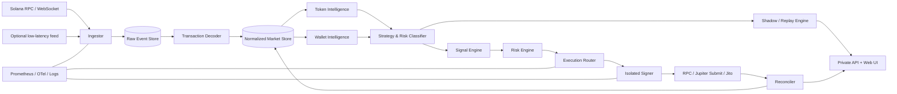

# Private Solana Intelligence & Execution Terminal — подробный `to-do.md`

> **Назначение:** единый исполнимый backlog для приватного аналитико‑торгового терминала на Solana с мониторингом токенов и кошельков, классификацией стратегий, Shadow Mode, симуляцией копирования, управлением собственными кошельками и контролируемым исполнением сделок.  
> **Формат:** модульный монолит для первого релиза, отдельный signer-процесс, приватный Web UI.  
> **Дата фиксации плана:** 2026-08-06.  
> **Основной пользователь:** один владелец системы; публичный SaaS, биллинг и мультиарендность не входят в первый контур.

---

## Как пользоваться этим файлом

- Выполнять задачи строго по зависимостям, а не по визуальному порядку интерфейса.
- Один checkbox — один проверяемый результат, который можно принять или отклонить отдельно.
- После каждой задачи запускать указанные тесты и фиксировать изменение отдельным коммитом.
- Живое исполнение не включать, пока не пройдены гейты `G0`–`G6`.
- Любой новый источник данных сначала подключать в read-only и Shadow Mode, затем Paper, и только после этого разрешать ему формировать реальные `OrderIntent`.
- Все числовые пороги ниже являются начальными рабочими значениями. Их менять только через версионируемые конфиги и после replay-калибровки.

### Легенда

| Обозначение | Значение |
|---|---|
| `P0` | блокирует MVP |
| `P1` | требуется для контролируемого Live |
| `P2` | расширение после стабильного MVP |
| `G0…G9` | обязательный go/no-go гейт |
| `DoD` | Definition of Done |
| `Observe` | сбор и анализ без торгового намерения |
| `Shadow` | расчёт сделки без подписи и отправки |
| `Paper` | виртуальное исполнение по наблюдаемой ликвидности |
| `Live` | реальная подписанная транзакция |

---

# 1. Зафиксированный scope

## 1.1. Цель продукта

Собрать один приватный инструмент, который:

1. Получает события Solana почти в реальном времени.
2. Декодирует Pump.fun/PumpSwap, Raydium, Meteora, Orca, Jupiter-маршруты и стандартные SPL/Token-2022 операции.
3. Восстанавливает понятные действия: покупка, продажа, перевод, открытие/закрытие позиции, миграция пула, изменение ликвидности.
4. Строит `Wallet DNA`, PnL, поведенческую классификацию и `Copy Score`.
5. Автоматически отличает воспроизводимый low-frequency трейдинг от HFT, арбитража, market making, LP-операций и подозрительной синтетической активности.
6. Позволяет сначала наблюдать кошелёк, затем прогнать Shadow/Paper replay и только после этого включить Live.
7. Исполняет сделки через контролируемый pipeline `quote → simulation → risk decision → sign → submit → reconcile`.
8. Разделяет ручные позиции, копитрейдинг, экспериментальные стратегии и будущие cross-venue стратегии по независимым портфелям.
9. Показывает полную цепочку задержек и объясняет, почему сделка выполнена, пропущена или заблокирована.
10. Сохраняет ключи вне БД, `.env`, логов и пользовательского интерфейса.

## 1.2. Что входит в MVP

- Solana mainnet read-only ingest.
- История и live-события по выбранным токенам, пулам и кошелькам.
- Нормализованные swaps и позиции.
- Token page: цена, ликвидность, объём, holders, creator/funder graph, risk flags.
- Wallet page: realized/unrealized PnL, win rate, expectancy, drawdown, trade timeline, Wallet DNA.
- Классификация кошельков и жёсткий `NON_COPYABLE` для HFT/арбитража/непонятных маршрутов.
- Copy Score и объяснение его компонентов.
- Shadow Mode и event-time replay.
- Paper portfolio.
- Live spot swaps для одного собственного портфеля после гейтов.
- Jupiter Swap V2 как основной агрегатор; прямой Raydium adapter как резервный и исследовательский маршрут.
- TP/SL, частичный выход, trailing, time stop, liquidity stop.
- Приватный Web UI через Tailscale/WireGuard.
- Telegram/desktop notifications без возможности подписывать транзакции из уведомления.

## 1.3. Что сознательно не входит

В продукт не закладываются модули, цель которых — создавать ложную рыночную картину или скрывать координацию:

- synthetic/wash volume;
- имитация «человеческой» торговой активности;
- искусственное увеличение числа holders;
- profile farming и массовое создание профилей;
- скрытое распределение supply по связанным адресам;
- одновременный запуск токена и скрытая закупка supply набором subwallets;
- clone-token workflow;
- координированный mass-dump;
- обход графов связности кошельков;
- управление чужими средствами или публичная мультиарендность.

Допустимы defensive-детекторы этих паттернов, исторический replay и управление собственными портфелями.

## 1.4. Главные выводы из исследований, превращённые в требования

### DogWifTools

Из конкурентного продукта полезно перенести только нейтральные примитивы:

- batch balance;
- funding/sweep собственных кошельков;
- закрытие пустых token accounts и возврат rent;
- перевод SPL между собственными счетами;
- быстрый RPC/WebSocket контур;
- отдельные кошельки под разные задачи;
- массовая ликвидация собственных позиций в явно выбранном scope.

Не переносить архитектурные анти-паттерны:

- private keys в обычном `config.json`;
- просьбы отключать Defender/карантин;
- неподписанные сборки;
- смешение secrets, UI и trading process;
- неограниченное создание кошельков без policy;
- режимы, метрика успеха которых — искусственный объём или holder count.

### GMGN

Взять как продуктовый ориентир:

- token discovery и trending по коротким окнам;
- holder/insider/bundle/creator analysis;
- Wallet Radar;
- wallet PnL и быстрый переход от наблюдения к Shadow;
- фильтры копирования по market cap, liquidity, token age, holder count, platform и LP-признакам;
- TP/SL, batch exits, trailing;
- live wallet alerts;
- прозрачную страницу токена и кошелька.

Улучшить относительно типичного GMGN-style UX:

- сначала показывать copyability и confidence, затем кнопку запуска;
- не создавать Live-стратегию одной кнопкой без Shadow;
- учитывать конфликт нескольких зеркал на одном активе;
- считать follower PnL с реальной задержкой, priority fees, tips, slippage и failed transactions;
- разделять lots и правила выхода для каждой стратегии;
- объяснять каждую блокировку и каждое исполнение.

### Практика копитрейдинга из приложенной статьи

- HFT-кошелёк с сотнями быстрых действий не должен считаться копируемым.
- Multi-hop арбитраж нельзя зеркалировать постфактум; для него нужен собственный native strategy engine.
- Low-frequency кошельки с редкими позициями лучше подходят для воспроизведения.
- Нельзя смешивать ручные и bot-позиции в одном учётном контуре.
- Два зеркала могут конфликтовать по одному токену; нужен position ownership и allocator.
- Задержка должна измеряться по этапам, а не одной общей цифрой.
- Результаты лидера нельзя выдавать за достижимые результаты follower без replay.

### Исследование подозрительных токенов

Простые «галочки безопасности» недостаточны. Отдельно анализировать:

- контроль LP и возможность его вывода;
- creator/funder graph;
- clusters holders вместо формального top-10;
- синхронность сделок и повторяемость сумм/интервалов;
- происхождение SOL у ранних покупателей;
- повторное использование funder/creator addresses;
- аномальное соотношение возраста, market cap, liquidity и органических holders;
- sellability через quote/simulation;
- миграции между bonding curve и DEX;
- разрыв между видимым объёмом и количеством независимых источников капитала.

### AMM/DEX

Движок обязан различать:

- order-book markets;
- CPMM;
- CLMM;
- DLMM;
- bonding curve;
- `ExactIn`, `ExactOut` и hybrid fee mechanics;
- price impact, slippage и route depth;
- direct swap и multi-hop route.

### Арбитраж

- Не пытаться делать copy-arbitrage.
- Для будущего собственного arbitrage module использовать отдельный scanner/executor.
- Atomic multi-hop считать отдельным типом стратегии.
- Failed atomic route не должен оставлять промежуточную позицию, но fee/priority/tip и rejected-attempt cost учитывать в аналитике.
- Качество RPC, размещение сервера и broadcast path измерять как часть стратегии.

---

# 2. Продуктовые режимы и основной flow

## 2.1. Четыре режима допуска

| Режим | Подпись | Отправка | Денежный риск | Назначение |
|---|---:|---:|---:|---|
| Observe | нет | нет | нет | сбор и анализ |
| Shadow | нет | нет | нет | расчёт реакции на реальное событие |
| Paper | нет | нет | виртуальный | портфель и правила исполнения |
| Live | да | да | реальный | сделки после всех гейтов |

Переход разрешён только по цепочке:

```text
Observe -> Shadow -> Paper -> Live
```

Обратный переход разрешён всегда. Любой критический health/risk event автоматически переводит стратегию в `PAUSED`, но не закрывает позицию без заранее определённого emergency rule.

## 2.2. Основной пользовательский путь

1. Вставить mint или wallet address.
2. Система догружает историю и показывает качество данных.
3. Для токена показать risk flags, pool topology, creator/funder/holder graph, liquidity.
4. Для кошелька показать Wallet DNA, PnL, strategy class, Copy Score.
5. Добавить кошелёк в Observe и задать период.
6. Запустить Shadow с несколькими профилями задержки и размера позиции.
7. Сравнить leader PnL, theoretical follower PnL и executable follower PnL.
8. Создать Paper strategy.
9. Пройти минимальное число сделок и гейты качества.
10. Привязать отдельный Live portfolio.
11. Включить лимиты капитала, exits и kill switch.
12. Перевести стратегию в Live вручную через двухэтапное подтверждение.

---

# 3. Архитектура

## 3.1. Выбранный подход

Первый релиз — **модульный монолит**, а не набор микросервисов:

- один Rust workspace;
- один основной backend-процесс с чёткими внутренними модулями;
- отдельный signer-процесс;
- отдельный frontend;
- PostgreSQL/TimescaleDB;
- Redis для cache, locks и коротких очередей;
- Docker Compose на текущем Ubuntu/Docker-контуре;
- NATS/ClickHouse добавлять только после подтверждённой нагрузки.

Это сокращает сетевые точки отказа, но сохраняет границы, по которым ingest и execution позже можно вынести отдельно.

## 3.2. Логическая схема



## 3.3. Критические границы

- `ingest` никогда не имеет доступа к private keys.
- `analytics` не может отправлять транзакции.
- `strategy` создаёт только `OrderIntent`.
- `risk` может разрешить или отклонить intent, но не подписывает.
- `execution` строит и симулирует transaction, но private key не читает.
- `signer` подписывает только разрешённый сериализованный payload по allowlist policy.
- `reconciler` является единственным источником финального статуса позиции.
- UI не хранит и не отображает private key/seed.

## 3.4. Состояния исполнения

```text
DETECTED
  -> NORMALIZED
  -> CLASSIFIED
  -> SIGNAL_CREATED
  -> RISK_REJECTED | QUOTE_REQUESTED
  -> QUOTED
  -> SIMULATION_FAILED | SIMULATED
  -> RISK_RECHECK_FAILED | APPROVED
  -> SIGNING_FAILED | SIGNED
  -> SUBMISSION_FAILED | SUBMITTED
  -> EXPIRED | LANDED
  -> CONFIRMED
  -> FINALIZED
  -> RECONCILED
```

Каждый переход сохраняется append-only и содержит:

- timestamp приложения;
- observed slot;
- commitment;
- provider;
- correlation ID;
- strategy ID;
- portfolio ID;
- reason code;
- latency from previous state.

---

# 4. Стек и структура репозитория

## 4.1. Backend

- Rust stable, edition 2024.
- Tokio, Axum, SQLx, Serde, Reqwest.
- `tracing` + OpenTelemetry.
- `thiserror` для typed errors.
- `rust_decimal`/целочисленные atomic units; `f64` не использовать для балансов.
- Solana SDK/client crates, закреплённые lockfile.
- IDL/program decoders из проверяемых источников с version pinning.

## 4.2. Frontend

- TypeScript strict.
- React + Vite.
- TanStack Query/Table.
- Lightweight Charts.
- Zod для runtime validation.
- WebSocket/SSE для live updates.
- Playwright для E2E.

## 4.3. Storage и operations

- PostgreSQL 16+ и TimescaleDB.
- Redis 7+.
- Object storage или локальный compressed archive для raw blocks и replay fixtures.
- Docker Compose.
- Caddy/Nginx только за VPN.
- Prometheus, Grafana, Loki, Tempo.
- SOPS + age для bootstrap secrets; Vault/KMS — при выносе signer на отдельный host.
- Cosign/Sigstore для release artifacts.

## 4.4. Репозиторий

```text
private-trading-terminal/
├── Cargo.toml
├── Cargo.lock
├── rust-toolchain.toml
├── deny.toml
├── apps/
│   ├── backend/src/main.rs
│   ├── signer/src/main.rs
│   ├── cli/src/main.rs
│   └── web/
├── crates/
│   ├── domain/
│   ├── config/
│   ├── chain-solana/
│   ├── ingest/
│   ├── decode-core/
│   ├── decode-spl/
│   ├── decode-pump/
│   ├── decode-raydium/
│   ├── decode-meteora/
│   ├── decode-orca/
│   ├── decode-jupiter/
│   ├── market-state/
│   ├── token-intelligence/
│   ├── wallet-intelligence/
│   ├── strategy-classifier/
│   ├── copy-score/
│   ├── replay/
│   ├── portfolio/
│   ├── risk-engine/
│   ├── execution/
│   ├── signer-protocol/
│   ├── notifications/
│   ├── persistence/
│   └── observability/
├── migrations/
├── config/
│   ├── defaults.toml
│   ├── risk.live.toml
│   ├── risk.paper.toml
│   └── program-registry.toml
├── fixtures/
│   ├── transactions/
│   ├── pools/
│   ├── wallets/
│   └── venti/
├── scripts/
├── deploy/
├── docs/
└── tests/
```


---

# 5. Канонические контракты и reason codes

## 5.1. Событие рынка

```rust
pub struct MarketEvent {
    pub event_id: Uuid,
    pub chain: Chain,
    pub slot: u64,
    pub block_time: Option<DateTime<Utc>>,
    pub observed_at: DateTime<Utc>,
    pub commitment: Commitment,
    pub signature: String,
    pub source: DataSource,
    pub program_id: String,
    pub kind: MarketEventKind,
    pub raw_ref: String,
}
```

## 5.2. Декодированный swap

```rust
pub struct DecodedSwap {
    pub swap_id: Uuid,
    pub signature: String,
    pub instruction_path: Vec<u16>,
    pub trader: String,
    pub venue: Venue,
    pub pool: String,
    pub input_mint: String,
    pub input_amount_atomic: u128,
    pub output_mint: String,
    pub output_amount_atomic: u128,
    pub fee_amount_atomic: Option<u128>,
    pub fee_mint: Option<String>,
    pub route_id: Option<Uuid>,
    pub slot: u64,
    pub success: bool,
}
```

## 5.3. Действие кошелька

```rust
pub struct WalletAction {
    pub action_id: Uuid,
    pub wallet: String,
    pub action_type: WalletActionType,
    pub base_mint: String,
    pub quote_mint: String,
    pub side: Side,
    pub quantity_atomic: u128,
    pub quote_value_usd: Option<Decimal>,
    pub effective_price_usd: Option<Decimal>,
    pub route_depth: u16,
    pub detected_at: DateTime<Utc>,
    pub source_slot: u64,
    pub confidence: Decimal,
}
```

## 5.4. Торговое намерение

```rust
pub struct OrderIntent {
    pub intent_id: Uuid,
    pub strategy_id: Uuid,
    pub portfolio_id: Uuid,
    pub venue: Venue,
    pub market: MarketId,
    pub side: Side,
    pub amount: AmountSpec,
    pub max_slippage_bps: u16,
    pub deadline: DateTime<Utc>,
    pub source_action_id: Option<Uuid>,
    pub exit_policy_id: Option<Uuid>,
    pub idempotency_key: String,
}
```

## 5.5. Risk decision

```rust
pub struct RiskDecision {
    pub decision_id: Uuid,
    pub intent_id: Uuid,
    pub status: RiskStatus,
    pub approved_amount: Option<AmountSpec>,
    pub reasons: Vec<RiskReason>,
    pub limits_snapshot_hash: String,
    pub decided_at: DateTime<Utc>,
}
```

## 5.6. Execution report

```rust
pub struct ExecutionReport {
    pub execution_id: Uuid,
    pub intent_id: Uuid,
    pub tx_signature: Option<String>,
    pub status: ExecutionStatus,
    pub quoted_out_atomic: Option<u128>,
    pub simulated_out_atomic: Option<u128>,
    pub filled_out_atomic: Option<u128>,
    pub fees_lamports: u64,
    pub tip_lamports: u64,
    pub detection_to_submit_ms: Option<u64>,
    pub slot_landed: Option<u64>,
    pub failure_code: Option<String>,
}
```

## 5.7. Универсальные reason codes

```text
DATA_INSUFFICIENT
DATA_STALE
DECODER_UNSUPPORTED
ROUTE_TOO_COMPLEX
STRATEGY_NON_COPYABLE_HFT
STRATEGY_NON_COPYABLE_ARBITRAGE
STRATEGY_SUSPICIOUS_ACTIVITY
TOKEN_RISK_HARD_BLOCK
LIQUIDITY_TOO_LOW
POSITION_LIMIT
PORTFOLIO_DRAWDOWN_LIMIT
DAILY_LOSS_LIMIT
SLIPPAGE_LIMIT
PRICE_IMPACT_LIMIT
QUOTE_EXPIRED
SIMULATION_FAILED
SIGNER_POLICY_REJECTED
SUBMISSION_TIMEOUT
TRANSACTION_EXPIRED
RECONCILIATION_MISMATCH
INFRA_DEGRADED
KILL_SWITCH_ACTIVE
```

---

# 6. Хранилище и модель данных

## 6.1. Обязательные таблицы

| Таблица | Назначение | Ключ/индекс |
|---|---|---|
| `chain_slots` | slot, parent, commitment, status | PK `slot` |
| `raw_transactions` | неизменённый tx/meta payload | unique `signature` |
| `raw_notifications` | входящие WS events | `(provider, subscription_id, sequence)` |
| `instructions` | outer/inner instruction tree | `(signature, path)` |
| `token_mints` | decimals, authorities, token program | PK `mint` |
| `token_metadata` | name/symbol/URI/verification | `(mint, observed_at)` |
| `pools` | venue, pair, curve type | PK `pool_address` |
| `pool_snapshots` | reserves/ticks/bins/liquidity | hypertable `(pool, observed_at)` |
| `swaps` | нормализованные swaps | unique `(signature, instruction_path)` |
| `routes` | multi-hop объединение | PK `route_id` |
| `wallet_actions` | buy/sell/transfer/LP | `(wallet, source_slot)` |
| `position_lots` | раздельные входы | `(portfolio_id, mint, lot_id)` |
| `portfolio_positions` | агрегированная позиция | `(portfolio_id, mint)` |
| `wallet_features` | временные признаки | `(wallet, window_end, feature_version)` |
| `wallet_scores` | DNA, copy/risk scores | `(wallet, score_version, scored_at)` |
| `token_risk_features` | creator/LP/cluster/activity | `(mint, feature_version, observed_at)` |
| `token_risk_scores` | итог и explanation | `(mint, score_version, observed_at)` |
| `strategies` | режим, источник, config | PK `strategy_id` |
| `strategy_allocations` | лимит капитала | `(strategy_id, portfolio_id)` |
| `shadow_runs` | параметры replay | PK `shadow_run_id` |
| `shadow_orders` | виртуальные попытки | `(shadow_run_id, sequence)` |
| `order_intents` | неизменяемые intents | unique `idempotency_key` |
| `risk_decisions` | решение и snapshot | `(intent_id, decided_at)` |
| `execution_attempts` | quote/sim/send | `(intent_id, attempt_no)` |
| `fills` | фактические изменения баланса | `(execution_id, fill_no)` |
| `latency_samples` | этапы pipeline | hypertable `(component, observed_at)` |
| `risk_events` | limits/kill switch | `(portfolio_id, observed_at)` |
| `alerts` | notifications | `(severity, created_at)` |
| `audit_log` | действия пользователя/системы | append-only |
| `provider_health` | RPC/WS/API health | hypertable |
| `schema_versions` | версии decoders/scores | PK `component` |

## 6.2. Правила хранения

- Raw payload сохранять до декодирования.
- Нормализованные записи никогда не перезаписывать без `decoder_version`.
- Исправление decoder создаёт новую projection, а не тихо меняет историю.
- Денежные значения хранить в atomic units + decimals; USD valuation хранить отдельно с price source и timestamp.
- Все timestamps — UTC.
- Для каждого on-chain факта хранить `slot`, `commitment`, `observed_at`, `provider`.
- Для orphaned/reverted slot помечать derived records `reverted=true` и пересчитывать projections.
- Raw watched-wallet/token data хранить бессрочно.
- Общий raw stream: 30 дней в DB, затем compressed archive.
- Normalized swaps/features/scores хранить бессрочно.
- Debug logs: 14 дней; audit/security logs: минимум 365 дней.

## 6.3. Идемпотентность

- Ingest key: `provider + signature + notification_type`.
- Instruction key: `signature + instruction_path`.
- Swap key: `signature + instruction_path + decoder_version`.
- Intent key: `strategy_id + source_action_id + side + market + policy_version`.
- Execution retry не создаёт новый intent; увеличивает `attempt_no`.
- Повторная отправка одной и той же signed transaction не должна создавать второй fill.

---

# 7. Scoring и классификация

## 7.1. Wallet DNA

Считать минимум по окнам `1d`, `7d`, `30d`, `90d`, `all`.

### Активность

- trades count;
- unique active days;
- trades/hour distribution;
- inter-trade interval p10/p50/p90;
- unique tokens;
- DEX distribution;
- route depth distribution;
- percent multi-hop;
- percent failed;
- percent transfers vs swaps;
- average/median position size;
- turnover;
- capital utilization.

### Поведение позиции

- median holding time;
- p10/p90 holding time;
- average adds per position;
- partial-exit frequency;
- full-exit frequency;
- average time to first partial exit;
- average time to final exit;
- average adverse excursion;
- average favorable excursion;
- entry token age;
- entry liquidity percentile;
- entry market-cap percentile.

### Результат

- realized PnL;
- unrealized PnL;
- win rate;
- profit factor;
- expectancy;
- payoff ratio;
- max drawdown;
- recovery factor;
- Sharpe-like ratio для нерегулярных сделок;
- Sortino-like ratio;
- PnL concentration in top 1/3/5 trades;
- loss concentration;
- weekly consistency;
- return skew/kurtosis;
- fee share;
- estimated slippage share.

### Риск и качество данных

- balance coverage;
- unpriced token ratio;
- decoder coverage;
- source confidence;
- rug exposure;
- liquidity-weighted exposure;
- holder-cluster exposure;
- suspected coordinated activity ratio;
- funding-source concentration.

## 7.2. Strategy classifier

Начальные классы:

```text
LOW_FREQUENCY_SPOT
SWING
MOMENTUM
EARLY_ENTRY
SCALPER
HFT
ARBITRAGE
MARKET_MAKER
LIQUIDITY_PROVIDER
GRID_LIKE
TRANSFER_ROUTER
SUSPICIOUS_SYNTHETIC
MIXED
UNKNOWN
```

Первый classifier — rules + calibrated thresholds, не ML. ML допускается только после накопления размеченного replay corpus.

### Жёсткие правила v1

- `HFT`: median inter-trade interval < 5 секунд **или** > 120 swaps за 10 минут.
- `ARBITRAGE`: round-trip в исходный mint внутри одной tx/route, route depth ≥ 2 и holding time ≈ 0.
- `LOW_FREQUENCY_SPOT`: ≤ 12 новых позиций/сутки, median holding ≥ 15 минут, route depth ≤ 2.
- `SWING`: median holding ≥ 6 часов и ≤ 30 дней.
- `SCALPER`: median holding 10 секунд–15 минут без atomic round-trip.
- `SUSPICIOUS_SYNTHETIC`: высокий cluster/funder synchronization score и повторяющиеся суммы/интервалы.
- `UNKNOWN`: decoder coverage < 95% или data confidence < 0.80.

## 7.3. Copyability hard gates

Кошелёк получает `NON_COPYABLE`, если выполняется хотя бы одно:

- history < 50 closed positions или < 14 active days;
- decoder coverage < 98%;
- unpriced volume > 10%;
- class `HFT`, `ARBITRAGE`, `MARKET_MAKER`, `LIQUIDITY_PROVIDER`, `SUSPICIOUS_SYNTHETIC`, `UNKNOWN`;
- median holding < 30 секунд;
- p50 follower replay при 500 ms отрицательный при положительном leader PnL;
- follower/leader execution similarity < 0.70;
- требуемый размер позиции превышает 10% доступной ликвидности выбранного route;
- PnL top-1 concentration > 70% при менее чем 100 closed positions;
- max drawdown > 60%;
- token-risk hard block встречается более чем в 20% entries.

## 7.4. Copy Score 0–100

Считать только после hard gates:

| Компонент | Вес |
|---|---:|
| data confidence | 10 |
| latency survivability | 20 |
| executable liquidity/capacity | 15 |
| PnL consistency | 15 |
| drawdown/risk quality | 15 |
| follower execution similarity | 15 |
| diversification/robustness | 10 |

Категории:

- `85–100`: high suitability;
- `70–84`: suitable with limits;
- `55–69`: Shadow/Paper only;
- `<55`: do not activate Live.

Каждый компонент хранить отдельно. UI обязан показывать причины, а не только число.

## 7.5. Token Risk Score 0–100

Чем выше число, тем выше риск:

| Компонент | Вес |
|---|---:|
| LP control/withdrawal risk | 20 |
| holder cluster concentration | 20 |
| synthetic activity | 20 |
| creator/funder history | 15 |
| mint/freeze/Token-2022 authority risk | 10 |
| sellability/route risk | 10 |
| age/MC/liquidity anomaly | 5 |

### Hard blocks

- quote отсутствует на всех разрешённых routes;
- simulation продажи минимального test amount стабильно отклоняется;
- freeze authority может заморозить пользовательский token account и нет allowlist exception;
- LP полностью контролируется связанным cluster и может быть снята немедленно;
- mint/metadata не соответствует выбранному asset;
- token program/extension не поддерживается execution engine;
- creator/funder входит в локальный denylist подтверждённых rug patterns.

### Обязательное explanation

```json
{
  "code": "HOLDER_CLUSTER_CONCENTRATION",
  "severity": "high",
  "value": 0.71,
  "threshold": 0.45,
  "evidence": {
    "cluster_count": 3,
    "controlled_supply_pct": 71.0,
    "common_funders": 2
  }
}
```

---

# 8. Risk engine и position ownership

## 8.1. Начальные Live limits

Эти значения — безопасный старт для технической проверки, а не целевые размеры капитала:

- max position per token: min(`2% portfolio NAV`, `$100`);
- max aggregate open risk: `20% NAV`;
- max new positions/hour: `3`;
- max new positions/day: `10`;
- max token price impact: `1.5%`;
- max route slippage: `2.0%`;
- max combined priority/tip/fee share: `1.0%` от notional;
- max daily realized loss: `3% NAV`;
- max rolling 7d drawdown: `7% NAV`;
- max strategy drawdown: `10% allocated capital`;
- max token risk score for Live entry: `35`;
- max pending intents: `1` на `portfolio + mint`;
- quote TTL: `1.5 s` для copy; `500 ms` для low-latency profile;
- source action max age: `5 s` для scalper, `60 s` для low-frequency/swing;
- liquidity coverage: executable depth должна быть ≥ `10x` follower notional.

Любое превышение создаёт `RiskDecision::Rejected` с конкретным reason code.

## 8.2. Position ownership

Каждый lot принадлежит ровно одному source:

```text
MANUAL
COPY:<strategy_id>
NATIVE:<strategy_id>
RESEARCH
```

Правила:

- strategy может продавать только свои lots;
- `sell entire wallet balance` запрещён как внутренний primitive;
- emergency close создаёт отдельный audit event и закрывает выбранные ownership groups;
- несколько зеркал по одному mint могут иметь отдельные virtual subpositions даже при одном on-chain token account;
- allocator резервирует доступный баланс до подписи intent;
- reconciler распределяет фактический fill по lots детерминированно.

## 8.3. Exit policies

Поддержать:

- proportional mirror sell;
- fixed percentage sell;
- full strategy-position exit;
- fixed notional exit;
- multi-level TP;
- stop loss;
- trailing take profit;
- trailing stop;
- time stop;
- liquidity deterioration stop;
- token-risk escalation stop;
- source-wallet exit;
- manual emergency exit.

Для каждой policy хранить activation condition, trigger source, amount calculation, max slippage, expiry, precedence, override rules и re-entry cooldown.

---

# 9. Детальный backlog


## Фаза 0 — Scope, ADR, репозиторий и воспроизводимая среда

### P0-001 — Product charter и границы модулей

- [ ] Создать `docs/product-charter.md` и `docs/adr/0001-scope-and-non-goals.md`.
- [ ] Перенести туда цели, режимы и non-goals из разделов 1–3.
- [ ] Для каждого модуля описать вход, выход, владельца данных и запретные зависимости.
- [ ] Зафиксировать signer как единственный компонент с доступом к key material.
- **Приёмка:** нет `TBD`; analytics физически не зависит от signer implementation; Live не может обойти risk engine.
- **Тест:** architecture dependency test в CI.
- **Коммит:** `docs: freeze product scope`.

### P0-002 — Rust workspace

- [ ] Создать workspace по структуре раздела 4.4.
- [ ] Включить `rustfmt`, `clippy -D warnings`, locked dependencies и запрет `unsafe` по умолчанию.
- [ ] Создать отдельные binaries `backend`, `signer`, `cli`.
- [ ] Добавить health endpoints backend/signer.
- **Приёмка:** `cargo build --workspace --locked`, `cargo test --workspace`, `cargo clippy --workspace --all-targets -- -D warnings` проходят.
- **Коммит:** `chore: bootstrap rust workspace`.

### P0-003 — Frontend workspace

- [ ] Создать React/TypeScript strict application.
- [ ] Маршруты: Dashboard, Tokens, Wallets, Radar, Shadow, Strategies, Portfolios, Executions, Alerts, Settings.
- [ ] Подключить runtime schema validation, unit tests и Playwright.
- **Приёмка:** build/typecheck/test проходят; публичный registration отсутствует.
- **Коммит:** `chore: bootstrap private web app`.

### P0-004 — Docker Compose

- [ ] Поднять PostgreSQL/Timescale, Redis, backend, signer, web и observability profile.
- [ ] Использовать private network; Web UI bind только к VPN interface.
- [ ] Добавить healthcheck, restart policy, resource limits и named volumes.
- [ ] Не помещать secrets в Compose и `.env.example`.
- **Приёмка:** чистый `scripts/bootstrap.sh` поднимает green stack; DB/signer не видны снаружи.
- **Коммит:** `chore: add local compose stack`.

### P0-005 — CI gates и dependency policy

- [ ] Format, clippy, tests, `cargo deny`, frontend lint/typecheck/build/test.
- [ ] Secret scan, SBOM, container scan.
- [ ] Запрет git dependency без pinned commit.
- [ ] Release artifacts с checksums.
- **Приёмка:** любой gate блокирует merge; SBOM генерируется автоматически.
- **Коммит:** `ci: enforce build test and dependency gates`.

### P0-006 — Typed versioned config

- [ ] Создать `config/defaults.toml`, `risk.paper.toml`, `risk.live.toml`, `program-registry.toml`.
- [ ] Отделить secret references от обычного config.
- [ ] Добавить version, checksum и validation ranges.
- [ ] Live startup запрещать при неизвестной версии risk config.
- **Приёмка:** invalid field возвращает exact path/reason; critical config change инвалидирует Live approval.
- **Коммит:** `feat: add versioned typed configuration`.

### P0-007 — Core DB migrations

- [ ] Создать таблицы раздела 6.
- [ ] Включить Timescale hypertables и индексы.
- [ ] Добавить schema version/lock.
- [ ] Production migration — forward-only; dev допускает rebuild.
- **Приёмка:** миграция чистой DB и повторный запуск проходят; ключевые query plans используют индексы.
- **Коммит:** `feat: create core persistence schema`.

### P0-008 — Error taxonomy и correlation IDs

- [ ] Typed error enums по компонентам.
- [ ] Stable user-facing codes из раздела 5.7.
- [ ] Correlation ID на входящее событие, intent и execution.
- [ ] Central secret redaction.
- **Приёмка:** API error имеет code/correlation ID; key/auth/signed tx не попадают в display/log.
- **Коммит:** `feat: standardize errors and correlation ids`.

### P0-009 — Immutable fixture registry

- [ ] `fixtures/manifest.yaml`: source, slot range, checksum, decoder version, expected outputs.
- [ ] Fixture не меняется без нового checksum/version.
- [ ] Добавить CLI `fixture verify`.
- **Приёмка:** повреждённый fixture ломает CI до replay.
- **Коммит:** `test: add immutable fixture registry`.

---

## Фаза 1 — Solana ingest, commitment и raw store

### SOL-001 — Provider-agnostic RPC client

- [ ] Trait для `getTransaction`, `getBlock`, `getSignatureStatuses`, `simulateTransaction`, `sendTransaction`.
- [ ] Timeout, bounded retry, rate-limit handling и circuit breaker.
- [ ] Provider health: p50/p95/p99, errors, stale slot.
- [ ] `sendTransaction` ретраить только той же signature.
- **Приёмка:** provider меняется config-ом без recompilation; failover typed и observable.
- **Тесты:** mock contract, timeout, 429, failover, idempotent resend.
- **Коммит:** `feat: add provider agnostic solana rpc`.

### SOL-002 — Resilient WebSocket subscriptions

- [ ] `logsSubscribe`, `signatureSubscribe`, `slotSubscribe`, `programSubscribe`.
- [ ] Desired subscriptions хранить отдельно от active.
- [ ] Reconnect с автоматическим resubscribe.
- [ ] Gap recovery через HTTP backfill.
- [ ] Commitment `processed/confirmed/finalized` хранить отдельно.
- **Приёмка:** forced disconnect не теряет watched transactions; duplicates deduplicated.
- **Коммит:** `feat: add resilient websocket subscriptions`.

### SOL-003 — Raw transaction persistence

- [ ] Raw notification и transaction/meta сохранять до parsing.
- [ ] Provider, observed time, slot, commitment, payload hash.
- [ ] Компрессировать большие payloads.
- [ ] Idempotent insert и dead-letter для malformed data.
- **Приёмка:** decoder crash не уничтожает event; replay доступен из raw store.
- **Нагрузка:** не менее 1k events/s burst без data loss на target host.
- **Коммит:** `feat: persist immutable raw chain events`.

### SOL-004 — Slot/fork reconciler

- [ ] Хранить parent slot и commitment progression.
- [ ] Помечать orphaned projections, не удалять историю.
- [ ] Rebuild от valid checkpoint.
- [ ] Critical alert при finalized inconsistency.
- **Приёмка:** reverted processed event не остаётся в позиции/PnL.
- **Коммит:** `feat: reconcile slots and forks`.

### SOL-005 — Dynamic watch registry

- [ ] Targets: wallet, mint, pool, program.
- [ ] Priority, retention profile, enabled state, labels.
- [ ] Add/remove без restart.
- [ ] Pubkey validation и dedupe.
- **Приёмка:** новый wallet начинает ingest сразу; удаление прекращает future subscription, историю сохраняет.
- **Коммит:** `feat: add dynamic watch registry`.

### SOL-006 — Resumable historical backfill

- [ ] Durable cursor и paginated signatures/transactions.
- [ ] Separate live/backfill queues.
- [ ] Provider concurrency budget.
- [ ] Restart/resume без повторной logical загрузки.
- **Приёмка:** live p95 деградирует не более чем на 20% при backfill.
- **Коммит:** `feat: add resumable historical backfill`.

### SOL-007 — Optional low-latency feed adapter

- [ ] Универсальный adapter для Geyser/ShredStream-class feed.
- [ ] Feature flag и standard RPC fallback.
- [ ] Сравнивать first-seen time между источниками.
- [ ] Любое low-latency событие подтверждать RPC reconciliation.
- **Приёмка:** система полностью работает без optional feed; disagreement создаёт alert.
- **Коммит:** `feat: add optional low latency feed adapter`.

### SOL-008 — Provider benchmark harness

- [ ] Измерять WS lag, HTTP latency, simulation, submit dry-run/devnet.
- [ ] Отчёт p50/p95/p99, errors, region, config hash.
- [ ] Redact credentials в endpoint URL.
- **Приёмка:** можно воспроизводимо сравнить минимум два provider и fallback.
- **Коммит:** `perf: add provider latency benchmark`.

---

## Фаза 2 — Декодирование и market state

### DEC-001 — Instruction tree и balance deltas

- [ ] Разобрать outer/inner instructions и CPI path.
- [ ] Сопоставить pre/post SOL и token balances.
- [ ] Нормализовать wrapped SOL.
- [ ] Отделить fee payer, trader, vault и intermediary accounts.
- **Приёмка:** token deltas сходятся с transaction meta; unknown instruction не ломает другие branches.
- **Коммит:** `feat: build instruction tree and balance deltas`.

### DEC-002 — SPL Token и Token-2022

- [ ] Transfer, transferChecked, mint, burn, close account, sync native, freeze/thaw.
- [ ] Mint/freeze authorities и Token-2022 extensions.
- [ ] Unsupported extension → execution hard block.
- **Приёмка:** все операции fixture имеют typed representation; ATA closure корректно отражает rent.
- **Коммит:** `feat: decode spl token programs`.

### DEC-003 — Pump.fun/PumpSwap lifecycle

- [ ] Create, buy, sell, bonding curve state и migration.
- [ ] Trader, mint, SOL/token amounts, effective price.
- [ ] Program/discriminator version pinning.
- [ ] Unknown version → raw saved + `DECODER_UNSUPPORTED`.
- **Приёмка:** buy/sell fixtures дают точные amounts; migration связывает pre/post market identity.
- **Коммит:** `feat: decode pump lifecycle`.

### DEC-004 — Raydium AMM v4/CPMM/CLMM

- [ ] Pool init, add/remove liquidity, swap.
- [ ] Vaults, reserves/ticks, fees.
- [ ] Direct и routed swap.
- [ ] LP operations не считать trader buy/sell.
- **Приёмка:** golden corpus по каждому pool type проходит.
- **Коммит:** `feat: decode raydium pools and swaps`.

### DEC-005 — Meteora DLMM

- [ ] Swap, bin/liquidity operations, active bin, dynamic fees.
- [ ] Не применять CPMM formula к DLMM.
- **Приёмка:** amounts и bin transitions совпадают с transaction/meta/account state.
- **Коммит:** `feat: decode meteora dlmm`.

### DEC-006 — Orca Whirlpool

- [ ] Swaps и concentrated liquidity operations.
- [ ] Tick arrays, fees и confidence при missing accounts.
- **Приёмка:** swap/LP разделены; partial decode явно маркирован.
- **Коммит:** `feat: decode orca whirlpools`.

### DEC-007 — Route reconstruction

- [ ] Группировать swaps одной transaction по flow of funds.
- [ ] Определять input/output asset, route depth, venues, intermediates.
- [ ] Распознавать round-trip в исходный mint.
- **Приёмка:** `SOL→USDC→TOKEN` = одна покупка; `SOL→X→SOL` = atomic round-trip, не copy action.
- **Коммит:** `feat: reconstruct multi hop routes`.

### DEC-008 — Jupiter routed transactions

- [ ] Распознавать Jupiter context и AMM inner calls.
- [ ] Объединять route в одно economic action.
- [ ] Сохранять quoted и observed route отдельно.
- **Приёмка:** одна Jupiter transaction не создаёт несколько follower signals.
- **Коммит:** `feat: decode jupiter routed swaps`.

### DEC-009 — Decoder coverage report

- [ ] Доля decoded instructions, decoded value и classified actions.
- [ ] Unknown program IDs и affected volume.
- [ ] Scoring block при coverage ниже threshold.
- **Приёмка:** Copy Score отсутствует при coverage <98%; причина видна в UI/API.
- **Коммит:** `feat: expose decoder coverage`.

### MKT-001 — Pool registry и snapshots

- [ ] Canonical MarketId для pair+venue+pool.
- [ ] Reserve/tick/bin snapshots и staleness.
- [ ] Bonding curve ↔ migrated pool link.
- **Приёмка:** token page показывает все активные pools; stale pool не используется для capacity.
- **Коммит:** `feat: build canonical pool registry`.

### MKT-002 — Price impact и executable depth

- [ ] CPMM, CLMM, DLMM, bonding curve adapters.
- [ ] Marginal price, executable price, impact для заданного notional.
- [ ] Local model только sanity-check; Live fill основан на quote/simulation/on-chain result.
- **Приёмка:** formulas совпадают с fixtures в указанной погрешности.
- **Коммит:** `feat: model pool price impact and depth`.

### MKT-003 — Candles и rolling metrics

- [ ] Event-time candles: 1s/5s/1m/5m/1h.
- [ ] Volume, buys/sells, unique traders, holder delta, liquidity delta.
- [ ] Late-event recompute только затронутых buckets.
- **Приёмка:** одинаковый raw dataset даёт детерминированный результат.
- **Коммит:** `feat: aggregate event time market metrics`.

---

## Фаза 3 — Token intelligence и defensive detection

### TOK-001 — Token profile

- [ ] Mint, metadata, authorities, age, pools, price, liquidity, holders, volume.
- [ ] Source timestamp и confidence каждого поля.
- [ ] Market cap не считать без supply confidence.
- **Приёмка:** API/UI различает `unknown`, stale и zero.
- **Коммит:** `feat: build token profile`.

### TOK-002 — Creator/funder graph

- [ ] Creator, initial funder, first/second/third-hop funders.
- [ ] Directed graph переводов с bounded traversal.
- [ ] Common-funder clustering и evidence edges.
- **Приёмка:** любой cluster flag раскрывается до конкретных tx; traversal не блокирует live ingest.
- **Коммит:** `feat: derive creator and funding graph`.

### TOK-003 — Holder snapshots и cluster concentration

- [ ] Исключать pools/vaults/program accounts.
- [ ] Связывать addresses по funding/transfer evidence.
- [ ] Считать raw top-10 и cluster-adjusted concentration.
- [ ] Хранить confidence и false-merge guard.
- **Приёмка:** множество связанных wallets отображается как economic cluster, а не как независимые holders.
- **Коммит:** `feat: calculate holder clusters`.

### TOK-004 — LP control и withdrawal risk

- [ ] Owner/position owner, lock/burn evidence, control cluster.
- [ ] История add/remove liquidity.
- [ ] Controlled liquidity percentage.
- [ ] Critical alert на резкое удаление LP.
- **Приёмка:** token page показывает контроль LP, а не только его сумму.
- **Коммит:** `feat: assess liquidity control`.

### TOK-005 — Synthetic activity detector

- [ ] Synchronization, repeated notional, regular intervals, common funding, circular flow, unique capital sources.
- [ ] Отделить heuristic score от hard evidence.
- [ ] Версионировать feature set.
- **Приёмка:** score детерминирован; UI показывает top contributors; detector не формирует trades.
- **Коммит:** `feat: detect synthetic activity patterns`.

### TOK-006 — Creator recurrence

- [ ] Прошлые mints/pools creator/funder cluster.
- [ ] Lifetime, peak liquidity, LP withdrawal, terminal state.
- [ ] Исключать exchange/hub wallets без дополнительного evidence.
- **Приёмка:** recurring pattern имеет evidence path; high-degree infrastructure не даёт ложный hard block.
- **Коммит:** `feat: score creator history`.

### TOK-007 — Sellability quote/simulation probe

- [ ] Read-only quotes для нескольких малых sizes.
- [ ] Build unsigned transaction и simulate без отправки.
- [ ] Token-2022 extension checks.
- [ ] Rate limit и short cache.
- **Приёмка:** probe никогда не подписывает и не отправляет transaction; failure имеет category/log hash.
- **Коммит:** `feat: add non executing sellability probe`.

### TOK-008 — Age/MC/liquidity anomaly

- [ ] Сравнить age, MC, liquidity, independent capital, holder growth и volume с cohort.
- [ ] Robust percentiles вместо одной абсолютной нормы.
- [ ] Cohort/version хранить в score evidence.
- **Приёмка:** anomaly объяснима; sparse cohort → low confidence, не автоматический block.
- **Коммит:** `feat: detect token market anomalies`.

### TOK-009 — Token Risk Score v1

- [ ] Реализовать веса и hard blocks раздела 7.5.
- [ ] Сохранять feature snapshot, explanation и score version.
- [ ] Allowlist exception только с reason, expiry и audit.
- **Приёмка:** одинаковый snapshot даёт одинаковый score; hard block нельзя снять обычным toggle.
- **Коммит:** `feat: calculate explainable token risk score`.

### TOK-010 — Token alerts

- [ ] LP remove, risk jump, recurrence, liquidity collapse, holder-cluster jump, sellability fail.
- [ ] Dedupe window, severity и evidence.
- [ ] Critical alert вызывает pause новых entries через risk engine.
- **Приёмка:** один факт не спамит; open positions следуют exit policy.
- **Коммит:** `feat: alert on token risk changes`.


---

## Фаза 4 — Wallet intelligence, PnL и Wallet DNA

### WAL-001 — Нормализация wallet actions

- [ ] Преобразовывать routes в buy/sell/transfer/LP/round-trip actions.
- [ ] Назначать confidence и evidence references.
- [ ] Не превращать atomic arb в открытую позицию.
- [ ] Deduplicate economic action across inner hops.
- **Приёмка:** одна multi-hop transaction создаёт одно понятное действие.
- **Коммит:** `feat: normalize wallet actions`.

### WAL-002 — Lot-based PnL ledger

- [ ] FIFO как отчётный default и average-cost view для UI.
- [ ] Учитывать base fees, priority/tip, wrapping SOL, partial exits и transfers.
- [ ] Разделять realized, unrealized и unpriced.
- [ ] Переводы между связанными собственными адресами не создают profit.
- **Приёмка:** ledger сходится с balance deltas на golden fixtures.
- **Коммит:** `feat: add wallet pnl ledger`.

### WAL-003 — Position reconstruction

- [ ] Position episodes по mint.
- [ ] Adds, partial exits, reopen, dust и airdrops.
- [ ] Holding time, MAE/MFE, time to first/final exit.
- **Приёмка:** dust transfer не закрывает позицию; re-entry создаёт новый episode.
- **Коммит:** `feat: reconstruct wallet positions`.

### WAL-004 — Performance metrics

- [ ] Реализовать метрики раздела 7.1.
- [ ] Transaction-weighted и capital-weighted views.
- [ ] Confidence interval/low-sample warning.
- [ ] Не annualize нерегулярный PnL без явного label.
- **Приёмка:** formula/version описаны в `docs/scoring/wallet-performance-v1.md`.
- **Коммит:** `feat: calculate wallet performance metrics`.

### WAL-005 — Behavioral features

- [ ] Frequency, intervals, route depth, venue mix, entry age/liquidity, sizing, exit style.
- [ ] Окна 1d/7d/30d/90d/all.
- [ ] Event-time recalculation для late events.
- **Приёмка:** replay детерминирован; window boundary tests проходят.
- **Коммит:** `feat: derive wallet behavioral features`.

### WAL-006 — Wallet DNA projection

- [ ] Объединить performance, behavior, risk exposure и data confidence.
- [ ] Compact labels + raw metrics + change over time.
- [ ] Не скрывать отрицательный recent window за all-time итогом.
- **Приёмка:** API содержит feature version и source timestamps.
- **Коммит:** `feat: build wallet dna`.

### WAL-007 — Wallet Radar

- [ ] Для набора до 10 tokens находить earliest buyers, highest realized profit, most bought, shared holdings.
- [ ] Исключать low-confidence и infrastructure wallets.
- [ ] Экспорт только в watchlist или Shadow.
- **Приёмка:** direct Live action из Radar отсутствует; ranking formula объяснима.
- **Коммит:** `feat: add wallet radar`.

### WAL-008 — Wallet tracking alerts

- [ ] Buy, sell, new token, large size, behavior change, score downgrade.
- [ ] Указывать source slot и detection latency.
- [ ] Multi-hop dedupe.
- **Приёмка:** alert содержит evidence link и не дублируется по hops.
- **Коммит:** `feat: alert on tracked wallet actions`.

---

## Фаза 5 — Strategy classifier, Anti-Copy и Copy Score

### CLS-001 — Rules classifier v1

- [ ] Реализовать классы и thresholds раздела 7.2.
- [ ] Primary/secondary label и confidence.
- [ ] Хранить matched rules.
- [ ] Unknown не превращать автоматически в low-frequency.
- **Приёмка:** каждый label объясним; boundary tests на thresholds проходят.
- **Коммит:** `feat: classify wallet strategies`.

### CLS-002 — Anti-Copy hard gates

- [ ] `COPYABLE`, `SHADOW_ONLY`, `NON_COPYABLE`.
- [ ] Реализовать все gates раздела 7.3.
- [ ] Evidence и reason list сохранять versioned.
- [ ] HFT/arb/suspicious source не может создать Live signal.
- **Приёмка:** false-copyable HFT/arb = 0 на classification corpus.
- **Коммит:** `feat: block non reproducible strategies`.

### CLS-003 — Execution similarity

- [ ] Entry coverage, side match, size ratio, execution price, exit timing, route success.
- [ ] Считать по нескольким latency profiles.
- [ ] Наказывать пропущенные и failed trades.
- **Приёмка:** metric 0–1 детерминирована; leader PnL не подменяет similarity.
- **Коммит:** `feat: score follower execution similarity`.

### CLS-004 — Copy Score v1

- [ ] Реализовать веса раздела 7.4.
- [ ] Считать компоненты независимо.
- [ ] Score только после hard gates.
- [ ] Versioned formula и complete explanation.
- **Приёмка:** UI показывает вклад каждого компонента; snapshot+version однозначно определяют score.
- **Коммит:** `feat: calculate explainable copy score`.

### CLS-005 — Score drift monitor

- [ ] Сравнивать 7d/30d score, class и data confidence.
- [ ] Downgrade alerts.
- [ ] Hard-gate regression → pause new entries.
- [ ] Open positions не закрывать вне заданной exit policy.
- **Приёмка:** regression test воспроизводит downgrade и pause.
- **Коммит:** `feat: monitor copy score drift`.

---

## Фаза 6 — Shadow Mode, Paper и replay

### SHD-001 — Event-time replay core

- [ ] Воспроизводить events по slot/block time/observed time.
- [ ] Deterministic seeded latency.
- [ ] Запрет look-ahead/future data.
- [ ] Сохранять config, data и decoder hashes.
- **Приёмка:** повтор run даёт byte-identical result; temporal leakage test проходит.
- **Коммит:** `feat: add deterministic event time replay`.

### SHD-002 — Latency model

- [ ] Профили: 0, 100, 250, 500, 1000, 2000, 5000, 30000, 50000 ms.
- [ ] Разделить ingest, decode, decision, quote, simulation, sign, submit.
- [ ] Поддержать empirical distribution из production metrics.
- **Приёмка:** report показывает вклад каждого этапа и fixed-vs-empirical comparison.
- **Коммит:** `feat: model follower latency`.

### SHD-003 — Executable quote/failure model

- [ ] Pool state на момент follower action.
- [ ] Price impact, slippage, base fee, priority/tip, quote expiry, failure.
- [ ] Leader fill price не использовать как follower fill.
- [ ] Размер follower позиции влияет на result.
- **Приёмка:** известный CPMM replay сходится; failed attempts учитываются отдельно.
- **Коммит:** `feat: simulate executable follower fills`.

### SHD-004 — Shadow copy runner

- [ ] Sizing и exit policy применять к source actions.
- [ ] Hard-blocked actions пропускать с reason.
- [ ] Virtual lots, capital reservation, competing mirrors.
- [ ] Leader/theoretical/executable follower reports.
- **Приёмка:** trade-by-trade diff; runner не зависит от signer.
- **Коммит:** `feat: add shadow copy runner`.

### SHD-005 — Live Paper portfolio

- [ ] Обрабатывать live source events виртуально.
- [ ] Использовать live quotes без подписи.
- [ ] Тот же risk engine, lots и exits, что Live.
- [ ] Сохранять missed/failed simulated orders.
- **Приёмка:** Paper и Live используют один `OrderIntent` contract и различаются execution adapter.
- **Коммит:** `feat: add live paper portfolio`.

### SHD-006 — Shadow API и report

- [ ] Create/start/stop/resume/compare runs.
- [ ] Progress streaming.
- [ ] Equity, drawdown, trade diff, latency sensitivity, costs.
- [ ] Нельзя тихо переиспользовать config hash с другим data hash.
- **Приёмка:** run возобновляется после restart.
- **Коммит:** `feat: expose shadow runs`.

### SHD-007 — VENTI benchmark

- [ ] Создать fixture для `FRpTyMBDavKsdYN1FQZcEeZ2iwGvHaZKFSkvr5izpump`.
- [ ] Зафиксировать доступный range transactions/pool data и checksums.
- [ ] Восстановить spike window, swaps, liquidity и holder changes в пределах on-chain данных.
- [ ] Прогнать latency 0–50000 ms и несколько position sizes.
- [ ] Не принимать цифры статьи как ground truth; ground truth — on-chain fixture.
- **Приёмка:** отчёт показывает предел воспроизводимости по latency/size и явно маркирует missing history.
- **Коммит:** `test: add venti replay benchmark`.

### SHD-008 — Promotion gates Paper → Live

- [ ] Минимум 30 Paper closed positions и 14 дней наблюдения.
- [ ] Copy Score ≥70, decoder coverage ≥98%, no hard blocks.
- [ ] Positive executable expectancy after costs, Paper DD ≤10%.
- [ ] Local approval record с config hash и expiry 24h.
- **Приёмка:** critical config change инвалидирует approval; backend не может обойти gate.
- **Коммит:** `feat: gate promotion from paper to live`.

---

## Фаза 7 — Портфели, lots и allocator

### PRT-001 — Portfolio domain model

- [ ] Types: Manual, Copy, Native, Research, Paper.
- [ ] Lot ownership, reserved/pending/filled/released capital.
- [ ] Atomic units only.
- [ ] Каждый fill относится к portfolio и lot.
- **Приёмка:** обычный strategy API не может продать lot другой strategy.
- **Коммит:** `feat: model isolated portfolios`.

### PRT-002 — Capital allocator

- [ ] Strategy weight, max capital, per-token overlap cap, cash buffer.
- [ ] Reservation до quote/sign.
- [ ] Conflict resolution: priority + earliest approved intent.
- [ ] Release на timeout/failure.
- **Приёмка:** два зеркала не тратят один balance; overlap reject объясним.
- **Коммит:** `feat: allocate capital across strategies`.

### PRT-003 — Virtual subpositions и net exposure

- [ ] Один on-chain balance сопоставлять нескольким strategy lots.
- [ ] Gross и net exposure.
- [ ] Partial fills распределять детерминированно.
- [ ] Negative lot balance запрещён.
- **Приёмка:** сумма lots = reconciled balance ± dust; Manual lot защищён от Copy exit.
- **Коммит:** `feat: track virtual strategy subpositions`.

### PRT-004 — Portfolio reconciliation

- [ ] Expected ledger vs on-chain balance.
- [ ] Классифицировать external/manual transfers.
- [ ] Unexplained mismatch → pause new entries.
- [ ] Repair через explicit adjustment event, не переписывание history.
- **Приёмка:** mismatch обнаруживается за один cycle и имеет evidence.
- **Коммит:** `feat: reconcile portfolio balances`.

### PRT-005 — Scoped emergency close

- [ ] Preview по portfolio/strategy/mint/ownership group.
- [ ] Quote/capacity check и staged exit при плохой depth.
- [ ] Отдельное подтверждение.
- [ ] Global indiscriminate sell-all не использовать.
- **Приёмка:** preview показывает impact и affected lots; excluded groups не затрагиваются.
- **Коммит:** `feat: plan scoped emergency exits`.

---

## Фаза 8 — Risk engine, execution router и signer

### RSK-001 — Pre-trade risk

- [ ] Проверки freshness, Token Risk, Copy Score/class, capital, position, impact, slippage, fees, drawdown.
- [ ] Limits snapshot hash.
- [ ] Paper/Live profiles.
- [ ] Каждый reject имеет stable reason.
- **Приёмка:** ни один Live intent не минует risk decision.
- **Коммит:** `feat: enforce pre trade risk limits`.

### RSK-002 — Continuous/post-trade risk

- [ ] Daily loss, rolling DD, score downgrade, token risk jump, infra health, reconciliation mismatch.
- [ ] `PAUSED` запрещает entries, но допускает exits.
- [ ] Manual и automatic kill switch sources.
- **Приёмка:** critical event переводит систему в exit-only за один control cycle.
- **Коммит:** `feat: add continuous risk controls`.

### EXE-001 — Execution adapter contract

- [ ] `quote`, `build`, `simulate`, `submit`, `status`.
- [ ] Managed/custom execution capabilities.
- [ ] Typed quote: route, impact, costs, expiry.
- [ ] Adapter не получает key.
- **Приёмка:** Mock/Paper/Jupiter/Raydium удовлетворяют одному contract.
- **Коммит:** `feat: define execution adapter contract`.

### EXE-002 — Jupiter Swap V2 build

- [ ] Получить build response и route plan.
- [ ] Проверить mints, amount, threshold, route labels, compute/tip instructions.
- [ ] Сравнить impact с local model.
- [ ] Валидировать transaction до signer.
- **Приёмка:** изменённый/unexpected response отклоняется; API key redacted.
- **Коммит:** `feat: integrate jupiter swap v2 build`.

### EXE-003 — Jupiter submit path

- [ ] Отправлять signed transaction с соблюдением size/tip policy.
- [ ] Submission latency/status.
- [ ] Idempotent resubmit той же signature.
- **Приёмка:** retry не создаёт второй intent/fill.
- **Коммит:** `feat: add jupiter transaction submission`.

### EXE-004 — Direct Raydium adapter

- [ ] Quote/build для CPMM/CLMM/AMM v4.
- [ ] Trade API для простого route; SDK/local state для pinned-pool research.
- [ ] Program/pool allowlist.
- **Приёмка:** можно сравнить direct route с Jupiter; unknown program blocked.
- **Коммит:** `feat: add raydium execution adapter`.

### EXE-005 — Route selector

- [ ] Сравнивать net out after impact/fees/tip, reliability и latency.
- [ ] Allow/deny venues.
- [ ] MVP не split-ит order между independent transactions.
- **Приёмка:** выбор объясним; лучший gross route может быть отклонён в пользу лучшего net/reliable.
- **Коммит:** `feat: select execution routes by net value`.

### EXE-006 — Simulation gate

- [ ] Симулировать готовую transaction перед send.
- [ ] Проверить logs, compute, account diffs, output threshold.
- [ ] Повторный risk check после simulation.
- [ ] Mismatch → block.
- **Приёмка:** Live submit без fresh successful simulation невозможен в MVP.
- **Коммит:** `feat: require transaction simulation`.

### SIGN-001 — Signer protocol

- [ ] Unix socket или mTLS loopback.
- [ ] Request: tx bytes, intent/risk/config hashes, expiry.
- [ ] Response: signature + signer audit ID.
- [ ] Arbitrary message signing не поддерживать.
- **Приёмка:** request без valid risk hash или с истёкшим expiry отклоняется.
- **Коммит:** `feat: define isolated signer protocol`.

### SIGN-002 — Encrypted key registry

- [ ] Encrypted key material или KMS/OS reference.
- [ ] Manual session unlock.
- [ ] Zeroize sensitive buffers.
- [ ] Seed/private key не экспортируется API.
- **Приёмка:** disk scan не находит plaintext; после lock signer не подписывает.
- **Коммит:** `feat: add encrypted signer key registry`.

### SIGN-003 — Signer policy engine

- [ ] Allowlist programs, fee payer, source accounts, mints, max lamports.
- [ ] Проверить blockhash/expiry, instruction count, compute/tip caps.
- [ ] Transaction должен совпадать с approved intent.
- [ ] Unexpected transfer/authority changes запрещены.
- **Приёмка:** mutation corpus с лишней instruction полностью rejected.
- **Коммит:** `feat: enforce signer transaction policy`.

### EXE-007 — Priority/tip policy

- [ ] Cap по congestion, notional и expected edge.
- [ ] Max fee share из risk config.
- [ ] Estimated vs actual costs.
- **Приёмка:** tiny trade с чрезмерным all-in fee rejected до sign.
- **Коммит:** `feat: calculate bounded priority fees`.

### EXE-008 — Jito broadcast adapter

- [ ] Fast send/bundle transport только для allowlisted технических intents.
- [ ] Standard RPC fallback.
- [ ] Landed/rejected/tip metrics.
- [ ] Не применять для скрытой координации multiwallet market actions.
- **Приёмка:** adapter отключается config-ом; fallback не создаёт duplicate fill.
- **Коммит:** `feat: add policy constrained jito broadcast`.

### EXE-009 — Retry policy

- [ ] Различать transport error, expiry, quote invalidation, program error.
- [ ] Same signed tx можно resubmit; новая tx требует quote/sim/risk recheck.
- [ ] Max attempts/deadline.
- **Приёмка:** program error не вызывает blind retry; idempotency сохраняется.
- **Коммит:** `feat: add idempotent execution retries`.

### EXE-010 — Confirmation/reconciliation worker

- [ ] Processed/confirmed/finalized tracking.
- [ ] Actual balances, fees, fills из chain meta.
- [ ] Late landing после timeout.
- [ ] Portfolio projection update.
- **Приёмка:** поздний landing не исполняется повторно; final amount не берётся из quote.
- **Коммит:** `feat: reconcile on chain executions`.

### EXE-011 — Lot-aware Smart Exit

- [ ] Все policies раздела 8.3.
- [ ] State per lot/strategy.
- [ ] Precedence: emergency > risk escalation > stop > source exit > TP/trailing.
- [ ] Re-entry не использует старые triggers.
- **Приёмка:** multiple buys не создают множественные неконтролируемые продажи общей позиции.
- **Коммит:** `feat: execute lot aware exit policies`.

### EXE-012 — Independent kill switch

- [ ] Scope: global, portfolio, strategy, venue.
- [ ] Signer проверяет state независимо от backend.
- [ ] Manual action требует typed confirmation и local auth.
- [ ] Exit-only mode поддерживается.
- **Приёмка:** compromised backend не обходит signer switch; state survives restart.
- **Коммит:** `feat: add independent kill switch`.


---

## Фаза 9 — Private Web UI и UX

### UI-001 — Private authenticated shell

- [ ] VPN-only access + local authentication.
- [ ] Short-lived sessions, secure cookies, CSRF protection.
- [ ] Public registration отсутствует.
- [ ] Mode badge Observe/Shadow/Paper/Live на каждой странице.
- [ ] Live mutations требуют step-up auth.
- **Приёмка:** без VPN/auth UI недоступен; session expiry проверен E2E.
- **Коммит:** `feat: add private authenticated ui shell`.

### UI-002 — Dashboard

- [ ] NAV, net/gross PnL, exposure, active strategies, risk state.
- [ ] Provider health, decoder coverage, signer status, alerts.
- [ ] Paper и Live визуально разделены.
- [ ] Каждая карточка имеет timestamp/source/stale state.
- **Приёмка:** нельзя спутать Paper результат с Live.
- **Коммит:** `feat: add operational dashboard`.

### UI-003 — Token page

- [ ] Chart, pools, liquidity/depth, holders, clusters, creator/funder graph.
- [ ] Authorities, Token Risk Score, evidence, live trades.
- [ ] Raw top holders и cluster-adjusted concentration рядом.
- [ ] Hard blocks до trade controls.
- [ ] Primary CTA — Observe/Shadow, не Live.
- **Приёмка:** любой risk flag раскрывается до фактов/transactions.
- **Коммит:** `feat: add token intelligence page`.

### UI-004 — Wallet page

- [ ] Wallet DNA, class, Copy Score, PnL windows, positions, timeline, venue mix, coverage.
- [ ] Leader vs executable follower replay.
- [ ] `Copy` disabled при NON_COPYABLE; Observe доступен.
- [ ] Score components и hard gates объяснимы.
- **Приёмка:** user видит не только PnL, но и воспроизводимость.
- **Коммит:** `feat: add wallet intelligence page`.

### UI-005 — Wallet Radar

- [ ] До 10 tokens.
- [ ] Earliest, highest profit, most bought, shared holdings.
- [ ] Export to watchlist/Shadow.
- [ ] Configurable columns и formula disclosure.
- **Приёмка:** direct Live action отсутствует.
- **Коммит:** `feat: add wallet radar ui`.

### UI-006 — Shadow wizard/report

- [ ] Source → period → sizing → latency → exits → risk → run.
- [ ] До запуска показать data coverage и expected runtime volume.
- [ ] Report: curves, drawdown, missed trades, latency sensitivity, all-in costs.
- [ ] Config clone создаёт новую immutable version.
- **Приёмка:** coverage warning нельзя пропустить молча.
- **Коммит:** `feat: add shadow workflow`.

### UI-007 — Strategy builder и lifecycle

- [ ] Observe/Shadow/Paper/Live lifecycle.
- [ ] Sizing, filters, allocation, exits, cooldown, risk.
- [ ] Promotion gates и evidence.
- [ ] Live activation — двухэтапная; critical edit сбрасывает approval.
- **Приёмка:** backend и UI оба запрещают преждевременный Live.
- **Коммит:** `feat: add gated strategy builder`.

### UI-008 — Execution timeline/latency

- [ ] Detected→decoded→signal→quote→simulation→sign→submit→land→confirm.
- [ ] Provider/broadcast comparison.
- [ ] Quote/sim/fill amounts и all-in costs.
- [ ] Failure code, retry и bottleneck.
- **Приёмка:** raw signed tx и secrets не отображаются.
- **Коммит:** `feat: add execution latency timeline`.

### UI-009 — Portfolio и lot ownership

- [ ] On-chain balance, virtual lots, ownership, reservations, exits.
- [ ] Tabs Manual/Copy/Native/Research/Paper.
- [ ] Scoped emergency close preview.
- [ ] Reconciliation state.
- **Приёмка:** affected lots видны до подтверждения.
- **Коммит:** `feat: add isolated portfolio ui`.

### UI-010 — Settings

- [ ] Providers, program registry, risk config, signer status.
- [ ] UI редактирует только non-secret config.
- [ ] Secret вводится через отдельный signer flow и никогда не возвращается.
- [ ] Config diff + audit comment + reload/restart indication.
- **Приёмка:** API schema не содержит secret fields.
- **Коммит:** `feat: add secure settings ui`.

### UI-011 — Alerts center

- [ ] Severity/source/status filters.
- [ ] Ack, mute with expiry, evidence links.
- [ ] Critical risk alerts нельзя permanently mute.
- **Приёмка:** mute/ack audit-logged и survives restart.
- **Коммит:** `feat: add alert center`.

### UI-012 — Explainability glossary

- [ ] Copy Score, confidence, route depth, impact, slippage, PnL, holder cluster.
- [ ] Tooltips с versioned docs.
- [ ] Формулы и значения threshold.
- **Приёмка:** каждый пользовательский term имеет определение и version.
- **Коммит:** `docs: add in product metric glossary`.

---

## Фаза 10 — Observability и SLO

### OBS-001 — Structured tracing

- [ ] JSON logs с correlation/intent/execution IDs.
- [ ] Redact auth, keys, signed tx и endpoint credentials.
- [ ] Audit events отдельно от debug logs.
- [ ] Trace одной сделки от source event до reconciliation.
- **Приёмка:** canary secret отсутствует в captured logs.
- **Коммит:** `feat: add structured redacted tracing`.

### OBS-002 — Latency metrics

- [ ] First-seen lag, decode, classify, quote, simulate, sign, submit, land, confirm.
- [ ] p50/p95/p99 по provider/path.
- [ ] Не использовать wallet/mint как high-cardinality Prometheus labels.
- [ ] Detailed samples хранить в DB.
- **Приёмка:** dashboard показывает bottleneck каждой execution attempt.
- **Коммит:** `feat: measure pipeline latency`.

### OBS-003 — Business/risk metrics

- [ ] Decoder coverage, Copy Score distribution, reject reasons.
- [ ] Shadow/Paper/Live divergence.
- [ ] PnL after costs, reconciliation mismatch, risk state.
- [ ] Paper/Live labels разделены.
- **Приёмка:** gross/net и Paper/Live невозможно смешать в запросе без явного dimension.
- **Коммит:** `feat: expose trading and risk metrics`.

### OBS-004 — Provider health scoring

- [ ] Latency, error rate, stale slots, disagreements, rate limits.
- [ ] Failover с hysteresis.
- [ ] Health snapshot доступен execution router.
- **Приёмка:** flapping provider не вызывает постоянные переключения.
- **Коммит:** `feat: score provider health`.

### OBS-005 — Operational alerts/runbooks

- [ ] Ingest gap, decoder drop, DB lag, signer unavailable, execution failure, mismatch, kill switch.
- [ ] Severity, owner action и runbook для каждого alert.
- [ ] Synthetic alert test до notification channel.
- **Приёмка:** critical alert без runbook отсутствует.
- **Коммит:** `ops: add operational alerting`.

### OBS-006 — Tamper-evident audit log

- [ ] Config changes, approvals, signer events, Live mode, kill switch, adjustments.
- [ ] Hash chain и daily signed digest.
- [ ] Export/verify CLI.
- **Приёмка:** изменение старой записи ломает verification.
- **Коммит:** `feat: add tamper evident audit log`.

---

## Фаза 11 — Security hardening и supply chain

### SEC-001 — Threat model

- [ ] Assets: keys, signed tx, portfolio state, config, data integrity.
- [ ] Threats: host/UI/dependency compromise, malicious RPC/API, replay, log leakage, backup theft.
- [ ] Prevention, detection, recovery для каждого threat.
- [ ] Отдельный сценарий compromised backend при здоровом signer.
- **Приёмка:** все trust boundaries из architecture покрыты.
- **Коммит:** `docs: add system threat model`.

### SEC-002 — Plaintext secret ban

- [ ] Pre-commit/CI secret scan.
- [ ] Git history и container layers.
- [ ] Private key, seed, auth query patterns.
- [ ] Documented false-positive process.
- **Приёмка:** canary secret блокирует commit/CI; release image чистый.
- **Коммит:** `security: enforce secret scanning`.

### SEC-003 — Signed/reproducible builds

- [ ] Reproducible release, SHA-256, SBOM, signature/provenance.
- [ ] Verify before deployment/update.
- [ ] Никаких рекомендаций отключать AV/quarantine.
- **Приёмка:** tampered binary не запускается deploy script.
- **Коммит:** `security: sign release artifacts`.

### SEC-004 — Dependency allowlist/pinning

- [ ] Pin critical Solana/crypto dependencies.
- [ ] Git dependency только с commit hash.
- [ ] Review build scripts и transitive changes.
- [ ] Critical update проходит full replay corpus.
- **Приёмка:** unpinned dependency ломает CI.
- **Коммит:** `security: pin and audit dependencies`.

### SEC-005 — Fuzz API/transaction validation

- [ ] JSON schemas, pubkeys, amounts, route plans, serialized tx.
- [ ] Overflow, account substitution, instruction injection, payload size.
- [ ] Signer mutation corpus.
- **Приёмка:** нет panic/overflow; mutated tx rejected.
- **Коммит:** `security: fuzz api and transaction validation`.

### SEC-006 — Encrypted backup/restore

- [ ] DB, raw archive, configs, audit digest, encrypted key store раздельно.
- [ ] Encrypt before leaving host, checksums, retention.
- [ ] Restore в isolated environment каждый release.
- [ ] Signer после restore остаётся locked.
- **Приёмка:** Paper/read-only system восстанавливается с нуля.
- **Коммит:** `ops: add encrypted backup and restore`.

### SEC-007 — Host hardening

- [ ] Firewall default deny, SSH keys only.
- [ ] Non-root services, read-only FS где возможно.
- [ ] Signer отдельный Unix user и restrictive socket permissions.
- [ ] Security updates с controlled restart.
- **Приёмка:** внешний scan видит только разрешённые VPN/SSH endpoints; backend не читает signer store.
- **Коммит:** `security: harden deployment host`.

### SEC-008 — Incident response

- [ ] Key suspicion, backend compromise, malicious dependency, RPC corruption, accounting mismatch.
- [ ] Kill switch, isolation, rotation, snapshot, evidence, clean restore.
- [ ] Criteria для возврата Live.
- [ ] Fire drill.
- **Приёмка:** для каждого incident есть действия первых 15 минут.
- **Коммит:** `docs: add incident response runbook`.

---

## Фаза 12 — Tests, performance и rollout

### TST-001 — Decoder golden corpus

- [ ] Минимум 50 tx на каждый P0 decoder и 20 unknown/failure cases.
- [ ] Expected normalized outputs и checksums.
- [ ] Каждый production decoder bug добавляет regression fixture.
- **Приёмка:** P0 watched-volume coverage ≥98%.
- **Коммит:** `test: build decoder golden corpus`.

### TST-002 — Strategy corpus

- [ ] Разметить low-frequency, swing, scalper, HFT, arb, LP, suspicious, unknown.
- [ ] Evidence period/source.
- [ ] Confusion report в CI.
- **Приёмка:** HFT/arb false-copyable rate = 0.
- **Коммит:** `test: add strategy classification corpus`.

### TST-003 — Accounting invariants

- [ ] `opening + inflows - outflows + fills - fees = closing`.
- [ ] `sum lots = controlled balance ± dust`.
- [ ] One intent cannot create duplicate fill.
- [ ] Randomized crash/restart sequences.
- **Приёмка:** 10k randomized event sequences без invariant violation.
- **Коммит:** `test: verify portfolio accounting invariants`.

### TST-004 — Paper soak

- [ ] Минимум 7 суток без required restart.
- [ ] ≥100 wallets и ≥500 tokens.
- [ ] Одновременный historical backfill.
- [ ] Latency, memory, DB growth, gaps, mismatches.
- **Приёмка:** data loss/mismatch = 0; memory growth стабилизируется; SLO ≥99% времени.
- **Коммит:** `test: complete paper mode soak`.

### TST-005 — Ingest/decode load

- [ ] Bursts 1k/5k/10k events/s.
- [ ] Queue lag, DB write, decode latency, dropped events.
- [ ] Safe operating envelope и backpressure behavior.
- **Приёмка:** target 1k events/s без data loss; p95 decode <250 ms на target host.
- **Коммит:** `perf: benchmark ingest and decode`.

### TST-006 — Execution pipeline load

- [ ] Mock 10/50/100 intents/s без реальных подписей.
- [ ] Quote concurrency, simulation queue, signer throughput, idempotency.
- [ ] Exit intents выше entries по priority.
- **Приёмка:** saturation приводит к bounded queue/reject, не к потере intent.
- **Коммит:** `perf: benchmark execution pipeline`.

### DEP-001 — Staging

- [ ] Mainnet read-only, отдельная DB, ключей нет, mode Paper.
- [ ] Migration/health automation, VPN-only.
- [ ] Fresh-host deploy test.
- **Приёмка:** Live endpoints disabled; staging воспроизводим с чистого host.
- **Коммит:** `ops: add staging deployment`.

### DEP-002 — Production

- [ ] Pinned images, resource limits, volumes, backup schedule.
- [ ] Signer locked after reboot.
- [ ] Durable cursor и maintenance mode.
- [ ] Rollback rehearsal.
- **Приёмка:** cold restart восстанавливает ingest/positions; signer не unlock автоматически.
- **Коммит:** `ops: add production deployment`.

### DEP-003 — Observe-only production

- [ ] 14 дней live data без Paper/Live intents.
- [ ] Provider health, gaps, coverage, storage growth.
- [ ] Manual audit 100 transactions.
- **Приёмка:** G2 выполнен, unresolved critical data issues отсутствуют.
- **Коммит:** `ops: complete observe only rollout`.

### DEP-004 — Paper production

- [ ] 14 дней Paper для 3–5 low-frequency wallets.
- [ ] Сравнить Shadow, live Paper quote и actual market outcomes.
- [ ] Calibration только новой config/score version.
- **Приёмка:** candidate имеет ≥30 closed positions, positive net expectancy и no mismatch.
- **Коммит:** `ops: complete paper rollout`.

### DEP-005 — Limited Live canary

- [ ] Одна strategy, один portfolio, limits раздела 8.1.
- [ ] Первые 10 entries с manual final approval.
- [ ] Parallel Paper twin.
- [ ] Daily review и kill-switch drill.
- **Приёмка:** 10 trades без policy breach/mismatch; fill deviation в tolerance.
- **Коммит:** `ops: complete limited live canary`.

### DEP-006 — Bounded automation

- [ ] Убрать per-trade approval, сохранить hard limits.
- [ ] Не расширять одновременно capital и strategy count.
- [ ] Ещё 30 closed positions до expansion.
- **Приёмка:** no critical incident; rollback to Paper tested.
- **Коммит:** `ops: enable bounded live automation`.

---

## Фаза 13 — Cross-venue: Hyperliquid, Lighter, Variational и CEX

### XVN-001 — Canonical venue interfaces

- [ ] `MarketDataSource`, `ExecutionVenue`, `PositionSource`, `MarginSource`.
- [ ] Capabilities: spot/perp, market/limit, post-only, reduce-only, leverage, funding, margin.
- [ ] Chain/venue-specific fields сохранять без нарушения общего contract.
- **Приёмка:** unsupported capability rejected до execution.
- **Коммит:** `feat: define cross venue contracts`.

### XVN-002 — Instrument/symbol/precision registry

- [ ] Нормализовать `DOGE/USDC`, `DOGE-USDC-PERP` и venue symbols.
- [ ] Tick, lot, min notional, margin asset, status, version.
- [ ] Quantization до создания order.
- **Приёмка:** precision update не ломает открытые positions.
- **Коммит:** `feat: add instrument registry`.

### XVN-003 — Official API snapshot

- [ ] Зафиксировать актуальные official docs Hyperliquid, Lighter, Variational, MEXC, Bybit, HTX.
- [ ] Auth, REST/WS, order types, rate limits, testnet, account/position endpoints.
- [ ] Date/version/checksum/capability matrix.
- [ ] Неподтверждённое помечать `unsupported`, не угадывать.
- **Приёмка:** полный `docs/venues/api-snapshot-2026-08.md`.
- **Коммит:** `docs: snapshot venue api capabilities`.

### XVN-004 — Hyperliquid adapter

- [ ] Обернуть существующий connector canonical interfaces.
- [ ] Idempotency, reconciliation, reduce-only, precision checks.
- [ ] Raw venue response сохранять.
- **Приёмка:** существующий DOGE-USDC flow проходит Paper contract tests.
- **Коммит:** `feat: adapt hyperliquid venue connector`.

### XVN-005 — Lighter read-only/Paper

- [ ] Market data, account state, positions, funding, orderbook.
- [ ] Paper execution lifecycle.
- [ ] Latency/rate-limit benchmark.
- **Приёмка:** 24h ingest без gaps; Paper order проходит canonical states.
- **Коммит:** `feat: add lighter paper adapter`.

### XVN-006 — Variational read-only/Paper

- [ ] Реализовать только возможности подтверждённого official API.
- [ ] Market/account/position data и Paper adapter.
- [ ] Explicit capability rejects.
- **Приёмка:** unsupported endpoint не симулируется приложением.
- **Коммит:** `feat: add variational paper adapter`.

### XVN-007 — CEX adapters

- [ ] Порядок: Bybit → HTX → MEXC.
- [ ] Read-only → Paper → tiny Live отдельно.
- [ ] Keys с минимальными permissions; withdrawals disabled.
- [ ] Position mode, precision и rate limits per venue.
- **Приёмка:** independent kill switch и reconciliation для каждого venue.
- **Коммит:** `feat: add cex venue adapters`.

### XVN-008 — Strategy Blueprint

- [ ] Signals, entry rules, sizing, exits, capabilities, risk.
- [ ] `Copy Wallet` и `Native Strategy` — разные signal sources.
- [ ] Blueprint переносится только между совместимыми venues.
- [ ] Atomic arb нельзя «скопировать» без native implementation.
- **Приёмка:** capability mismatch объясним и блокирует deploy.
- **Коммит:** `feat: model portable strategy blueprints`.

### XVN-009 — Cross-venue risk view

- [ ] NAV, delta, leverage, funding, margin, venue exposure.
- [ ] Stale venue status и transfer latency.
- [ ] Не netting физически независимые balances для execution.
- **Приёмка:** global risk видит все exposures; outage не маскирует stale data.
- **Коммит:** `feat: add cross venue risk view`.

### XVN-010 — Native atomic arbitrage как отдельный контур

- [ ] Separate scanner, opportunity model, executor, capital и gates.
- [ ] Не использовать copy engine.
- [ ] Подключать только после G7 Solana platform.
- [ ] Copy source arb остаётся NON_COPYABLE.
- **Приёмка:** native arb не имеет доступа к Copy portfolio.
- **Коммит:** `docs: separate native arbitrage from copy engine`.


---

# 10. API surface первого релиза

## Read APIs

```text
GET  /api/v1/health
GET  /api/v1/providers
GET  /api/v1/watch-targets
GET  /api/v1/tokens/{mint}
GET  /api/v1/tokens/{mint}/risk
GET  /api/v1/tokens/{mint}/holders
GET  /api/v1/tokens/{mint}/funding-graph
GET  /api/v1/tokens/{mint}/pools
GET  /api/v1/wallets/{address}
GET  /api/v1/wallets/{address}/dna
GET  /api/v1/wallets/{address}/copy-score
GET  /api/v1/wallets/{address}/actions
GET  /api/v1/radar
GET  /api/v1/shadow-runs/{id}
GET  /api/v1/strategies
GET  /api/v1/portfolios
GET  /api/v1/executions
GET  /api/v1/alerts
GET  /api/v1/audit
```

## Mutation APIs

```text
POST   /api/v1/watch-targets
DELETE /api/v1/watch-targets/{id}
POST   /api/v1/shadow-runs
POST   /api/v1/shadow-runs/{id}/stop
POST   /api/v1/paper-strategies
PATCH  /api/v1/strategies/{id}
POST   /api/v1/strategies/{id}/promote
POST   /api/v1/strategies/{id}/pause
POST   /api/v1/strategies/{id}/resume
POST   /api/v1/exits/preview
POST   /api/v1/exits/execute
POST   /api/v1/kill-switch
POST   /api/v1/alerts/{id}/ack
POST   /api/v1/config/validate
POST   /api/v1/config/apply
```

Правила:

- Любая mutation требует idempotency key.
- Live mutation требует step-up auth и audit comment.
- API не принимает private key, seed phrase или raw secret.
- `promote` принимает gate evidence IDs и config hash.
- `exit/execute` исполняет только предварительно созданный preview с коротким TTL.
- Read API всегда возвращает `data_timestamp`, `confidence`, `schema_version` и `stale`.

---

# 11. SLO и контрольные метрики

## Data pipeline

| Метрика | MVP target |
|---|---:|
| watched-event loss | `0` после gap recovery |
| raw persistence success | `≥99.99%` |
| P0 decoder coverage watched volume | `≥98%` |
| normalized action confidence high/medium | `≥95%` |
| live ingest p95, standard WS | `<1.5 s` |
| decode p95 | `<250 ms` |
| score refresh after action p95 | `<5 s` |

## Execution

| Метрика | Target |
|---|---:|
| decision→quote p95 | `<400 ms` |
| quote→simulation p95 | `<700 ms` |
| signer p95 | `<30 ms` |
| submit request p95 | `<250 ms` |
| detection→submit p95 low-frequency profile | `<2.5 s` |
| duplicate fills caused by system | `0` |
| unexplained reconciliation mismatch | `0` |
| transaction validation coverage | `100% Live` |

## Product quality

| Метрика | Target |
|---|---:|
| HFT/arb classified copyable in corpus | `0` |
| Live strategy without gates | `0` |
| score without explanation | `0` |
| critical alert without runbook | `0` |
| plaintext secret findings | `0` |
| unsigned/unverified release deployed | `0` |

---

# 12. Go/No-Go гейты

## G0 — Design frozen

- [ ] Product charter утверждён.
- [ ] Non-goals закреплены.
- [ ] Signer boundary утверждена.
- [ ] Data contracts versioned.

## G1 — Deterministic data

- [ ] Raw ingest не теряет события при reconnect.
- [ ] Fork/commitment reconciler протестирован.
- [ ] P0 decoder golden corpus проходит.
- [ ] Decoder coverage report работает.

## G2 — Observe production

- [ ] 14 дней Observe без critical gap.
- [ ] ≥98% decoder coverage watched volume.
- [ ] Provider failover и alerts проверены.
- [ ] Backup/restore drill успешен.

## G3 — Explainable intelligence

- [ ] Token Risk Score v1.
- [ ] Wallet DNA.
- [ ] Strategy classifier.
- [ ] Anti-Copy.
- [ ] Все scores содержат evidence/version/confidence.

## G4 — Shadow/Paper

- [ ] Replay детерминирован.
- [ ] VENTI benchmark сохранён.
- [ ] ≥30 Paper closed positions candidate strategy.
- [ ] Leader/follower divergence измерена.
- [ ] Accounting invariants не нарушены.

## G5 — Execution safety

- [ ] Quote/build/simulation validation.
- [ ] Isolated signer.
- [ ] Signer mutation/adversarial tests.
- [ ] Kill switch с независимой проверкой signer.
- [ ] Reconciliation и late-landing tests.

## G6 — Live canary

- [ ] Live limits ≤ значений раздела 8.1.
- [ ] Один portfolio и одна strategy.
- [ ] Первые 10 entries с manual approval.
- [ ] Paper twin запущен параллельно.
- [ ] Нет mismatch/policy breach.

## G7 — Bounded automation

- [ ] ≥30 Live closed positions.
- [ ] Positive net expectancy после всех fees.
- [ ] Drawdown в пределах policy.
- [ ] Incident/rollback drill пройден.
- [ ] Расширяется только один параметр: capital **или** strategy count.

## G8 — Cross-venue Paper

- [ ] Canonical contracts приняты.
- [ ] Official API snapshot актуален.
- [ ] Hyperliquid/Lighter/Variational adapters прошли read-only soak.
- [ ] CEX keys без withdrawal permission.
- [ ] Cross-venue reconciliation работает.

## G9 — Cross-venue Live

- [ ] Каждый venue отдельно прошёл Paper и canary.
- [ ] Independent kill switch.
- [ ] Margin/liquidation parameters читаются live.
- [ ] Stale venue data блокирует new entries.
- [ ] Global risk view проверен.

---

# 13. Приоритетный порядок выполнения

## Волна A — достоверные данные

```text
P0-001 → P0-009
SOL-001 → SOL-006
DEC-001 → DEC-009
MKT-001 → MKT-003
```

**Результат:** терминал надёжно собирает и объясняет on-chain события.

## Волна B — аналитическая ценность

```text
TOK-001 → TOK-009
WAL-001 → WAL-006
CLS-001 → CLS-002
UI-001 → UI-004
```

**Результат:** полноценные token/wallet pages, risk flags и Anti-Copy.

## Волна C — доказать воспроизводимость

```text
PRT-001 → PRT-003
SHD-001 → SHD-008
CLS-003 → CLS-005
UI-006
```

**Результат:** Shadow/Paper и честное сравнение leader/follower.

## Волна D — controlled execution

```text
RSK-001
EXE-001 → EXE-012
SIGN-001 → SIGN-003
PRT-004 → PRT-005
```

**Результат:** policy-constrained Live execution.

## Волна E — эксплуатация

```text
OBS-001 → OBS-006
SEC-001 → SEC-008
TST-001 → TST-006
DEP-001 → DEP-006
UI-007 → UI-012
```

**Результат:** production-ready private terminal.

## Волна F — расширение на DEX/CEX perps

```text
XVN-001 → XVN-010
```

**Результат:** единый strategy/execution/risk layer поверх Solana, Hyperliquid, Lighter, Variational и выбранных CEX.

---

# 14. Первые 20 атомарных коммитов

1. `docs: freeze product scope`
2. `chore: bootstrap rust workspace`
3. `chore: bootstrap private web app`
4. `chore: add local compose stack`
5. `ci: enforce build test and dependency gates`
6. `feat: add versioned typed configuration`
7. `feat: create core persistence schema`
8. `feat: standardize errors and correlation ids`
9. `test: add immutable fixture registry`
10. `feat: add provider agnostic solana rpc`
11. `feat: add resilient websocket subscriptions`
12. `feat: persist immutable raw chain events`
13. `feat: reconcile slots and forks`
14. `feat: add dynamic watch registry`
15. `feat: add resumable historical backfill`
16. `feat: build instruction tree and balance deltas`
17. `feat: decode spl token programs`
18. `feat: decode pump lifecycle`
19. `feat: decode raydium pools and swaps`
20. `feat: reconstruct multi hop routes`

До выполнения этих 20 коммитов не начинать Live UI, cross-venue adapters и native arbitrage.

---

# 15. Definition of Done

Задача закрывается только если:

- [ ] Код/документ соответствует указанному interface.
- [ ] Есть positive test.
- [ ] Есть минимум один relevant negative/failure test.
- [ ] Errors typed и не содержат secrets.
- [ ] Добавлены metrics/logs, если задача затрагивает runtime.
- [ ] Обновлена schema/version документация.
- [ ] Migration/config имеет определённое backward/forward behavior.
- [ ] `cargo fmt`, clippy, tests и frontend checks проходят.
- [ ] Изменение проверено на fixture/replay, если затрагивает data/trading logic.
- [ ] Нет скрытого изменения risk limits.
- [ ] Коммит атомарный и соответствует task ID.
- [ ] Удалены временные debug endpoints и mock secrets.
- [ ] Для production-impacting задачи обновлён runbook.

---

# 16. Критические test cases

## Data

- WebSocket отключился на 90 секунд, watched wallet сделал 12 tx.
- Один event пришёл от двух providers с разными first-seen timestamps.
- Processed transaction попала в orphaned slot.
- Program instruction обновилась и decoder её не узнаёт.
- Route имеет 4 hops и повторяющийся mint.

## Token risk

- 50 формально разных holders получают funding из двух sources.
- LP большая, но position owner связан с creator.
- Простые mint/holder checks проходят, activity highly synchronized.
- Token-2022 extension неизвестна execution engine.
- Малый sell quote проходит, крупный даёт недопустимый impact.

## Wallet intelligence

- Wallet перевёл token между собственными addresses.
- Partial sell → add → full exit.
- 90% PnL получено одной сделкой.
- HFT wallet генерирует 100+ swaps/minute.
- Atomic arb возвращается в исходный mint.
- Low-frequency wallet делает 1–2 entries/day.

## Shadow/Paper

- Follower quote через 500 ms хуже leader fill.
- Follower пропустил buy из-за quote expiry.
- Два sources хотят купить один mint при недостатке capital.
- Source продал 20%, policy настроена на full strategy exit.
- Manual lot и Copy lot находятся в одном token account.

## Execution

- Jupiter response содержит unexpected instruction.
- Quote истёк между simulation и sign.
- Submit timed out, но transaction позднее landed.
- Повторная отправка same signature.
- Provider A unhealthy, B healthy.
- Signer locked.
- Kill switch включён после quote, до sign.
- Risk score вырос после buy; exit-only должен работать.

---

# 17. Инженерные риски реализации

| Риск | Ранний индикатор | Митигатор |
|---|---|---|
| decoder drift | растёт unknown volume | program versioning, raw replay, coverage alert |
| ложный PnL из-за transfers/dust | ledger не сходится | lot ledger + invariants + reconciliation |
| копирование некопируемого wallet | хороший leader, плохой replay | Anti-Copy hard gates |
| quote/fill divergence | растёт execution delta | simulation, TTL, local sanity model |
| конфликт mirrors | competing intents | allocator + lot ownership |
| secret leak | secret scanner finding | isolated signer, redaction, encrypted config |
| stale/corrupt RPC | slot lag/disagreement | multi-provider health + reconciliation |
| оптимистичный Paper | Paper/Live twin divergence | empirical latency/failure/fee model |
| DB overload | queue lag/WAL growth | retention, archive, backpressure, later ClickHouse |
| premature Live UX | direct action bypass | backend lifecycle gates |
| cross-venue scope creep | незакрытые P0 | Wave F only after G7 |
| supply-chain compromise | unexpected artifact/dependency diff | signed builds, SBOM, pinned deps |

---

# 18. Источники и трассировка требований

## Пользовательские материалы

1. `Вставленный текст.txt` / `Вставленный текст(1).txt` — практический опыт DEX copy trading: HFT/arb non-copyability, latency, low-frequency suitability, conflicts of mirrors, separation of manual/bot positions, UX.
2. `Вставленный текст(2).txt` — defensive-разбор токенов с контролируемой ликвидностью, связанными wallets и synthetic activity.
3. `Вставленный текст (2).txt` — AMM/CPMM/CLMM/DLMM, fee models, price impact и slippage.
4. `Вставленный текст (3).txt` — atomic multi-hop Solana arbitrage и важность RPC/latency.
5. GMGN case mint: `FRpTyMBDavKsdYN1FQZcEeZ2iwGvHaZKFSkvr5izpump`.

Цифры доходности из статей не используются как product benchmark. Они используются для выделения технических требований и выбора replay cases.

## DogWifTools documentation

- https://docs.dogwiftools.com/dogwiftools/getting-started/wallets/volume
- https://docs.dogwiftools.com/dogwiftools/getting-started/wallets/bundler
- https://docs.dogwiftools.com/dogwiftools/getting-started/tasks/buy
- https://docs.dogwiftools.com/dogwiftools/getting-started/tasks/sell
- https://docs.dogwiftools.com/dogwiftools/getting-started/bundler
- https://docs.dogwiftools.com/dogwiftools/getting-started/settings/general/rpc-and-websocket
- https://docs.dogwiftools.com/dogwiftools/getting-started/common-issues-and-troubleshooting
- https://docs.dogwiftools.com/dogwiftools/getting-started/downloading-the-software/uninstalling-the-software

## GMGN documentation

- https://docs.gmgn.ai/index/wallet-radar
- https://docs.gmgn.ai/index/gmgn-app-tutorial/copy-trade
- https://docs.gmgn.ai/index/copy-trade-copy-smart-money-automatically-earn-sol
- https://docs.gmgn.ai/index/auto-sell-auto-sell-take-profit-stop-loss
- https://docs.gmgn.ai/index/trailing-take-profit
- https://docs.gmgn.ai/index/trailing-stop-loss
- https://docs.gmgn.ai/index/trending
- https://docs.gmgn.ai/index/wallet-detail-page
- https://docs.gmgn.ai/index/gmgn-agent-api

## Solana/Jupiter/Jito/Raydium

- https://solana.com/docs/rpc
- https://solana.com/docs/rpc/websocket
- https://developers.jup.ag/docs/api-reference/swap/build
- https://developers.jup.ag/docs/transaction/submit
- https://developers.jup.ag/docs/guides
- https://docs.jito.wtf/
- https://docs.raydium.io/sdk-api
- https://docs.raydium.io/sdk-api/trade-api
- https://docs.raydium.io/sdk-api/rust-cpi

---

# 19. Финальная формулировка продукта

Не «клон volume/bundler tool», а приватная система из четырёх слоёв:

```text
On-chain Intelligence
        ↓
Strategy Classification & Copyability
        ↓
Shadow/Paper Verification
        ↓
Policy-constrained Execution
```

Конкурентное преимущество строится на пяти свойствах:

1. система умеет сказать **«это нельзя нормально скопировать»**;
2. показывает достижимый follower result, а не leader screenshot;
3. разделяет позиции и capital разных strategies;
4. объясняет risk/score/latency до trade;
5. private key физически отделён от analytics и UI.

Критерий завершённого первого релиза: он покрывает полезную операционную часть DogWifTools/GMGN-класса, но делает её воспроизводимой, измеримой и пригодной для дальнейшего подключения Hyperliquid, Lighter, Variational и CEX.
