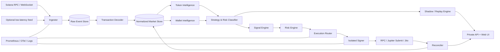

# Private Solana Intelligence & Execution Terminal — detailed `to-do.md`

> **Purpose:** a single executable backlog for a private Solana analytics and trading terminal with token and wallet monitoring, strategy classification, Shadow Mode, copy simulation, management of the owner's wallets, and controlled trade execution.\
> **Format:** a modular monolith for the first release, a separate signer process, and a private Web UI.\
> **Plan baseline date:** 2026-08-06.\
> **Primary user:** one system owner; public SaaS, billing, and multitenancy are outside the initial scope.

---

## How to use this file

- Execute tasks strictly according to dependencies, not the visual order of the interface.
- One checkbox represents one verifiable result that can be accepted or rejected separately.
- After each task, run the specified tests and record the change in a separate commit.
- Do not enable live execution until gates `G0`–`G6` have passed.
- Connect every new data source in read-only and Shadow Mode first, then Paper, and only then allow it to generate real `OrderIntent` values.
- All numeric thresholds below are initial working values. Change them only through versioned configurations and after replay calibration.

### Legend

| Notation | Meaning |
|---|---|
| `P0` | blocks the MVP |
| `P1` | required for controlled Live |
| `P2` | expansion after a stable MVP |
| `G0…G9` | mandatory go/no-go gate |
| `DoD` | Definition of Done |
| `Observe` | collection and analysis without a trading intent |
| `Shadow` | trade calculation without signing or submission |
| `Paper` | virtual execution against observed liquidity |
| `Live` | a real signed transaction |

---

# 1. Fixed scope

## 1.1. Product goal

Build one private tool that:

1. Receives Solana events in near real time.
2. Decodes Pump.fun/PumpSwap, Raydium, Meteora, Orca, Jupiter routes, and standard SPL/Token-2022 operations.
3. Reconstructs understandable actions: buy, sell, transfer, position opening/closing, pool migration, and liquidity changes.
4. Builds `Wallet DNA`, PnL, behavioral classification, and `Copy Score`.
5. Automatically distinguishes reproducible low-frequency trading from HFT, arbitrage, market making, LP operations, and suspicious synthetic activity.
6. Allows a wallet to be observed first, followed by Shadow/Paper replay, and only then enables Live.
7. Executes trades through a controlled pipeline: `quote → simulation → risk decision → sign → submit → reconcile`.
8. Separates manual positions, copy trading, experimental strategies, and future cross-venue strategies into independent portfolios.
9. Shows the full latency chain and explains why a trade was executed, skipped, or blocked.
10. Keeps keys outside the database, `.env`, logs, and user interface.

## 1.2. MVP scope

- Solana mainnet read-only ingest.
- History and live events for selected tokens, pools, and wallets.
- Normalized swaps and positions.
- Token page: price, liquidity, volume, holders, creator/funder graph, risk flags.
- Wallet page: realized/unrealized PnL, win rate, expectancy, drawdown, trade timeline, Wallet DNA.
- Wallet classification and a hard `NON_COPYABLE` designation for HFT/arbitrage/unclear routes.
- Copy Score and an explanation of its components.
- Shadow Mode and event-time replay.
- Paper portfolio.
- Live spot swaps for one owner-controlled portfolio after the gates.
- Jupiter Swap V2 as the primary aggregator; a direct Raydium adapter as a fallback and research route.
- TP/SL, partial exit, trailing, time stop, liquidity stop.
- Private Web UI through Tailscale/WireGuard.
- Telegram/desktop notifications without the ability to sign transactions from a notification.

## 1.3. Deliberate exclusions

The product does not include modules intended to create a false market picture or conceal coordination:

- synthetic/wash volume;
- imitation of “human” trading activity;
- artificial inflation of holder counts;
- profile farming and mass profile creation;
- concealed distribution of supply across related addresses;
- simultaneous token launch and concealed supply purchases by a set of subwallets;
- clone-token workflow;
- coordinated mass-dump;
- evasion of wallet relationship graphs;
- management of other people's funds or public multitenancy.

Defensive detectors for these patterns, historical replay, and management of the owner's portfolios are permitted.

## 1.4. Key research findings converted into requirements

### DogWifTools

Only neutral primitives are useful to adopt from the competing product:

- batch balance;
- funding/sweep of the owner's wallets;
- closing empty token accounts and reclaiming rent;
- SPL transfers between the owner's accounts;
- a fast RPC/WebSocket pipeline;
- separate wallets for different tasks;
- bulk liquidation of the owner's positions within an explicitly selected scope.

Do not adopt architectural anti-patterns:

- private keys in a plain `config.json`;
- requests to disable Defender/quarantine;
- unsigned builds;
- mixing secrets, UI, and the trading process;
- unlimited wallet creation without a policy;
- modes whose success metric is artificial volume or holder count.

### GMGN

Use as a product reference:

- token discovery and trending over short windows;
- holder/insider/bundle/creator analysis;
- Wallet Radar;
- wallet PnL and a quick transition from observation to Shadow;
- copy filters by market cap, liquidity, token age, holder count, platform, and LP attributes;
- TP/SL, batch exits, trailing;
- live wallet alerts;
- transparent token and wallet pages.

Improve on typical GMGN-style UX:

- show copyability and confidence before the launch button;
- do not create a Live strategy in one click without Shadow;
- account for conflicts between multiple mirrors on the same asset;
- calculate follower PnL with actual latency, priority fees, tips, slippage, and failed transactions;
- separate lots and exit rules for each strategy;
- explain every block and every execution.

### Copy-trading experience from the attached article

- An HFT wallet with hundreds of rapid actions must not be considered copyable.
- Multi-hop arbitrage cannot be mirrored after the fact; it requires a dedicated native strategy engine.
- Low-frequency wallets with infrequent positions are better suited for replication.
- Manual and bot positions must not be mixed in the same accounting scope.
- Two mirrors can conflict on one token; position ownership and an allocator are required.
- Latency must be measured by stage, not as one aggregate number.
- Leader results must not be presented as achievable follower results without replay.

### Research into suspicious tokens

Simple “safety checkmarks” are insufficient. Analyze separately:

- LP control and the ability to withdraw it;
- creator/funder graph;
- holder clusters instead of a nominal top-10;
- synchronized trades and repeated amounts/intervals;
- the origin of early buyers' SOL;
- reuse of funder/creator addresses;
- anomalous relationships between age, market cap, liquidity, and organic holders;
- sellability through quote/simulation;
- migrations between a bonding curve and a DEX;
- the gap between apparent volume and the number of independent capital sources.

### AMM/DEX

The engine must distinguish:

- order-book markets;
- CPMM;
- CLMM;
- DLMM;
- bonding curve;
- `ExactIn`, `ExactOut`, and hybrid fee mechanics;
- price impact, slippage, and route depth;
- direct swaps and multi-hop routes.

### Arbitrage

- Do not attempt copy-arbitrage.
- Use a separate scanner/executor for a future native arbitrage module.
- Treat atomic multi-hop as a separate strategy type.
- A failed atomic route must not leave an intermediate position, but analytics must account for fee/priority/tip and rejected-attempt cost.
- Measure RPC quality, server placement, and broadcast path as part of the strategy.

---

# 2. Product modes and primary flow

## 2.1. Four permission modes

| Mode | Signing | Submission | Financial risk | Purpose |
|---|---:|---:|---:|---|
| Observe | no | no | none | collection and analysis |
| Shadow | no | no | none | calculating a response to a real event |
| Paper | no | no | virtual | portfolio and execution rules |
| Live | yes | yes | real | trades after all gates |

Forward transitions are allowed only in this sequence:

```text
Observe -> Shadow -> Paper -> Live
```

A backward transition is always allowed. Any critical health/risk event automatically moves the strategy to `PAUSED`, but does not close a position without a predefined emergency rule.

## 2.2. Primary user journey

1. Paste a mint or wallet address.
2. The system backfills history and shows data quality.
3. For a token, show risk flags, pool topology, creator/funder/holder graph, and liquidity.
4. For a wallet, show Wallet DNA, PnL, strategy class, and Copy Score.
5. Add the wallet to Observe and set a period.
6. Run Shadow with several latency and position-size profiles.
7. Compare leader PnL, theoretical follower PnL, and executable follower PnL.
8. Create a Paper strategy.
9. Complete the minimum number of trades and pass the quality gates.
10. Link a separate Live portfolio.
11. Enable capital limits, exits, and the kill switch.
12. Move the strategy to Live manually through two-step confirmation.

---

# 3. Architecture

## 3.1. Selected approach

The first release is a **modular monolith**, not a set of microservices:

- one Rust workspace;
- one primary backend process with clear internal modules;
- a separate signer process;
- a separate frontend;
- PostgreSQL/TimescaleDB;
- Redis for cache, locks, and short queues;
- Docker Compose on the current Ubuntu/Docker setup;
- add NATS/ClickHouse only after load is confirmed.

This reduces network failure points while preserving boundaries that allow ingest and execution to be separated later.

## 3.2. Logical diagram



## 3.3. Critical boundaries

- `ingest` never has access to private keys.
- `analytics` cannot submit transactions.
- `strategy` creates only `OrderIntent` values.
- `risk` can approve or reject an intent, but does not sign.
- `execution` builds and simulates a transaction, but does not read the private key.
- `signer` signs only an authorized serialized payload under an allowlist policy.
- `reconciler` is the sole source of the final position status.
- The UI does not store or display a private key/seed.

## 3.4. Execution states

```text
DETECTED
  -> NORMALIZED
  -> CLASSIFIED
  -> SIGNAL_CREATED
  -> RISK_REJECTED | QUOTE_REQUESTED
  -> QUOTED
  -> SIMULATION_FAILED | SIMULATED
  -> RISK_RECHECK_FAILED | APPROVED
  -> SIGNING_FAILED | SIGNED
  -> SUBMISSION_FAILED | SUBMITTED
  -> EXPIRED | LANDED
  -> CONFIRMED
  -> FINALIZED
  -> RECONCILED
```

Each transition is stored append-only and contains:

- application timestamp;
- observed slot;
- commitment;
- provider;
- correlation ID;
- strategy ID;
- portfolio ID;
- reason code;
- latency from previous state.

---

# 4. Stack and repository structure

## 4.1. Backend

- Rust stable, edition 2024.
- Tokio, Axum, SQLx, Serde, Reqwest.
- `tracing` + OpenTelemetry.
- `thiserror` for typed errors.
- `rust_decimal`/integer atomic units; do not use `f64` for balances.
- Solana SDK/client crates pinned by the lockfile.
- IDL/program decoders from verifiable sources with version pinning.

## 4.2. Frontend

- TypeScript strict.
- React + Vite.
- TanStack Query/Table.
- Lightweight Charts.
- Zod for runtime validation.
- WebSocket/SSE for live updates.
- Playwright for E2E.

## 4.3. Storage and operations

- PostgreSQL 16+ and TimescaleDB.
- Redis 7+.
- Object storage or a local compressed archive for raw blocks and replay fixtures.
- Docker Compose.
- Caddy/Nginx only behind a VPN.
- Prometheus, Grafana, Loki, Tempo.
- SOPS + age for bootstrap secrets; Vault/KMS when moving the signer to a separate host.
- Cosign/Sigstore for release artifacts.

## 4.4. Repository

```text
private-trading-terminal/
├── Cargo.toml
├── Cargo.lock
├── rust-toolchain.toml
├── deny.toml
├── apps/
│   ├── backend/src/main.rs
│   ├── signer/src/main.rs
│   ├── cli/src/main.rs
│   └── web/
├── crates/
│   ├── domain/
│   ├── config/
│   ├── chain-solana/
│   ├── ingest/
│   ├── decode-core/
│   ├── decode-spl/
│   ├── decode-pump/
│   ├── decode-raydium/
│   ├── decode-meteora/
│   ├── decode-orca/
│   ├── decode-jupiter/
│   ├── market-state/
│   ├── token-intelligence/
│   ├── wallet-intelligence/
│   ├── strategy-classifier/
│   ├── copy-score/
│   ├── replay/
│   ├── portfolio/
│   ├── risk-engine/
│   ├── execution/
│   ├── signer-protocol/
│   ├── notifications/
│   ├── persistence/
│   └── observability/
├── migrations/
├── config/
│   ├── defaults.toml
│   ├── risk.live.toml
│   ├── risk.paper.toml
│   └── program-registry.toml
├── fixtures/
│   ├── transactions/
│   ├── pools/
│   ├── wallets/
│   └── venti/
├── scripts/
├── deploy/
├── docs/
└── tests/
```


---

# 5. Canonical contracts and reason codes

## 5.1. Market event

```rust
pub struct MarketEvent {
    pub event_id: Uuid,
    pub chain: Chain,
    pub slot: u64,
    pub block_time: Option<DateTime<Utc>>,
    pub observed_at: DateTime<Utc>,
    pub commitment: Commitment,
    pub signature: String,
    pub source: DataSource,
    pub program_id: String,
    pub kind: MarketEventKind,
    pub raw_ref: String,
}
```

## 5.2. Decoded swap

```rust
pub struct DecodedSwap {
    pub swap_id: Uuid,
    pub signature: String,
    pub instruction_path: Vec<u16>,
    pub trader: String,
    pub venue: Venue,
    pub pool: String,
    pub input_mint: String,
    pub input_amount_atomic: u128,
    pub output_mint: String,
    pub output_amount_atomic: u128,
    pub fee_amount_atomic: Option<u128>,
    pub fee_mint: Option<String>,
    pub route_id: Option<Uuid>,
    pub slot: u64,
    pub success: bool,
}
```

## 5.3. Wallet action

```rust
pub struct WalletAction {
    pub action_id: Uuid,
    pub wallet: String,
    pub action_type: WalletActionType,
    pub base_mint: String,
    pub quote_mint: String,
    pub side: Side,
    pub quantity_atomic: u128,
    pub quote_value_usd: Option<Decimal>,
    pub effective_price_usd: Option<Decimal>,
    pub route_depth: u16,
    pub detected_at: DateTime<Utc>,
    pub source_slot: u64,
    pub confidence: Decimal,
}
```

## 5.4. Trading intent

```rust
pub struct OrderIntent {
    pub intent_id: Uuid,
    pub strategy_id: Uuid,
    pub portfolio_id: Uuid,
    pub venue: Venue,
    pub market: MarketId,
    pub side: Side,
    pub amount: AmountSpec,
    pub max_slippage_bps: u16,
    pub deadline: DateTime<Utc>,
    pub source_action_id: Option<Uuid>,
    pub exit_policy_id: Option<Uuid>,
    pub idempotency_key: String,
}
```

## 5.5. Risk decision

```rust
pub struct RiskDecision {
    pub decision_id: Uuid,
    pub intent_id: Uuid,
    pub status: RiskStatus,
    pub approved_amount: Option<AmountSpec>,
    pub reasons: Vec<RiskReason>,
    pub limits_snapshot_hash: String,
    pub decided_at: DateTime<Utc>,
}
```

## 5.6. Execution report

```rust
pub struct ExecutionReport {
    pub execution_id: Uuid,
    pub intent_id: Uuid,
    pub tx_signature: Option<String>,
    pub status: ExecutionStatus,
    pub quoted_out_atomic: Option<u128>,
    pub simulated_out_atomic: Option<u128>,
    pub filled_out_atomic: Option<u128>,
    pub fees_lamports: u64,
    pub tip_lamports: u64,
    pub detection_to_submit_ms: Option<u64>,
    pub slot_landed: Option<u64>,
    pub failure_code: Option<String>,
}
```

## 5.7. Universal reason codes

```text
DATA_INSUFFICIENT
DATA_STALE
DECODER_UNSUPPORTED
ROUTE_TOO_COMPLEX
STRATEGY_NON_COPYABLE_HFT
STRATEGY_NON_COPYABLE_ARBITRAGE
STRATEGY_SUSPICIOUS_ACTIVITY
TOKEN_RISK_HARD_BLOCK
LIQUIDITY_TOO_LOW
POSITION_LIMIT
PORTFOLIO_DRAWDOWN_LIMIT
DAILY_LOSS_LIMIT
SLIPPAGE_LIMIT
PRICE_IMPACT_LIMIT
QUOTE_EXPIRED
SIMULATION_FAILED
SIGNER_POLICY_REJECTED
SUBMISSION_TIMEOUT
TRANSACTION_EXPIRED
RECONCILIATION_MISMATCH
INFRA_DEGRADED
KILL_SWITCH_ACTIVE
```

---

# 6. Storage and data model

## 6.1. Required tables

| Table | Purpose | Key/index |
|---|---|---|
| `chain_slots` | slot, parent, commitment, status | PK `slot` |
| `raw_transactions` | unmodified tx/meta payload | unique `signature` |
| `raw_notifications` | incoming WS events | `(provider, subscription_id, sequence)` |
| `instructions` | outer/inner instruction tree | `(signature, path)` |
| `token_mints` | decimals, authorities, token program | PK `mint` |
| `token_metadata` | name/symbol/URI/verification | `(mint, observed_at)` |
| `pools` | venue, pair, curve type | PK `pool_address` |
| `pool_snapshots` | reserves/ticks/bins/liquidity | hypertable `(pool, observed_at)` |
| `swaps` | normalized swaps | unique `(signature, instruction_path)` |
| `routes` | multi-hop aggregation | PK `route_id` |
| `wallet_actions` | buy/sell/transfer/LP | `(wallet, source_slot)` |
| `position_lots` | separate entries | `(portfolio_id, mint, lot_id)` |
| `portfolio_positions` | aggregated position | `(portfolio_id, mint)` |
| `wallet_features` | temporal features | `(wallet, window_end, feature_version)` |
| `wallet_scores` | DNA, copy/risk scores | `(wallet, score_version, scored_at)` |
| `token_risk_features` | creator/LP/cluster/activity | `(mint, feature_version, observed_at)` |
| `token_risk_scores` | result and explanation | `(mint, score_version, observed_at)` |
| `strategies` | mode, source, config | PK `strategy_id` |
| `strategy_allocations` | capital limit | `(strategy_id, portfolio_id)` |
| `shadow_runs` | replay parameters | PK `shadow_run_id` |
| `shadow_orders` | virtual attempts | `(shadow_run_id, sequence)` |
| `order_intents` | immutable intents | unique `idempotency_key` |
| `risk_decisions` | decision and snapshot | `(intent_id, decided_at)` |
| `execution_attempts` | quote/sim/send | `(intent_id, attempt_no)` |
| `fills` | actual balance changes | `(execution_id, fill_no)` |
| `latency_samples` | pipeline stages | hypertable `(component, observed_at)` |
| `risk_events` | limits/kill switch | `(portfolio_id, observed_at)` |
| `alerts` | notifications | `(severity, created_at)` |
| `audit_log` | user/system actions | append-only |
| `provider_health` | RPC/WS/API health | hypertable |
| `schema_versions` | decoder/score versions | PK `component` |

## 6.2. Storage rules

- Store the raw payload before decoding.
- Never overwrite normalized records without `decoder_version`.
- A decoder fix creates a new projection instead of silently changing history.
- Store monetary values in atomic units + decimals; store USD valuation separately with price source and timestamp.
- All timestamps are UTC.
- Store `slot`, `commitment`, `observed_at`, and `provider` for every on-chain fact.
- For an orphaned/reverted slot, mark derived records `reverted=true` and recalculate projections.
- Retain raw watched-wallet/token data indefinitely.
- General raw stream: 30 days in the DB, then a compressed archive.
- Retain normalized swaps/features/scores indefinitely.
- Debug logs: 14 days; audit/security logs: at least 365 days.

## 6.3. Idempotency

- Ingest key: `provider + signature + notification_type`.
- Instruction key: `signature + instruction_path`.
- Swap key: `signature + instruction_path + decoder_version`.
- Intent key: `strategy_id + source_action_id + side + market + policy_version`.
- An execution retry does not create a new intent; it increments `attempt_no`.
- Resubmitting the same signed transaction must not create a second fill.

---

# 7. Scoring and classification

## 7.1. Wallet DNA

Calculate over at least the `1d`, `7d`, `30d`, `90d`, and `all` windows.

### Activity

- trades count;
- unique active days;
- trades/hour distribution;
- inter-trade interval p10/p50/p90;
- unique tokens;
- DEX distribution;
- route depth distribution;
- percent multi-hop;
- percent failed;
- percent transfers vs swaps;
- average/median position size;
- turnover;
- capital utilization.

### Position behavior

- median holding time;
- p10/p90 holding time;
- average adds per position;
- partial-exit frequency;
- full-exit frequency;
- average time to first partial exit;
- average time to final exit;
- average adverse excursion;
- average favorable excursion;
- entry token age;
- entry liquidity percentile;
- entry market-cap percentile.

### Results

- realized PnL;
- unrealized PnL;
- win rate;
- profit factor;
- expectancy;
- payoff ratio;
- max drawdown;
- recovery factor;
- Sharpe-like ratio for irregular trades;
- Sortino-like ratio;
- PnL concentration in top 1/3/5 trades;
- loss concentration;
- weekly consistency;
- return skew/kurtosis;
- fee share;
- estimated slippage share.

### Risk and data quality

- balance coverage;
- unpriced token ratio;
- decoder coverage;
- source confidence;
- rug exposure;
- liquidity-weighted exposure;
- holder-cluster exposure;
- suspected coordinated activity ratio;
- funding-source concentration.

## 7.2. Strategy classifier

Initial classes:

```text
LOW_FREQUENCY_SPOT
SWING
MOMENTUM
EARLY_ENTRY
SCALPER
HFT
ARBITRAGE
MARKET_MAKER
LIQUIDITY_PROVIDER
GRID_LIKE
TRANSFER_ROUTER
SUSPICIOUS_SYNTHETIC
MIXED
UNKNOWN
```

The first classifier uses rules + calibrated thresholds, not ML. ML is allowed only after a labeled replay corpus has been accumulated.

### Hard rules v1

- `HFT`: median inter-trade interval < 5 seconds **or** > 120 swaps in 10 minutes.
- `ARBITRAGE`: round-trip to the original mint within one tx/route, route depth ≥ 2, and holding time ≈ 0.
- `LOW_FREQUENCY_SPOT`: ≤ 12 new positions/day, median holding ≥ 15 minutes, route depth ≤ 2.
- `SWING`: median holding ≥ 6 hours and ≤ 30 days.
- `SCALPER`: median holding 10 seconds–15 minutes without an atomic round-trip.
- `SUSPICIOUS_SYNTHETIC`: high cluster/funder synchronization score and repeated amounts/intervals.
- `UNKNOWN`: decoder coverage < 95% or data confidence < 0.80.

## 7.3. Copyability hard gates

A wallet receives `NON_COPYABLE` if at least one of the following holds:

- history < 50 closed positions or < 14 active days;
- decoder coverage < 98%;
- unpriced volume > 10%;
- class `HFT`, `ARBITRAGE`, `MARKET_MAKER`, `LIQUIDITY_PROVIDER`, `SUSPICIOUS_SYNTHETIC`, `UNKNOWN`;
- median holding < 30 seconds;
- p50 follower replay at 500 ms is negative while leader PnL is positive;
- follower/leader execution similarity < 0.70;
- the required position size exceeds 10% of available liquidity on the selected route;
- PnL top-1 concentration > 70% with fewer than 100 closed positions;
- max drawdown > 60%;
- a token-risk hard block occurs in more than 20% of entries.

## 7.4. Copy Score 0–100

Calculate only after the hard gates:

| Component | Weight |
|---|---:|
| data confidence | 10 |
| latency survivability | 20 |
| executable liquidity/capacity | 15 |
| PnL consistency | 15 |
| drawdown/risk quality | 15 |
| follower execution similarity | 15 |
| diversification/robustness | 10 |

Categories:

- `85–100`: high suitability;
- `70–84`: suitable with limits;
- `55–69`: Shadow/Paper only;
- `<55`: do not activate Live.

Store each component separately. The UI must show reasons, not just a number.

## 7.5. Token Risk Score 0–100

The higher the number, the higher the risk:

| Component | Weight |
|---|---:|
| LP control/withdrawal risk | 20 |
| holder cluster concentration | 20 |
| synthetic activity | 20 |
| creator/funder history | 15 |
| mint/freeze/Token-2022 authority risk | 10 |
| sellability/route risk | 10 |
| age/MC/liquidity anomaly | 5 |

### Hard blocks

- no quote is available on any permitted route;
- simulation of selling the minimum test amount is consistently rejected;
- the freeze authority can freeze the user's token account and there is no allowlist exception;
- LP is fully controlled by a related cluster and can be withdrawn immediately;
- mint/metadata does not match the selected asset;
- the token program/extension is not supported by the execution engine;
- the creator/funder is on the local denylist of confirmed rug patterns.

### Required explanation

```json
{
  "code": "HOLDER_CLUSTER_CONCENTRATION",
  "severity": "high",
  "value": 0.71,
  "threshold": 0.45,
  "evidence": {
    "cluster_count": 3,
    "controlled_supply_pct": 71.0,
    "common_funders": 2
  }
}
```

---

# 8. Risk engine and position ownership

## 8.1. Initial Live limits

These values are a safe starting point for technical verification, not target capital sizes:

- max position per token: min(`2% portfolio NAV`, `$100`);
- max aggregate open risk: `20% NAV`;
- max new positions/hour: `3`;
- max new positions/day: `10`;
- max token price impact: `1.5%`;
- max route slippage: `2.0%`;
- max combined priority/tip/fee share: `1.0%` of notional;
- max daily realized loss: `3% NAV`;
- max rolling 7d drawdown: `7% NAV`;
- max strategy drawdown: `10% allocated capital`;
- max token risk score for Live entry: `35`;
- max pending intents: `1` per `portfolio + mint`;
- quote TTL: `1.5 s` for copy; `500 ms` for a low-latency profile;
- source action max age: `5 s` for scalper, `60 s` for low-frequency/swing;
- liquidity coverage: executable depth must be ≥ `10x` follower notional.

Any breach creates `RiskDecision::Rejected` with a specific reason code.

## 8.2. Position ownership

Each lot belongs to exactly one source:

```text
MANUAL
COPY:<strategy_id>
NATIVE:<strategy_id>
RESEARCH
```

Rules:

- a strategy can sell only its own lots;
- `sell entire wallet balance` is forbidden as an internal primitive;
- an emergency close creates a separate audit event and closes the selected ownership groups;
- multiple mirrors on one mint can have separate virtual subpositions even within one on-chain token account;
- the allocator reserves the available balance before the intent is signed;
- the reconciler allocates the actual fill across lots deterministically.

## 8.3. Exit policies

Support:

- proportional mirror sell;
- fixed percentage sell;
- full strategy-position exit;
- fixed notional exit;
- multi-level TP;
- stop loss;
- trailing take profit;
- trailing stop;
- time stop;
- liquidity deterioration stop;
- token-risk escalation stop;
- source-wallet exit;
- manual emergency exit.

For each policy, store activation condition, trigger source, amount calculation, max slippage, expiry, precedence, override rules, and re-entry cooldown.

---

# 9. Detailed backlog


## Phase 0 — Scope, ADR, repository, and reproducible environment

### P0-001 — Product charter and module boundaries

- [ ] Create `docs/product-charter.md` and `docs/adr/0001-scope-and-non-goals.md`.
- [ ] Transfer the goals, modes, and non-goals from sections 1–3 into them.
- [ ] Describe each module's input, output, data owner, and forbidden dependencies.
- [ ] Establish the signer as the only component with access to key material.
- **Acceptance:** no `TBD`; analytics has no physical dependency on the signer implementation; Live cannot bypass the risk engine.
- **Test:** architecture dependency test in CI.
- **Commit:** `docs: freeze product scope`.

### P0-002 — Rust workspace

- [ ] Create the workspace according to the structure in section 4.4.
- [ ] Enable `rustfmt`, `clippy -D warnings`, locked dependencies, and a default ban on `unsafe`.
- [ ] Create separate `backend`, `signer`, and `cli` binaries.
- [ ] Add backend/signer health endpoints.
- **Acceptance:** `cargo build --workspace --locked`, `cargo test --workspace`, and `cargo clippy --workspace --all-targets -- -D warnings` pass.
- **Commit:** `chore: bootstrap rust workspace`.

### P0-003 — Frontend workspace

- [ ] Create a React/TypeScript strict application.
- [ ] Routes: Dashboard, Tokens, Wallets, Radar, Shadow, Strategies, Portfolios, Executions, Alerts, Settings.
- [ ] Integrate runtime schema validation, unit tests, and Playwright.
- **Acceptance:** build/typecheck/test pass; public registration is absent.
- **Commit:** `chore: bootstrap private web app`.

### P0-004 — Docker Compose

- [ ] Start PostgreSQL/Timescale, Redis, backend, signer, web, and an observability profile.
- [ ] Use a private network; bind the Web UI only to the VPN interface.
- [ ] Add healthcheck, restart policy, resource limits, and named volumes.
- [ ] Do not put secrets in Compose or `.env.example`.
- **Acceptance:** a clean `scripts/bootstrap.sh` starts a green stack; DB/signer are not externally visible.
- **Commit:** `chore: add local compose stack`.

### P0-005 — CI gates and dependency policy

- [ ] Format, clippy, tests, `cargo deny`, frontend lint/typecheck/build/test.
- [ ] Secret scan, SBOM, container scan.
- [ ] Ban git dependencies without a pinned commit.
- [ ] Release artifacts with checksums.
- **Acceptance:** every gate blocks merging; the SBOM is generated automatically.
- **Commit:** `ci: enforce build test and dependency gates`.

### P0-006 — Typed versioned config

- [ ] Create `config/defaults.toml`, `risk.paper.toml`, `risk.live.toml`, and `program-registry.toml`.
- [ ] Separate secret references from regular configuration.
- [ ] Add version, checksum, and validation ranges.
- [ ] Forbid Live startup with an unknown risk config version.
- **Acceptance:** an invalid field returns the exact path/reason; a critical config change invalidates Live approval.
- **Commit:** `feat: add versioned typed configuration`.

### P0-007 — Core DB migrations

- [ ] Create the tables from section 6.
- [ ] Enable Timescale hypertables and indexes.
- [ ] Add schema version/lock.
- [ ] Production migrations are forward-only; development allows a rebuild.
- **Acceptance:** migration of a clean DB and a repeated run pass; key query plans use indexes.
- **Commit:** `feat: create core persistence schema`.

### P0-008 — Error taxonomy and correlation IDs

- [ ] Typed error enums by component.
- [ ] Stable user-facing codes from section 5.7.
- [ ] A correlation ID for each incoming event, intent, and execution.
- [ ] Central secret redaction.
- **Acceptance:** an API error has a code/correlation ID; keys/auth/signed tx do not reach display/logs.
- **Commit:** `feat: standardize errors and correlation ids`.

### P0-009 — Immutable fixture registry

- [ ] `fixtures/manifest.yaml`: source, slot range, checksum, decoder version, expected outputs.
- [ ] A fixture cannot change without a new checksum/version.
- [ ] Add the `fixture verify` CLI.
- **Acceptance:** a corrupted fixture fails CI before replay.
- **Commit:** `test: add immutable fixture registry`.

---

## Phase 1 — Solana ingest, commitment, and raw store

### SOL-001 — Provider-agnostic RPC client

- [ ] A trait for `getTransaction`, `getBlock`, `getSignatureStatuses`, `simulateTransaction`, and `sendTransaction`.
- [ ] Timeout, bounded retry, rate-limit handling, and circuit breaker.
- [ ] Provider health: p50/p95/p99, errors, stale slot.
- [ ] Retry `sendTransaction` only with the same signature.
- **Acceptance:** the provider can be changed through config without recompilation; failover is typed and observable.
- **Tests:** mock contract, timeout, 429, failover, idempotent resend.
- **Commit:** `feat: add provider agnostic solana rpc`.

### SOL-002 — Resilient WebSocket subscriptions

- [ ] `logsSubscribe`, `signatureSubscribe`, `slotSubscribe`, `programSubscribe`.
- [ ] Store desired subscriptions separately from active subscriptions.
- [ ] Reconnect with automatic resubscribe.
- [ ] Gap recovery through HTTP backfill.
- [ ] Store `processed/confirmed/finalized` commitments separately.
- **Acceptance:** forced disconnection does not lose watched transactions; duplicates are deduplicated.
- **Commit:** `feat: add resilient websocket subscriptions`.

### SOL-003 — Raw transaction persistence

- [ ] Store raw notifications and transaction/meta before parsing.
- [ ] Provider, observed time, slot, commitment, payload hash.
- [ ] Compress large payloads.
- [ ] Idempotent insert and a dead-letter mechanism for malformed data.
- **Acceptance:** a decoder crash does not destroy the event; replay is available from the raw store.
- **Load:** at least a 1k events/s burst without data loss on the target host.
- **Commit:** `feat: persist immutable raw chain events`.

### SOL-004 — Slot/fork reconciler

- [ ] Store parent slot and commitment progression.
- [ ] Mark orphaned projections; do not delete history.
- [ ] Rebuild from a valid checkpoint.
- [ ] Critical alert on finalized inconsistency.
- **Acceptance:** a reverted processed event does not remain in positions/PnL.
- **Commit:** `feat: reconcile slots and forks`.

### SOL-005 — Dynamic watch registry

- [ ] Targets: wallet, mint, pool, program.
- [ ] Priority, retention profile, enabled state, labels.
- [ ] Add/remove without a restart.
- [ ] Pubkey validation and dedupe.
- **Acceptance:** ingest begins immediately for a new wallet; removal stops future subscriptions and preserves history.
- **Commit:** `feat: add dynamic watch registry`.

### SOL-006 — Resumable historical backfill

- [ ] Durable cursor and paginated signatures/transactions.
- [ ] Separate live/backfill queues.
- [ ] Provider concurrency budget.
- [ ] Restart/resume without repeating the logical load.
- **Acceptance:** live p95 degrades by no more than 20% during backfill.
- **Commit:** `feat: add resumable historical backfill`.

### SOL-007 — Optional low-latency feed adapter

- [ ] A universal adapter for a Geyser/ShredStream-class feed.
- [ ] Feature flag and standard RPC fallback.
- [ ] Compare first-seen time across sources.
- [ ] Confirm every low-latency event through RPC reconciliation.
- **Acceptance:** the system operates fully without the optional feed; disagreement creates an alert.
- **Commit:** `feat: add optional low latency feed adapter`.

### SOL-008 — Provider benchmark harness

- [ ] Measure WS lag, HTTP latency, simulation, and submit dry-run/devnet.
- [ ] Report p50/p95/p99, errors, region, and config hash.
- [ ] Redact credentials in the endpoint URL.
- **Acceptance:** at least two providers and a fallback can be compared reproducibly.
- **Commit:** `perf: add provider latency benchmark`.

---

## Phase 2 — Decoding and market state

### DEC-001 — Instruction tree and balance deltas

- [ ] Parse outer/inner instructions and the CPI path.
- [ ] Match pre/post SOL and token balances.
- [ ] Normalize wrapped SOL.
- [ ] Separate fee payer, trader, vault, and intermediary accounts.
- **Acceptance:** token deltas reconcile with transaction meta; an unknown instruction does not break other branches.
- **Commit:** `feat: build instruction tree and balance deltas`.

### DEC-002 — SPL Token and Token-2022

- [ ] Transfer, transferChecked, mint, burn, close account, sync native, freeze/thaw.
- [ ] Mint/freeze authorities and Token-2022 extensions.
- [ ] Unsupported extension → execution hard block.
- **Acceptance:** all fixture operations have typed representations; ATA closure correctly reflects rent.
- **Commit:** `feat: decode spl token programs`.

### DEC-003 — Pump.fun/PumpSwap lifecycle

- [ ] Create, buy, sell, bonding curve state, and migration.
- [ ] Trader, mint, SOL/token amounts, effective price.
- [ ] Program/discriminator version pinning.
- [ ] Unknown version → raw saved + `DECODER_UNSUPPORTED`.
- **Acceptance:** buy/sell fixtures produce exact amounts; migration links pre/post market identity.
- **Commit:** `feat: decode pump lifecycle`.

### DEC-004 — Raydium AMM v4/CPMM/CLMM

- [ ] Pool init, add/remove liquidity, swap.
- [ ] Vaults, reserves/ticks, fees.
- [ ] Direct and routed swaps.
- [ ] Do not count LP operations as trader buys/sells.
- **Acceptance:** the golden corpus for each pool type passes.
- **Commit:** `feat: decode raydium pools and swaps`.

### DEC-005 — Meteora DLMM

- [ ] Swap, bin/liquidity operations, active bin, dynamic fees.
- [ ] Do not apply a CPMM formula to DLMM.
- **Acceptance:** amounts and bin transitions match transaction/meta/account state.
- **Commit:** `feat: decode meteora dlmm`.

### DEC-006 — Orca Whirlpool

- [ ] Swaps and concentrated liquidity operations.
- [ ] Tick arrays, fees, and confidence when accounts are missing.
- **Acceptance:** swap/LP are separated; partial decoding is explicitly marked.
- **Commit:** `feat: decode orca whirlpools`.

### DEC-007 — Route reconstruction

- [ ] Group swaps within one transaction by flow of funds.
- [ ] Identify input/output asset, route depth, venues, and intermediates.
- [ ] Recognize round-trips to the original mint.
- **Acceptance:** `SOL→USDC→TOKEN` = one buy; `SOL→X→SOL` = an atomic round-trip, not a copy action.
- **Commit:** `feat: reconstruct multi hop routes`.

### DEC-008 — Jupiter routed transactions

- [ ] Recognize Jupiter context and AMM inner calls.
- [ ] Aggregate a route into one economic action.
- [ ] Store quoted and observed routes separately.
- **Acceptance:** one Jupiter transaction does not create multiple follower signals.
- **Commit:** `feat: decode jupiter routed swaps`.

### DEC-009 — Decoder coverage report

- [ ] Proportion of decoded instructions, decoded value, and classified actions.
- [ ] Unknown program IDs and affected volume.
- [ ] Block scoring when coverage is below the threshold.
- **Acceptance:** Copy Score is absent when coverage <98%; the reason is visible in UI/API.
- **Commit:** `feat: expose decoder coverage`.

### MKT-001 — Pool registry and snapshots

- [ ] Canonical MarketId for pair+venue+pool.
- [ ] Reserve/tick/bin snapshots and staleness.
- [ ] Bonding curve ↔ migrated pool link.
- **Acceptance:** the token page shows all active pools; a stale pool is not used for capacity.
- **Commit:** `feat: build canonical pool registry`.

### MKT-002 — Price impact and executable depth

- [ ] CPMM, CLMM, DLMM, bonding curve adapters.
- [ ] Marginal price, executable price, and impact for a given notional.
- [ ] The local model is only a sanity check; Live fill is based on quote/simulation/on-chain result.
- **Acceptance:** formulas match fixtures within the specified tolerance.
- **Commit:** `feat: model pool price impact and depth`.

### MKT-003 — Candles and rolling metrics

- [ ] Event-time candles: 1s/5s/1m/5m/1h.
- [ ] Volume, buys/sells, unique traders, holder delta, liquidity delta.
- [ ] Recompute only affected buckets for late events.
- **Acceptance:** the same raw dataset produces a deterministic result.
- **Commit:** `feat: aggregate event time market metrics`.

---

## Phase 3 — Token intelligence and defensive detection

### TOK-001 — Token profile

- [ ] Mint, metadata, authorities, age, pools, price, liquidity, holders, volume.
- [ ] Source timestamp and confidence for every field.
- [ ] Do not calculate market cap without supply confidence.
- **Acceptance:** API/UI distinguishes `unknown`, stale, and zero.
- **Commit:** `feat: build token profile`.

### TOK-002 — Creator/funder graph

- [ ] Creator, initial funder, first/second/third-hop funders.
- [ ] Directed transfer graph with bounded traversal.
- [ ] Common-funder clustering and evidence edges.
- **Acceptance:** every cluster flag can be traced to specific tx; traversal does not block live ingest.
- **Commit:** `feat: derive creator and funding graph`.

### TOK-003 — Holder snapshots and cluster concentration

- [ ] Exclude pools/vaults/program accounts.
- [ ] Link addresses through funding/transfer evidence.
- [ ] Calculate raw top-10 and cluster-adjusted concentration.
- [ ] Store confidence and a false-merge guard.
- **Acceptance:** a set of related wallets is displayed as an economic cluster, not as independent holders.
- **Commit:** `feat: calculate holder clusters`.

### TOK-004 — LP control and withdrawal risk

- [ ] Owner/position owner, lock/burn evidence, control cluster.
- [ ] History of add/remove liquidity.
- [ ] Controlled liquidity percentage.
- [ ] Critical alert on a sudden LP removal.
- **Acceptance:** the token page shows LP control, not just its amount.
- **Commit:** `feat: assess liquidity control`.

### TOK-005 — Synthetic activity detector

- [ ] Synchronization, repeated notional, regular intervals, common funding, circular flow, unique capital sources.
- [ ] Separate heuristic scores from hard evidence.
- [ ] Version the feature set.
- **Acceptance:** the score is deterministic; the UI shows top contributors; the detector does not generate trades.
- **Commit:** `feat: detect synthetic activity patterns`.

### TOK-006 — Creator recurrence

- [ ] Past mints/pools of the creator/funder cluster.
- [ ] Lifetime, peak liquidity, LP withdrawal, terminal state.
- [ ] Exclude exchange/hub wallets unless there is additional evidence.
- **Acceptance:** a recurring pattern has an evidence path; high-degree infrastructure does not cause a false hard block.
- **Commit:** `feat: score creator history`.

### TOK-007 — Sellability quote/simulation probe

- [ ] Read-only quotes for several small sizes.
- [ ] Build an unsigned transaction and simulate it without submission.
- [ ] Token-2022 extension checks.
- [ ] Rate limit and short cache.
- **Acceptance:** the probe never signs or submits a transaction; failure has a category/log hash.
- **Commit:** `feat: add non executing sellability probe`.

### TOK-008 — Age/MC/liquidity anomaly

- [ ] Compare age, MC, liquidity, independent capital, holder growth, and volume against the cohort.
- [ ] Robust percentiles instead of one absolute norm.
- [ ] Store cohort/version in score evidence.
- **Acceptance:** the anomaly is explainable; a sparse cohort → low confidence, not an automatic block.
- **Commit:** `feat: detect token market anomalies`.

### TOK-009 — Token Risk Score v1

- [ ] Implement the weights and hard blocks from section 7.5.
- [ ] Store the feature snapshot, explanation, and score version.
- [ ] Allowlist exceptions only with a reason, expiry, and audit.
- **Acceptance:** the same snapshot produces the same score; a hard block cannot be removed with a regular toggle.
- **Commit:** `feat: calculate explainable token risk score`.

### TOK-010 — Token alerts

- [ ] LP remove, risk jump, recurrence, liquidity collapse, holder-cluster jump, sellability fail.
- [ ] Dedupe window, severity, and evidence.
- [ ] A critical alert pauses new entries through the risk engine.
- **Acceptance:** one fact does not cause spam; open positions follow the exit policy.
- **Commit:** `feat: alert on token risk changes`.


---

## Phase 4 — Wallet intelligence, PnL, and Wallet DNA

### WAL-001 — Wallet action normalization

- [ ] Convert routes into buy/sell/transfer/LP/round-trip actions.
- [ ] Assign confidence and evidence references.
- [ ] Do not turn atomic arbitrage into an open position.
- [ ] Deduplicate economic action across inner hops.
- **Acceptance:** one multi-hop transaction creates one understandable action.
- **Commit:** `feat: normalize wallet actions`.

### WAL-002 — Lot-based PnL ledger

- [ ] FIFO as the reporting default and an average-cost view for the UI.
- [ ] Account for base fees, priority/tip, wrapping SOL, partial exits, and transfers.
- [ ] Separate realized, unrealized, and unpriced.
- [ ] Transfers between related owner-controlled addresses do not create profit.
- **Acceptance:** the ledger reconciles with balance deltas on golden fixtures.
- **Commit:** `feat: add wallet pnl ledger`.

### WAL-003 — Position reconstruction

- [ ] Position episodes by mint.
- [ ] Adds, partial exits, reopen, dust, and airdrops.
- [ ] Holding time, MAE/MFE, time to first/final exit.
- **Acceptance:** a dust transfer does not close a position; re-entry creates a new episode.
- **Commit:** `feat: reconstruct wallet positions`.

### WAL-004 — Performance metrics

- [ ] Implement the metrics from section 7.1.
- [ ] Transaction-weighted and capital-weighted views.
- [ ] Confidence interval/low-sample warning.
- [ ] Do not annualize irregular PnL without an explicit label.
- **Acceptance:** formula/version are documented in `docs/scoring/wallet-performance-v1.md`.
- **Commit:** `feat: calculate wallet performance metrics`.

### WAL-005 — Behavioral features

- [ ] Frequency, intervals, route depth, venue mix, entry age/liquidity, sizing, exit style.
- [ ] Windows: 1d/7d/30d/90d/all.
- [ ] Event-time recalculation for late events.
- **Acceptance:** replay is deterministic; window boundary tests pass.
- **Commit:** `feat: derive wallet behavioral features`.

### WAL-006 — Wallet DNA projection

- [ ] Combine performance, behavior, risk exposure, and data confidence.
- [ ] Compact labels + raw metrics + change over time.
- [ ] Do not hide a negative recent window behind the all-time total.
- **Acceptance:** the API contains the feature version and source timestamps.
- **Commit:** `feat: build wallet dna`.

### WAL-007 — Wallet Radar

- [ ] For a set of up to 10 tokens, find earliest buyers, highest realized profit, most bought, and shared holdings.
- [ ] Exclude low-confidence and infrastructure wallets.
- [ ] Export only to a watchlist or Shadow.
- **Acceptance:** no direct Live action from Radar; the ranking formula is explainable.
- **Commit:** `feat: add wallet radar`.

### WAL-008 — Wallet tracking alerts

- [ ] Buy, sell, new token, large size, behavior change, score downgrade.
- [ ] Include source slot and detection latency.
- [ ] Multi-hop dedupe.
- **Acceptance:** the alert contains an evidence link and is not duplicated across hops.
- **Commit:** `feat: alert on tracked wallet actions`.

---

## Phase 5 — Strategy classifier, Anti-Copy, and Copy Score

### CLS-001 — Rules classifier v1

- [ ] Implement the classes and thresholds from section 7.2.
- [ ] Primary/secondary label and confidence.
- [ ] Store matched rules.
- [ ] Do not automatically turn Unknown into low-frequency.
- **Acceptance:** every label is explainable; threshold boundary tests pass.
- **Commit:** `feat: classify wallet strategies`.

### CLS-002 — Anti-Copy hard gates

- [ ] `COPYABLE`, `SHADOW_ONLY`, `NON_COPYABLE`.
- [ ] Implement all gates from section 7.3.
- [ ] Store versioned evidence and reason lists.
- [ ] An HFT/arb/suspicious source cannot create a Live signal.
- **Acceptance:** false-copyable HFT/arb = 0 on the classification corpus.
- **Commit:** `feat: block non reproducible strategies`.

### CLS-003 — Execution similarity

- [ ] Entry coverage, side match, size ratio, execution price, exit timing, route success.
- [ ] Calculate across several latency profiles.
- [ ] Penalize missed and failed trades.
- **Acceptance:** the 0–1 metric is deterministic; leader PnL does not substitute for similarity.
- **Commit:** `feat: score follower execution similarity`.

### CLS-004 — Copy Score v1

- [ ] Implement the weights from section 7.4.
- [ ] Calculate components independently.
- [ ] Score only after hard gates.
- [ ] Versioned formula and complete explanation.
- **Acceptance:** the UI shows every component's contribution; snapshot+version uniquely determine the score.
- **Commit:** `feat: calculate explainable copy score`.

### CLS-005 — Score drift monitor

- [ ] Compare 7d/30d score, class, and data confidence.
- [ ] Downgrade alerts.
- [ ] Hard-gate regression → pause new entries.
- [ ] Do not close open positions outside the specified exit policy.
- **Acceptance:** the regression test reproduces downgrade and pause.
- **Commit:** `feat: monitor copy score drift`.

---

## Phase 6 — Shadow Mode, Paper, and replay

### SHD-001 — Event-time replay core

- [ ] Replay events by slot/block time/observed time.
- [ ] Deterministic seeded latency.
- [ ] Ban look-ahead/future data.
- [ ] Store config, data, and decoder hashes.
- **Acceptance:** rerunning produces a byte-identical result; the temporal leakage test passes.
- **Commit:** `feat: add deterministic event time replay`.

### SHD-002 — Latency model

- [ ] Profiles: 0, 100, 250, 500, 1000, 2000, 5000, 30000, 50000 ms.
- [ ] Separate ingest, decode, decision, quote, simulation, sign, and submit.
- [ ] Support empirical distributions from production metrics.
- **Acceptance:** the report shows each stage's contribution and a fixed-vs-empirical comparison.
- **Commit:** `feat: model follower latency`.

### SHD-003 — Executable quote/failure model

- [ ] Pool state at the time of the follower action.
- [ ] Price impact, slippage, base fee, priority/tip, quote expiry, failure.
- [ ] Do not use the leader fill price as the follower fill.
- [ ] Follower position size affects the result.
- **Acceptance:** a known CPMM replay reconciles; failed attempts are accounted for separately.
- **Commit:** `feat: simulate executable follower fills`.

### SHD-004 — Shadow copy runner

- [ ] Apply sizing and exit policy to source actions.
- [ ] Skip hard-blocked actions with a reason.
- [ ] Virtual lots, capital reservation, competing mirrors.
- [ ] Leader/theoretical/executable follower reports.
- **Acceptance:** trade-by-trade diff; the runner does not depend on the signer.
- **Commit:** `feat: add shadow copy runner`.

### SHD-005 — Live Paper portfolio

- [ ] Process live source events virtually.
- [ ] Use live quotes without signing.
- [ ] The same risk engine, lots, and exits as Live.
- [ ] Store missed/failed simulated orders.
- **Acceptance:** Paper and Live use one `OrderIntent` contract and differ in execution adapter.
- **Commit:** `feat: add live paper portfolio`.

### SHD-006 — Shadow API and report

- [ ] Create/start/stop/resume/compare runs.
- [ ] Progress streaming.
- [ ] Equity, drawdown, trade diff, latency sensitivity, costs.
- [ ] A config hash must not be silently reused with a different data hash.
- **Acceptance:** a run resumes after restart.
- **Commit:** `feat: expose shadow runs`.

### SHD-007 — VENTI benchmark

- [ ] Create a fixture for `FRpTyMBDavKsdYN1FQZcEeZ2iwGvHaZKFSkvr5izpump`.
- [ ] Record the available range of transactions/pool data and checksums.
- [ ] Reconstruct the spike window, swaps, liquidity, and holder changes within the available on-chain data.
- [ ] Run latency 0–50000 ms and several position sizes.
- [ ] Do not accept the article's figures as ground truth; the on-chain fixture is ground truth.
- **Acceptance:** the report shows the reproducibility limit by latency/size and explicitly marks missing history.
- **Commit:** `test: add venti replay benchmark`.

### SHD-008 — Promotion gates Paper → Live

- [ ] At least 30 Paper closed positions and 14 days of observation.
- [ ] Copy Score ≥70, decoder coverage ≥98%, no hard blocks.
- [ ] Positive executable expectancy after costs, Paper DD ≤10%.
- [ ] Local approval record with config hash and 24h expiry.
- **Acceptance:** a critical config change invalidates approval; the backend cannot bypass the gate.
- **Commit:** `feat: gate promotion from paper to live`.

---

## Phase 7 — Portfolios, lots, and allocator

### PRT-001 — Portfolio domain model

- [ ] Types: Manual, Copy, Native, Research, Paper.
- [ ] Lot ownership, reserved/pending/filled/released capital.
- [ ] Atomic units only.
- [ ] Each fill belongs to a portfolio and lot.
- **Acceptance:** the regular strategy API cannot sell another strategy's lot.
- **Commit:** `feat: model isolated portfolios`.

### PRT-002 — Capital allocator

- [ ] Strategy weight, max capital, per-token overlap cap, cash buffer.
- [ ] Reservation before quote/sign.
- [ ] Conflict resolution: priority + earliest approved intent.
- [ ] Release on timeout/failure.
- **Acceptance:** two mirrors do not spend the same balance; overlap rejection is explainable.
- **Commit:** `feat: allocate capital across strategies`.

### PRT-003 — Virtual subpositions and net exposure

- [ ] Map one on-chain balance to multiple strategy lots.
- [ ] Gross and net exposure.
- [ ] Allocate partial fills deterministically.
- [ ] Negative lot balances are forbidden.
- **Acceptance:** the sum of lots = reconciled balance ± dust; the Manual lot is protected from Copy exits.
- **Commit:** `feat: track virtual strategy subpositions`.

### PRT-004 — Portfolio reconciliation

- [ ] Expected ledger vs on-chain balance.
- [ ] Classify external/manual transfers.
- [ ] Unexplained mismatch → pause new entries.
- [ ] Repair through an explicit adjustment event, not by rewriting history.
- **Acceptance:** mismatch is detected within one cycle and has evidence.
- **Commit:** `feat: reconcile portfolio balances`.

### PRT-005 — Scoped emergency close

- [ ] Preview by portfolio/strategy/mint/ownership group.
- [ ] Quote/capacity check and staged exit when depth is poor.
- [ ] Separate confirmation.
- [ ] Do not use a global indiscriminate sell-all.
- **Acceptance:** preview shows impact and affected lots; excluded groups are unaffected.
- **Commit:** `feat: plan scoped emergency exits`.

---

## Phase 8 — Risk engine, execution router, and signer

### RSK-001 — Pre-trade risk

- [ ] Checks for freshness, Token Risk, Copy Score/class, capital, position, impact, slippage, fees, and drawdown.
- [ ] Limits snapshot hash.
- [ ] Paper/Live profiles.
- [ ] Every rejection has a stable reason.
- **Acceptance:** no Live intent bypasses a risk decision.
- **Commit:** `feat: enforce pre trade risk limits`.

### RSK-002 — Continuous/post-trade risk

- [ ] Daily loss, rolling DD, score downgrade, token risk jump, infra health, reconciliation mismatch.
- [ ] `PAUSED` forbids entries but permits exits.
- [ ] Manual and automatic kill switch sources.
- **Acceptance:** a critical event moves the system to exit-only within one control cycle.
- **Commit:** `feat: add continuous risk controls`.

### EXE-001 — Execution adapter contract

- [ ] `quote`, `build`, `simulate`, `submit`, `status`.
- [ ] Managed/custom execution capabilities.
- [ ] Typed quote: route, impact, costs, expiry.
- [ ] The adapter does not receive a key.
- **Acceptance:** Mock/Paper/Jupiter/Raydium satisfy one contract.
- **Commit:** `feat: define execution adapter contract`.

### EXE-002 — Jupiter Swap V2 build

- [ ] Obtain the build response and route plan.
- [ ] Check mints, amount, threshold, route labels, and compute/tip instructions.
- [ ] Compare impact against the local model.
- [ ] Validate the transaction before the signer.
- **Acceptance:** a modified/unexpected response is rejected; the API key is redacted.
- **Commit:** `feat: integrate jupiter swap v2 build`.

### EXE-003 — Jupiter submit path

- [ ] Submit the signed transaction in accordance with size/tip policy.
- [ ] Submission latency/status.
- [ ] Idempotent resubmit of the same signature.
- **Acceptance:** retry does not create a second intent/fill.
- **Commit:** `feat: add jupiter transaction submission`.

### EXE-004 — Direct Raydium adapter

- [ ] Quote/build for CPMM/CLMM/AMM v4.
- [ ] Trade API for a simple route; SDK/local state for pinned-pool research.
- [ ] Program/pool allowlist.
- **Acceptance:** a direct route can be compared with Jupiter; unknown programs are blocked.
- **Commit:** `feat: add raydium execution adapter`.

### EXE-005 — Route selector

- [ ] Compare net out after impact/fees/tip, reliability, and latency.
- [ ] Allow/deny venues.
- [ ] The MVP does not split an order across independent transactions.
- **Acceptance:** selection is explainable; the best gross route may be rejected in favor of a better net/reliable route.
- **Commit:** `feat: select execution routes by net value`.

### EXE-006 — Simulation gate

- [ ] Simulate the completed transaction before sending.
- [ ] Check logs, compute, account diffs, and output threshold.
- [ ] Repeat the risk check after simulation.
- [ ] Mismatch → block.
- **Acceptance:** Live submit without a fresh successful simulation is impossible in the MVP.
- **Commit:** `feat: require transaction simulation`.

### SIGN-001 — Signer protocol

- [ ] Unix socket or mTLS loopback.
- [ ] Request: tx bytes, intent/risk/config hashes, expiry.
- [ ] Response: signature + signer audit ID.
- [ ] Do not support arbitrary message signing.
- **Acceptance:** a request without a valid risk hash or with an elapsed expiry is rejected.
- **Commit:** `feat: define isolated signer protocol`.

### SIGN-002 — Encrypted key registry

- [ ] Encrypted key material or a KMS/OS reference.
- [ ] Manual session unlock.
- [ ] Zeroize sensitive buffers.
- [ ] Seed/private key is not exported through the API.
- **Acceptance:** a disk scan finds no plaintext; after locking, the signer does not sign.
- **Commit:** `feat: add encrypted signer key registry`.

### SIGN-003 — Signer policy engine

- [ ] Allowlist programs, fee payer, source accounts, mints, max lamports.
- [ ] Check blockhash/expiry, instruction count, and compute/tip caps.
- [ ] The transaction must match the approved intent.
- [ ] Unexpected transfers/authority changes are forbidden.
- **Acceptance:** the entire mutation corpus with extra instructions is rejected.
- **Commit:** `feat: enforce signer transaction policy`.

### EXE-007 — Priority/tip policy

- [ ] Cap by congestion, notional, and expected edge.
- [ ] Max fee share from risk config.
- [ ] Estimated vs actual costs.
- **Acceptance:** a tiny trade with an excessive all-in fee is rejected before signing.
- **Commit:** `feat: calculate bounded priority fees`.

### EXE-008 — Jito broadcast adapter

- [ ] Fast send/bundle transport only for allowlisted technical intents.
- [ ] Standard RPC fallback.
- [ ] Landed/rejected/tip metrics.
- [ ] Do not use for covert coordination of multiwallet market actions.
- **Acceptance:** the adapter can be disabled through config; fallback does not create duplicate fills.
- **Commit:** `feat: add policy constrained jito broadcast`.

### EXE-009 — Retry policy

- [ ] Distinguish transport error, expiry, quote invalidation, and program error.
- [ ] The same signed tx can be resubmitted; a new tx requires quote/sim/risk recheck.
- [ ] Max attempts/deadline.
- **Acceptance:** a program error does not trigger blind retry; idempotency is preserved.
- **Commit:** `feat: add idempotent execution retries`.

### EXE-010 — Confirmation/reconciliation worker

- [ ] Processed/confirmed/finalized tracking.
- [ ] Actual balances, fees, and fills from chain meta.
- [ ] Late landing after timeout.
- [ ] Portfolio projection update.
- **Acceptance:** late landing does not trigger re-execution; the final amount is not taken from the quote.
- **Commit:** `feat: reconcile on chain executions`.

### EXE-011 — Lot-aware Smart Exit

- [ ] All policies from section 8.3.
- [ ] State per lot/strategy.
- [ ] Precedence: emergency > risk escalation > stop > source exit > TP/trailing.
- [ ] Re-entry does not use old triggers.
- **Acceptance:** multiple buys do not create multiple uncontrolled sales of the aggregate position.
- **Commit:** `feat: execute lot aware exit policies`.

### EXE-012 — Independent kill switch

- [ ] Scope: global, portfolio, strategy, venue.
- [ ] The signer checks the state independently of the backend.
- [ ] Manual action requires typed confirmation and local auth.
- [ ] Exit-only mode is supported.
- **Acceptance:** a compromised backend cannot bypass the signer switch; state survives restart.
- **Commit:** `feat: add independent kill switch`.


---

## Phase 9 — Private Web UI and UX

### UI-001 — Private authenticated shell

- [ ] VPN-only access + local authentication.
- [ ] Short-lived sessions, secure cookies, CSRF protection.
- [ ] Public registration is absent.
- [ ] An Observe/Shadow/Paper/Live mode badge on every page.
- [ ] Live mutations require step-up auth.
- **Acceptance:** UI is inaccessible without VPN/auth; session expiry is tested E2E.
- **Commit:** `feat: add private authenticated ui shell`.

### UI-002 — Dashboard

- [ ] NAV, net/gross PnL, exposure, active strategies, risk state.
- [ ] Provider health, decoder coverage, signer status, alerts.
- [ ] Paper and Live are visually separated.
- [ ] Every card has a timestamp/source/stale state.
- **Acceptance:** a Paper result cannot be confused with Live.
- **Commit:** `feat: add operational dashboard`.

### UI-003 — Token page

- [ ] Chart, pools, liquidity/depth, holders, clusters, creator/funder graph.
- [ ] Authorities, Token Risk Score, evidence, live trades.
- [ ] Raw top holders and cluster-adjusted concentration side by side.
- [ ] Hard blocks before trade controls.
- [ ] Primary CTA is Observe/Shadow, not Live.
- **Acceptance:** every risk flag can be traced to facts/transactions.
- **Commit:** `feat: add token intelligence page`.

### UI-004 — Wallet page

- [ ] Wallet DNA, class, Copy Score, PnL windows, positions, timeline, venue mix, coverage.
- [ ] Leader vs executable follower replay.
- [ ] `Copy` is disabled when NON_COPYABLE; Observe remains available.
- [ ] Score components and hard gates are explainable.
- **Acceptance:** the user sees reproducibility as well as PnL.
- **Commit:** `feat: add wallet intelligence page`.

### UI-005 — Wallet Radar

- [ ] Up to 10 tokens.
- [ ] Earliest, highest profit, most bought, shared holdings.
- [ ] Export to watchlist/Shadow.
- [ ] Configurable columns and formula disclosure.
- **Acceptance:** direct Live action is absent.
- **Commit:** `feat: add wallet radar ui`.

### UI-006 — Shadow wizard/report

- [ ] Source → period → sizing → latency → exits → risk → run.
- [ ] Show data coverage and expected runtime volume before launch.
- [ ] Report: curves, drawdown, missed trades, latency sensitivity, all-in costs.
- [ ] A config clone creates a new immutable version.
- **Acceptance:** the coverage warning cannot be silently skipped.
- **Commit:** `feat: add shadow workflow`.

### UI-007 — Strategy builder and lifecycle

- [ ] Observe/Shadow/Paper/Live lifecycle.
- [ ] Sizing, filters, allocation, exits, cooldown, risk.
- [ ] Promotion gates and evidence.
- [ ] Live activation uses two steps; a critical edit resets approval.
- **Acceptance:** both backend and UI forbid premature Live.
- **Commit:** `feat: add gated strategy builder`.

### UI-008 — Execution timeline/latency

- [ ] Detected→decoded→signal→quote→simulation→sign→submit→land→confirm.
- [ ] Provider/broadcast comparison.
- [ ] Quote/sim/fill amounts and all-in costs.
- [ ] Failure code, retry, and bottleneck.
- **Acceptance:** raw signed tx and secrets are not displayed.
- **Commit:** `feat: add execution latency timeline`.

### UI-009 — Portfolio and lot ownership

- [ ] On-chain balance, virtual lots, ownership, reservations, exits.
- [ ] Tabs Manual/Copy/Native/Research/Paper.
- [ ] Scoped emergency close preview.
- [ ] Reconciliation state.
- **Acceptance:** affected lots are visible before confirmation.
- **Commit:** `feat: add isolated portfolio ui`.

### UI-010 — Settings

- [ ] Providers, program registry, risk config, signer status.
- [ ] UI edits only non-secret config.
- [ ] A secret is entered through a separate signer flow and never returned.
- [ ] Config diff + audit comment + reload/restart indication.
- **Acceptance:** the API schema contains no secret fields.
- **Commit:** `feat: add secure settings ui`.

### UI-011 — Alerts center

- [ ] Severity/source/status filters.
- [ ] Ack, mute with expiry, evidence links.
- [ ] Critical risk alerts cannot be permanently muted.
- **Acceptance:** mute/ack is audit-logged and survives restart.
- **Commit:** `feat: add alert center`.

### UI-012 — Explainability glossary

- [ ] Copy Score, confidence, route depth, impact, slippage, PnL, holder cluster.
- [ ] Tooltips with versioned docs.
- [ ] Formulas and threshold values.
- **Acceptance:** every user-facing term has a definition and version.
- **Commit:** `docs: add in product metric glossary`.

---

## Phase 10 — Observability and SLO

### OBS-001 — Structured tracing

- [ ] JSON logs with correlation/intent/execution IDs.
- [ ] Redact auth, keys, signed tx, and endpoint credentials.
- [ ] Audit events separately from debug logs.
- [ ] Trace one trade from source event to reconciliation.
- **Acceptance:** the canary secret is absent from captured logs.
- **Commit:** `feat: add structured redacted tracing`.

### OBS-002 — Latency metrics

- [ ] First-seen lag, decode, classify, quote, simulate, sign, submit, land, confirm.
- [ ] p50/p95/p99 by provider/path.
- [ ] Do not use wallet/mint as high-cardinality Prometheus labels.
- [ ] Store detailed samples in the DB.
- **Acceptance:** the dashboard shows the bottleneck of each execution attempt.
- **Commit:** `feat: measure pipeline latency`.

### OBS-003 — Business/risk metrics

- [ ] Decoder coverage, Copy Score distribution, reject reasons.
- [ ] Shadow/Paper/Live divergence.
- [ ] PnL after costs, reconciliation mismatch, risk state.
- [ ] Paper/Live labels are separated.
- **Acceptance:** gross/net and Paper/Live cannot be mixed in a query without an explicit dimension.
- **Commit:** `feat: expose trading and risk metrics`.

### OBS-004 — Provider health scoring

- [ ] Latency, error rate, stale slots, disagreements, rate limits.
- [ ] Failover with hysteresis.
- [ ] The health snapshot is available to the execution router.
- **Acceptance:** a flapping provider does not cause constant switching.
- **Commit:** `feat: score provider health`.

### OBS-005 — Operational alerts/runbooks

- [ ] Ingest gap, decoder drop, DB lag, signer unavailable, execution failure, mismatch, kill switch.
- [ ] Severity, owner action, and runbook for every alert.
- [ ] Synthetic alert test through to the notification channel.
- **Acceptance:** there is no critical alert without a runbook.
- **Commit:** `ops: add operational alerting`.

### OBS-006 — Tamper-evident audit log

- [ ] Config changes, approvals, signer events, Live mode, kill switch, adjustments.
- [ ] Hash chain and daily signed digest.
- [ ] Export/verify CLI.
- **Acceptance:** modifying an old record breaks verification.
- **Commit:** `feat: add tamper evident audit log`.

---

## Phase 11 — Security hardening and supply chain

### SEC-001 — Threat model

- [ ] Assets: keys, signed tx, portfolio state, config, data integrity.
- [ ] Threats: host/UI/dependency compromise, malicious RPC/API, replay, log leakage, backup theft.
- [ ] Prevention, detection, and recovery for every threat.
- [ ] A separate scenario for a compromised backend with a healthy signer.
- **Acceptance:** all trust boundaries from the architecture are covered.
- **Commit:** `docs: add system threat model`.

### SEC-002 — Plaintext secret ban

- [ ] Pre-commit/CI secret scan.
- [ ] Git history and container layers.
- [ ] Private key, seed, auth query patterns.
- [ ] Documented false-positive process.
- **Acceptance:** a canary secret blocks commit/CI; the release image is clean.
- **Commit:** `security: enforce secret scanning`.

### SEC-003 — Signed/reproducible builds

- [ ] Reproducible release, SHA-256, SBOM, signature/provenance.
- [ ] Verify before deployment/update.
- [ ] No recommendations to disable AV/quarantine.
- **Acceptance:** the deploy script does not launch a tampered binary.
- **Commit:** `security: sign release artifacts`.

### SEC-004 — Dependency allowlist/pinning

- [ ] Pin critical Solana/crypto dependencies.
- [ ] Git dependencies only with a commit hash.
- [ ] Review build scripts and transitive changes.
- [ ] A critical update passes the full replay corpus.
- **Acceptance:** an unpinned dependency fails CI.
- **Commit:** `security: pin and audit dependencies`.

### SEC-005 — Fuzz API/transaction validation

- [ ] JSON schemas, pubkeys, amounts, route plans, serialized tx.
- [ ] Overflow, account substitution, instruction injection, payload size.
- [ ] Signer mutation corpus.
- **Acceptance:** no panic/overflow; mutated tx is rejected.
- **Commit:** `security: fuzz api and transaction validation`.

### SEC-006 — Encrypted backup/restore

- [ ] Separate DB, raw archive, configs, audit digest, and encrypted key store.
- [ ] Encrypt before leaving host, checksums, retention.
- [ ] Restore in an isolated environment for every release.
- [ ] The signer remains locked after restore.
- **Acceptance:** the Paper/read-only system can be restored from scratch.
- **Commit:** `ops: add encrypted backup and restore`.

### SEC-007 — Host hardening

- [ ] Firewall default deny, SSH keys only.
- [ ] Non-root services, read-only FS where possible.
- [ ] A separate Unix user for the signer and restrictive socket permissions.
- [ ] Security updates with controlled restart.
- **Acceptance:** an external scan sees only permitted VPN/SSH endpoints; the backend cannot read the signer store.
- **Commit:** `security: harden deployment host`.

### SEC-008 — Incident response

- [ ] Key suspicion, backend compromise, malicious dependency, RPC corruption, accounting mismatch.
- [ ] Kill switch, isolation, rotation, snapshot, evidence, clean restore.
- [ ] Criteria for returning to Live.
- [ ] Fire drill.
- **Acceptance:** each incident has actions for the first 15 minutes.
- **Commit:** `docs: add incident response runbook`.

---

## Phase 12 — Tests, performance, and rollout

### TST-001 — Decoder golden corpus

- [ ] At least 50 tx per P0 decoder and 20 unknown/failure cases.
- [ ] Expected normalized outputs and checksums.
- [ ] Every production decoder bug adds a regression fixture.
- **Acceptance:** P0 watched-volume coverage ≥98%.
- **Commit:** `test: build decoder golden corpus`.

### TST-002 — Strategy corpus

- [ ] Label low-frequency, swing, scalper, HFT, arb, LP, suspicious, and unknown.
- [ ] Evidence period/source.
- [ ] Confusion report in CI.
- **Acceptance:** HFT/arb false-copyable rate = 0.
- **Commit:** `test: add strategy classification corpus`.

### TST-003 — Accounting invariants

- [ ] `opening + inflows - outflows + fills - fees = closing`.
- [ ] `sum lots = controlled balance ± dust`.
- [ ] One intent cannot create duplicate fill.
- [ ] Randomized crash/restart sequences.
- **Acceptance:** 10k randomized event sequences without an invariant violation.
- **Commit:** `test: verify portfolio accounting invariants`.

### TST-004 — Paper soak

- [ ] At least 7 days without a required restart.
- [ ] ≥100 wallets and ≥500 tokens.
- [ ] Concurrent historical backfill.
- [ ] Latency, memory, DB growth, gaps, mismatches.
- **Acceptance:** data loss/mismatch = 0; memory growth stabilizes; SLO met ≥99% of the time.
- **Commit:** `test: complete paper mode soak`.

### TST-005 — Ingest/decode load

- [ ] Bursts 1k/5k/10k events/s.
- [ ] Queue lag, DB write, decode latency, dropped events.
- [ ] Safe operating envelope and backpressure behavior.
- **Acceptance:** target 1k events/s without data loss; p95 decode <250 ms on the target host.
- **Commit:** `perf: benchmark ingest and decode`.

### TST-006 — Execution pipeline load

- [ ] Mock 10/50/100 intents/s without real signatures.
- [ ] Quote concurrency, simulation queue, signer throughput, idempotency.
- [ ] Exit intents have higher priority than entries.
- **Acceptance:** saturation leads to a bounded queue/rejection, not intent loss.
- **Commit:** `perf: benchmark execution pipeline`.

### DEP-001 — Staging

- [ ] Mainnet read-only, separate DB, no keys, Paper mode.
- [ ] Migration/health automation, VPN-only.
- [ ] Fresh-host deploy test.
- **Acceptance:** Live endpoints are disabled; staging is reproducible from a clean host.
- **Commit:** `ops: add staging deployment`.

### DEP-002 — Production

- [ ] Pinned images, resource limits, volumes, backup schedule.
- [ ] Signer locked after reboot.
- [ ] Durable cursor and maintenance mode.
- [ ] Rollback rehearsal.
- **Acceptance:** a cold restart restores ingest/positions; the signer does not unlock automatically.
- **Commit:** `ops: add production deployment`.

### DEP-003 — Observe-only production

- [ ] 14 days of live data without Paper/Live intents.
- [ ] Provider health, gaps, coverage, storage growth.
- [ ] Manual audit 100 transactions.
- **Acceptance:** G2 is complete; there are no unresolved critical data issues.
- **Commit:** `ops: complete observe only rollout`.

### DEP-004 — Paper production

- [ ] 14 days of Paper for 3–5 low-frequency wallets.
- [ ] Compare Shadow, live Paper quotes, and actual market outcomes.
- [ ] Calibration only through a new config/score version.
- **Acceptance:** the candidate has ≥30 closed positions, positive net expectancy, and no mismatch.
- **Commit:** `ops: complete paper rollout`.

### DEP-005 — Limited Live canary

- [ ] One strategy, one portfolio, limits from section 8.1.
- [ ] The first 10 entries have manual final approval.
- [ ] Parallel Paper twin.
- [ ] Daily review and kill-switch drill.
- **Acceptance:** 10 trades without policy breach/mismatch; fill deviation within tolerance.
- **Commit:** `ops: complete limited live canary`.

### DEP-006 — Bounded automation

- [ ] Remove per-trade approval; retain hard limits.
- [ ] Do not expand capital and strategy count simultaneously.
- [ ] Another 30 closed positions before expansion.
- **Acceptance:** no critical incident; rollback to Paper tested.
- **Commit:** `ops: enable bounded live automation`.

---

## Phase 13 — Cross-venue: Hyperliquid, Lighter, Variational, and CEX

### XVN-001 — Canonical venue interfaces

- [ ] `MarketDataSource`, `ExecutionVenue`, `PositionSource`, `MarginSource`.
- [ ] Capabilities: spot/perp, market/limit, post-only, reduce-only, leverage, funding, margin.
- [ ] Preserve chain/venue-specific fields without violating the common contract.
- **Acceptance:** unsupported capability is rejected before execution.
- **Commit:** `feat: define cross venue contracts`.

### XVN-002 — Instrument/symbol/precision registry

- [ ] Normalize `DOGE/USDC`, `DOGE-USDC-PERP`, and venue symbols.
- [ ] Tick, lot, min notional, margin asset, status, version.
- [ ] Quantization before order creation.
- **Acceptance:** a precision update does not break open positions.
- **Commit:** `feat: add instrument registry`.

### XVN-003 — Official API snapshot

- [ ] Record current official docs for Hyperliquid, Lighter, Variational, MEXC, Bybit, and HTX.
- [ ] Auth, REST/WS, order types, rate limits, testnet, account/position endpoints.
- [ ] Date/version/checksum/capability matrix.
- [ ] Mark unconfirmed capabilities as `unsupported`; do not guess.
- **Acceptance:** complete `docs/venues/api-snapshot-2026-08.md`.
- **Commit:** `docs: snapshot venue api capabilities`.

### XVN-004 — Hyperliquid adapter

- [ ] Wrap the existing connector in canonical interfaces.
- [ ] Idempotency, reconciliation, reduce-only, precision checks.
- [ ] Store raw venue responses.
- **Acceptance:** the existing DOGE-USDC flow passes Paper contract tests.
- **Commit:** `feat: adapt hyperliquid venue connector`.

### XVN-005 — Lighter read-only/Paper

- [ ] Market data, account state, positions, funding, orderbook.
- [ ] Paper execution lifecycle.
- [ ] Latency/rate-limit benchmark.
- **Acceptance:** 24h ingest without gaps; a Paper order passes through canonical states.
- **Commit:** `feat: add lighter paper adapter`.

### XVN-006 — Variational read-only/Paper

- [ ] Implement only capabilities of the confirmed official API.
- [ ] Market/account/position data and a Paper adapter.
- [ ] Explicit capability rejects.
- **Acceptance:** the application does not simulate an unsupported endpoint.
- **Commit:** `feat: add variational paper adapter`.

### XVN-007 — CEX adapters

- [ ] Order: Bybit → HTX → MEXC.
- [ ] Read-only → Paper → tiny Live separately.
- [ ] Keys with minimal permissions; withdrawals disabled.
- [ ] Position mode, precision, and rate limits per venue.
- **Acceptance:** independent kill switch and reconciliation for every venue.
- **Commit:** `feat: add cex venue adapters`.

### XVN-008 — Strategy Blueprint

- [ ] Signals, entry rules, sizing, exits, capabilities, risk.
- [ ] `Copy Wallet` and `Native Strategy` are different signal sources.
- [ ] A blueprint transfers only between compatible venues.
- [ ] Atomic arbitrage cannot be “copied” without a native implementation.
- **Acceptance:** capability mismatch is explainable and blocks deployment.
- **Commit:** `feat: model portable strategy blueprints`.

### XVN-009 — Cross-venue risk view

- [ ] NAV, delta, leverage, funding, margin, venue exposure.
- [ ] Stale venue status and transfer latency.
- [ ] Do not net physically independent balances for execution.
- **Acceptance:** global risk sees all exposures; an outage does not mask stale data.
- **Commit:** `feat: add cross venue risk view`.

### XVN-010 — Native atomic arbitrage as a separate subsystem

- [ ] Separate scanner, opportunity model, executor, capital, and gates.
- [ ] Do not use the copy engine.
- [ ] Connect only after Solana platform G7.
- [ ] An arbitrage copy source remains NON_COPYABLE.
- **Acceptance:** native arbitrage has no access to the Copy portfolio.
- **Commit:** `docs: separate native arbitrage from copy engine`.


---

# 10. First-release API surface

## Read APIs

```text
GET  /api/v1/health
GET  /api/v1/providers
GET  /api/v1/watch-targets
GET  /api/v1/tokens/{mint}
GET  /api/v1/tokens/{mint}/risk
GET  /api/v1/tokens/{mint}/holders
GET  /api/v1/tokens/{mint}/funding-graph
GET  /api/v1/tokens/{mint}/pools
GET  /api/v1/wallets/{address}
GET  /api/v1/wallets/{address}/dna
GET  /api/v1/wallets/{address}/copy-score
GET  /api/v1/wallets/{address}/actions
GET  /api/v1/radar
GET  /api/v1/shadow-runs/{id}
GET  /api/v1/strategies
GET  /api/v1/portfolios
GET  /api/v1/executions
GET  /api/v1/alerts
GET  /api/v1/audit
```

## Mutation APIs

```text
POST   /api/v1/watch-targets
DELETE /api/v1/watch-targets/{id}
POST   /api/v1/shadow-runs
POST   /api/v1/shadow-runs/{id}/stop
POST   /api/v1/paper-strategies
PATCH  /api/v1/strategies/{id}
POST   /api/v1/strategies/{id}/promote
POST   /api/v1/strategies/{id}/pause
POST   /api/v1/strategies/{id}/resume
POST   /api/v1/exits/preview
POST   /api/v1/exits/execute
POST   /api/v1/kill-switch
POST   /api/v1/alerts/{id}/ack
POST   /api/v1/config/validate
POST   /api/v1/config/apply
```

Rules:

- Every mutation requires an idempotency key.
- A Live mutation requires step-up auth and an audit comment.
- The API does not accept a private key, seed phrase, or raw secret.
- `promote` accepts gate evidence IDs and a config hash.
- `exit/execute` executes only a previously created preview with a short TTL.
- The read API always returns `data_timestamp`, `confidence`, `schema_version`, and `stale`.

---

# 11. SLO and monitoring metrics

## Data pipeline

| Metric | MVP target |
|---|---:|
| watched-event loss | `0` after gap recovery |
| raw persistence success | `≥99.99%` |
| P0 decoder coverage watched volume | `≥98%` |
| normalized action confidence high/medium | `≥95%` |
| live ingest p95, standard WS | `<1.5 s` |
| decode p95 | `<250 ms` |
| score refresh after action p95 | `<5 s` |

## Execution

| Metric | Target |
|---|---:|
| decision→quote p95 | `<400 ms` |
| quote→simulation p95 | `<700 ms` |
| signer p95 | `<30 ms` |
| submit request p95 | `<250 ms` |
| detection→submit p95 low-frequency profile | `<2.5 s` |
| duplicate fills caused by system | `0` |
| unexplained reconciliation mismatch | `0` |
| transaction validation coverage | `100% Live` |

## Product quality

| Metric | Target |
|---|---:|
| HFT/arb classified copyable in corpus | `0` |
| Live strategy without gates | `0` |
| score without explanation | `0` |
| critical alert without runbook | `0` |
| plaintext secret findings | `0` |
| unsigned/unverified release deployed | `0` |

---

# 12. Go/No-Go gates

## G0 — Design frozen

- [ ] Product charter approved.
- [ ] Non-goals fixed.
- [ ] Signer boundary approved.
- [ ] Data contracts versioned.

## G1 — Deterministic data

- [ ] Raw ingest loses no events on reconnect.
- [ ] Fork/commitment reconciler tested.
- [ ] P0 decoder golden corpus passes.
- [ ] Decoder coverage report works.

## G2 — Observe production

- [ ] 14 days of Observe without a critical gap.
- [ ] ≥98% decoder coverage watched volume.
- [ ] Provider failover and alerts verified.
- [ ] Backup/restore drill successful.

## G3 — Explainable intelligence

- [ ] Token Risk Score v1.
- [ ] Wallet DNA.
- [ ] Strategy classifier.
- [ ] Anti-Copy.
- [ ] All scores contain evidence/version/confidence.

## G4 — Shadow/Paper

- [ ] Replay is deterministic.
- [ ] VENTI benchmark saved.
- [ ] ≥30 Paper closed positions candidate strategy.
- [ ] Leader/follower divergence measured.
- [ ] Accounting invariants hold.

## G5 — Execution safety

- [ ] Quote/build/simulation validation.
- [ ] Isolated signer.
- [ ] Signer mutation/adversarial tests.
- [ ] Kill switch with independent signer verification.
- [ ] Reconciliation and late-landing tests.

## G6 — Live canary

- [ ] Live limits ≤ values in section 8.1.
- [ ] One portfolio and one strategy.
- [ ] First 10 entries with manual approval.
- [ ] Paper twin running in parallel.
- [ ] No mismatch/policy breach.

## G7 — Bounded automation

- [ ] ≥30 Live closed positions.
- [ ] Positive net expectancy after all fees.
- [ ] Drawdown within policy.
- [ ] Incident/rollback drill passed.
- [ ] Only one parameter is expanded: capital **or** strategy count.

## G8 — Cross-venue Paper

- [ ] Canonical contracts accepted.
- [ ] Official API snapshot up to date.
- [ ] Hyperliquid/Lighter/Variational adapters passed read-only soak.
- [ ] CEX keys without withdrawal permission.
- [ ] Cross-venue reconciliation works.

## G9 — Cross-venue Live

- [ ] Each venue separately passed Paper and canary.
- [ ] Independent kill switch.
- [ ] Margin/liquidation parameters are read live.
- [ ] Stale venue data blocks new entries.
- [ ] Global risk view verified.

---

# 13. Prioritized execution order

## Wave A — reliable data

```text
P0-001 → P0-009
SOL-001 → SOL-006
DEC-001 → DEC-009
MKT-001 → MKT-003
```

**Result:** the terminal reliably collects and explains on-chain events.

## Wave B — analytical value

```text
TOK-001 → TOK-009
WAL-001 → WAL-006
CLS-001 → CLS-002
UI-001 → UI-004
```

**Result:** complete token/wallet pages, risk flags, and Anti-Copy.

## Wave C — prove reproducibility

```text
PRT-001 → PRT-003
SHD-001 → SHD-008
CLS-003 → CLS-005
UI-006
```

**Result:** Shadow/Paper and an honest leader/follower comparison.

## Wave D — controlled execution

```text
RSK-001
EXE-001 → EXE-012
SIGN-001 → SIGN-003
PRT-004 → PRT-005
```

**Result:** policy-constrained Live execution.

## Wave E — operations

```text
OBS-001 → OBS-006
SEC-001 → SEC-008
TST-001 → TST-006
DEP-001 → DEP-006
UI-007 → UI-012
```

**Result:** production-ready private terminal.

## Wave F — expansion to DEX/CEX perps

```text
XVN-001 → XVN-010
```

**Result:** a unified strategy/execution/risk layer over Solana, Hyperliquid, Lighter, Variational, and selected CEX.

---

# 14. First 20 atomic commits

1. `docs: freeze product scope`
2. `chore: bootstrap rust workspace`
3. `chore: bootstrap private web app`
4. `chore: add local compose stack`
5. `ci: enforce build test and dependency gates`
6. `feat: add versioned typed configuration`
7. `feat: create core persistence schema`
8. `feat: standardize errors and correlation ids`
9. `test: add immutable fixture registry`
10. `feat: add provider agnostic solana rpc`
11. `feat: add resilient websocket subscriptions`
12. `feat: persist immutable raw chain events`
13. `feat: reconcile slots and forks`
14. `feat: add dynamic watch registry`
15. `feat: add resumable historical backfill`
16. `feat: build instruction tree and balance deltas`
17. `feat: decode spl token programs`
18. `feat: decode pump lifecycle`
19. `feat: decode raydium pools and swaps`
20. `feat: reconstruct multi hop routes`

Do not start Live UI, cross-venue adapters, or native arbitrage before completing these 20 commits.

---

# 15. Definition of Done

A task is closed only if:

- [ ] Code/document matches the specified interface.
- [ ] There is a positive test.
- [ ] There is at least one relevant negative/failure test.
- [ ] Errors are typed and contain no secrets.
- [ ] Metrics/logs are added if the task affects runtime.
- [ ] Schema/version documentation is updated.
- [ ] Migration/config has defined backward/forward behavior.
- [ ] `cargo fmt`, clippy, tests, and frontend checks pass.
- [ ] The change is verified against a fixture/replay if it affects data/trading logic.
- [ ] There is no hidden change to risk limits.
- [ ] The commit is atomic and matches the task ID.
- [ ] Temporary debug endpoints and mock secrets are removed.
- [ ] The runbook is updated for a task that affects production.

---

# 16. Critical test cases

## Data

- WebSocket disconnected for 90 seconds; the watched wallet made 12 tx.
- One event arrived from two providers with different first-seen timestamps.
- A processed transaction ended up in an orphaned slot.
- A program instruction was updated and the decoder does not recognize it.
- A route has 4 hops and a repeated mint.

## Token risk

- 50 nominally distinct holders receive funding from two sources.
- LP is large, but the position owner is related to the creator.
- Simple mint/holder checks pass; activity is highly synchronized.
- A Token-2022 extension is unknown to the execution engine.
- A small sell quote passes; a large one produces unacceptable impact.

## Wallet intelligence

- A wallet transferred a token between its own addresses.
- Partial sell → add → full exit.
- 90% of PnL came from one trade.
- An HFT wallet generates 100+ swaps/minute.
- Atomic arbitrage returns to the original mint.
- A low-frequency wallet makes 1–2 entries/day.

## Shadow/Paper

- The follower quote after 500 ms is worse than the leader fill.
- The follower missed a buy because the quote expired.
- Two sources want to buy the same mint with insufficient capital.
- The source sold 20%; the policy is configured for a full strategy exit.
- Manual and Copy lots are in the same token account.

## Execution

- A Jupiter response contains an unexpected instruction.
- The quote expired between simulation and signing.
- Submit timed out, but the transaction landed later.
- Resubmission of the same signature.
- Provider A unhealthy, B healthy.
- Signer locked.
- The kill switch was activated after the quote, before signing.
- The risk score increased after the buy; exit-only must work.

---

# 17. Engineering implementation risks

| Risk | Early indicator | Mitigation |
|---|---|---|
| decoder drift | unknown volume grows | program versioning, raw replay, coverage alert |
| false PnL due to transfers/dust | ledger does not reconcile | lot ledger + invariants + reconciliation |
| copying a non-copyable wallet | good leader, poor replay | Anti-Copy hard gates |
| quote/fill divergence | execution delta grows | simulation, TTL, local sanity model |
| mirror conflicts | competing intents | allocator + lot ownership |
| secret leak | secret scanner finding | isolated signer, redaction, encrypted config |
| stale/corrupt RPC | slot lag/disagreement | multi-provider health + reconciliation |
| optimistic Paper | Paper/Live twin divergence | empirical latency/failure/fee model |
| DB overload | queue lag/WAL growth | retention, archive, backpressure, later ClickHouse |
| premature Live UX | direct action bypass | backend lifecycle gates |
| cross-venue scope creep | unfinished P0 tasks | Wave F only after G7 |
| supply-chain compromise | unexpected artifact/dependency diff | signed builds, SBOM, pinned deps |

---

# 18. Sources and requirements traceability

## User-provided materials

1. `Вставленный текст.txt` / `Вставленный текст(1).txt` — practical DEX copy-trading experience: HFT/arb non-copyability, latency, low-frequency suitability, conflicts of mirrors, separation of manual/bot positions, UX.
2. `Вставленный текст(2).txt` — defensive analysis of tokens with controlled liquidity, related wallets, and synthetic activity.
3. `Вставленный текст (2).txt` — AMM/CPMM/CLMM/DLMM, fee models, price impact, and slippage.
4. `Вставленный текст (3).txt` — atomic multi-hop Solana arbitrage and the importance of RPC/latency.
5. GMGN case mint: `FRpTyMBDavKsdYN1FQZcEeZ2iwGvHaZKFSkvr5izpump`.

Return figures from the articles are not used as product benchmarks. They are used to identify technical requirements and select replay cases.

## DogWifTools documentation

- https://docs.dogwiftools.com/dogwiftools/getting-started/wallets/volume
- https://docs.dogwiftools.com/dogwiftools/getting-started/wallets/bundler
- https://docs.dogwiftools.com/dogwiftools/getting-started/tasks/buy
- https://docs.dogwiftools.com/dogwiftools/getting-started/tasks/sell
- https://docs.dogwiftools.com/dogwiftools/getting-started/bundler
- https://docs.dogwiftools.com/dogwiftools/getting-started/settings/general/rpc-and-websocket
- https://docs.dogwiftools.com/dogwiftools/getting-started/common-issues-and-troubleshooting
- https://docs.dogwiftools.com/dogwiftools/getting-started/downloading-the-software/uninstalling-the-software

## GMGN documentation

- https://docs.gmgn.ai/index/wallet-radar
- https://docs.gmgn.ai/index/gmgn-app-tutorial/copy-trade
- https://docs.gmgn.ai/index/copy-trade-copy-smart-money-automatically-earn-sol
- https://docs.gmgn.ai/index/auto-sell-auto-sell-take-profit-stop-loss
- https://docs.gmgn.ai/index/trailing-take-profit
- https://docs.gmgn.ai/index/trailing-stop-loss
- https://docs.gmgn.ai/index/trending
- https://docs.gmgn.ai/index/wallet-detail-page
- https://docs.gmgn.ai/index/gmgn-agent-api

## Solana/Jupiter/Jito/Raydium

- https://solana.com/docs/rpc
- https://solana.com/docs/rpc/websocket
- https://developers.jup.ag/docs/api-reference/swap/build
- https://developers.jup.ag/docs/transaction/submit
- https://developers.jup.ag/docs/guides
- https://docs.jito.wtf/
- https://docs.raydium.io/sdk-api
- https://docs.raydium.io/sdk-api/trade-api
- https://docs.raydium.io/sdk-api/rust-cpi

---

# 19. Final product definition

A private system with four layers, not a “volume/bundler tool clone”:

```text
On-chain Intelligence
        ↓
Strategy Classification & Copyability
        ↓
Shadow/Paper Verification
        ↓
Policy-constrained Execution
```

Competitive advantage rests on five properties:

1. the system can say **“this cannot be copied reliably”**;
2. it shows an achievable follower result rather than a leader screenshot;
3. it separates the positions and capital of different strategies;
4. it explains risk/score/latency before the trade;
5. the private key is physically separated from analytics and UI.

First-release completion criterion: it covers the useful operational capabilities of the DogWifTools/GMGN class, while making them reproducible, measurable, and suitable for later integration with Hyperliquid, Lighter, Variational, and CEX.
