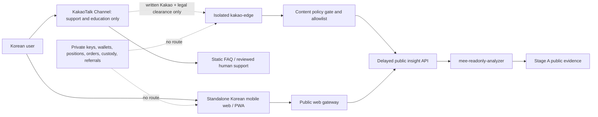

# Master Project Research

Snapshot: **2026-08-18**

[Research index](README.md) · [Kakao/Korea launch gate](#kakaotalk-south-korea-launch-gate-2026-08-18) · [Critical PMF review](PMF_CRITICAL_REVIEW.md) · [Competitive code intelligence](COMPETITIVE_CODE_INTELLIGENCE.md) · [Technical strategy](TECHNICAL_STRATEGY.md) · [Source ledger](SOURCE_LEDGER.md) · [Repository audit](REPOSITORY_CONNECTIVITY_AUDIT.md) · [Repository README](../../README.md)

## Purpose

This is the strategic source of truth for the project history, research conclusions, product thesis, falsification plan and decision log. It does **not** override runtime code, tests, accepted ADRs, security restrictions or the implementation roadmap.

The repository started from a mobile-product idea and is now deliberately narrower: first prove that trustworthy cross-venue evidence and execution economics exist; only then choose the product packaging.

## Executive verdict

The original thesis was:

> Build a Telegram Mini App for perpetual DEXs that lack an official mobile application, monetize through builder fees and referrals, and acquire users in tier-2/3 markets.

That thesis is not strong enough by itself.

The market already contains mobile perp clients, Telegram trading surfaces, unified terminals, bot frameworks, connector libraries and funding-arbitrage tools. Lighter is already exposed through Telegram Wallet. Hyperliquid has multiple mobile clients. Liquid, goodcryptoX, VOOI, Hummingbot, CCXT, Freqtrade, perp-cli and other projects cover substantial parts of the original feature list.

The surviving thesis is:

> Build a safety-first cross-venue evidence, reconciliation and paired-execution core; prove executable economics in shadow mode; then choose between internal proprietary trading, a prosumer product, a B2B execution API, or a Korean-first user surface.

The broad B2C product-market-fit hypothesis remains **unproven**. The repository must not pretend otherwise.

## Project history and pivots

### Original market selection

The first integration order was:

1. Extended;
2. Reya;
3. Ostium.

The rationale was mobile-access scarcity, low direct competition and monetization through builder/referral programs.

Technical work covered:

- Extended Starknet SNIP-12/Poseidon order signing;
- builder-fee inclusion in the signed fee amount;
- quantization and signed integer handling;
- official Python, Rust and WASM references;
- Reya EIP-712 order signatures, ABI-encoded inputs and packed nonce;
- Reya remote-configuration requirements during Evolution migration;
- Ostium contract/SDK peculiarities and RWA markets.

### Telegram pivot

The project moved from native Android/Kotlin to Telegram Mini App because of:

- lower distribution friction;
- no Play Store release dependency;
- fast frontend updates;
- direct Telegram acquisition and notifications;
- rising app-store restrictions for crypto products.

This distribution logic remains useful, but Telegram itself is not a moat.

### Hyperliquid discovery

An existing bot was already connected to Hyperliquid. It was adapted from an HTX futures grid bot and had generated more than USD 10,000 of the owner's own volume. It dynamically discovered markets including `DOGE-USDC` and `kSHIB`.

That changed Hyperliquid from a future integration into the initial live-code reference. It also introduced inherited risk:

- HTX-specific assumptions;
- grid-strategy coupling;
- unknown idempotency behavior;
- possible retry races;
- incomplete position reconciliation;
- unverified contract-multiplier handling.

The existing bot is evidence of connectivity, not evidence of a safe multi-user execution core.

### Lighter priority

Lighter became the first new venue because it offers:

- documented APIs and WebSockets;
- API keys and nonce handling;
- partner attribution;
- suitable market coverage;
- direct pairing with Hyperliquid for shadow comparison.

Lighter is an execution venue, not a sufficient product proposition. Telegram Wallet already offers Lighter perps, and other aggregators support it.

### Variational priority

Variational became strategically important because its RFQ model can create a differentiated hedge workflow. An official Python SDK exists, but API-key generation is gated and must be requested from the team.

The production rule is explicit:

- public/read-only use is allowed within documented limits;
- private trading endpoints are not reverse-engineered into production;
- full RFQ execution begins only after official access and commercial/technical terms are understood.

### Execution-company pivot

Competitor research showed that adapter count, funding dashboards, Telegram alerts and basic multi-venue portfolios are already common. The project therefore shifted from a frontend company to an execution-correctness thesis.

The critical capabilities are now:

- exact economic instrument identity;
- reproducible raw evidence;
- executable VWAP rather than last price;
- deterministic opportunity calculation;
- persistent client-order identity;
- reconciliation before retry;
- partial-fill accounting;
- bounded residual exposure;
- fail-closed unknown states;
- transparent net P&L.

## Market-fit assessment by product shape

| Product shape | Current evidence | Main weakness | Decision |
|---|---|---|---|
| Generic B2C multi-exchange terminal | Weak | Mature incumbents, trust burden, low differentiation | Do not build first |
| B2C automated arbitrage bot | Weak-to-moderate | Users want yield but do not trust key custody or execution; support and liability are high | Validate only with manual/canary scope |
| Prosumer self-hosted tool | Moderate | Smaller market, technical onboarding | Plausible early packaging |
| B2B execution API | Moderate | Crowded by VOOI, Hummingbot-derived stacks and direct venue SDKs | Viable only with measurable reliability advantage |
| Internal proprietary trading | Strongest validation path | Does not prove external willingness to pay | Use to falsify economics safely |
| Korean-first product | Unproven but possible wedge | Local acquisition, legal and trust constraints | Test landing/interviews before product UI |

### Why old projects do not prove mass demand

Multi-exchange tools have existed for years because the problem is technically real. Their longevity proves a niche, not necessarily a mass market.

Common reasons broad PMF remains weak:

- exchange users prefer official interfaces;
- professional users build or buy infrastructure privately;
- retail users overestimate arbitrage returns and underestimate operational risk;
- API-key onboarding is high friction;
- custody and secret-storage trust is difficult;
- spreads disappear after fees, slippage and latency;
- capital must be pre-positioned on multiple venues;
- support burden is high relative to subscription willingness;
- exchange APIs and product rules change continuously;
- profitable strategies attract competition and decay.

The project must not infer demand from crypto derivatives volume alone.

## Competitive conclusions

### Highest code-level threats

#### VOOI

VOOI exposes a unified perpetual execution layer and public examples covering funding workflows, Hyperliquid, Lighter, Telegram signals, event streams and REST reconciliation. It is the closest direct infrastructure competitor.

#### hypurrquant/perp-cli

perp-cli publicly demonstrates multi-DEX execution, funding arbitrage, portfolio aggregation, transfers, rebalance, alerts, risk checks and a large test surface. It is the strongest open architectural benchmark.

#### Hummingbot

Hummingbot proves the maturity of connector and strategy infrastructure, but its public issue history also proves how difficult order-state correctness remains. A failure event followed by a late fill and blind retry can create duplicate closes or reversed exposure.

#### goodcryptoX and Liquid

goodcryptoX combines CEX and DEX access, bots and portfolio features. Liquid is a funded mobile multi-perp aggregator. Their closed execution cores limit code inspection but make the generic terminal proposition unattractive.

#### Wallet in Telegram + Lighter

This removes “Lighter inside Telegram” as a differentiated claim.

### What is commoditized

- public market-data ingestion;
- basic REST/WebSocket adapters;
- funding-rate dashboards;
- Telegram alerts;
- grid/DCA/TWAP;
- generic portfolio aggregation;
- standard CEX connectivity;
- simple opportunity ranking.

### What remains difficult

- authoritative order-state convergence;
- duplicate prevention under asynchronous events;
- residual-delta hedging;
- exact contract equivalence across venues;
- real execution-capacity measurement;
- capital-rebalance economics;
- trustworthy user-key isolation;
- a local distribution wedge with measurable retained volume.

## South Korea thesis

South Korean app-store restrictions on foreign crypto exchanges create distribution friction, but they do not automatically create permission or product-market fit for a Telegram replacement.

The useful thesis is not “bypass blocked exchange apps”. It is:

- Korean-language comparison and risk education;
- venue eligibility controls;
- cross-venue funding/basis analytics;
- a controlled execution surface for supported users and venues.

The Korea wedge remains speculative until validated through:

- Korean interviews;
- landing-page conversion;
- account-connection completion;
- willingness to allocate real capital;
- retained trading volume;
- legal review of derivatives marketing and intermediation.

## KakaoTalk South Korea launch gate (2026-08-18)

**Status:** `RESEARCH_GATE / NO_GO_DIRECT_KAKAO_CRYPTO`

**Scope:** product, platform, security, privacy, regulatory and launch analysis. This section is not legal advice and does not authorize runtime work, a Kakao Developers application, Korean marketing, private venue access, referrals, custody or trading.

### Executive decision

A Telegram-style trading mini-app inside KakaoTalk is not a viable default plan.

Kakao provides channels, channel chatbots, external chatbot skills, Kakao Login/OIDC, Kakao Sync, Talk Share/Message and web-to-channel bridges. The reviewed public documentation does not expose a general third-party mini-app runtime equivalent to Telegram Mini Apps. That is an inference from the documented product surface, not a quoted Kakao promise.

More importantly, Kakao Developers' operating policy expressly prohibits virtual-asset services that provide transactions, storage or deposits. KakaoTalk's investment-related policy also prohibits promotion of unregistered virtual-asset exchanges and inducement or promotion of virtual-asset futures not permitted by applicable law. A direct Kakao integration for exchange onboarding, API-key connection, order placement, custody, deposits, withdrawals, copy trading, personalized signals or referral funnels is therefore `NO_GO` unless Kakao provides an explicit written classification that covers the exact service and Korean counsel separately clears the model.

The recommended first Korean MVP is a **standalone Korean mobile web/PWA with no Kakao SDK or Kakao Login**, limited to delayed public evidence, market-structure education and non-personalized read-only comparisons. A KakaoTalk Channel may be investigated only as a separate support/education/status surface after written Kakao clearance. Stage A remains unchanged.

### Targeting premise

The project must not classify Korean users as “vulnerable” because of politics or design acquisition around exploiting perceived instability. That premise is both ethically weak and operationally dangerous. Market selection must use measurable demand, legal eligibility, retention, support burden and unit economics.

Permissible research questions include:

- Do Korean technical traders need independent cross-venue evidence?
- Can they understand and trust delayed, reproducible read-only outputs?
- Will they join interviews or a waitlist without exchange incentives?
- Which workflows are lawful and platform-compatible?
- Does a Korean surface improve retention enough to justify localization and compliance cost?

### Repository boundary

This research does not change the accepted Stage A runtime:

- `mee-public-capture` remains credential-free and public-only;
- `mee-readonly-analyzer` remains deterministic and read-only;
- no Kakao package, private adapter, order route, user key, wallet, deposit, withdrawal, referral or personalized recommendation is authorized;
- any future Korean presentation layer must consume a deliberately reduced public insight contract, not the engine's private/execution interfaces;
- runtime code, tests, accepted ADRs, `SECURITY.md` and `docs/ROADMAP.md` continue to outrank this research.

### What Kakao actually provides

| Capability | What it does | Important constraints | MEE decision |
|---|---|---|---|
| KakaoTalk Channel | Brand/support presence and user chat | Business verification and category review may apply; channel use does not override content or financial policies | Conditional support/education only after written clearance |
| Chatbot Manager / Open Builder-style chatbot | Conversational bot attached to a KakaoTalk Channel | External skills call an API; ordinary skill response SLA is 5 seconds; AI callback is valid for 1 minute and one use, with separate review | Conditional FAQ/status surface; no trading or personalized investment output |
| Channel JavaScript bridge | Opens add-channel or chat flows from a website | Bridge to a channel, not an embedded application runtime | Optional only after channel clearance |
| Kakao Login / OIDC | OAuth-based identity and optional ID token | Redirect URI, client secret, state/nonce, token lifecycle and unlink webhook handling required | Technically possible, but `NO_GO` for the crypto-facing service without explicit Kakao approval |
| Kakao Sync | Kakao Login plus streamlined signup/channel relationship | Requires Biz App, Business Channel and review | Not an MVP dependency |
| KakaoTalk Share | User initiates sharing into KakaoTalk | User-to-user sharing, templates, quotas and content policy; not service broadcast | Excluded from MVP |
| KakaoTalk Message | Messages between users of the same service | Permission review, Kakao Login, consent and recipient limits; services cannot treat it as unrestricted push | Excluded from MVP |
| Paid API / Biz Wallet | Pays Kakao API overage charges | This is API billing, not a merchant checkout or KakaoPay integration | Do not confuse with product payments |
| Merchant payment / KakaoPay | Separate commercial product and onboarding | Public Kakao Developers paid-API docs do not establish eligibility for an overseas crypto service | Excluded pending separate written commercial approval |
| General mini-app runtime | Telegram-like arbitrary web app hosted inside messenger | No such general runtime was identified in the reviewed official product catalog | Do not plan around it |

### Kakao platform hard stops

The following are blocking unless Kakao gives explicit written approval for the exact service, content and flow:

1. Any Kakao Developers app that provides virtual-asset transactions, storage or deposits.
2. Exchange account creation, exchange API-key connection, wallet connection, deposits, withdrawals or order placement from Kakao.
3. Personalized buy/sell/funding recommendations, copy trading, “AI auto trading,” leading rooms or interactive investment advice.
4. Promotion, registration funnels or deep links for an exchange whose exact legal entity and KoFIU status have not been verified.
5. Promotion or inducement of virtual-asset futures where legal permissibility is unresolved.
6. Using Kakao mainly as a redirect shell to an external trading service.
7. Return guarantees, “risk-free” claims, principal protection, guaranteed yield or urgency/scarcity manipulation.
8. Claims that MEE is affiliated with, approved by or partnered with Kakao without a written agreement.

Kakao may block an app or account for policy violations. The English policy is informational; the Korean version controls in a conflict. Product and legal review must use the Korean text before submission.

### Eligibility and onboarding dependencies

Kakao Developers documents the following business paths:

- a Korean business registers its Korean business registration number;
- an overseas business registers a D-U-N-S number for Biz App conversion;
- an individual can complete identity verification and obtain an individual Biz App, but an individual Biz App cannot connect to a Business Channel;
- connecting an app to a KakaoTalk Channel requires the same business operator and matching business information on the Biz App and Business Channel;
- Business Channel review is stated as approximately 3–5 business days, but that estimate does not include category disputes, foreign-entity ambiguity or crypto-policy escalation.

The public documentation does not establish a dependable foreign Business Channel path for this category. Before implementation, the owner must obtain a written Kakao/DevTalk answer containing the app category, exact screenshots, data fields, public-only limitation, absence of trading and planned outbound links. Silence, a generic support response or successful account creation is not approval.

### Kakao Login security requirements if the gate ever opens

Kakao Login is not part of the recommended MVP. If Kakao later approves the exact service, the minimum design is:

- authorization-code flow handled server-side;
- exact allowlisted HTTPS redirect URIs;
- client secret enabled and kept server-side;
- `state` for request correlation/CSRF defense;
- OIDC `nonce` when ID tokens are used;
- short-lived application sessions with rotation and revocation;
- no Kakao token, admin key or venue credential in browser storage;
- Admin key restricted to dedicated server IPs and API scopes;
- unlink webhook verification using the primary Admin key and `app_id`;
- immediate `200 OK` response to unlink within 3 seconds, with deletion/deactivation completed asynchronously and auditable;
- account-status webhook validation, replay protection and deactivation monitoring;
- key rotation runbook and incident-response kill switch.

A technically correct OAuth implementation does not cure a prohibited business category.

### South Korean crypto and financial perimeter

#### VASP registration and foreign targeting

Korean rules require a VASP to register with KoFIU before operating. Official FSC guidance describes VASPs broadly to include trading, exchange, transfer, safekeeping/administration, digital-wallet services, intermediation and brokerage.

KoFIU's public site stated on 2026-06-30 that 28 VASPs were registered and warned that, other than those registered entities, services targeting Korean residents may be unregistered/illegal. Historic enforcement against foreign VASPs treated Korean-language websites, Korean-targeted promotions and Korean-compatible purchase methods as evidence of targeting.

MEE must therefore distinguish sharply between:

- a public analytics publisher that does not intermediate a transaction; and
- a service that routes users, credentials, orders, wallets, deposits or incentives to a venue.

The second category may trigger VASP, financial-promotion, intermediation and platform risks. The exact entity operating Hyperliquid or Lighter was not verified against the current KoFIU spreadsheet in this research pass. Until an exact legal-entity match and Korean legal memorandum exist, Korean-facing exchange promotion, signup links, referrals, builder fees and trading links remain off.

#### Virtual Asset User Protection Act

The Act on the Protection of Virtual Asset Users took effect on 2024-07-19. It covers user-asset protection, unfair trading, supervision and sanctions. Registered VASPs must separate user deposits and assets, maintain custody of the assets owed to users, and comply with cold-storage and incident-protection requirements. MEE's no-custody, no-deposit Stage A boundary avoids assuming these duties, but a later hosted trading/custody product would require a new legal and architecture decision.

#### Travel Rule and the 2026-08-20 change window

The existing travel rule applies to VASP-to-VASP transfers of KRW 1 million or more and requires originator/beneficiary information with five-year retention. FSC proposed 2026 changes expanding obligations, including lower-value transfers and conditions for domestic-to-overseas VASP or wallet transfers, with an intended effective date of 2026-08-20.

Because this snapshot is dated 2026-08-18, no launch decision may rely on the pre-2026-08-20 position. Counsel must re-check the final enacted decree, subordinate regulations and KoFIU guidance after they are effective.

#### Investment advice, promotion and derivatives

A read-only chart is not automatically safe merely because it does not place an order. Risk rises when the service:

- ranks assets or venues for a specific user;
- states that a user should enter, exit or copy a position;
- sends time-sensitive alerts framed as action recommendations;
- receives compensation tied to exchange signup or volume;
- promotes derivatives or an overseas platform to Korean residents;
- operates interactive rooms that function as investment-leading rooms.

The MVP must publish methodology, timestamp, data freshness, limitations and non-personalized educational context. It must not use “not financial advice” as a substitute for actual product boundaries.

#### Privacy and cross-border processing

Korean PIPA regulates overseas provision, outsourced processing and storage of personal information. A lawful transfer basis, required disclosures, data-subject handling, security safeguards and contractual protections with overseas processors must be documented. The enforcement decree requires security, complaint/dispute and other protection measures to be agreed with the overseas recipient.

A foreign controller may need a Korean domestic representative when current statutory thresholds or a PIPC order apply. Current public rules include thresholds based on total revenue, Korean data-subject volume or a PIPC determination. The project is unlikely to meet the scale thresholds at MVP, but counsel must verify the current rule and the amendments scheduled for 2026-08-20 and 2026-09-11 before production.

Data minimization for the recommended MVP:

- anonymous browsing by default;
- no Kakao ID;
- no venue account ID, API key, wallet address, balance, position, P&L or order history;
- no precise behavioral profile used for investment personalization;
- separate consent for waitlist/interview contact data;
- explicit retention schedule and deletion path;
- region and processor inventory;
- Korean privacy notice reviewed by a native legal reviewer;
- no advertising pixel until its lawful basis and cross-border disclosures are approved.

#### Age, consumer, tax and payments

Use a conservative `19+` product policy for Korean discovery until counsel confirms the exact age treatment for the final feature set. This is a product control, not a claim that one universal statutory age applies to every virtual-asset or analytics activity.

Before charging Korean users, obtain separate advice on electronic commerce, subscription cancellation/refunds, consumer disclosures, Korean VAT/digital-service obligations, invoicing and permanent-establishment/corporate-nexus risk. Do not use Kakao's Biz Wallet as evidence that merchant payments are approved; it pays Kakao API charges.

### Allowed and forbidden information surfaces

| Data or action | Standalone PWA | Kakao Channel/chatbot | Reason |
|---|---:|---:|---|
| Delayed public order-book evidence | Conditional | Conditional, summarized | Must remain public, non-personalized and policy-cleared |
| Methodology and freshness explanation | Yes | Conditional | Education/status use |
| Service incident/status message | Yes | Conditional | Operational, not investment advice |
| Generic market-risk education | Yes | Conditional | Must avoid inducement or guarantees |
| Real-time personalized opportunity | No | No | Advice/promotion and user-harm risk |
| Venue signup or referral link | No | No | Registration/targeting/compensation risk |
| Wallet or exchange API key | No | No | Security, VASP and Kakao category risk |
| Balance, position, P&L or order history | No for MVP | No | Personal/sensitive financial context and leakage risk |
| Order, cancel, deposit or withdrawal | No | No | Outside Stage A; direct Kakao category prohibition |
| Copy trading or automated execution | No | No | Platform and legal hard stop |

### Architecture options

#### Option A — standalone Korean mobile web/PWA

**Verdict: recommended discovery MVP.**

- no Kakao SDK, Kakao Login or KakaoTalk dependency;
- anonymous read-only access by default;
- delayed public evidence from a reduced API contract;
- Korean methodology, freshness, uncertainty and risk explanations;
- optional waitlist/interview form stored separately from market usage;
- no venue links, referrals, account connection, keys, wallets or orders;
- age/interview eligibility control;
- feature flag to disable Korea-specific pages immediately.

This is the fastest architecture because it tests demand without asking Kakao to approve a prohibited crypto application. It still requires Korean legal/privacy/content review because Korean localization can evidence deliberate market targeting.

#### Option B — general KakaoTalk Channel for support and education

**Verdict: conditional, not required for MVP.**

- channel contains static service description, methodology, risk education and support hours;
- human support uses a closed answer playbook;
- no signals, recommendations, exchange links, referrals or trading instructions;
- no claim of Kakao approval;
- no user financial data in chat;
- launch only after written Kakao category classification and legal review.

A channel account existing successfully is not evidence that its content is permitted.

#### Option C — Business Channel chatbot with isolated public insight edge

**Verdict: conditional future experiment.**

Prerequisites: overseas business/D-U-N-S path confirmed, Business Channel eligibility confirmed, written Kakao approval, Korean legal memorandum and approved content taxonomy.

The chatbot must call a separate `kakao-edge` service. That service may return only allowlisted, delayed, non-personalized public facts. It must have no network route, credential, import or secret that can reach private venue adapters or execution code. Slow jobs must use the reviewed callback model; no long-running request may depend on exceeding Kakao's ordinary skill timeout.

#### Option D — Kakao Login linked dashboard

**Verdict: `NO_GO` until explicit written exception/approval.**

Kakao Login is technically implementable, but linking Kakao identity to a crypto-facing dashboard increases platform-category, privacy and account-blocking risk while adding little value to the read-only MVP. Use anonymous access or email/passkey outside Kakao instead. Reconsider only if Kakao approves the exact application and counsel clears the data flow.

#### Direct trading bot, custody or exchange mini-app

**Verdict: rejected.**

This conflicts with Stage A and the reviewed Kakao policies. It is not an implementation option in the current program.

### Recommended architecture



Required isolation:

- public insight API has a versioned, minimal response schema;
- responses carry source time, receive time, freshness, method version and uncertainty/insufficient-evidence reason;
- CDN/cache delay is explicit and configurable;
- `kakao-edge` accepts only fixed intents and allowlisted identifiers;
- no free-form model may invent prices, returns, legal claims or recommendations;
- every outbound content template is versioned, Korean-reviewed and auditable;
- a policy kill switch disables the entire Kakao path without affecting Stage A collection;
- a Korea kill switch removes localized acquisition and signup surfaces;
- logs exclude message bodies where possible and never contain secrets or user financial data.

### Decision matrix

| Option | Platform fit | Legal/platform risk | Delivery estimate after approvals | Decision |
|---|---:|---:|---:|---|
| Standalone Korean read-only PWA | High | Medium | 10–15 working days for a narrow MVP | `GO_DISCOVERY`, subject to legal/privacy/content review |
| General KakaoTalk Channel | Medium | Medium–High | 3–7 working days plus unknown policy response | Conditional support-only experiment |
| Business Channel chatbot | Medium | High | 3–5 business-day channel review plus 2–4 weeks integration; foreign/category review may be longer | Conditional after written clearances |
| Kakao Login dashboard | Low for MVP | Very High | Technically 1–2 weeks, but approval risk dominates | `NO_GO` |
| Direct trading/custody/referral bot | Superficially attractive | Critical | Not applicable | Rejected |

Estimates are engineering ranges, not commitments. Kakao and regulatory review duration is not controllable.

### Content policy taxonomy

#### Green — eligible for counsel/Kakao review

- how evidence is collected and timestamped;
- what stale or insufficient evidence means;
- generic definitions of basis, funding, slippage and liquidation risk;
- service uptime and incident status;
- non-personalized, delayed public statistics with methodology;
- interview recruitment without investment inducement.

#### Amber — disabled until written approval

- named venue comparisons;
- real-time or near-real-time spreads;
- rankings that could be interpreted as recommendations;
- links to venue documentation;
- paid subscription;
- Kakao Login;
- behavioral personalization;
- outbound notifications that can influence immediate trades.

#### Red — prohibited in the current scope

- exchange signup/referral/builder-fee links;
- futures promotion;
- buy/sell/long/short instructions;
- personalized opportunity alerts;
- copy trading or AI trading;
- API keys, wallet connection, balances, positions or P&L;
- order placement, cancellation, deposits, withdrawals or custody;
- guaranteed return, principal protection, urgency or “zero risk” claims.

### Risk register

| Risk | Probability | Impact | Default control | Kill condition |
|---|---:|---:|---|---|
| Kakao classifies the service as prohibited virtual-asset use | High | Critical | No Kakao Developers integration; obtain written classification | Any rejection, warning or ambiguous escalation response |
| Korean-facing flow is treated as unregistered VASP targeting/intermediation | Medium–High | Critical | Public-only PWA, no transaction routing, Korean legal memo | Counsel cannot give a bounded written scope |
| Hyperliquid/Lighter exact entities are not registered/eligible | High until verified | Critical | No promotion, links, referral or trading | No exact current registry and entity match |
| Content is treated as investment advice or futures promotion | Medium | High | Non-personalized delayed evidence, reviewed taxonomy | Kakao/counsel rejects named venue or signal content |
| PIPA cross-border transfer failure | Medium | High | Minimize data, map processors, lawful basis, contracts and deletion | Unknown processor/transfer basis or unresolved deletion path |
| Foreign Business Channel path is unavailable | Medium | Medium | PWA does not depend on Kakao | Kakao cannot confirm eligibility in writing |
| Kakao account/app is blocked | Medium | High | Separate business account, no dependency, immediate channel kill switch | Any enforcement notice or repeated moderation event |
| User financial data leaks through chat/logs | Low if design holds | Critical | Never collect it; schema and log denylist | Any key, wallet, balance, position or order data observed |
| Localization creates misleading claims | Medium | High | Native Korean product/legal review and versioned templates | Unreviewed translation reaches production |
| Regulatory change invalidates the gate | High around 2026-08-20/09-11 | High | Dated legal re-review before launch | Final rules differ materially from assumptions |
| Demand is political/news-driven but not retained | Medium | Medium | Interviews, cohort retention and no paid build first | No repeat use or interview conversion after test window |

### Unresolved verification register

| ID | Question | Required evidence | Owner | Default while unresolved |
|---|---|---|---|---|
| KR-KAKAO-001 | Will Kakao permit a public-only market-evidence service at all? | Written Kakao/DevTalk answer tied to exact screenshots, content and flows | Product/legal | `NO_GO_KAKAO` |
| KR-KAKAO-002 | Can the overseas entity obtain and connect a Business Channel? | Written Kakao confirmation of D-U-N-S/entity/channel path | Operations | No Business Channel build |
| KR-KAKAO-003 | Is support/education content with named venues allowed? | Approved content matrix from Kakao and counsel | Content/legal | No named venue content in Kakao |
| KR-VASP-001 | What exact entity operates each promoted venue, and is it registered/eligible? | Current KoFIU spreadsheet match plus legal-entity evidence | Legal/compliance | No links, referrals or trading |
| KR-VASP-002 | Does the PWA's analytics/CTA model constitute VASP intermediation or targeted promotion? | Written Korean legal memorandum | Legal | Public information only; no transaction CTA |
| KR-ADVICE-001 | When do ranking/alerts become regulated advice or prohibited promotion? | Feature-by-feature Korean legal memorandum | Product/legal | No ranking, personalization or alerts |
| KR-PIPA-001 | What transfer basis and notices cover every processor? | Data map, DPA/SCC-equivalent terms, Korean privacy review | Privacy/security | Anonymous-only MVP; no tracking pixels |
| KR-PIPA-002 | Is a domestic representative required? | Current threshold analysis after 2026-09-11 changes | Privacy/legal | Recheck before production |
| KR-TAX-001 | What VAT, e-commerce, refund and invoice rules apply? | Korean tax/consumer memorandum | Finance/legal | No paid Korean subscription |
| KR-AGE-001 | What age controls are required for the final content/features? | Counsel-approved age policy | Legal/product | Conservative 19+ discovery policy |
| KR-TERMS-001 | Do venue terms allow Korean users and a third-party analytics/integration surface? | Current venue terms and written venue confirmation where necessary | Partnerships/legal | No venue connection or promotion |
| KR-PMF-001 | Is there retained demand independent of temporary political/news conditions? | Interviews, waitlist quality, repeat-use and cohort data | Product | No broad UI or paid acquisition commitment |

### Accounts and dependencies

For Option A, the minimum stack is deliberately small:

- domain and Korean-language PWA deployment;
- CDN/WAF and rate limiting;
- anonymous analytics configured only after privacy review;
- public insight gateway separated from engine internals;
- Korean legal/privacy/content reviewers;
- native Korean copy review;
- incident, takedown and feature-flag controls.

Only for a later cleared Kakao experiment:

- Kakao Account dedicated to the business;
- Kakao Developers app;
- verified overseas business and D-U-N-S data;
- KakaoTalk Channel and, if eligible, Business Channel;
- Chatbot Manager bot and reviewed skill/callback endpoints;
- separate `kakao-edge` service and secrets;
- written Kakao approval record stored outside the repository with a non-secret evidence reference;
- operational owner for moderation, complaints and account notices.

### Staged launch plan

#### Gate 0 — evidence closure

- obtain Korean legal opinions for VASP/intermediation, advice/promotion, PIPA, age, consumer and tax boundaries;
- re-check the final 2026-08-20 AML/VASP rules and the 2026-09-11 PIPA changes;
- verify exact current KoFIU and venue-entity status;
- submit a written Kakao classification request with exact mockups;
- run Korean interviews without exchange promotion or trading CTAs.

#### Gate 1 — standalone discovery MVP

- ship a Korean mobile web/PWA with anonymous access;
- expose delayed public evidence only;
- show methodology, timestamps, freshness and insufficiency reasons;
- collect only separate, consented interview/waitlist contact data;
- instrument retention and comprehension, not trading conversion;
- keep a one-action Korea shutdown switch.

#### Gate 2 — controlled support surface

Only if Gate 0 produces written clearance:

- create a KakaoTalk Channel with reviewed static content;
- train support on a fixed non-advisory answer set;
- prohibit account, wallet, order and recommendation discussions;
- monitor reports, moderation and complaint patterns;
- do not add Kakao Login, messages or chatbot yet.

#### Gate 3 — chatbot experiment

Only after separate Kakao approval and legal review:

- connect the Business Channel and chatbot;
- deploy isolated `kakao-edge` with allowlisted intents;
- return delayed public facts and service status only;
- validate timeout/callback, webhook, logging and kill-switch behavior;
- run a small closed cohort with no paid acquisition.

#### Gate 4 — identity or monetization reconsideration

Kakao Login, paid Korean subscriptions, named venue promotion, referral/builder economics and any account-connected observer require new ADR/roadmap/security decisions. They are not incremental toggles.

### Launch checklist

- [ ] Korean counsel has signed the VASP/intermediation scope memo.
- [ ] Korean counsel has signed the investment-advice/financial-promotion content matrix.
- [ ] Final rules effective 2026-08-20 have been re-checked against the design.
- [ ] PIPA changes effective 2026-09-11 have been re-checked before production.
- [ ] The current KoFIU registry spreadsheet has been downloaded and exact venue entities verified.
- [ ] Venue terms and Korean geographic eligibility have been verified.
- [ ] Kakao has answered the exact service-classification request in writing.
- [ ] Foreign Biz App/Business Channel eligibility is documented if Kakao is in scope.
- [ ] Root README, docs index, research index, source ledger and connectivity graph point to this gate.
- [ ] The PWA uses no Kakao SDK or Kakao Login for Gate 1.
- [ ] Public insight API has a versioned minimal schema and explicit delay.
- [ ] No private adapter, signer, order, wallet, custody or withdrawal path is reachable.
- [ ] No exchange signup, referral, builder-fee or trading CTA exists.
- [ ] No personalized alert, ranking or recommendation exists.
- [ ] Korean copy has native product and legal review.
- [ ] Privacy notice, transfer basis, processor list, retention and deletion are documented.
- [ ] Waitlist/interview data is separated from market-usage data.
- [ ] No tracking or advertising pixel is enabled without approval.
- [ ] Conservative age control is active.
- [ ] Support scripts prohibit investment advice and user financial data.
- [ ] Logs are tested for API keys, wallet addresses, balances, positions, P&L and message bodies.
- [ ] Korea and Kakao feature flags fail closed.
- [ ] Incident, complaint, moderation, takedown and regulator-contact runbooks exist.
- [ ] Metrics measure comprehension, repeat use, interview quality and retention.
- [ ] A kill review is scheduled after the first bounded cohort.

### Kill criteria specific to Korea/Kakao

Stop or remove the Korean/Kakao surface if any of the following occurs:

1. Kakao rejects the category, requests removal or cannot give a bounded written classification.
2. Counsel cannot distinguish the service from VASP intermediation or prohibited promotion.
3. A promoted venue cannot be matched to a currently eligible legal entity.
4. Users repeatedly request execution, custody, guaranteed returns or personalized recommendations as the core value.
5. The only meaningful conversion comes from referral/trading CTAs that are outside the approved scope.
6. Any secret, wallet, balance, position, P&L or order data enters Kakao or the public edge.
7. Korean localization produces complaints or moderation events suggesting misleading investment inducement.
8. Retention is weak after the news/political acquisition spike ends.
9. Compliance, support and localization cost exceeds conservative retained revenue.
10. Regulatory changes invalidate the legal memorandum or data-transfer basis.

### Primary sources checked 2026-08-18

Kakao platform and policy:

- https://developers.kakao.com/terms/en/site-policies-20250304
- https://talksafety.kakao.com/en/policy/commercial/investmentadvising
- https://developers.kakao.com/docs/en/app-setting/app
- https://developers.kakao.com/docs/en/kakaotalk-channel/common
- https://developers.kakao.com/docs/en/kakaologin/prerequisite
- https://developers.kakao.com/docs/en/getting-started/security-guideline
- https://developers.kakao.com/docs/en/kakaologin/callback
- https://developers.kakao.com/docs/en/kakaotalk-message/common
- https://developers.kakao.com/docs/en/getting-started/quota
- https://developers.kakao.com/docs/en/app-setting/paid-api
- https://kakaobusiness.gitbook.io/main/tool/chatbot/start/overview
- https://kakaobusiness.gitbook.io/main/tool/chatbot/skill_guide/ai_chatbot_callback_guide

Korean regulatory and privacy sources:

- https://www.kofiu.go.kr/kor/notification/notice.do
- https://www.fsc.go.kr/eng/pr010101/78319
- https://www.fsc.go.kr/eng/pr010101/75563
- https://www.fsc.go.kr/eng/pr010101/77580
- https://www.fsc.go.kr/eng/pr010101/82683
- https://www.fsc.go.kr/eng/pr010101/82534
- https://www.fsc.go.kr/eng/pr010101/86597
- https://www.law.go.kr/lsInfoP.do?lsiSeq=283365&viewCls=lsRvsDocInfoR
- https://www.law.go.kr/LSW/lsLinkCommonInfo.do?chrClsCd=010202&lsJoLnkSeq=1029334869
- https://www.law.go.kr/LSW/lsLinkCommonInfo.do?chrClsCd=010202&lsJoLnkSeq=1029335609
- https://law.go.kr/LSW/lsLinkCommonInfo.do?chrClsCd=010202&lspttninfSeq=182203
- https://www.law.go.kr/LSW/lsInfoP.do?lsiSeq=283839&viewCls=lsRvsDocInfoR

Source interpretation and confidence are also recorded in [SOURCE_LEDGER.md](SOURCE_LEDGER.md). Time-sensitive claims must be re-checked at launch.

## Monetization assessment

Potential revenue sources include:

- Lighter partner attribution;
- Hyperliquid builder fees;
- venue referral programs;
- CEX broker/affiliate programs;
- subscription;
- B2B API contracts;
- managed or profit-share models only after legal review.

The economics are fragile.

A one-basis-point fee produces only USD 10 per USD 100,000 of eligible volume. Revenue must be modeled after:

- user fee discounts;
- venue eligibility;
- maker/taker mix;
- entry and exit costs;
- acquisition cost;
- support;
- infrastructure;
- strategy decay;
- retained volume duration.

Referral points or future-token expectations are optional upside, not base-case cash flow.

## Surviving technical architecture

The accepted runtime direction is the Python modular monolith described in [ADR-0001](../adr/0001-python-universal-arbitrage-core.md).

Core flow:

```text
raw venue evidence
→ normalized economic identity
→ fresh executable market state
→ reproducible opportunity
→ risk reservation
→ persisted paired-execution saga
→ private event evidence
→ REST reconciliation
→ residual hedge or manual intervention
→ realized net P&L
```

### Non-negotiable invariants

1. Money and quantities use exact decimal/fixed-point representations.
2. Ticker equality never proves hedge equivalence.
3. HTTP acceptance never proves a fill.
4. Unknown outcomes block blind retry.
5. Private events wake reconciliation; authoritative venue state resolves ambiguity.
6. Residual hedge uses authoritative cumulative fills.
7. Orders are cancelled only through exact ownership records.
8. Every signal is reproducible from stored evidence.
9. Missing or stale data produces no opportunity.
10. Research claims never imply a runtime feature exists.

## Build versus buy

### Reuse or buy

- official venue SDKs;
- public market-data clients;
- generic CEX adapters where their semantics are verified;
- charting and Telegram UI components;
- standard observability and persistence libraries;
- competitor code as a benchmark where licenses permit.

### Own

- economic instrument registry;
- evidence schema;
- opportunity reproducibility;
- paired-execution state machine;
- order identity and idempotency;
- reconciliation;
- residual hedge policy;
- risk reservation;
- fee/P&L attribution;
- venue-quality dataset.

### VOOI shortcut decision

VOOI may be used to benchmark response shapes, venue coverage and product assumptions. It should not become the only production dependency because that would expose order flow, add lock-in and allow the nearest competitor to own the core execution relationship.

## Validation sequence

### Phase A: evidence and mapping

- collect Hyperliquid and Lighter public data;
- validate sequence, freshness and crossed-book rules;
- map economic instruments explicitly;
- verify `DOGE` and the `kSHIB` multiplier/equivalence;
- calculate full-depth executable VWAP;
- store reproducible observations.

### Phase B: shadow economics

For each opportunity, calculate:

- gross spread;
- entry fees;
- expected exit fees;
- builder/partner fees;
- funding-period normalization;
- slippage;
- latency decay;
- executable capacity;
- rebalance cost.

Measure opportunity survival at 100 ms, 300 ms, 500 ms, 1 second and 5 seconds.

### Phase C: single-venue safety

Before paired execution:

- persistent client-order IDs;
- testnet or minimal-size order lifecycle;
- private fill events;
- REST reconciliation;
- restart recovery;
- timeout and late-fill fault injection;
- duplicate prevention.

### Phase D: paired canary

- manual confirmation;
- minimal capital;
- one asset at a time;
- explicit unhedged limit;
- residual hedge;
- kill switch;
- full realized P&L.

### Phase E: packaging validation

Only after economics and safety are proven:

- internal strategy;
- prosumer CLI/self-hosted service;
- Korean closed beta;
- B2B API discussions;
- Telegram Mini App.

## Kill criteria

The project should be stopped, paused or substantially repurposed if any of the following hold:

1. Shadow opportunities are not profitable after realistic fees, slippage, latency and exits.
2. Positive edge exists only at zero latency or on last-price comparisons.
3. Executable capacity is too small to support either proprietary returns or customer revenue.
4. Lighter/Hyperliquid mapping cannot be made deterministic for a useful universe.
5. Unknown-order outcomes cannot be reconciled safely.
6. Residual exposure cannot be bounded within the planned risk budget.
7. Korean interviews and landing tests show interest but no account connection or capital allocation.
8. Customer acquisition cost exceeds conservative retained gross revenue.
9. Users demand custody, withdrawals or guarantees that make the risk/legal model unacceptable.
10. Variational access or another supposed differentiator is available equally to larger incumbents before validation.

## Thirty-day plan

- complete repository truth and navigation cleanup;
- audit the inherited Hyperliquid bot assumptions;
- verify `kSHIB` economic identity;
- finish Lighter public-data mapping;
- run deterministic public-data collectors;
- produce shadow opportunity and decay reports;
- contact Variational for official access;
- run at least ten customer-discovery interviews across prosumer, B2B and Korean segments;
- publish a no-code Korean landing test;
- make no consumer UI commitment.

## Ninety-day plan

Conditional on passing the shadow gate:

- prove single-venue order reconciliation;
- run minimal-size live canaries;
- implement paired saga and residual hedge;
- add Bybit only after the same reconciliation contract is satisfied;
- compare internal proprietary, prosumer and B2B packaging with real usage evidence;
- build Telegram UI only for a validated workflow.

## Decision log

### D-001 — Telegram is a client, not the core

Accepted. The engine must remain usable through CLI/API/web without Telegram.

### D-002 — Python is the active runtime direction

Accepted in ADR-0001. Go remains reference/legacy until explicitly removed after Python parity.

### D-003 — Hyperliquid and Lighter are the first evidence pair

Accepted. This does not authorize live trading.

### D-004 — Variational requires official access

Accepted. No unsupported production reverse engineering.

### D-005 — Shadow economics precede product development

Accepted. No broad B2C build before the falsification gate.

### D-006 — No automatic withdrawal permission in the initial system

Accepted. Trading credentials must remain limited and isolated.

### D-007 — Generic multi-exchange terminal thesis is rejected

Accepted. Any future product must be justified by execution advantage or a measured distribution wedge.

### D-008 — Direct Kakao crypto application is rejected

Accepted as a dated research gate. Kakao Developers integration for virtual-asset transactions, storage, deposits, account connection, trading, custody, personalized advice, futures promotion or referral acquisition is not authorized.

### D-009 — Korean discovery starts outside Kakao

Accepted as the recommended validation path. A standalone Korean mobile web/PWA may test delayed public evidence and education only after legal/privacy/content review; Kakao remains an optional, separately approved support surface.

## Open questions

- Does executable edge survive Lighter account latency and both-leg exit costs?
- What exact economic unit does `kSHIB` represent, and which venue instruments are truly hedge-equivalent?
- Which packaging produces the first real willingness to pay: proprietary, prosumer, B2B or Korean-first?
- Can user keys be isolated with acceptable operational and legal risk?
- Does Variational provide a sufficiently differentiated RFQ workflow?
- How much capital must be fragmented across venues to earn meaningful net returns?
- Are builder/partner fees compatible with arbitrage economics?
- What legal classification applies to automated strategies and Korean derivatives marketing?
- Will Kakao approve any public-only MEE evidence/support surface in writing?
- Can exact venue entities be matched to current KoFIU and Korean eligibility requirements?
- Does Korean demand persist without exchange referrals, trading CTAs or political/news spikes?

## Repository truth policy

- Current implementation truth: code, tests, ADRs, [ROADMAP](../ROADMAP.md), [SECURITY](../../SECURITY.md).
- Strategic truth: this file and the other documents in `docs/research/`.
- Historical material: `docs/archive/` and explicitly marked legacy files.
- A research statement about a venue or feature never means that the repository implements it.
- Any document that changes product direction must link here and to the active ADR/roadmap.
