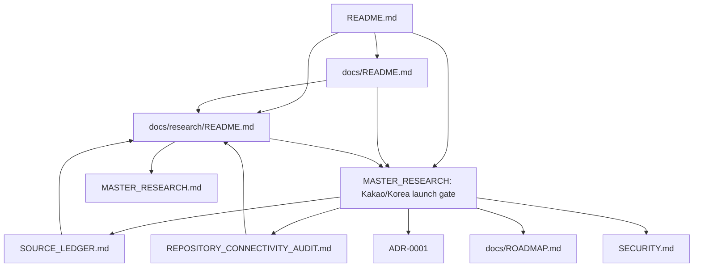

# Repository Connectivity and Dead-Entity Audit

Snapshot: **2026-08-18**

[Research index](README.md) · [Master research](MASTER_RESEARCH.md) · [Kakao/Korea launch gate](MASTER_RESEARCH.md#kakaotalk-south-korea-launch-gate-2026-08-18) · [Source ledger](SOURCE_LEDGER.md) · [Repository README](../../README.md) · [Documentation index](../README.md) · [Roadmap](../ROADMAP.md)

## Scope and method

This audit used the connected GitHub repository API to inspect the default branch, current entry-point documents, repository tree metadata and the repository's default-deny architecture inventory. It did **not** rely on a local clone: the available shell environment could not resolve `github.com`, which is a DNS/network limitation in that environment and is not evidence that the repository is unavailable.

This pass focuses on repository truth, documentation connectivity, machine discoverability and the KakaoTalk/South Korea research gate. It does not claim that every executable or test was run.

## Findings and resolution

### 1. The requested Kakao/Korea research did not exist in Git

Before this pass, `main` contained no file, heading or inbound link matching `Kakao`. The previous deep-research invocation had produced an external research session but had not written a repository artifact or commit.

Status: **fixed on the documentation branch** by adding the complete dated launch gate to the canonical tracked file:

- [`MASTER_RESEARCH.md#kakaotalk-south-korea-launch-gate-2026-08-18`](MASTER_RESEARCH.md#kakaotalk-south-korea-launch-gate-2026-08-18).

The gate contains the platform capability matrix, Kakao policy boundary, Korean VASP/AML/privacy analysis, four architecture options, security model, decision matrix, risk register, unresolved-evidence register, launch stages, checklist, kill criteria and primary sources.

### 2. A new standalone file would have violated the default-deny inventory unless the architecture graph changed

`architecture/architecture.yaml` inventories Git-tracked paths through a closed, default-deny policy. Creating an otherwise reasonable new Markdown file without updating that authority would produce an unknown tracked path and would conflict with the repository's no-orphan rule.

Status: **avoided deliberately**. The research is stored as a stable anchored section in the existing canonical `docs/research/MASTER_RESEARCH.md`, which is already classified and connected. No new tracked path was introduced. This keeps the documentation-only change inside the existing authority boundary.

A future extraction into `docs/research/kakao-korea-launch.md` is allowed only as a separate graph-aware change that updates the exact path inventory, tests and inbound links atomically.

### 3. The gate required independent inbound paths

A heading inside a large document can still be practically orphaned if only discoverable by full-text search.

Status: **fixed** with direct links from:

- root [`README.md`](../../README.md);
- [`docs/README.md`](../README.md);
- [`docs/research/README.md`](README.md);
- [`SOURCE_LEDGER.md`](SOURCE_LEDGER.md);
- this connectivity audit.

The root README also includes a Mermaid discoverability graph. A repository-aware agent entering through the root, documentation index or research index reaches the exact anchor without relying on keyword search.

### 4. Source provenance needed a maintained ledger

The launch decision depends on time-sensitive Kakao platform rules and Korean regulatory/privacy sources. URLs embedded only in prose would be harder for another agent to classify or re-check.

Status: **fixed** in [`SOURCE_LEDGER.md`](SOURCE_LEDGER.md) with dated primary-source tables for:

- Kakao Developers and KakaoTalk policy;
- Kakao app/channel/login/message/chatbot/API capabilities;
- KoFIU/FSC VASP, targeting, Travel Rule and user-protection material;
- PIPA cross-border processing and domestic-representative rules;
- the 2026-08-20 and 2026-09-11 change windows.

Every unresolved fact remains a verification item. The ledger does not convert a proposal, successful account creation or undocumented platform behavior into permission.

### 5. The research gate must not masquerade as implementation authority

The gate recommends a standalone Korean read-only PWA for discovery and conditionally describes a future support/chatbot edge. Neither exists in runtime code.

Status: **explicitly bounded** across the root README, documentation index, research index and master research:

- Stage A remains public capture and read-only analysis;
- no Kakao SDK, Kakao Login, Channel, chatbot or `kakao-edge` runtime is implemented;
- no private venue credentials, wallets, orders, custody, deposits, withdrawals, personalized advice, futures promotion or referrals are authorized;
- runtime code, tests, accepted ADRs, `SECURITY.md` and `docs/ROADMAP.md` outrank research.

### 6. Political vulnerability is not a product-selection criterion

The original request suggested Korean users may be “vulnerable” because of politics. That premise is not accepted as a targeting or persuasion strategy.

Status: **reframed**. The gate requires measurable demand, lawful eligibility, comprehension, retention, support burden and unit economics. Political/news volatility is treated as a confounder and a potential kill criterion, not a conversion opportunity.

## Entry-point graph after this pass



Text projection:

```text
README.md
├── docs/README.md
│   ├── docs/research/README.md
│   └── docs/research/MASTER_RESEARCH.md#kakaotalk-south-korea-launch-gate-2026-08-18
├── docs/research/README.md
│   ├── MASTER_RESEARCH.md
│   │   └── #kakaotalk-south-korea-launch-gate-2026-08-18
│   ├── SOURCE_LEDGER.md
│   └── REPOSITORY_CONNECTIVITY_AUDIT.md
├── docs/adr/0001-python-universal-arbitrage-core.md
├── docs/ROADMAP.md
└── SECURITY.md
```

The gate has multiple independent inbound links, links back to maintained indexes and links to the sources and implementation authorities that constrain it.

## Machine-discoverability contract

A bot or agent with repository access should follow this route:

1. read root `README.md`;
2. follow `docs/README.md` or `docs/research/README.md`;
3. open the exact Kakao/Korea anchor in `MASTER_RESEARCH.md`;
4. validate claims against `SOURCE_LEDGER.md`;
5. check `SECURITY.md`, `docs/ROADMAP.md` and accepted ADRs before proposing code;
6. treat every unresolved register row as fail-closed;
7. never infer implementation or legal clearance from research.

Search terms intentionally present in the gate and entry points:

- `KakaoTalk`;
- `South Korea`;
- `Kakao Login`;
- `KakaoTalk Channel`;
- `chatbot`;
- `KoFIU`;
- `VASP`;
- `Travel Rule`;
- `PIPA`;
- `NO_GO_DIRECT_KAKAO_CRYPTO`.

## Authority hierarchy

When documents conflict, use this order:

1. Runtime code and tests.
2. Accepted ADRs.
3. `SECURITY.md` safety restrictions.
4. `docs/ROADMAP.md` implementation gates.
5. Root `README.md` and `docs/README.md` current status.
6. `docs/research/` strategic conclusions.
7. Historical documents in `docs/archive/`.

Research can change what should be built, but it cannot claim that code already exists or that a platform/regulator has approved it.

## Entity classification

### Active product authority

- `packages/contracts` / `mee_contracts`;
- `packages/public-capture` / `mee_public_capture`;
- `packages/readonly-analyzer` / `mee_readonly_analyzer`;
- accepted ADRs;
- `docs/ROADMAP.md`;
- `SECURITY.md`;
- the architecture manifests and graph checker.

### Active strategic research

- `docs/research/README.md`;
- `docs/research/MASTER_RESEARCH.md`;
- the Kakao/Korea launch-gate anchor;
- `docs/research/SOURCE_LEDGER.md`;
- `docs/research/REPOSITORY_CONNECTIVITY_AUDIT.md`;
- `docs/research/user-needs/README.md`.

Strategic research remains non-executable and cannot arm runtime capabilities.

### Transitional/reference

- retained Go foundation classified as `TEST_ONLY_EXECUTABLE_SPEC`;
- historical A2 and migration narratives still referenced by handoff/history;
- deployment documents whose current applicability must be checked against package boundaries.

### Compatibility pointers

- root `MASTER_PLAN.md`;
- `docs/SOLANA_TERMINAL_TODO.md`;
- other short files that intentionally redirect to an archive/current source.

### Historical/archive

- `docs/archive/**`;
- superseded product charters and old master plans;
- prior Solana-terminal scope.

### Tooling/internal

- `.agents/**`;
- `_bmad/**`;
- `.grok/**` and `.grok-stack/**` where permitted by the current inventory;
- generated or research-acquisition helpers classified by graph policy.

## Link and documentation rules going forward

1. Every top-level maintained document must link to the root README or a maintained index.
2. Every research decision must be reachable from `docs/research/README.md`.
3. Every time-sensitive platform/legal gate must record a snapshot date and primary sources.
4. Every archived document must have an archive banner or be reachable only through an explicit historical pointer.
5. New strategy decisions must update `MASTER_RESEARCH.md`, the source ledger and roadmap/ADR only when implementation scope changes.
6. No README may describe a planned adapter or surface as implemented.
7. New tracked paths must be added to the default-deny architecture inventory in the same reviewed change.
8. A future automated Markdown-link checker should run on the approved self-hosted verification path; GitHub Actions must not be assumed available.
9. Kakao/Korea work must preserve the direct anchor and fail-closed unresolved register.
10. Written Kakao or legal evidence must be referenced without committing confidential correspondence or personal data.

## Verification limitations

- The connected GitHub API confirmed the default-branch baseline and prepared exact replacement blobs for the existing tracked files.
- The available local shell could not resolve `github.com`; no local clone, Markdown renderer or repository test suite was available there.
- No production runtime, package, workflow, architecture manifest, secret, Kakao account, regulator filing or live-trading boundary was changed.
- The documentation-only change intentionally introduces no new tracked path, so it does not require an architecture inventory expansion.
- Link integrity and exact branch diff must be checked through the GitHub compare/PR interfaces after the commit is created.

## Remaining work

- obtain written Kakao classification for the exact public-only concept;
- obtain Korean legal memoranda listed in the unresolved register;
- re-check final rules after 2026-08-20 and 2026-09-11;
- inspect the current KoFIU spreadsheet against exact venue legal entities;
- validate demand through Korean interviews and a standalone read-only PWA before any Kakao build;
- add runtime architecture/ADR/roadmap changes only after an explicit owner decision and the research gates pass;
- keep the gate updated as a dated snapshot rather than silently converting unresolved claims into settled facts.
