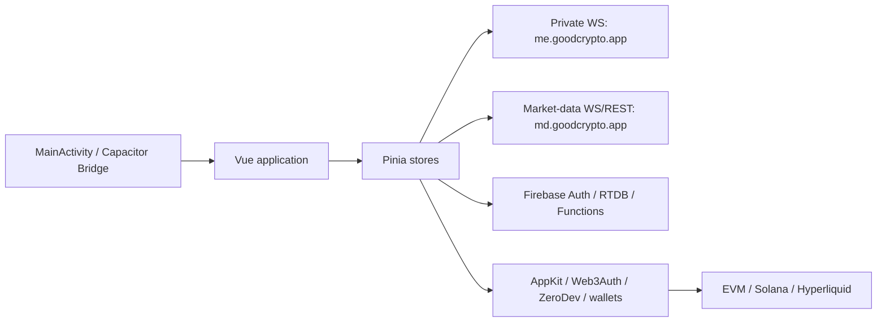

# Reverse-engineering report

## 1. Scope and confidence

The only binary analyzed was `goodcryptoX-2.5.1.apk` with SHA-256 `70ecfc62a62a0c822b310e992e77e477e797ebdc5e87abdb43cc59d50e1acb1c`. Findings marked confirmed are directly present in the APK. Inferences are explicitly labelled. No backend authentication was bypassed and no live order, withdrawal, wallet or exchange operation was executed.

## 2. Architecture

### 2.1 Android host

`app.goodcrypto.MainActivity` extends `com.getcapacitor.BridgeActivity`. During `onCreate` it registers `app.goodcrypto.AndroidImmersivePlugin` and starts the Capacitor bridge. The custom plugin exposes `hide(PluginCall)` and `show(PluginCall)`; both post to the UI thread, obtain a `WindowInsetsControllerCompat`, hide/show system bars and resolve the call.

The remaining Android surface is library code: Firebase, billing, AppsFlyer, RevenueCat, biometric authentication, ML Kit barcode scanning, CameraX, notifications and standard Capacitor plugins. The four native `.so` files are barcode/camera/DataStore support libraries; no GoodCryptoX trading engine was observed in native code.

### 2.2 Embedded web application

Capacitor loads an embedded Vite build from `assets/public/`. The main chunk is `index-DHlB7G7_.js`; lazy chunks correspond to settings, authentication, alerts, exchange keys, wallet setup, positions, referrals, subscriptions and other screens. State is organized around 59 Pinia stores.

## 3. Functional modules

### 3.1 Identity and authentication

Confirmed capabilities include Firebase email/social login, email verification, password reset, TOTP/MFA, new-device verification, refresh-token forcing and provider linking. Deep links support Firebase OOB actions and internal route navigation. `user`, `mfa`, `doRefreshToken`, `loginTools` and `keys` stores carry the main state.

The private API connection obtains a Firebase ID token and opens `wss://me.goodcrypto.app`. Authentication is layered:

1. Firebase token in the WebSocket subprotocol.
2. The same token plus `uid/id` in authenticated command payloads.
3. Nonce + RSA-PSS signature + timestamp for sensitive trading writes.

### 3.2 Exchange accounts and portfolio

The client supports exchange API-key account creation, update, rename and removal; wallet account management; balance import; current and historical balances; open positions; order/trade history; transaction details; portfolio history and summary configuration. Exchange/account state is synchronized through the private command channel.

### 3.3 CEX trading

The CEX path supports market, limit, stop-limit, stop-market, native and GoodCrypto-managed stops, trailing stop, trailing reverse, repeat trailing, post-only, improve-only, reduce-only, time-in-force, delayed orders, isolated/cross margin, leverage changes and connected TP/SL. The order form normalizes the order, generates a client tag, injects a nonce, signs the canonical payload and waits for an `order-status` response.

### 3.4 CEX bots and strategies

- **Grid:** linear/logarithmic levels, active-level count, initial position, post-only, auto-close, activation, stop-low/high, maximum P&L and drawdown controls.
- **DCA:** market/limit/trailing entry, geometric size scaling, distance scaling/acceleration, fixed or average-price TP, trailing/repeat TP, SL, cooldown and close-position policy.
- **Infinity/repeat trailing:** entry and exit trailing parameters, improve-exit and drawdown controls.

Strategy lifecycle commands include create/list/status/pause/resume/stop/modify, duplicate, report, share, next iteration and restore average.

### 3.5 DEX trading and wallets

The DEX interface supports swap, limit, stop, trailing, trailing-reverse, DCA and filter-based strategy forms. EVM and Solana chains are represented, with account abstraction/session keys, route simulation, gas/priority-fee handling, Jito options, slippage and recipient selection. Manifest package queries cover MetaMask, Trust Wallet, Phantom, Coinbase Wallet, 1inch, SafePal, Exodus, Zerion, TokenPocket, Bitget and Rainbow.

Relevant stores include `appkit`, `walletConnect`, `web3Auth`, `xZeroDev`, `xAccounts`, `xWithdraw`, `xAssets`, `xBalances`, `xTransactions`, `xStrategies`, `hyperliquid` and `xUser`.

### 3.6 Hyperliquid

The `hyperliquid` store contains max-builder-fee lookup, agent listing, agent approval/removal, builder-fee approval, agent generation, persistence, private-key-to-agent reconstruction, Firebase synchronization and connection repair. The implementation treats the Hyperliquid agent as a separately managed credential bound to wallet/account state.

### 3.7 Alerts, webhooks and notifications

Capabilities include price, portfolio and listing alerts; alert thresholds; enable/disable/persist/reorder/delete; TradingView webhook activation; webhook creation; Telegram integration; FCM subscription management; notification archive; and local/deep-link navigation from notifications.

### 3.8 Billing, subscriptions and referrals

The bundle integrates RevenueCat, Play Billing/Cordova purchase, Stripe and Banxa. Subscription flows include purchase, cancellation, upgrade, restore and entitlement/status processing. Referral flows include link creation, sign-up attribution and withdrawal. The GOOD-token state tracks holdings, discounts, earned revenue and NFT multipliers. `isGoodsEnoughToRevShare` is literally `goodHeld >= 10000` at `index-DHlB7G7_.js:2180`.

## 4. Network protocol

### 4.1 Private command channel

The client buffers one pending payload per event while the socket is not ready. It sends a JSON object containing `event` plus event-specific data. Heartbeats run every second; a missing response beyond about nine seconds triggers reconnection. Default timeout is 30 seconds; new orders use 90 seconds and DEX quote/route sessions use 60 seconds.

Core writes include `order-new`, `order-modify`, `order-modify-meta`, `order-action`, `order-cancel`, `position-modify-leverage`, `strategy-new`, `strategy-action`, account/wallet CRUD, alerts, webhooks and portfolio configuration.

### 4.2 Public market data

The market-data socket uses JSON array commands such as `SUBSCRIBE` and channels including prints (`MT`), asset updates (`A`), asset prices (`AP`), candles (`AC`) and books (`BK`). REST endpoints under `https://md.goodcrypto.app/api` supply snapshots, symbology, exchanges, assets, rates, candles, prints, books, indicators, version data, DEX tokens and Gems.

### 4.3 Firebase

The client uses Firebase Authentication, Realtime Database, Messaging, Analytics, Crashlytics and callable Cloud Functions. Thirty-two callable names were recovered, including key generation, web3 address state, notifications, referrals, Stripe, Telegram, Banxa, OAuth, order presets and custom-token operations.

## 5. State, storage and synchronization

The application uses IndexedDB database `store` with object store `dictionary`; `localStorage` namespaces `settings.` and `data.` with checksum/expiry suffixes; Firebase user paths for synchronized settings, identity, keys, web3 state, notification subscriptions and entitlements; and memory-resident Pinia stores for active trading and wallet state.

Android declares `allowBackup=true`; decoded backup rules exclude AppsFlyer data but do not show a broad exclusion for WebView/Capacitor application state.

## 6. Obfuscation and limits

The JavaScript is minified but not packed or encrypted. Vite chunk names and many semantic object keys survive, allowing reliable reconstruction of store IDs, method names, order types, command names, route paths and state constants. Original TypeScript local names are not preserved and source maps are absent.

Backend order execution, exchange adapters, Firebase rules, entitlement calculation and server-side strategy state machines are outside the APK. The dossier distinguishes client-side validation/orchestration from server execution.
